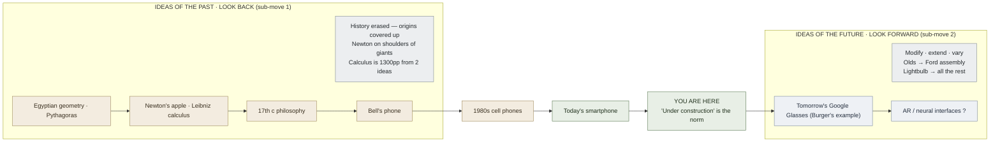

# Water — Follow the Flow of Ideas (Burger Habit 4)

**Summary**: Burger and Starbird's fourth habit of effective thinking ([*The 5 Elements of Effective Thinking*](./burger-5-elements-effective-thinking.md) 2012, Ch 4). New ideas never arise in a vacuum. Every advance extends a line that started in the past and travels through the present into the future. Two sub-moves: (1) understanding current ideas through the flow of ideas (look-back) · (2) creating new ideas from old ones (look-forward, modify-extend-vary). The canonical exemplar: Leibniz's first calculus paper (1684) was 6 pages; today's introductory calculus textbook is 1300 pp — *"two fundamental ideas, and the remaining 1,294 pages consist of examples, variations, and applications"* (p. 99). Names overlap with [automaticity-and-reflex-training](./automaticity-and-reflex-training.md)'s Water=Perceptual skill-type — they are **directly contradicted** (see [five-elements-mapping-reconciliation](./five-elements-mapping-reconciliation.md); Burger's Water is *temporal* — historical flow — while the wiki's Water is *spatial* — perceptual reading).

**Sources**: [burger-5-elements-effective-thinking](./burger-5-elements-effective-thinking.md) Ch 4 (pp. 95–118); [burger-heart-of-mathematics](./burger-heart-of-mathematics.md) (the textbook embodies this habit — each chapter traces its central idea from antiquity through present applications).

**Last updated**: 2026-05-27 — created during the Burger ingest.

---

## The two sub-moves

### 1. Understanding current ideas through the flow of ideas (look back)

> *"Every great idea is a human idea that evolved from hundreds if not thousands of individuals struggling to make sense of and understand the issue at hand."* — Burger & Starbird p. 96
>
> *"If I have seen farther than others it is because I have stood on the shoulders of giants."* — Isaac Newton (cited p. 99)

**The Newton/Leibniz calculus story** (pp. 98–100): Newton and Leibniz independently discovered calculus in the last half of the seventeenth century at essentially the same time. Why simultaneous? Because *all the essential elements of calculus had been thought of by other mathematicians before either of them came along*. The discovery was not a huge leap — it was the next small step. Leibniz published the first article on calculus in 1684 — 6 pages. Today's introductory calculus textbook is over 1300 pages. *"A calculus textbook introduces two fundamental ideas, and the remaining 1,294 pages consist of examples, variations, and applications — all arising from following the consequences of just two fundamental ideas."*

**History erased** (pp. 96–97): when you sit lost in a lecture or read a profound idea and ask *"how did anyone ever come up with this stuff?!"* — the question is well-posed but the answer is hidden. The origins of ideas are often covered up, giving the impression of magic, spontaneous creation, when reality is incremental evolution.

**Guessing what's next anchors what's there** (pp. 102–103): before each art-history class, Burger and two undergraduate friends would guess (from memory of the previous class) what topic would come next. They never read the text, took no notes, attended no conference sections — but discussions in walking to class and active listening during lectures (with this prediction game) was enough to pass exams. *"Even when our guesses were completely off, they still helped us to view the previous material more fully by thinking how the earlier material might have looked in the middle of a stream of progress rather than in isolation."*

**A look back makes earlier material easier** (p. 103): once you understand a more advanced topic, look back to see what brought you there. The earlier material becomes clearer because you see its significance through the later work that grew from it. The trumpet virtuoso Tony Plog story ([understand-deeply-habit](./understand-deeply-habit.md) §1) is a Water-habit story too: revisiting the simple warm-up exercise after years of mastery reveals limitless beauty.

### 2. Creating new ideas from old ones (look forward, modify-extend-vary)

> *"The time to work on a problem is after you've solved it."* — R. H. Bing (cited p. 106)
>
> *"I begin with an idea and then it becomes something else."* — Pablo Picasso (cited p. 107)

**Edison's incremental lightbulb** (pp. 106–107): the lightbulb was only the tip of a monumental iceberg. Pushing the idea of the lightbulb led to movies · televisions · computers · copy machines · fiber optics · medical procedures · tanning beds · heat sources at buffets. *"Before the invention of the lightbulb, people could not imagine the incredibly rich and varied developments that would stem from it, but in fact every idea, though it may seem to solve just one isolated problem, is only the tiny tip of its own monumental iceberg."*

**Dial M for more** (pp. 107–108): Bell's telephone → wall-mounted rotary → table-mounted rotary → extensions → touch-tone → cordless → brick cellphones → pocket cellphones with cameras → smartphones with Internet/video → ... Each step required taking the current pinnacle and asking *"how could that current solution be refined to solve the problem it solved even better?"*

**Olds → Ford assembly line** (pp. 110–111): Ransom Olds invented the assembly line in 1901, jumping car-production from 425/year to 2,500/year. *Other competitors were in awe.* Henry Ford asked *"can we do even better?"* and added conveyor belts. Production jumped from 1.5 days/car to 90 minutes/car. *"Good progress is often the herald of great progress."*

**eBay** (p. 109): in 1995 Pierre Omidyar asked how the centuries-old auction format could be extended to millions of bidders. He turned to the Internet — eBay.

**Once you have it, see if you can improve it** (pp. 111–112): take an essay or solution and *assume there is a mistake or omission or missed opportunity in your work* — there always is.

**Ask: what were they thinking?** (pp. 115–116): what beliefs, cultural habits, or practices that are accepted today will be condemned as offensive in the future? *"Centuries ago, perfectly respectable people viewed slavery as a natural and moral practice. What practices that we accept as fine today will be condemned as offensive in the future?"* Burger and Starbird suggest one candidate: failing grades on report cards explicitly telling significant numbers of students that they are inferior. The point isn't whether they're right — it's that *any* practice that will be viewed as immoral in the future must be a custom currently viewed as perfectly fine.

> *"It is impossible to avoid bias — it infuses itself through our upbringing, our values, our society, and our community. The first real action item for all of us is to acknowledge (unabashedly) that we are all prejudiced."* — Burger & Starbird p. 116

### Final thoughts: *"Under construction" is the norm* (pp. 117–118)

A little arithmetic: New York City has ~200 skyscrapers. A building lasts ~40 years before needing major renovation or replacement. Renovation takes ~4 years. So 5 skyscrapers/year start renovation, meaning ~20 are under major construction at any time. The "finished" city is a myth. Your life has many features — family, friends, education, profession, possessions — all in flux. The normal state is one in which some features are problematic and need attention.

---

## Where Water fits in the wiki

| Wiki page | How Water shows up |
|---|---|
| meadows-thinking-in-systems | "History erased" is the systems-thinking failure mode Meadows names as Rung-9 (the structure beneath the trends) |
| [ok-plateau](./ok-plateau.md) | Look-back to fundamentals is the antidote to the autopilot plateau |
| history-as-foundation | the wiki's existing pattern of opening every framework page with its lineage is operationalized Water-habit |
| [cast-overview](./cast-overview.md) | CAST graph encoder's verb-edges = look-forward extensions in concept space |
| [bridge-load](./bridge-load.md) | BRIDGE's Nearest-Neighbor slot operationalizes look-back (which existing idea this is most similar to) |
| [remaps](./remaps.md) | REMAPS *Associate* move is direct Water-habit (find the existing image this echoes) |
| [spark-overview](./spark-overview.md) | Trophy Palace = look-back over earned wins; bidirectional priming reuses past wins to shape future ones |
| [flow-of-ideas-habit](./flow-of-ideas-habit.md) | this page |

---

## METER integration

| Event | Operational form | Pass floor |
|---|---|---|
| `lineage_chain_length` | For any current idea, trace it N steps back to predecessors AND M steps forward to likely extensions | floor 3-back/1-fwd; pass 5-back/2-fwd |
| `prediction_pass_rate` | Before each lecture/chapter/section, guess what's next; check after | ≥40% (floor 25%); the *miss* rate is where the learning is |
| `revisit_fundamentals/quarter` | Quarterly return to prior course's basics; can you do it 100% from cold? | binary; required-gate for any advancing learner |
| `improvement_after_solution/week` | Per week, count how many *already-solved* problems you returned to and made better | ≥2/week (stretch) |
| `under_construction_acknowledgment` | Per week, name 1–2 areas of life currently "under construction" (not failed, just in-flux) | binary; weekly journal habit |

---

## Visual — Water as the river of ideas

---

## Mnemonic — *"Newton on Giants, Ford on Olds"*

Two anchor stories in one line.

- *"Newton on Giants"* = look back (sub-move 1) — every idea evolved from predecessors
- *"Ford on Olds"* = look forward (sub-move 2) — every solution invites the next refinement

---

## Memory Checksum

Numbered inventory (recite in ≤20 s):

1. **Sub-move 1**: Understanding current through the flow (look back) (stories: Newton/Leibniz simultaneous discovery · calculus 6pp → 1300pp · Burger's art-history class prediction game · history erased)
2. **Sub-move 2**: Creating new from old (look forward) (stories: Edison lightbulb iceberg · Bell phone evolution · Olds→Ford assembly line · eBay extending auctions · Picasso "becomes something else")
3. **"Ask: what were they thinking?"**: future generations will condemn current practices we accept (one Burger candidate: failing grades on report cards)
4. **"Under construction" is the norm**: ~20 skyscrapers at any time mid-renovation in NYC; your life's "finished" state is a myth

**Counts**: 2 sub-moves · 9 named stories · 1 future-bias diagnostic · 1 calculation (NYC skyscraper).

**Recite floor**: ≤20 s for the 2 sub-moves; ≤90 s with named stories.

---

## Related pages

- [burger-5-elements-effective-thinking](./burger-5-elements-effective-thinking.md) — parent ingest summary
- [five-elements-mapping-reconciliation](./five-elements-mapping-reconciliation.md) — collision page (Water-habit ≠ Water-skill-type; **directly contradicted**)
- [understand-deeply-habit](./understand-deeply-habit.md) · [fail-to-succeed-habit](./fail-to-succeed-habit.md) · [socratic-question-generation](./socratic-question-generation.md) · [transformative-change-habit](./transformative-change-habit.md) — sibling habits
- meadows-thinking-in-systems · meadows-12-leverage-points — Water-habit applied to systems intervention
- [ok-plateau](./ok-plateau.md) · history-as-foundation · [bridge-load](./bridge-load.md) · [cast-overview](./cast-overview.md) · [remaps](./remaps.md) · [spark-overview](./spark-overview.md) — wiki pages that operationalize Water-habit
