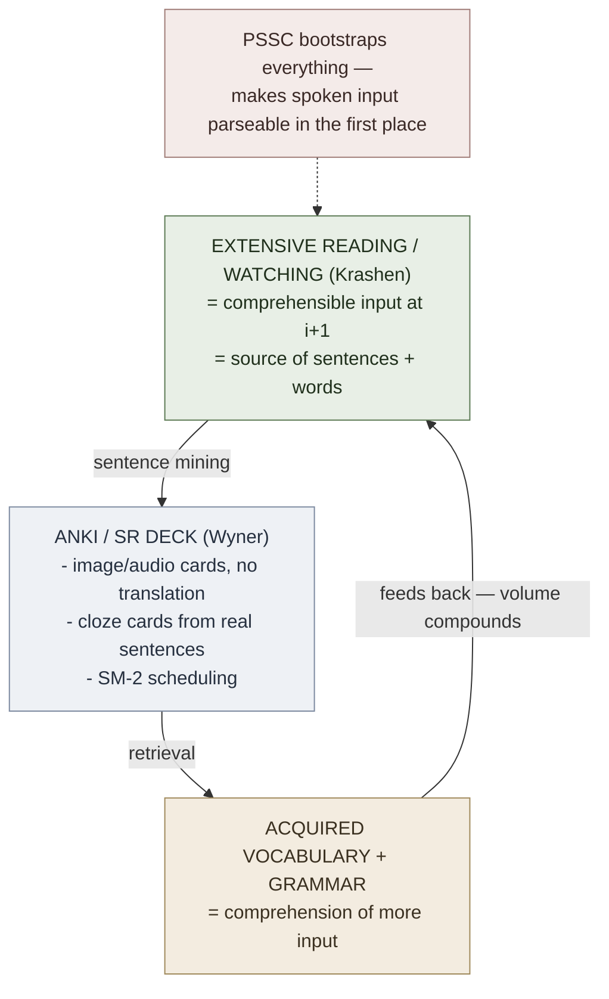

# Fluent Forever (Wyner)

**Summary**: Gabriel Wyner's *Fluent Forever* (2014) is a Krashen-aligned, [SR](./spaced-repetition.md)-driven, image-and-sound-first protocol for adult second-language acquisition. It refuses translation as the primary mediation layer ("**No-Translation Rule**"), substitutes direct image-to-target-word binding, and adds three engineering innovations on top of [Krashen's Input protocol](./comprehensible-input-protocol.md): (1) **PSSC** (Pronunciation-Spelling-Sound Correspondence) — pronunciation drilling **before** vocabulary, using minimal-pair audio and IPA, so the learner's phonological system can hear the target language; (2) **Sentence Mining** — building personal SR decks from real native sentences encountered in extensive reading or media, rather than from textbook word lists; (3) **No-Translation Rule** — every Anki card binds target-language stimulus to target-language response (image, audio, definition in TL), never to L1 translation. The protocol is the most-cited operational adult-SLA self-study method of the last decade. This page is the canonical owner.

**Sources**:
- Wyner, G. (2014). *Fluent Forever: How to Learn Any Language Fast and Never Forget It*. Harmony Books.
- Wyner, G. (2017+). Fluent Forever app + blog (fluent-forever.com).
- Wyner, G. TED talk (2014). "How to Learn a New Language."
- Underlying SLA frame: [krashen-sla-hypotheses](./krashen-sla-hypotheses.md), [comprehensible-input-protocol](./comprehensible-input-protocol.md).
- Underlying memory frame: [spaced-repetition](./spaced-repetition.md), [active-recall](./active-recall.md), [substitute-word-system](./substitute-word-system.md) (Wyner's "Personal Connection Anki cards").
- Contrast case (rival method, not adopted): Ягодкин Н.А., Згода А.Н. — *Учись учиться* (2023), the Advance method — see §Contrast below and [yagodkin-advance-mnemonics](./yagodkin-advance-mnemonics.md).
- Internal: [language-learning-architecture](./language-learning-architecture.md), [language-learning-protocol](./language-learning-protocol.md).

**Last updated**: 2026-07-16

---

## The three load-bearing innovations

### 1. Sentence Mining

**Don't memorize word lists.** Read real native content; when you hit an unknown word you care about, capture the **whole sentence** as the Anki card context, with the target word as the cloze deletion or front-side cue. The sentence supplies context, collocation, and grammar all at once; the word is encoded *in situ* rather than as a context-free pair.

Mechanism: a word's meaning lives in its distribution of contexts. A sentence-mined card encodes one such context; many sentence-mined cards build a distributional sketch that matches how native speakers actually use the word.

The Fluent Forever app automates the harvesting workflow (paste sentence → cloze the target word → auto-fetch image + native audio → schedule via SR).

### 2. PSSC — Pronunciation First

Adult L2 learners' chronic blocker is **phonological deafness**: they can't *hear* contrasts that don't exist in their L1 (Japanese R/L; English/Korean voiced-vs-aspirated; tonal contrasts for non-tonal-L1 speakers). Until phonology comes online, comprehensible input doesn't fully parse and vocabulary doesn't fully bind.

PSSC = the targeted drill that builds it:

1. **Minimal-pair audio drills** — same-difference judgments on the target language's contrasts (3-5 days of focused work for most language pairs).
2. **IPA familiarity** — enough IPA to read pronunciation dictionaries.
3. **Per-grapheme sound mapping** — what each letter / digraph / accent mark *sounds like* in this language, drilled to reflex on Anki before vocab work begins.

The phonology comes first, then vocabulary, then grammar. Inverting the order — vocab without phonology — produces learners who can read but not parse speech.

### 3. No-Translation Rule

Every Anki card is target-language → target-language. Three card archetypes:

| Card type | Front | Back |
|---|---|---|
| **Image card** | Image of a dog | "perro" + native audio |
| **Definition card** (intermediate+) | "perro" + native audio | A native-language definition + example sentence |
| **Cloze card** (sentence-mined) | "El _____ corre rápido." | Image of dog + native audio "perro" |

L1 translation appears **nowhere**. Reasoning: every L1↔L2 binding creates a translation-mediated retrieval path; that path is slower than direct binding and contaminates fluency. By blocking translation at the encoding stage, Wyner forces direct image↔target binding from card 1.

For abstract or culturally-specific words where no image works, the back side carries a native-language definition + example. The L1 stays out.

Kozarenko's [GMS](./kozarenko-mnemotechnics.md) phrase layer converges independently on the same direct-binding move: **образ-значение** (image-meaning) binds a foreign word to a language-independent image rather than an L1 translation. [phrase-based-acquisition](./phrase-based-acquisition.md) maps that construct onto this No-Translation Rule rather than redefining it, and notes the polyglot fan-out (one image, many target-language words) as a property of image-binding this page already owns.

## How Fluent Forever sits on top of Krashen

Krashen's protocol is the *substrate*: high-volume comprehensible input at i+1 with low affective filter. Wyner's contribution is the *encoding engine* that converts encountered material into durable retrieval traces.

## Operational sequence

Wyner's recommended order (book Ch 2-8):

1. **Days 1-7**: PSSC bootstrap. Minimal-pair drills + IPA + grapheme-to-sound Anki deck.
2. **Weeks 2-4**: First 625 high-frequency words via image+audio cards (Wyner's curated list, available from his site).
3. **Months 2-3**: Sentence mining begins; learner reads at i+1; harvests cloze cards from real sentences.
4. **Months 4+**: Grammar emerges from sentence patterns + targeted study; conversation as ready.

Output is **not blocked** but is also not pushed — Wyner's stance is that output supplements input once acquired competence is there; he does not adopt the strict no-output stance of ALG.

## Why this works (mechanism)

- **No-translation rule** removes L1-mediation overhead; direct image-binding builds *L2 thinking* rather than L2-translated-from-L1 thinking.
- **PSSC-first** un-locks the [Input Hypothesis](./krashen-sla-hypotheses.md) by making spoken input parseable at all.
- **Sentence mining** ensures cards are at i+1 with personal relevance (low filter) and full distributional context.
- **SR substrate** makes retention essentially free per-card after the encoding step.
- **Image binding** leverages picture-superiority effect (Paivio dual-coding): image+word binds stronger than word alone or word+translation.

## Failure modes

| Failure | Symptom | Mitigation |
|---|---|---|
| **Skip PSSC** | Can read but can't parse speech; minimal-pair distinctions stay collapsed | Go back to PSSC; 3-5 days of focused minimal-pair drill |
| **Translation cards** | "perro = dog" cards bind L1↔L2; fluency stays translation-mediated | Re-author cards image-only or definition-in-TL |
| **Word-list cards** (vs sentence-mined) | Words known in isolation but collocation/grammar weak | Switch to sentence-mining from real reading |
| **All Anki, no input** | Vocabulary memorized but no comprehension growth | Re-introduce extensive reading at i+1 |
| **Premature output** | Speaking before acquired competence supports it | Bias to input until conversation flows |

## Critiques and limits

- **Image-card limit** — abstract / grammatical / cultural words resist image binding; definition cards work but are slower.
- **Sentence-mining cost** — high upfront tool overhead; the FF app addresses this but it's a paid product.
- **Phonology assumption** — PSSC drills assume the learner has access to native audio and a quiet feedback loop; harder for under-resourced languages.
- **Not magic** — fluency in 3 months claims (marketing) overstate; Wyner's actual position is faster-than-traditional, not instant.

## Contrast: where Yagodkin/Advance disagrees

[yagodkin-advance-mnemonics](./yagodkin-advance-mnemonics.md) (Ягодкин/Згода, *Учись учиться*, 2023) is the closest rival in the wiki's corpus: another mnemonic-vocabulary system, likewise image-first, likewise sitting near [Krashen](./krashen-sla-hypotheses.md)-adjacent assumptions about volume and context. That proximity makes its two disagreements with this page worth recording precisely. **Neither is resolved here** — the ingest gate for that source was *rival account: noted, not resolved*. This section states the disagreement; it does not amend Wyner's rules, and it does not import Advance's doctrine (that page owns it).

### Disagreement 1 — translation-mediated encoding vs the No-Translation Rule

This is the sharp one, and it is a real methodological disagreement rather than an apparent one.

**Wyner's position** (canonical on this page, §No-Translation Rule, unchanged): every L1↔L2 binding "creates a translation-mediated retrieval path; that path is slower than direct binding and **contaminates fluency**." L1 translation appears nowhere on the card (source: Fluent Forever, Wyner 2014).

**Yagodkin's default is translation-mediated by construction.** The universal word-memorisation algorithm is three steps: (1) represent the word's *meaning* visually — the first image; (2) find a visual association for the *sound* of the foreign word — the second image; (3) fuse the two into one inseparable, interacting picture, said aloud in the foreign language three times (source: Ягодкин Н.А., Згода А.Н. - Учись учиться - 2023.pdf). The base of the structure is the L1 sense; the L2 sound is a hook welded onto it. The source is explicit that the retrieval path runs *through* the pair: on recall you must retrieve the first image specifically, because "only in that case do we get the link to the second image, **which prompts us the translation**" (source: Ягодкин Н.А., Згода А.Н. - Учись учиться - 2023.pdf). That is precisely the path Wyner blocks at encoding time.

Worked example from the source: the French phrase *qu'est-ce que c'est?* → the Russian sound-render «кес ке сэ» → a cat going "кис-кис" pointing a paw at a packet of Whiskas, asking with its eyes "what's this? I don't eat that!" — the phrase's L1 gloss ("что это?") is the anchor the image hangs on (source: Ягодкин Н.А., Згода А.Н. - Учись учиться - 2023.pdf).

**Yagodkin does have an L2-primary variant, but frames it as an advanced option, not the default.** Sourcing vocabulary from English-English dictionaries is placed deliberately last among all sources, inside the chapter of "фишки" (non-standard tricks that deliberately bypass parts of the technology), and is gated behind full skill formation — the source states three preconditions, including at least 2,000 words already memorised and retained, and speed having plateaued over the last 300 words (source: Ягодкин Н.А., Згода А.Н. - Учись учиться - 2023.pdf). Applying the tricks earlier, the source warns, risks losing part of the skill (source: Ягодкин Н.А., Згода А.Н. - Учись учиться - 2023.pdf). So the two systems put L2-primary encoding at opposite ends of the sequence: card 1 for Wyner, post-2,000-words and optional for Yagodkin.

### The tension inside Wyner's own kit (observed, not adjudicated)

The clarifying observation is that the substitution move *both* systems depend on is inherently L1-mediated. [substitute-word-system](./substitute-word-system.md)'s Phonetic Bridge works by finding a sound-alike **in the learner's native language** — that is what makes the foreign sound graspable at all. This page already credits that bridge as the engine of Wyner's "Personal Connection" cards for hard words (see §Neural OS implementations). So the No-Translation Rule and Wyner's own use of the phonetic bridge sit in some tension: the card face may show no translation, yet the encoding step reached for an L1 word to build the hook. Yagodkin does not have this tension because he resolves it in the other direction — he makes the L1 base explicit and builds on it openly.

Advance's own answer to the objection is that mnemonic images are "**строительные леса**" (scaffolding) — needed only until the building is finished; once a word is reproduced fast and error-free after the loading stage, the extra images are no longer used, or not used at all (source: Ягодкин Н.А., Згода А.Н. - Учись учиться - 2023.pdf). Whether a scaffold that dissolves still counts as contaminating the retrieval path is exactly the point at issue — Wyner's rule targets the retrieval path itself, and neither source engages the other. **Left open.**

### Disagreement 2 — frequency lists (a tension, not a contradiction)

Yagodkin names the raw frequency dictionary as a mistaken *starting* source: "начинать изучение языка с запоминания частотного словаря ни в коем случае не следует" (one should on no account begin language study by memorising a frequency dictionary). Two reasons are given: the words sit outside any single context or theme, which makes choosing the right sense hard; and **most words at the head of the list are function words** (служебные), which are very hard to memorise without context and which the learner meets before the mnemonic skill is even formed (source: Ягодкин Н.А., Згода А.Н. - Учись учиться - 2023.pdf). He does not reject frequency lists wholesale — he keeps them for other jobs, e.g. running a spelling-correction pass (source: Ягодкин Н.А., Згода А.Н. - Учись учиться - 2023.pdf).

Wyner's opening list is not a raw frequency head. His first 625 words (§Operational sequence) are a *curated* list, weighted toward concrete, imageable words precisely because they must survive image-card encoding (source: Fluent Forever, Wyner 2014). That curation is the filter Yagodkin's objection asks for. Yagodkin's own recommended starter source points the same way: thematic word lists, and especially lists consisting only of nouns with a concrete image, which he calls the ideal option for training the skill (source: Ягодкин Н.А., Згода А.Н. - Учись учиться - 2023.pdf). So the two agree in practice and disagree on framing — Wyner treats the concreteness filter as implicit in his list, Yagodkin makes it an explicit rule about sourcing.

**Downstream gap, flagged for another owner.** The wiki's generic governance gate in [language-learning-protocol](./language-learning-protocol.md) asks only whether a word is in the top 5,000 frequency list for the target language, and skips SPM encoding if not. That gate carries Wyner's *frequency* criterion but **not** his implicit concreteness filter — so as written it would wave through exactly the function-word head that Yagodkin's objection targets. Arguably it should carry the filter. That is a call for that page's owner; nothing is changed here.

### Uncited figures

Advance's throughput claims are internal to the source and carry no external citation: that a reader of the book or an Advance course graduate needs "at most a week" to memorise 1,000 words, that 1,000 words in a month costs 15–20 minutes a day, and that after about two weeks of targeted training one can memorise 1,000 words in a single day (source: Ягодкин Н.А., Згода А.Н. - Учись учиться - 2023.pdf) — **(needs verification — Advance-internal)**. They are recorded as claims, not adopted as benchmarks.

## Neural OS implementations

- [krashen-sla-hypotheses](./krashen-sla-hypotheses.md) — theoretical parent
- [comprehensible-input-protocol](./comprehensible-input-protocol.md) — input-side protocol Fluent Forever extends
- [language-learning-architecture](./language-learning-architecture.md) — wiki's stack-design for L2
- [language-learning-protocol](./language-learning-protocol.md) — daily-loop variant
- [spaced-repetition](./spaced-repetition.md) — substrate
- [active-recall](./active-recall.md) — every FF card is retrieval-not-restudy by design
- [substitute-word-system](./substitute-word-system.md) — Phonetic Bridge powers Wyner's "Personal Connection" cards for hard words

## Related pages

- [krashen-sla-hypotheses](./krashen-sla-hypotheses.md)
- [comprehensible-input-protocol](./comprehensible-input-protocol.md)
- [language-learning-architecture](./language-learning-architecture.md)
- [language-learning-protocol](./language-learning-protocol.md)
- [language-family-clustering](./language-family-clustering.md)
- [spaced-repetition](./spaced-repetition.md)
- [active-recall](./active-recall.md)
- [substitute-word-system](./substitute-word-system.md)
- [anki-reflex-deck-builder](./anki-reflex-deck-builder.md)
- [phrase-based-acquisition](./phrase-based-acquisition.md) — maps образ-значение onto this page's No-Translation Rule
- [yagodkin-advance-mnemonics](./yagodkin-advance-mnemonics.md) — rival method; disagrees on translation-mediated encoding and on frequency-list sourcing (see §Contrast)

---

## U — See (CAST)
1. Phonology → vocab → grammar → output (in that order)
2. No L1 on the card; sentence over isolated word

## D — Name (NEDF)
1. Fluent Forever = PSSC + No-Translation + Sentence Mining on Krashen substrate
2. Distinguisher: image/audio binding without L1 mediation
3. Failure mode: skipping PSSC; translation cards
4. Rival: [yagodkin-advance-mnemonics](./yagodkin-advance-mnemonics.md) encodes L1-sense-first by construction — disagreement recorded, not resolved

## F — Do (SPEAR)
1. PSSC bootstrap (week 1) → image-deck 625 words (weeks 2-4) → sentence-mine from reading (months 2+)
2. SR every day; extensive reading every day

## B — Watch (HEART)
1. Reading-fluent but listening-deaf → PSSC was skipped or shallow
2. Card review feels like translation → re-author no-translation
3. Phonetic-Bridge card still fires through its L1 sound-alike → known open edge of the No-Translation Rule (§Contrast), not yet adjudicated

## L — Predict (ORACLE)
1. PSSC done + image-decks reflex + sentences mined → conversation in ~6 months
2. Translation cards + no PSSC → translation-mediated fluency cap

## R — Act (GRACE)
1. New language → start PSSC, not vocab
2. Encountering unknown word in reading → cloze the sentence, not the word
