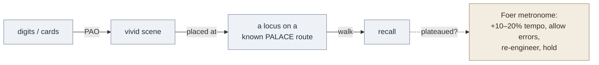

# Moonwalking with Einstein (Foer)

**Summary**: *Moonwalking with Einstein: The Art and Science of Remembering Everything* (Joshua Foer, Penguin 2011) is a first-person narrative of a science journalist who, in one year, trained from ordinary memory to win the 2006 USA Memory Championship under coach Ed Cooke. Its load-bearing claim for the wiki: **extraordinary memory is a trained skill built on ancient techniques — the [memory-palace](./memory-palace.md) / method of loci and [PAO](./person-action-object-system.md) — not an innate gift** — and the chief obstacle to *any* skill is the [ok-plateau](./ok-plateau.md), Foer's coined term for the autopilot ceiling. The book is the wiki's primary source for the OK Plateau and the Foer-metronome escape, and a popular-audience vehicle for memory-palace technique. This page is the source-summary / routing owner.

**Sources**:
- Foer, J. (2011). *Moonwalking with Einstein: The Art and Science of Remembering Everything*. Penguin Press.
- Research Foer relays: [Ericsson](./ericsson-peak.md) deliberate practice; Wilding & Valentine memory-athlete studies.
- Internal concept owners: [ok-plateau](./ok-plateau.md), [memory-palace](./memory-palace.md), [person-action-object-system](./person-action-object-system.md), [deliberate-practice](./deliberate-practice.md), [elaboration](./elaboration.md).

**Last updated**: 2026-07-01

---

## What the book is

First-person reportage. Foer embeds with memory athletes, learns their methods, and tests the thesis that their feats are technique, not talent. For the wiki it is the narrative backstop behind two operational items the cluster already uses — the OK Plateau and the Foer metronome.

## The core claims — each owned elsewhere

This table *routes*; it does not redefine.

| Foer's framing | Owner page |
|---|---|
| The memory palace / method of loci — vivid images placed along a known route | [memory-palace](./memory-palace.md) |
| PAO (Person-Action-Object) — encode digit strings as scenes at loci | [person-action-object-system](./person-action-object-system.md) |
| The OK Plateau — skill stalls when it becomes "good enough" and drops below conscious control | [ok-plateau](./ok-plateau.md) |
| The Foer metronome — push tempo 10–20% past comfort, allow errors, re-engineer the failing encoding | [ok-plateau](./ok-plateau.md) §Foer metronome |
| Memory feats are trained, not innate — Cooke's "anyone can do this" | [deliberate-practice](./deliberate-practice.md) |

## The "Baker / baker paradox"

The book's most-quoted illustration of [elaboration](./elaboration.md): people recall *baker* (the profession) far better than *Baker* (the surname), because the profession hangs on a web of associations — bread, ovens, a white hat — while the bare name hangs on nothing. The lesson the wiki keeps is that meaning and connection drive retention; the mechanism is owned by [elaboration](./elaboration.md) and [mental-models-for-learning](./mental-models-for-learning.md).

## How it sits in Neural OS

Foer is the popular-narrative layer over the wiki's memory stack: the [memory-palace](./memory-palace.md) he dramatizes is the substrate beneath [PAO](./person-action-object-system.md) and the encoder family; the [ok-plateau](./ok-plateau.md) he named is the failure state the [red-queen-skill-gym](./red-queen-skill-gym.md) and [Great Work](./automaticity-and-reflex-training.md) push past; and his "trained, not innate" thesis retells [Ericsson's](./ericsson-peak.md) deliberate practice as a story (Foer relays Ericsson directly). It converges with [brown-make-it-stick](./brown-make-it-stick.md) on elaborative encoding.

## Visual

## Mnemonic

**MOON** (from *Moonwalking*): **M**ake it bizarre (elaborate) · **O**rganize on a palace route (loci) · **O**vershoot the OK Plateau (Foer metronome) · **N**arrate the walk to recall. The four moves that turned a journalist into a champion in a year.

## Checksum

1. What did Foer coin for the autopilot ceiling, and what breaks it? (The OK Plateau; comfort-zone exit via the Foer metronome — push tempo past comfort, allow errors, re-engineer — see [ok-plateau](./ok-plateau.md).)
2. What is the "Baker / baker paradox" an illustration of? (Elaborative encoding — the profession "baker" carries a web of associations the surname "Baker" lacks — see [elaboration](./elaboration.md).)
3. State Foer's central thesis about memory feats. (They are trained technique — palace + PAO + deliberate practice — not an innate gift.)

## Related pages

- [ok-plateau](./ok-plateau.md) — the term Foer coined; the Foer metronome lives there
- [memory-palace](./memory-palace.md) · [person-action-object-system](./person-action-object-system.md) — the techniques he dramatizes
- [deliberate-practice](./deliberate-practice.md) · [ericsson-peak](./ericsson-peak.md) — the "trained, not innate" engine he relays
- [elaboration](./elaboration.md) · [mental-models-for-learning](./mental-models-for-learning.md) — the Baker/baker mechanism
- [brown-make-it-stick](./brown-make-it-stick.md) — converges on elaborative encoding
- [red-queen-skill-gym](./red-queen-skill-gym.md) · [automaticity-and-reflex-training](./automaticity-and-reflex-training.md) — where the OK Plateau is fought
