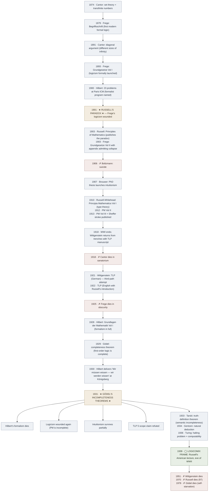

# Foundations Crisis (1874–1939)

**Summary**: The 65-year period in which mathematics' foundational confidence — that arithmetic, geometry, analysis all rest on a consistent and complete formal base — was first inflated by Cantor's set theory (1874+), then progressively undermined by [Russell's paradox](./russells-paradox.md) (1901), three rival reconstruction programs (logicism · formalism · intuitionism), and finally [Gödel's incompleteness theorems](./godels-incompleteness.md) (1931), leaving the post-1939 mathematical community to work *within known internal limits*. The narrative spine of [Logicomix](./logicomix-graphic-novel.md); the historical context that produced [TLP](./tractatus-logico-philosophicus.md), *Principia Mathematica*, the Vienna Circle, and modern type theory. **The three-program trichotomy** (logicism · formalism · intuitionism) is registered as a candidate META-pattern in [composability-index](./composability-index.md).

**Sources**:
- [logicomix-graphic-novel](./logicomix-graphic-novel.md) — narrative-authoritative.
- van Heijenoort, *From Frege to Gödel: A Source Book in Mathematical Logic, 1879–1931* (Harvard, 1967) — the standard scholarly anthology of primary documents.
- Stewart Shapiro, *Thinking About Mathematics: The Philosophy of Mathematics* (Oxford 2000) — modern philosophy-of-mathematics overview.
- [russells-paradox](./russells-paradox.md) · [godels-incompleteness](./godels-incompleteness.md) · [principia-mathematica](./principia-mathematica.md) · [tractatus-logico-philosophicus](./tractatus-logico-philosophicus.md) · [truth-function-machine](./truth-function-machine.md) — wiki concept pages covering specific events.

**Last updated**: 2026-05-25

---

## One-line

> 1874 Cantor opens infinity to mathematics; 1901 Russell finds the paradox; 1900-1930 three programs (logicism · formalism · intuitionism) compete to repair the damage; 1931 Gödel demolishes the formalist program and wounds the rest. *Wir müssen wissen — wir werden wissen* (we must know; we will know) is the last 19th-century sentence in mathematics.

## Unlocks (lead, not footer)

1. **Three-response-to-foundational-crisis as a candidate META-pattern.** Logicism · Formalism · Intuitionism is structurally the same shape as several other foundational disputes the wiki tracks. In Bible interpretation: historicist · idealist · futurist (three eschatological frameworks). In problem-solving: [strategy](./problem-solving-three-levels.md) · tactic · tool (three operational levels). In software design: DRY · YAGNI · KISS (three competing optimization principles). The pattern: when a domain hits a foundational dispute, **three responses emerge, none sufficient alone, all conditioned by the limits of formal systems**. Currently the foundations crisis is the 1 explicit named instance; 2 more would trigger promotion of the candidate-pattern. Registered in [composability-index](./composability-index.md) §candidate-patterns.

2. **The post-Gödel landscape — practice continues, foundations relativized.** The crisis didn't kill mathematics; it killed the *idea of a single self-certifying foundation*. Modern mathematics works *within* one of several foundational systems (ZFC set theory · Martin-Löf intuitionistic type theory · category-theoretic foundations · second-order logic) and treats the choice as a pragmatic matter rather than a metaphysical one. **The foundations crisis is the moment foundations stopped being a Settled Question and became a research field.**

3. **The crisis runs explicitly through TLP.** Wittgenstein's *Tractatus* is written *during* this crisis (composed in the trenches of WWI, 1914-1918, published 1921) by someone who was Russell's student and saw the paradox first-hand. TLP's truth-function reduction (TLP 5–6) is *Wittgenstein's response* to the crisis — an attempt at a foundation that is *neither* Russell-Whitehead logicism *nor* Hilbert formalism. Gödel 1931 demolished TLP's specific reduction; [picture theory](./picture-theory-of-language.md) itself survives.

4. **The substrate cost is visible in the cast.** Six of the seven leading figures of the crisis (Cantor · Frege · Boltzmann · Gödel · Wittgenstein · Russell) paid substantial substrate-stewardship costs; only Russell survived intact, and he did so by *repeatedly leaving the field*. The [wiki's interpretation](./logicians-madness-substrate-thesis.md) is that the substrate cost is non-incidental — foundations work without substrate stewardship corrodes the worker.

## Mnemonic

**1874 → 1901 → 1931** = *Cantor opens · Russell wounds · Gödel closes.*

Three dates. The crisis is bracketed by exactly three events on three decade-scale anchors.

For the three programs: **L-F-I** = *Logicism · Formalism · Intuitionism.*

## Memory checksum

If you can answer these in <60 s each from memory, the page is encoded:

1. **State the three anchor dates and what happened.** (1874: Cantor introduces set theory + transfinite numbers. 1901: Russell's paradox demolishes Frege's logicism mid-publication. 1931: Gödel's incompleteness theorems demolish Hilbert's formalism and wound the rest.)
2. **Name the three programs and their lead figures.** (Logicism: Frege → Russell → Whitehead. Formalism: Hilbert and the Göttingen school. Intuitionism: Brouwer.)
3. **What is the post-1931 landscape?** (No single self-certifying foundation; mathematics continues within one of several systems (ZFC · type theory · category theory) as pragmatic choice; the post-Gödel understanding is that *every formal system has a horizon*.)
4. **Where does TLP sit in the crisis?** (TLP is composed 1914-1918 during WWI, published 1921 — *during* the crisis, by Russell's student. TLP 5-6 attempts a third path (truth-function reduction); Gödel demolishes its scope claim in 1931.)
5. **What is the candidate META-pattern?** (Three-response-to-foundational-crisis — when a domain hits a foundational dispute, three responses emerge, none sufficient alone. 1 explicit named instance (foundations of math); hint instances in Bible eschatology, problem-solving, software design.)

## Visual — the 65-year timeline

The crisis is the vertical line; ● marks events; ✗ marks deaths; ◯ marks the Logicomix frame. The two stars (★) are the two demolitions — Russell's 1901 paradox and Gödel's 1931 theorems.

---

## Pre-crisis confidence (1874 and earlier)

Before Cantor, mathematics had a *de facto* foundation: geometry rested on Euclid; arithmetic rested on intuition (small numbers obviously real, larger numbers built up by induction); analysis was being rigorized through Weierstrass and Dedekind. Foundational worry existed (non-Euclidean geometry had emerged in the 1820s-1860s) but was contained.

Cantor's 1874-1891 work changed the field:
- **Set theory** introduced *infinite sets* as actual objects of mathematical study, not merely potentialities.
- **Transfinite numbers** showed that infinity has *gradations* (ℵ₀ < ℵ₁ < …; the continuum hypothesis asks whether 2^ℵ₀ = ℵ₁).
- **Diagonal argument** (1891) proved the real numbers cannot be enumerated; new sizes of infinity exist.

Reception was hostile: Kronecker called Cantor's work "a grave disease afflicting mathematics"; Poincaré thought future generations would regard set theory "as a disease one has recovered from"; Cantor was excommunicated from mainstream Berlin mathematics and suffered repeated manic-depressive episodes.

Frege's response (1879+): formalize logic; derive arithmetic from logic alone; bypass Cantor's intuition-based set theory. The *Begriffsschrift* (1879) is the first modern formal logic system; *Grundgesetze* (1893, 1903) attempts the logicist reduction.

## The paradox (1901) — see [russells-paradox](./russells-paradox.md) for details

Russell's letter to Frege (June 1902) presents the *set of all sets that do not contain themselves* — a clearly defined object under Frege's Basic Law V, but one that demonstrably cannot exist. Frege's reply: *"Your discovery of the contradiction has surprised me beyond words and, I should almost like to say, left me thunderstruck."* The appendix to *Grundgesetze* Vol II admits the foundation has collapsed.

**The crisis is now real.** Naive set theory is inconsistent; logicism cannot rest on it.

## The three reconstruction programs (1900-1931)

### Logicism (Frege → Russell-Whitehead → modern type theory)

*Mathematics reduces to logic.* All mathematical truths are theorems of pure logic (suitably extended).

- Frege launched it in *Grundgesetze* (1893-1903).
- Russell-Whitehead reformulated after the paradox via *type theory* in *Principia Mathematica* (1910-1913).
- Result: most of mathematics *is* derivable from type-theoretic logic + axioms (infinity, reducibility, choice).
- Status after Gödel: the system is incomplete — there are true statements of the system not provable in it.
- Modern descendants: Martin-Löf intuitionistic type theory, Coq, Lean, Agda, homotopy type theory. **Logicism survives in constructive enclaves.**

### Formalism (Hilbert and the Göttingen school)

*Mathematics is the consistent manipulation of formal symbols; truth = derivability in a consistent system; consistency provable from within the system itself.*

- Hilbert's 1900 ICM Problem #2 asked for consistency of arithmetic.
- Hilbert's program (1920s): formalize all of mathematics; prove consistency by finitary methods *inside the formalism*.
- *Grundlagen der Mathematik* Vol I (Hilbert + Bernays, 1928) is the program in full form.
- Status after Gödel: **DEAD by the second incompleteness theorem.** No sufficiently powerful consistent system can prove its own consistency.
- Modern descendants: model theory (Tarski), proof theory (Gentzen), automated theorem proving. **The formalist methodology survives; the universal-self-certification ambition does not.**

### Intuitionism (Brouwer → modern constructive mathematics)

*Mathematics is mental construction; only constructive proofs are legitimate; reject the law of excluded middle for infinite domains.*

- Brouwer launched it in his 1907 PhD thesis.
- Distinguishing claim: a mathematical object *exists* iff we can construct it; *"either P or ¬P"* is not assumable for statements over infinite domains.
- Status after Gödel: partially survives. Gödel's theorems apply to intuitionistic systems too (no escape), but intuitionism never claimed self-certification — its core methodology was already conservative.
- Modern descendants: constructive type theory, computability theory, programming language semantics. **The most resilient of the three programs against Gödel.**

### Why three?

The candidate META-pattern: when a domain hits a foundational crisis, three responses emerge. Why three and not two or four?

**Hypothesis** (registered as candidate-pattern in [composability-index](./composability-index.md)): a foundational crisis exposes three independent *response axes*:

- **Reductionist axis**: reduce the contested domain to something more secure (logicism: reduce math to logic).
- **Methodological axis**: keep the domain intact but tighten methodology to prevent the failure mode (formalism: formalize everything, prove consistency).
- **Constructivist axis**: restrict the domain to what can be directly constructed (intuitionism: only constructive existence).

Each axis is a coherent and partial response. None alone suffices — exactly as the three programs of math foundations turned out partial. The candidate pattern predicts: in any future foundational crisis, three responses will emerge along these three axes.

Hint instances (not yet promoted to confirmed):

| Domain | Reductionist | Methodological | Constructivist |
|---|---|---|---|
| **Bible eschatology** | Historicist (reduce apocalyptic to historical) | Idealist (allegorize methodology) | Futurist (restrict to literal-as-yet-unfulfilled) |
| **Problem-solving** | Strategy (reduce to overall plan) | Tactic (methodological middle) | Tool (constructive moves) — [problem-solving-three-levels](./problem-solving-three-levels.md) |
| **Software design** | DRY (reduce duplication) | YAGNI (methodological discipline) | KISS (constructive minimum) |
| **Foundations of math** | Logicism | Formalism | Intuitionism |

The mapping is candidate, not confirmed; each row would benefit from a fuller worked argument. Two more confirmed instances would promote the pattern.

## TLP's third path

[TLP](./tractatus-logico-philosophicus.md) (composed 1914-1918, published 1921-1922) is Wittgenstein's response to the crisis — neither logicist nor formalist nor intuitionist:

- **Not logicism**: TLP 6.13 explicitly rejects logic as a *theory*; logic is the form of any possible substantive proposition, not a domain from which math derives.
- **Not formalism**: TLP 6.1 (the propositions of logic are tautologies) is *not* a formalist consistency claim; it's a claim about what logical propositions *are*.
- **Not intuitionism**: TLP doesn't restrict to constructive existence; it accepts truth-functional reasoning across the board.

TLP's specific reduction (every proposition is a truth-function of elementary propositions — TLP 5) was demolished by Gödel 1931. [Picture theory](./picture-theory-of-language.md) itself survives.

The pattern: in any foundational crisis, *fourth* paths emerge that don't fit the three-axis trichotomy. TLP is one. Modern category-theoretic foundations is arguably another. The candidate META-pattern doesn't claim *only three* responses ever emerge — it claims three *coherent* responses along three *axes* always emerge. Fourth paths may exist but typically aren't sustained.

## The substrate cost — see [logicians-madness-substrate-thesis](./logicians-madness-substrate-thesis.md)

The crisis produced an unusually high concentration of psychological collapse and premature death among its leading figures:

| Figure | Outcome | What collapsed |
|---|---|---|
| Cantor | Multiple sanatorium stays; died in one 1918 | Mood regulation; Berlin community |
| Frege | Late-life anti-Semitic collapse; isolation; died 1925 | Social anchoring; political reasoning |
| Boltzmann | Suicide 1906 (parallel domain) | Will to live |
| Hilbert | Survived but in measured retreat after 1931 | (partial) authority |
| Wittgenstein | Self-flagellation; monastic withdrawal; died 1951 | Stable identity |
| Gödel | Starvation paranoia; died 1978 self-starved | Trust in food/world |
| Russell | Survived (97) — by *leaving the field* repeatedly | (partial — sustained suicidal periods) |

The wiki's interpretation ([logicians-madness-substrate-thesis](./logicians-madness-substrate-thesis.md)): foundations work without substrate stewardship corrodes the worker. The pattern is not that *doing logic* causes mental illness (base rates probably aren't elevated); it's that the *specific failure mode* of pursuing certainty into a regress, isolating from non-mathematical relational substrate, modeling abstract perfection as the standard for one's own life — converges on a particular kind of collapse, and the foundations cast is six worked instances of it.

## What the crisis produced (the survivors)

Despite the substrate costs, the crisis produced enduring intellectual machinery:

- **Type theory** (Russell, *Principia*) → modern Coq, Lean, Agda, dependently-typed programming languages.
- **Set theory** (Zermelo-Fraenkel post-paradox) → the standard foundation of mainstream mathematics.
- **Model theory** (Tarski 1933+) → algebraic geometry, model-theoretic algebra, descriptive set theory.
- **Proof theory** (Gentzen 1934+) → cut elimination, normalization, modern proof assistants.
- **Computability theory** (Turing 1936+) → entire field of computer science.
- **Truth-tables** (Wittgenstein TLP 4.31 1921) → every logic textbook ever since.
- **Vienna Circle / logical positivism** (1920s-30s) → modern philosophy of science.
- **The recognition that formal systems have internal limits** — the *epistemic* legacy that organized 20th-century mathematics, philosophy, computer science.

The crisis was *productive*. The mathematical community emerged from it with a far more sophisticated understanding of foundations than it had had in 1874. The cost was high; the work survives.

## Cross-link to TLP show-vs-say

[TLP's show-vs-say boundary](./show-vs-say.md) (4.121-4.1212) gains a technical mathematical analogue from the crisis:

- **TLP intuition**: what can be shown cannot be said; logical form is displayed by propositions, not asserted.
- **Crisis-era technical analogue**: every formal system has facts about itself (consistency, the Gödel sentence, undecidable statements) that *show themselves* in the system's structure but *cannot be said* as theorems of the system.
- **The boundary recurs**: in any sufficiently powerful representational system, internal limits exist.

This is one of the candidate META-patterns the wiki tracks: representational systems have horizons; cross-domain (logic, computation, language, possibly physics).

## METER integration

| Drill | Pass floor | Source | Owner |
|---|---|---|---|
| State the three anchor dates and events | <20 s | this page §Mnemonic | this page |
| Name the three programs + lead figures | <30 s | this page §Three programs | this page |
| Place a foundations-crisis event on the timeline (±2 years) | <30 s | this page §Visual | this page |
| Distinguish what each program lost vs survived under Gödel | <60 s | this page §Three programs | this page |
| Identify the candidate META-pattern hint instances | <60 s | this page §Why three? | this page |

## Related pages

- [logicomix-graphic-novel](./logicomix-graphic-novel.md) — narrative depiction of the crisis (Russell as narrator)
- [russells-paradox](./russells-paradox.md) — 1901 demolition of Frege's logicism
- [godels-incompleteness](./godels-incompleteness.md) — 1931 demolition of Hilbert's formalism + wounds to logicism
- [principia-mathematica](./principia-mathematica.md) — Russell-Whitehead's reconstruction attempt
- [tractatus-logico-philosophicus](./tractatus-logico-philosophicus.md) — Wittgenstein's third-path response written during the crisis
- [truth-function-machine](./truth-function-machine.md) — TLP 5-6 machinery Gödel demolished in scope
- [picture-theory-of-language](./picture-theory-of-language.md) — TLP's surviving philosophical contribution
- [show-vs-say](./show-vs-say.md) — gains a technical analogue from the crisis
- [logicians-madness-substrate-thesis](./logicians-madness-substrate-thesis.md) — the substrate cost across the cast
- [composability-index](./composability-index.md) — three-response-to-foundational-crisis candidate-pattern
- bible-historicist-hermeneutic — hint instance of the three-response trichotomy
- [problem-solving-three-levels](./problem-solving-three-levels.md) — hint instance of the three-response trichotomy
- [logic-atomic-design](./logic-atomic-design.md) — Wave 1 hub; foundations crisis context for §Gaps registry
- [glossary](./glossary.md) — Logic layer registration
