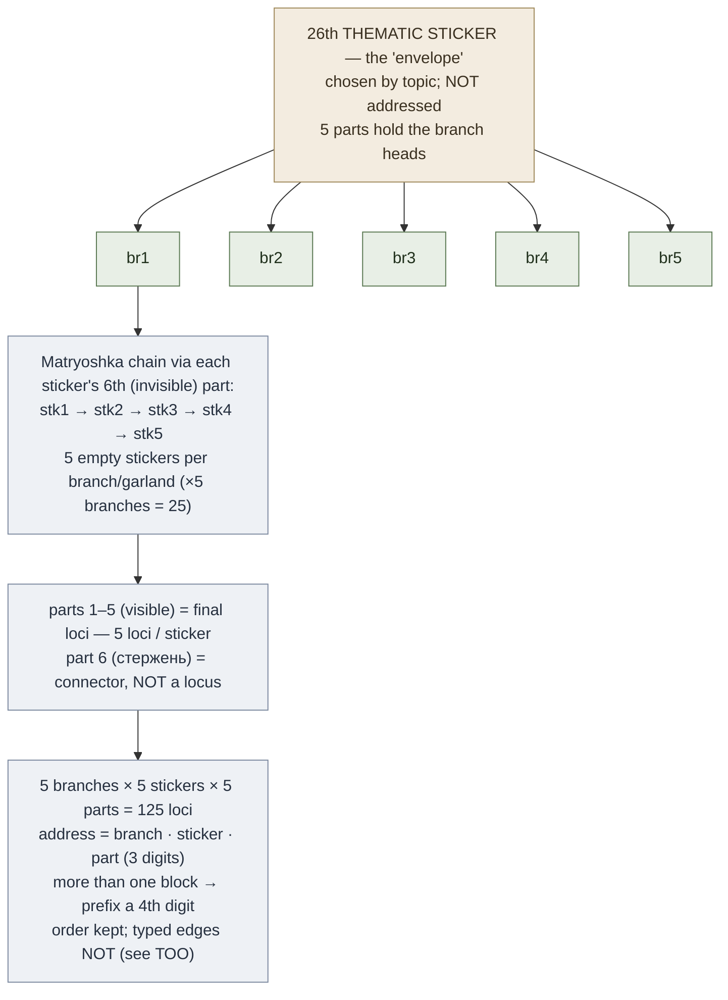

# Four-Level Blocks (Блок стикеров)

**Summary**: The four-level block is Kozarenko's *second* self-generating addressable-loci store — parallel to [table-of-support-images](./table-of-support-images.md) but bigger-per-unit and differently shaped: it nests empty support-images (*стикеры*) into a 5×5 lattice of 125 three-digit-addressed loci collected onto a single thematic image, spun up per-topic when there is no table of contents to hang loci on.

**Sources**: `GMS_V.Kozarenko.pdf`; internal [kozarenko-mnemotechnics](./kozarenko-mnemotechnics.md), [table-of-support-images](./table-of-support-images.md), [memory-palace](./memory-palace.md), [prose-memorization](./prose-memorization.md).

**Last updated**: 2026-07-10.

---

## The стикер — an empty support-image

A **стикер** (empty support-image) is any vivid image pressed into service as a *container* rather than as an encoded item: it carries no information of its own and exists only as scaffolding, exactly like the other support-images in [the Giordano school](./kozarenko-mnemotechnics.md) (source: GMS_V.Kozarenko.pdf). Stickers can be memorized onto existing loci and linked to one another by the Matryoshka nesting technique or the *приём возврата*, always through the sticker's last free part (source: GMS_V.Kozarenko.pdf).

Stickers exist to solve one specific bottleneck. Image-codes cannot be chained directly to each other — reusing a code as a connector overwrites it (the *затирание* collision rule owned by [kozarenko-mnemotechnics](./kozarenko-mnemotechnics.md)). So any data whose elements are **all image-codes** — train schedules, chemical-equation coefficients, grouped formulas — has nothing to bind them and needs an empty association-base to hang on (source: GMS_V.Kozarenko.pdf). Kozarenko's worked example is a commuter-train timetable: pick any image from the platform as a sticker, hang the morning trains on it, free-associate a second sticker, hang the evening trains on that (source: GMS_V.Kozarenko.pdf).

This page owns the *стикер*, the *four-level block*, and the *тематический стикер*. It does **not** re-document the image-code vocabulary those loci store — that is owned by [mnemonic-methods-master](./mnemonic-methods-master.md) (number-image codes) and [method-of-guiding-associations](./method-of-guiding-associations.md) (word→image).

## Building the four-level block

For a *block* of loci you pick arbitrary images that can each be split into **five visible parts plus a sixth, invisible part** (source: GMS_V.Kozarenko.pdf). Kozarenko's model is a pen (*авторучка*): parts 1–5 are the final loci; the 6th part — the refill (*стержень*) — is not a locus, it is the connector used to nest the next sticker by the [Matryoshka technique](./memory-palace.md) (source: GMS_V.Kozarenko.pdf).

The recipe fans out over four levels (source: GMS_V.Kozarenko.pdf; counts per [skill-progression-stages](./skill-progression-stages.md)):

1. **Thematic image** — one collecting image, its 5 parts hold the branch heads.
2. **5 branches** — one garland per part of the collecting image.
3. **25 stickers** — 5 empty stickers per branch, strung nose-to-tail through each sticker's 6th part.
4. **125 final loci** — the 5 visible parts of each sticker.

So **5 stickers per branch × 5 branches = 25 stickers = 125 final support-images**, gathered onto the parts of a **26th image** (source: GMS_V.Kozarenko.pdf; count per [skill-progression-stages](./skill-progression-stages.md)). When that 26th collecting image is chosen to symbolize the topic it becomes the **тематический стикер** (thematic sticker) — the same collecting image that [prose-memorization](./prose-memorization.md) uses to head a textbook chapter (source: GMS_V.Kozarenko.pdf). Kozarenko's analogy: the collecting image is an **envelope** into which you insert the **garlands** of empty stickers (source: GMS_V.Kozarenko.pdf).

## Addressing — three digits

Inside one block the loci carry a **three-digit numeric address** (branch · sticker · part), and the collecting image itself is not counted (source: GMS_V.Kozarenko.pdf; scale per [skill-progression-stages](./skill-progression-stages.md)). Digits run 1–5, so the addresses span `1.1.1 … 5.5.5` = 125 cells. If you run **several blocks**, the address grows to **four digits**, the leading digit selecting the block (source: GMS_V.Kozarenko.pdf).

## Comparison: three kinds of image

Kozarenko's own table distinguishing the empty locus, the loaded association-base, and the topic image (source: GMS_V.Kozarenko.pdf):

|  | Опорный образ (support-image / locus) | Основа ассоциации (association base) | Тематический стикер (thematic sticker) |
| --- | --- | --- | --- |
| **How formed** | Different ways (e.g. Cicero method); encodes no information | Encodes a unique part of the material | Symbolizes the name of a textbook section |
| **Function** | Empty memory cell; a place in the sequence; first cell in a table row | Binds different parts of one item into a whole | Binds the information of one section into a whole |
| **Sequence** | A pre-created order — its whole point | Stored onto loci, into a sequence, or held separately | Order built by chaining stickers via Matryoshka, or through the 6th free part |

In a four-level block the collecting image (envelope) is the thematic sticker; the garlands of empty stickers are the intermediate support-images; the parts of the empty stickers are the final loci (source: GMS_V.Kozarenko.pdf).

## ТОО vs four-level blocks — when to use which

Both are self-generating, addressable, long-term stores, and both preserve the **address but not the relationships** between cells — for that native failure mode and its manual work-arounds, see [table-of-support-images](./table-of-support-images.md) (do not re-derive it here). They differ in shape and origin:

- **[table-of-support-images](./table-of-support-images.md) (ТОО)** — ~900 cells minted *once* from the number-image code vocabulary by free-association fan-out (3 images × 3 parts = 9 per base code), addressed by a global **number**. A permanent spreadsheet for random-access reference data you query by index (source: GMS_V.Kozarenko.pdf; counts per [skill-progression-stages](./skill-progression-stages.md)).
- **Four-level block** — 125 loci grown by **empty-sticker Matryoshka nesting** (5 × 5), addressed **3-digit** and scoped to one **theme**. Spun up on demand for a single topic when there is no oglavlenie/table of contents to hang loci on — e.g. a programming lecture with no textbook (source: GMS_V.Kozarenko.pdf; counts per [skill-progression-stages](./skill-progression-stages.md)).

Rule of thumb: reach for **ТОО** when you want one durable, number-indexed store of unrelated facts; reach for a **four-level block** when you need a fresh, topic-local address space of ordered loci for one body of material. For payloads whose *typed edges* are the point, neither is right — route to a [CAST](./cast-overview.md) graph, which both of these structures discard.

## METER fit

Measured, per [METER](./meter-overview.md), as address→image retrieval latency at two gates:

- **Prerequisite (automaticity).** The images used as stickers must be well-fixed and reviewable fast — Kozarenko's Memory-Tester threshold is **10 loci scanned in 2 seconds** (~0.2s each), and the image-codes stored in them coded in **≤1 second** (source: GMS_V.Kozarenko.pdf) — the recognition-class automaticity level owned by [skill-progression-stages](./skill-progression-stages.md) and shared with the ~0.5s number-code gate that [mnemonic-methods-master](./mnemonic-methods-master.md) and [table-of-support-images](./table-of-support-images.md) ride. Un-automatized stickers make an unstable lattice.
- **Pass-floor.** A 3-digit address must resolve to its locus in **under 2 seconds**, recognition not reconstruction. If reaching `3.4.2` requires System-2 re-walking of the branch, the block is not yet a store and will drop items under load ([METER](./meter-overview.md)).

## Mnemonic

**"The envelope of five garlands."** A themed **envelope** (the 26th image) holds five **garlands**; each garland is five stickers strung nose-to-tail, threaded through the invisible refill of the one before; each sticker shows five faces. 5 garlands × 5 stickers × 5 faces = **125** loci, addressed `1.1.1 … 5.5.5`. The envelope is the address you never count.

## Memory checksum

Three falsifiable recall checks:

1. **How many loci per block, by what recipe?** Answer: **125** — 5 branches × 5 stickers × 5 *visible* parts (source: GMS_V.Kozarenko.pdf). Trap: if you said 150 you counted the 6th part, or if you said 126 you counted the collecting image — neither is a locus.
2. **What is the sticker's 6th, invisible part for?** Answer: **Matryoshka chaining** to the next sticker (the pen's *стержень*/refill), a connector, *not* storage. Trap: hanging an item on it collides with the chain — the 6th part links, it never holds.
3. **стикер vs a ТОО cell?** Answer: a стикер is a whole image (5 loci) nested by Matryoshka into a per-theme, 3-digit-addressed block; a [ТОО](./table-of-support-images.md) cell is one number-addressed slot in a ~900-cell global table (source: GMS_V.Kozarenko.pdf). Trap: treating them as the same, or thinking a sticker holds only one item.

## Visual

## Related pages

- [table-of-support-images](./table-of-support-images.md) — the sibling self-generating store (ТОО); ~900 number-addressed cells vs this block's 125 theme-scoped loci; owner of the shared address-not-relationships failure mode
- [kozarenko-mnemotechnics](./kozarenko-mnemotechnics.md) — Giordano-school hub; owner of *затирание* and *приём возврата*, the collision rule that makes empty stickers necessary
- [memory-palace](./memory-palace.md) — owner of the Matryoshka nesting technique that strings the garlands
- [prose-memorization](./prose-memorization.md) — sibling method that heads a textbook chapter with the same тематический стикер
- [mnemonic-methods-master](./mnemonic-methods-master.md) — number-image codes stored in the loci
- [method-of-guiding-associations](./method-of-guiding-associations.md) — word→image codes, the other content this scaffolding holds
- [skill-progression-stages](./skill-progression-stages.md) — owner of the counts and the automaticity gate
- [meter-overview](./meter-overview.md) — retrieval-latency pass-floor discipline
- [cast-overview](./cast-overview.md) — the graph to prefer when typed edges are the payload

---

## U — See (CAST)
1. One empty image, split 5+1, nesting into a 125-locus lattice with no photography and no textbook TOC
2. Edges: 26th thematic image → 5 branches → 25 stickers (Matryoshka via 6th part) → 125 final loci

## D — Name (NEDF)
1. Four-level block = 125 three-digit-addressed loci grown by empty-sticker (стикер) Matryoshka nesting, 5×5
2. Distinguisher: per-theme, spun up on demand; sibling of ТОО but built from stickers, not number-codes
3. Failure mode: relational payloads — like ТОО it keeps the address, not the edges between loci

## F — Do (SPEAR)
1. Pick images divisible 5+1, chain 5 into a garland via the 6th part, gather 5 garlands on a 26th theme image
2. Address each locus branch·sticker·part (3 digits; 4 when blocks multiply) and store an image-code on it

## B — Watch (HEART)
1. Hanging an item on the 6th part → it collides with the chain; the 6th part connects, never holds
2. Building a block on un-automatized stickers (slower than 10-in-2s) → the lattice drops loci under load

## L — Predict (ORACLE)
1. "A topic with no table of contents to hang loci on" → a fresh four-level block mints 125 theme-local slots
2. If the material's relationships matter, expect to lose them here — carry edges in a CAST graph instead

## R — Act (GRACE)
1. One-topic, order-scoped material with no TOC → spin up a four-level block and address it 3-digit
2. Durable, number-indexed, unrelated reference facts → route to a [ТОО](./table-of-support-images.md) cell instead
