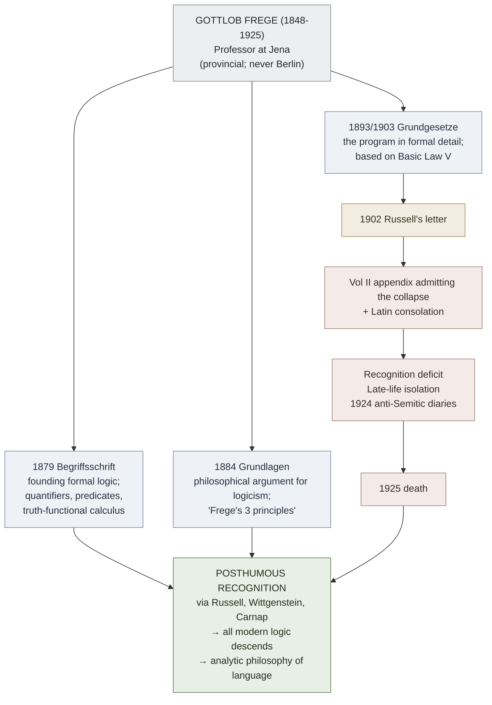

# Gottlob Frege (1848–1925)

**Summary**: The mathematician-philosopher who **invented modern formal logic** (*Begriffsschrift*, 1879) and built the most ambitious 19th-century [logicist](./foundations-crisis.md) program (*Grundgesetze der Arithmetik*, Vols I 1893 / II 1903). Demolished mid-publication by [Russell's letter of June 1902](./russells-paradox.md). His appendix to *Grundgesetze* Vol II — admitting the foundation had collapsed and accompanied by the Latin consolation *"Solatium miseris socios habuisse malorum"* (it is a consolation in misery to have companions) — is **the most painful single page in the history of mathematics**. Case 2 of the [logicians-madness-substrate-thesis](./logicians-madness-substrate-thesis.md); the prophet whose entire life's work was demolished by a single counter-example.

**Sources**:
- Hans Sluga, *Gottlob Frege* (Routledge 1980) — the standard scholarly biography.
- Frege's primary works: *Begriffsschrift* (Halle 1879); *Die Grundlagen der Arithmetik* (Breslau 1884); *Grundgesetze der Arithmetik* Vols I-II (Jena 1893, 1903).
- Russell's letter to Frege June 16, 1902 + Frege's reply June 22, 1902. Both reprinted in van Heijenoort, *From Frege to Gödel* (Harvard 1967), pp. 124-128.
- [logicomix-graphic-novel](./logicomix-graphic-novel.md) — narrative depiction; the scene of Frege opening Russell's letter.

**Last updated**: 2026-05-25

---

## One-line

> Invented modern formal logic with *Begriffsschrift* (1879). Spent the next 24 years deriving arithmetic from logic in *Grundgesetze*. Volume II was at press when Russell's letter (1902) arrived demolishing the foundation. Added an appendix admitting the collapse; never recovered his program; died largely unknown in 1925.

## Unlocks (lead, not footer)

1. ***Begriffsschrift* 1879 is the founding document of modern formal logic.** Pre-Frege, logic was Aristotelian categorical syllogism + medieval refinements + sporadic algebraic-logic moves (Boole 1854, De Morgan 1847). Post-*Begriffsschrift*, logic has **quantifiers** (∀ and ∃ in their modern formal sense — Frege's own notation differs but the concept is his), **propositional functions** (predicates with variable slots), **truth-functional connectives** as a precise system, and **proofs as derivations within a formal calculus**. **Everything Copi Ch 8-10 teaches descends from Frege 1879.**

2. **The collapse pattern Russell will repeat to Hilbert.** Frege's 24-year project demolished by Russell's single-paragraph letter (1902) is structurally the same shape as Hilbert's 30-year formalist program demolished by Gödel's single-page paper (1931). **Two foundations-crisis cycles, same shape: long ambitious program + counter-example destroys it + program leaves descendants but does not survive as program.**

3. **Logicism survives in Frege's descendants, not in Frege's system.** Frege's specific *Grundgesetze* — based on Basic Law V (unrestricted comprehension) — is dead. **But Frege's *project*** (derive arithmetic from logic) is alive in modern type theory: [Russell-Whitehead](./principia-mathematica.md) type-theoretically; Martin-Löf intuitionistically; modern Coq, Lean, Agda industrially. Frege's defeat is partial.

4. **Substrate-thesis case 2.** The collapse of Frege's life work + his subsequent isolation + the late-life anti-Semitic political collapse (documented in 1924 diaries) → death in obscurity 1925. Three-component mechanism present: regress-pursuing (logical foundations of arithmetic), social isolation (never had a school in his lifetime), abstract perfection as personal standard (the *Grundgesetze* project was an attempt at absolute foundational certainty).

## Mnemonic

**1879 → 1902 → 1925** = *Begriffsschrift · Russell's letter · death in obscurity.*

Three dates: invented formal logic; saw it weaponized against his own program; died unknown 23 years later.

## Memory checksum

1. **What did Frege publish in 1879?** (*Begriffsschrift* — the founding document of modern formal logic; first system with quantifiers + propositional functions + formal proof calculus.)
2. **What was the *Grundgesetze* project?** (The logicist program: derive arithmetic from logic alone via Basic Law V — unrestricted set comprehension. Vols I 1893, II 1903.)
3. **What did Russell's letter prove?** (Basic Law V leads to contradiction via the *set of all sets that don't contain themselves*. Frege's foundation cannot stand. See [russells-paradox](./russells-paradox.md).)
4. **What was Frege's response?** (Appendix to Vol II (1903) admitting the collapse; brief attempt at a patch; ultimate acknowledgment that the system as published cannot be saved. The Latin consolation about miserable companions follows.)
5. **What survives Frege's *Grundgesetze*?** (Frege's *project* (derive math from logic) survives in [*PM*](./principia-mathematica.md) type theory and modern proof assistants. Frege's *Begriffsschrift* notation and methodology are alive in every modern logic textbook. The specific Basic Law V is dead.)

## Visual — the Frege arc

The notation Frege invented continues; the program he built does not.

---

## The works

### *Begriffsschrift* (1879)

*"Concept-script: a formula language of pure thought modeled on that of arithmetic"* — Frege's first major work. **The founding document of modern formal logic.**

What it introduced:
- **Quantifiers** (∀, ∃) as binding operators on propositional variables. Pre-Frege logic could only quantify over the *subjects* of categorical propositions; Frege allowed quantification over predicates and any variable slot.
- **Propositional functions**: predicates with named variable slots, e.g. *F(x)* for "x is F". Pre-Frege logic treated predicates as labels, not as functions of arguments.
- **Truth-functional connectives** as a precise system: ⌐, ⊃ (Frege's notation for "if-then"; modern logic uses →), and derived from these.
- **Formal proof calculus**: deductions presented as numbered lines with explicit justifications referring to axioms and prior lines.

Notation was idiosyncratic — Frege used a vertical "concept-script" with hooks and lines rather than the linear formula style that became standard (largely due to Peano + Russell-Whitehead conventions). Modern logic descends from Frege's *content* but uses Peano-Russell's *notation*.

Reception in 1879: minimal. *Begriffsschrift* was a difficult read in unfamiliar notation; the small German logic community at the time was largely uninterested. The book sold poorly. Frege's recognition would come only after his death.

### *Die Grundlagen der Arithmetik* (1884)

*"The Foundations of Arithmetic: A logico-mathematical investigation into the concept of number"* — the philosophical argument for logicism. **Required reading for any later philosopher of mathematics; one of the most influential single books in 20th-century philosophy.**

Three of Frege's famous principles articulated here:

1. **Always sharply separate the psychological from the logical, the subjective from the objective.**
2. **Never ask the meaning of a word in isolation, only in the context of a proposition.** (The *context principle*; later load-bearing for Wittgenstein.)
3. **Never lose sight of the distinction between concept and object.**

The book argues that **number is a logical concept** — specifically, the number of F's is the *extension* of the concept "equinumerous with F". This is the logicist thesis: arithmetic = logic + class theory.

The book also contains the famous attacks on Kant's view that arithmetic is synthetic a priori (Frege says it's *analytic* a priori), on Mill's empiricism (Frege rejects), and on formalism (Frege rejects).

### *Grundgesetze der Arithmetik* (1893, 1903)

*"Basic Laws of Arithmetic"* — the **formal derivation** of arithmetic from logic. Vol I (1893) introduces the system; Vol II (1903) develops real number theory.

The system rests on **Basic Law V**:

> For any concepts F and G, the extension of F equals the extension of G iff F and G have the same instances.

In modern notation: `{x : F(x)} = {x : G(x)} ↔ ∀x.(F(x) ↔ G(x))`.

This is essentially **unrestricted set comprehension** — for any predicate, there is a set of things satisfying it.

### Russell's letter (June 16, 1902)

While *Grundgesetze* Vol II was at press, Russell wrote to Frege:

> *Let w be the predicate "is a predicate which cannot be predicated of itself". Can w be predicated of itself? From each answer the opposite follows. We must therefore conclude that w is not a predicate. Likewise there is no class (as a totality) of those classes which, each taken as a totality, do not belong to themselves. From this I conclude that under certain circumstances a definable set does not form a totality.*

Russell's paradox in its original epistolary form. The construction proceeds *inside Frege's own Basic Law V*: take the predicate "is a class that does not contain itself"; by Basic Law V it determines a class R; R ∈ R iff R ∉ R; contradiction.

### Frege's reply (June 22, 1902)

Frege wrote back:

> *Your discovery of the contradiction has surprised me beyond words and, I should almost like to say, left me thunderstruck, because it has rocked the ground on which I meant to build arithmetic. […] It is all the more serious as the collapse of my Law V seems to undermine not only the foundations of my arithmetic but the only possible foundations of arithmetic as such.*

And the famous Latin consolation: *"Solatium miseris socios habuisse malorum"* — "It is a consolation in misery to have companions". (Frege misattributes the line in his appendix; the source is Latin proverbial.)

The appendix to *Grundgesetze* Vol II briefly attempted a patch to Basic Law V (the "Russell-fix"); Frege himself recognized the patch was inadequate. He never published Vol III; the program was effectively dead.

## What survives Frege

The *program* (logicism) survives in [Russell-Whitehead](./principia-mathematica.md) and modern type theory. The *system* (Grundgesetze) does not.

The *content* of *Begriffsschrift* — quantifiers, propositional functions, truth-functional connectives, formal proof calculus — is **the substrate of every logic textbook ever after**. Copi Ch 8-10 is Frege 1879 in modernized notation.

The *philosophical foundations* of *Grundlagen* — the analytic/synthetic distinction applied to arithmetic, the context principle, the concept/object distinction, the attack on psychologism — are **the load-bearing infrastructure of analytic philosophy of language**. Wittgenstein, Russell, Quine, Dummett all built on Frege.

The Sense/Reference distinction (*Sinn und Bedeutung*, 1892) — that linguistic expressions have both a sense (mode of presentation) and a reference (the object referred to) — is **the founding move of philosophy of language**.

Frege's modern reputation is *enormous*; his contemporary reputation was minimal. The reversal happened gradually 1903-1950 via Russell, Wittgenstein, and Carnap.

## Substrate-thesis case 2

Frege presents three-component mechanism, partially:

| Component | Present? |
|---|---|
| Regress-pursuing inside a closed formal system | YES — 24 years on the *Grundgesetze* foundation |
| Social isolation from non-domain peers | YES — provincial Jena position; no school in his lifetime; minimal correspondence with non-mathematicians |
| Abstract perfection as personal standard | YES — the *Grundgesetze* was an attempt at absolute foundational certainty; the appendix's pain reflects the standard not being met |

Outcome: not the dramatic sanatorium-or-suicide of Cantor/Boltzmann, but **slow withdrawal + late-life political collapse**.

The 1924 diaries — found posthumously — document anti-Semitic positions that horrified later editors. The wiki's conservative interpretation: the late-life political collapse is *correlated with* but probably not *caused by* the foundational collapse. The foundational collapse weakened Frege's relational + cognitive substrate broadly, contributing to but not explaining the political turn. Other contemporaries (e.g., Hilbert) endured similar political pressures without similar collapse; the substrate damage matters.

## The Logicomix portrayal

[Logicomix](./logicomix-graphic-novel.md) depicts Frege opening Russell's letter — the moment the foundation gives way. The visual: Frege at his desk, the letter in hand, the air going out of him. The book treats Frege with deep sympathy; the scene is one of the emotional anchors of the foundations-crisis narrative.

## METER integration

| Drill | Pass floor | Source |
|---|---|---|
| Place Frege on the foundations-crisis timeline | <15 s | [foundations-crisis](./foundations-crisis.md) |
| State *Begriffsschrift*'s 4 founding contributions | <30 s | this page §*Begriffsschrift* |
| State Basic Law V and explain why it leads to Russell's paradox | <60 s | this page §*Grundgesetze* + [russells-paradox](./russells-paradox.md) |
| Quote Frege's "thunderstruck" reply | <30 s | this page §Russell's letter |
| State the substrate-thesis mechanism for Frege | <60 s | this page §Substrate case 2 |

## Related pages

- [logicomix-graphic-novel](./logicomix-graphic-novel.md) — narrative source
- [russells-paradox](./russells-paradox.md) — what demolished Frege's program
- [principia-mathematica](./principia-mathematica.md) — Russell-Whitehead's response continues Frege's project
- [foundations-crisis](./foundations-crisis.md) — Frege as case 2 in the timeline
- [logicians-madness-substrate-thesis](./logicians-madness-substrate-thesis.md) — Frege as case 2
- [argument-anatomy](./argument-anatomy.md) — Frege's quantifiers + propositional functions enabled this
- [methods-of-deduction](./methods-of-deduction.md) — Frege's formal proof calculus is the substrate
- [copi-introduction-to-logic](./copi-introduction-to-logic.md) — Ch 8-10 descends from Frege 1879
- [logic-atomic-design](./logic-atomic-design.md) — Frege's Atom-tier contributions
- [glossary](./glossary.md) — Logic layer registration
