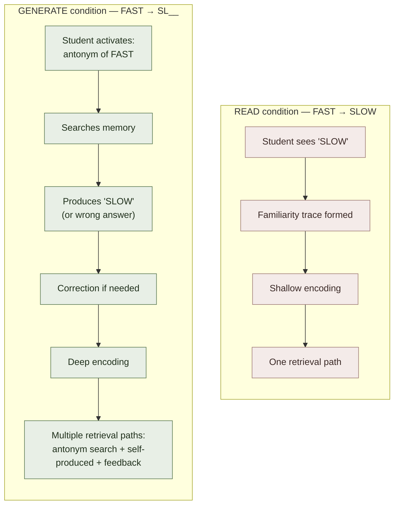

# Generation Effect

**Summary**: The generation effect is the robust finding that **material you generate yourself is remembered better than material you passively read**, even when the generated version is wrong or only approximate. First documented by Slamecka & Graf (1978): completing word-stems (SO__ for SOAP) produced dramatically better recall than reading the word. The mechanism is **encoding depth through production**: generation forces the learner to activate prior knowledge, search memory, and resolve ambiguity — each step deepening the trace. The generation effect is the cognitive-science basis for the wiki's bias toward **closed-book recall**, **self-testing**, **elaborative interrogation**, and **active problem-solving over re-reading**. This page is the canonical owner.

**Sources**:
- Slamecka, N. J., & Graf, P. (1978). "The Generation Effect: Delineation of a Phenomenon." *Journal of Experimental Psychology: Human Learning and Memory*, 4(6), 592-604. — original finding.
- Jacoby, L. L. (1978). "On Interpreting the Effects of Repetition: Solving a Problem Versus Remembering a Solution." *Journal of Verbal Learning and Verbal Behavior*, 17(6), 649-667. — solving-vs-reading comparison.
- McNamara, D. S., & Healy, A. F. (1995). "A Generation Advantage for Multiplication Skill Training and Nonword Vocabulary Acquisition." *Journal of Memory and Language*, 34(3), 374-400. — extends to arithmetic, vocabulary.
- Bertsch, S., Pesta, B. J., Wiscott, R., & McDaniel, M. A. (2007). "The Generation Effect: A Meta-Analysis." *Journal of Memory and Language*, 56(4), 521-542. — meta-analysis, robust across conditions.
- Brown, P. C., Roediger, H. L., & McDaniel, M. A. (2014). *Make It Stick*. Harvard University Press. — Ch 4 practical account.
- Internal: [active-recall](./active-recall.md), [elaboration](./elaboration.md), [desirable-difficulties](./desirable-difficulties.md), [fluency-illusion](./fluency-illusion.md), [self-explanation](./self-explanation.md).

**Last updated**: 2026-06-10

---

## The core finding

Slamecka & Graf (1978) presented participants with word pairs. Some saw the full word (read condition: *FAST — SLOW*). Others saw the first word and had to generate the second from a rule (generate condition: *FAST — SL__*). On a later free-recall test, **generated words were recalled significantly better than read words** — despite the same exposure time.

Key features of the phenomenon:
- Holds for antonyms, synonyms, category members, rhymes, and associates
- Holds even for INCORRECT generations — the act of generating (and then correcting) still beats passive reading
- Holds across ages and materials
- Bertsch et al. (2007) meta-analysis: **d ≈ 0.40** — a medium-to-large effect size, robust across conditions

## Why generation works

Multiple (not mutually exclusive) explanations:

| Mechanism | What it claims |
|---|---|
| **Processing effort** | Generation is harder than reading → deeper encoding (Craik & Lockhart levels-of-processing) |
| **Activation of prior knowledge** | Generating requires accessing what you already know → new material connects to existing network → multiple retrieval paths (see [elaboration](./elaboration.md)) |
| **Error-signal salience** | When generation produces a wrong answer, the mismatch is salient → the correction is more memorable than if passively read |
| **Self-referential encoding** | Generated material is coded as "something I produced" → self-reference effect adds a retrieval cue |
| **Reduced contextual dependency** | Generated traces are less bound to the specific encoding context → more robust to context change at retrieval |

These mechanisms converge on the same practical implication: **don't restudy; generate**.

## The generation effect and the fluency illusion

Passive re-reading produces familiarity without recall strength. Familiarity feels like knowing — this is the [fluency-illusion](./fluency-illusion.md). Generation bypasses this: the generation attempt either succeeds (correct recall) or fails with a salient error signal (incorrect generation → correction → deeper trace than reading would have produced).

This is why **closed-book testing outperforms re-reading** even when the test score is low — the low score is a signal, not evidence that testing didn't work. The act of attempting recall is the encoding event.

## Operational forms in the wiki

| Wiki context | How generation is operationalized |
|---|---|
| [active-recall](./active-recall.md) drill cards | Prompt → attempt → reveal: the reveal is the re-study; the attempt is the generation event |
| Elaborative interrogation | "Why is X true?" forces generation of a causal explanation before the answer is given |
| Self-explanation ([self-explanation](./self-explanation.md)) | Explaining a worked example to yourself = generating the rationale |
| Memory checksum per page | Producing the 3-question answer from memory = generation; reading the checksum passively = not |
| Mnemonic encoding via [remaps](./remaps.md) | Constructing the scene (not copying a provided one) = generation |
| [5-gates-of-comprehension](./5-gates-of-comprehension.md) Gate 5 (REGENERATE) | Producing the compressed form from memory after reading = deliberate generation event |

The generation effect is why the wiki's authoring norm is "produce the mnemonic and checksum yourself" rather than importing pre-made ones: the production event is the learning event.

## Boundary conditions

The generation effect is robust but not unconditional:

| Condition | Effect attenuated? |
|---|---|
| **Very unfamiliar material** | If the learner has no prior knowledge to activate, generation fails; passive reading may need to precede generation (see [deliberate-practice](./deliberate-practice.md) — explicit instruction before generation) |
| **Incorrect generation not corrected** | Uncorrected errors consolidate false traces; generation without feedback is risky |
| **Motor/procedural material** | Generation effect is strongest for verbal material; weaker for purely procedural motor skills (which require physical repetition) |
| **Multiple-choice testing** | Recognition-format testing shows weaker generation advantage; free recall and cued recall show strongest advantage |

## Visual



```chart height=300
{"title":{"text":"Recall test, 1 hour later","subtext":"Generation advantage: d ≈ 0.40 (Bertsch 2007 meta-analysis)"},"xAxis":{"type":"category","data":["READ","GENERATE"]},"yAxis":{"type":"value","max":100,"axisLabel":{"formatter":"{value}%"}},"series":[{"type":"bar","barWidth":"45%","label":{"show":true,"position":"top","formatter":"{c}%"},"data":[{"value":35,"itemStyle":{"color":"#a07d78"}},{"value":71,"itemStyle":{"color":"#5c7a54"}}]}]}
```

## Failure modes

| Failure | What it produces |
|---|---|
| **Generation without feedback** | Errors harden into confident false memories; always close the generation loop |
| **Generation before any comprehension** | No prior knowledge → no activation → no generation effect; read/explain first |
| **"Passive generation"** | Writing out a word you just read is not generation; there must be a temporal gap or concealment |
| **Only free-recall format** | Generation effect appears across formats; but ensure some free-recall or cued-recall tests (not only multiple-choice) |

## Related pages

- [active-recall](./active-recall.md) — the primary operational form of the generation effect in the wiki
- [elaboration](./elaboration.md) — generation of explanations is one elaboration form
- [fluency-illusion](./fluency-illusion.md) — generation bypasses the fluency illusion that passive reading creates
- [desirable-difficulties](./desirable-difficulties.md) — generation is one of the four canonical desirable difficulties
- [self-explanation](./self-explanation.md) — generation of rationale for worked examples
- [5-gates-of-comprehension](./5-gates-of-comprehension.md) — Gate 5 REGENERATE is deliberate generation after compression
- [practice-is-required-not-optional](./practice-is-required-not-optional.md) — generation events are the practice events

---

## U — See (CAST)
1. Generated material recalled better than passively read material — even when wrong
2. Mechanism: activation of prior knowledge + deeper encoding + salient error signal

## D — Name (NEDF)
1. Generation effect = producing (not reading) the target → better memory
2. Distinguisher: familiarity (reading) ≠ recall strength (generation)
3. Failure mode: generation without feedback → errors harden

## F — Do (SPEAR)
1. For any new material: conceal answer → attempt generation → reveal → correct → re-generate if wrong
2. Mnemonic creation: build the scene yourself (don't copy a pre-made one)

## B — Watch (HEART)
1. Copying from a provided answer ≠ generation; must produce without seeing
2. Material unfamiliar enough that activation fails → read/understand first, then generate

## L — Predict (ORACLE)
1. Generation attempt (even failed) → deeper trace than reading same material
2. Passive re-study → familiarity + fluency illusion; poor recall on delayed test

## R — Act (GRACE)
1. Reviewing any material → close the book before attempting recall; never restudy passively
2. Writing a mnemonic → produce it yourself; the production event is the encoding event
