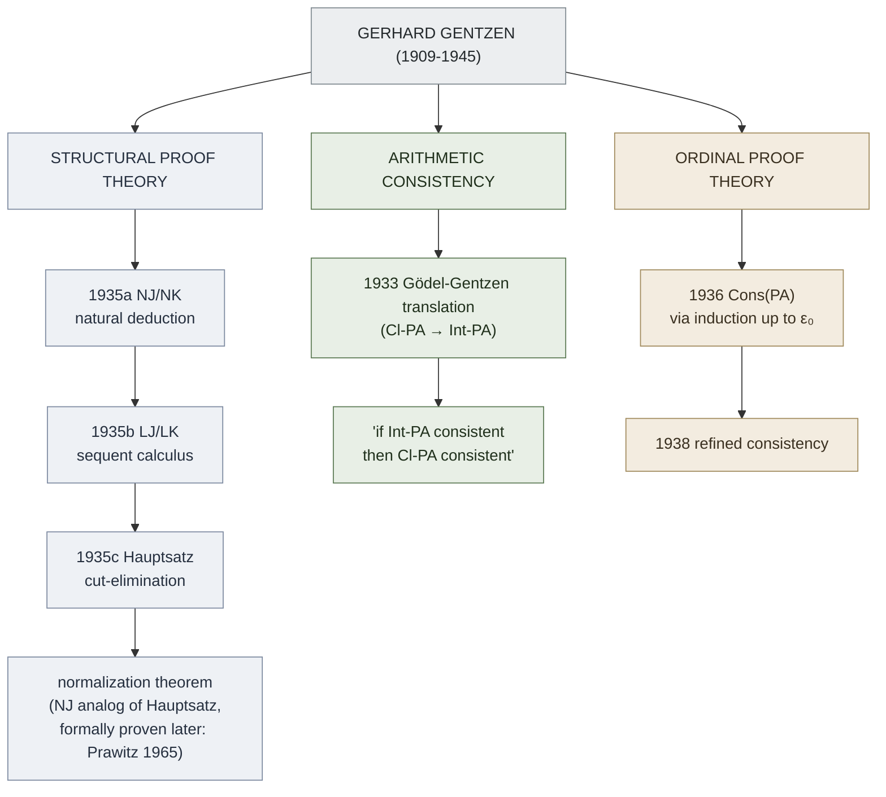
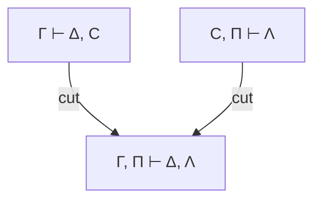

# Gentzen's Proof Theory

**Summary**: Gerhard Gentzen's 1933–1938 work, which created modern proof theory: the [Gödel-Gentzen translation](./godel-gentzen-translation.md) of classical into intuitionistic arithmetic (1933), [natural deduction](./natural-deduction.md) (NJ, NK; 1935), the [sequent calculus](./sequent-calculus.md) (LJ, LK; 1935), the [cut-elimination theorem](./cut-elimination-hauptsatz.md) (1935 *Hauptsatz*), and the [consistency proof for Peano arithmetic](./consistency-of-peano-arithmetic.md) using ordinal induction up to [ε₀](./epsilon-zero-and-ordinal-induction.md) (1936, refined 1938). The shift from *reductive* proof theory (Hilbert-style epistemic certification) to *general* proof theory (study proofs as mathematical objects in themselves) — Prawitz 1971's coinage — starts here.

**Sources**:
- [Mancosu, Galvan, Zach (2021)](./proof-theory-mancosu-galvan-zach.md) Ch 1.2 — primary source for this page.
- Mancosu, Galvan, Zach (2021) *An Introduction to Proof Theory: Normalization, Cut-Elimination, and Consistency Proofs*, OUP — §1.2–§1.3, Ch 1 (the published edition; cited inline as an-introduction-to-proof-theory...pdf).
- Gentzen, G. (1969) *The Collected Papers of Gerhard Gentzen*, ed. M. E. Szabo, Amsterdam: North-Holland.
- Gentzen, G. (1935b, 1935c) "Investigations into logical deduction" (his dissertation).
- Gentzen, G. (1936) "Die Widerspruchsfreiheit der reinen Zahlentheorie."
- Gentzen, G. (1938) revised consistency proof.
- Von Plato, J. (2018) "The development of proof theory," *Stanford Encyclopedia of Philosophy*.
- Menzler-Trott, E. (2016) *Logic's Lost Genius: The Life of Gerhard Gentzen.*

**Last updated**: 2026-06-10

---

## Unlocks (lead, not footer)

1. **Reductive → general proof theory shift.** Hilbert wanted proofs *as means* (to certify infinitary mathematics). Gentzen treated proofs *as objects* (with structure, transformations, normal forms). The wiki's encoder paradigm — NEDF/SPEAR/CAST/HEART/ORACLE/GRACE treating *concepts as objects with slots* rather than as means to recall — is structurally a Gentzen-style move. **The encoder methodology has its formal-logic ancestor in 1935.**

2. **Five contributions, one architecture.** Translation + natural deduction + sequent calculus + cut-elimination + consistency-via-ordinals — these aren't five disjoint papers, they're one architecture: a way to study what proofs *are* by exhibiting their canonical forms and their transformations. The relation between NJ and LJ (translations both ways) shows that *natural deduction and sequent calculus are two views of the same object* — like representations of the same mathematical structure. [Framework comparison](./framework-comparison-matrix.md) discipline applied to logic itself.

3. **Discharge mechanism is the formal home of the production-reception grammar pair.** Gentzen's [ND](./natural-deduction.md) discharges assumptions: reason under A, derive B, conclude A→B with A *no longer in force*. The production-reception-grammar-pair pattern at the speaking layer (I-utterance, SHIELD) does the same: receive Event under provisional interpretation, respond with Request that lands independent of which interpretation was assumed.

## Mnemonic

**TNSCO** = *Translation · Natural-deduction · Sequent-calculus · Cut-elimination · Ordinal-consistency*.

The five-letter sequence covers the entire arc 1933 → 1938 in chronological order: Translation (1933) · NJ/NK (1935a) · LJ/LK (1935b) · Cut-elimination *Hauptsatz* (1935c) · Ordinal-induction-consistency (1936).

## Memory checksum

If you can answer these in <60 s each from memory, the page is encoded:

1. State the **[Gödel-Gentzen translation](./godel-gentzen-translation.md)** in one sentence. (*Any classical-arithmetic proof of φ translates to an intuitionistic-arithmetic proof of φ', where φ' is φ with every atomic sub-formula double-negated. Result: Cl-PA is consistent iff Int-PA is consistent — answering the intuitionist charge that classical math is unsafe.*)
2. State the difference between **NJ and LJ**. (*NJ = natural deduction for intuitionistic predicate logic — proofs are trees, intro/elim rule pairs per connective, assumptions discharged at conditional-introduction. LJ = sequent calculus for intuitionistic predicate logic — proofs are trees of sequents Γ ⊢ Δ where Δ has at most one formula; rules introduce connectives on left or right.*)
3. State **Gentzen's Hauptsatz** (the [cut-elimination theorem](./cut-elimination-hauptsatz.md)). (*Every LK / LJ proof can be effectively transformed into a cut-free proof of the same end-sequent. Cut is the only rule that can introduce formulas not in the end-sequent; eliminating it gives the **sub-formula property** for sequent calculus.*)
4. What ordinal does **[Gentzen's consistency proof](./consistency-of-peano-arithmetic.md)** require induction up to, and why? (*[ε₀](./epsilon-zero-and-ordinal-induction.md) = sup{ω, ω^ω, ω^{ω^ω}, …}. Each cut-reduction step strictly decreases an ordinal notation assigned to the proof; the proof terminates because ordinal notations are well-ordered up to ε₀; PA cannot prove this well-ordering of ε₀ — that's the extra step beyond PA.*)
5. What is the **reductive vs general proof theory** distinction (Prawitz 1971)? (*Reductive proof theory uses proofs to reduce infinitary epistemology to finitary — [Hilbert's program](./hilberts-program.md) goal. General proof theory studies proofs as mathematical objects without epistemic constraints — Gentzen's broader legacy, where normalization and cut-elimination are interesting independent of any consistency-proof use.*)

## Visual — the five Gentzen contributions

The cut-elimination theorem for LK and the [normalization theorem](./normalization-theorem.md) for NJ/NK are *the same theorem in two presentations*. Cut in LK corresponds to detour-introduction-then-elimination in NJ. Eliminating one is eliminating the other.

---

## What Gentzen did (and why each piece matters)

### 1. The Gödel-Gentzen translation (1933)

Defines (·)' on formulas:
- p' = ¬¬p (for atomic p)
- (φ ∧ ψ)' = φ' ∧ ψ'
- (φ ∨ ψ)' = ¬(¬φ' ∧ ¬ψ')
- (φ → ψ)' = φ' → ψ'
- (¬φ)' = ¬φ'
- (∀x φ)' = ∀x φ'
- (∃x φ)' = ¬∀x ¬φ'

Theorem: PA ⊢ φ iff HA (Heyting arithmetic, intuitionistic) ⊢ φ'.

Significance: **classical arithmetic is no less safe than intuitionistic arithmetic.** Brouwer-Weyl couldn't honestly use inconsistency as a reason to reject PA — if PA is inconsistent, so is HA, which they accept. See [godel-gentzen-translation](./godel-gentzen-translation.md).

### 2. Natural deduction (NJ, NK, NM; 1935)

Proofs are *trees* of formulas, not sequences. Each connective has an *introduction rule* (how to prove a formula with that connective as main operator) and an *elimination rule* (how to use a formula with that connective). Some rules discharge assumptions.

NM = minimal logic · NJ = NM + ex-falso-quodlibet (intuitionistic) · NK = NJ + double-negation-elimination (classical).

Why this matters: ND matches *how mathematicians actually argue*. "Assume X. Then ... So Y. Hence X → Y." That's literally the →I rule. See [natural-deduction](./natural-deduction.md).

### 3. Sequent calculus (LJ, LK; 1935)

Proofs are trees of *sequents* Γ ⊢ Δ. The antecedent Γ is a list of formulas, the succedent Δ is a list (LK) or at-most-singleton list (LJ). Each connective has a *left rule* and a *right rule* (operating on the antecedent or succedent respectively).

Why this matters: sequents make symmetry between antecedent and succedent visible (the structural rules — weakening, contraction, interchange, cut — operate on both sides identically). The symmetry is the reason cut-elimination is *easier* to prove for sequent calculus than normalization for natural deduction. See [sequent-calculus](./sequent-calculus.md).

### 4. Cut-elimination (the *Hauptsatz*; 1935c)

The cut rule (two premises above the bar, conclusion below):

Cut introduces a formula C that disappears in the conclusion. Intuitively: C is a *lemma*. Cut-free proofs use no lemmas.

The Hauptsatz: *every cut can be eliminated.* The eliminated proof is direct (uses only sub-formulas of the end-sequent).

Why this matters:
- **Decidability** of propositional logic (cut-free proof search terminates).
- **Consistency** of pure first-order logic (no cut-free proof of the empty sequent exists by inspection).
- **Conservativity** results (extending a theory by some axioms doesn't prove new theorems in the old language, if cut-elimination is preserved).
- **Witness extraction** (mid-sequent / Herbrand's theorem).

See [cut-elimination-hauptsatz](./cut-elimination-hauptsatz.md).

### 5. Consistency of PA (1936, refined 1938)

Idea: assign every PA-proof a *primitive-recursive ordinal notation* < ε₀. Show that a fixed reduction procedure on proofs strictly decreases the ordinal. Since ε₀ is well-ordered (no infinite descending sequence), the reduction terminates — and when it does, all cuts on complex formulas and all induction rules are gone. A proof of the empty sequent in PA would then reduce to a cut-free induction-free proof of the empty sequent in pure logic, which inspection rules out.

Why this matters: gives a *constructive* (in the BHK sense) proof of Con(PA) that goes beyond what PA proves about itself — answering [Gödel's second incompleteness theorem](./godels-incompleteness.md) in a way that *partly preserves* Hilbert's program. See [consistency-of-peano-arithmetic](./consistency-of-peano-arithmetic.md).

## Why Gentzen matters beyond proof theory

Gentzen's methods generalize. **Reductive** proof theory: stronger systems S are reduced to weaker systems W by finding an ordinal α such that W + induction-up-to-α proves Con(S). This is the modern subject — Schütte, Pohlers, Rathjen extend Gentzen's technique to systems far beyond PA (ACA₀ with Γ₀; predicative analysis; impredicative theories via Bachmann-Howard).

**General** proof theory: Curry-Howard correspondence (proofs ≈ programs), proof-theoretic semantics (Dummett, Prawitz), linear logic (Girard), proof complexity. Each takes a Gentzen-style transformation (normalization, cut-elimination) and uses it as the primary object of study, not as a tool for some external consistency goal.

## Tragic biographical note

Gentzen joined the SA (Nazi Sturmabteilung) in 1933. He worked in Prague during WWII; after the city's liberation by Soviet forces in May 1945, he was arrested and died of starvation in a Soviet detention camp on August 4, 1945, age 35. *Logic's Lost Genius* (Menzler-Trott 2016) is the definitive biography. The wiki cites the proofs; the politics belong in the biography.

## Connection to the wiki

- **[TLP show-vs-say](./show-vs-say.md) connection**: every Gentzen transformation (normalization, cut-elimination) is a way to *show* what a proof contains by stripping detours. The conclusion "shows" only its own sub-formulas in a normal proof. Compare TLP 4.121: *propositions show the [logical form](./picture-theory-of-language.md) of reality.*

- **[Memory Paradox](./memory-paradox.md) connection**: Gentzen's life is a Memory Paradox instance — the work survives (every modern logic textbook cites it), the politics are remembered separately (the SA membership is in the bio, not the math). *Take seriously enough to invest, hold lightly enough to forgive* doesn't apply to the Nazi affiliation, but it applies to how the wiki treats his work: cite, learn, don't sanitize the bio.

- **Reductive-vs-general distinction × [the wiki's own ingest practice](./wiki-ingest-meta-pattern.md)**: the wiki ingests texts both *reductively* (extract the actionable rules — [METER](./meter-overview.md) pass-floors, drill ladders) and *generally* (preserve the conceptual architecture for its own sake, even when no immediate use is visible). Gentzen-style move: study the object, the use will follow.

## Reductive vs general proof theory (owner statement)

**This page owns the reductive-vs-general proof-theory distinction.** *Reductive proof theory* is the Hilbertian conception: proof theory is restricted by the goal of reducing proofs that use infinitary considerations to finitary (or constructive) proofs — the discipline is mainly interested in *derivability*, in whether something is derivable in a certain theory by certain means (source: an-introduction-to-proof-theory...pdf). [Hilbert's program](./hilberts-program.md) is its founding instance, and Gentzen's 1936 consistency proof is its high-water mark.

*General proof theory* is the broader stance Gentzen's work opened: an approach to the study of proofs that is *not constrained* by the epistemological aims that dominate reductive proof theory. One does not restrict the mathematical tools enlisted in the study of proofs — no requirement of finitary or constructive reasoning in the metamathematics — and proofs and their transformations are studied as objects of interest in themselves, not only as tools serving a foundational program (source: an-introduction-to-proof-theory...pdf). Gentzen managed to expand the Hilbertian approach by considering mathematical proofs in themselves and their transformations, and his approach was pivotal in the move from reductive to general proof theory (source: an-introduction-to-proof-theory...pdf).

The terminological contrast was given its sharp form and especially emphasized by **Prawitz and Kreisel in the 1970s** (Prawitz 1971) (source: an-introduction-to-proof-theory...pdf). The same authors supply the canonical general-proof-theoretic result: the cut-elimination theorem for natural deduction, called the [normalization theorem](./normalization-theorem.md), proved independently by Raggio (1965) and Prawitz (1965), and extended by Prawitz from intuitionistic to classical and stronger logics (source: an-introduction-to-proof-theory...pdf). The structural-proof-theory results that exhibit a normal proof's [sub-formula property](./sub-formula-property.md) are general-proof-theoretic — they are interesting independent of any consistency-proof payoff. This is the distinction the wiki re-uses as the [METER](./meter-overview.md) split between *measuring for use* and *modeling for structure*, and it grounds [proof-theoretic semantics](./proof-theoretic-semantics.md) (Dummett-Prawitz), where the meaning of a connective is given by its introduction/elimination rules rather than by any external truth-conditional or epistemic goal.

## The ω-rule (owner declaration)

**This page owns the term "ω-rule."** The ω-rule is the infinitary inference: from the infinitely many premises A(0), A(1), A(2), … infer ∀x A(x) (source: an-introduction-to-proof-theory...pdf). It is a *rule with an infinite number of premises and one conclusion* — a genuine departure from finitary syntax, since no finite proof figure can list all its premises (source: an-introduction-to-proof-theory...pdf).

Schütte and others found it expedient, when carrying out consistency proofs for systems stronger than arithmetic, to work with systems that themselves contain such infinitary rules (source: an-introduction-to-proof-theory...pdf). The ω-rule has now become *standard* in proof theory, but — as the source stresses — it is "definitely quite far from what Hilbert envisaged in his finitary presentation of theories" (source: an-introduction-to-proof-theory...pdf). It is therefore a tool of *general* proof theory: adopting it abandons the finitary metamathematics that defined [Hilbert's program](./hilberts-program.md), in exchange for a system whose proofs (now infinite, well-founded trees) are easier to analyze ordinal-theoretically. The well-foundedness machinery that tames those infinite trees is the ordinal apparatus documented at [epsilon-zero-and-ordinal-induction](./epsilon-zero-and-ordinal-induction.md).

## The Gödel System T connection (owner declaration)

**This page owns the term "Gödel System T."** Gödel's System T is the system of *functionals of finite type* underlying his 1958 consistency proof for arithmetic — an important extension of the finitary point of view within general proof theory (source: an-introduction-to-proof-theory...pdf). A numerical function takes natural numbers to natural numbers; a *functional* may in addition take functions as arguments and produce functions as values. System T is produced by starting from specific numerical functions and generating new functions and functionals by certain principles, repeated an arbitrary finite number of times, yielding the class of functionals of finite type; Gödel singled out the *recursive functionals of finite type* — those computable whenever their arguments are (source: an-introduction-to-proof-theory...pdf).

The link back to Gentzen's own route is exact: Gödel associated with every arithmetical statement P an existence assertion about a recursive functional such that a proof of P in arithmetic implies that assertion; the assertion corresponding to 0 = 1 is then shown false, yielding the consistency of arithmetic — and **the assumption of existence of the recursive functionals of finite type is demonstrably equivalent to induction along the well-ordering [ε₀](./epsilon-zero-and-ordinal-induction.md)** (source: an-introduction-to-proof-theory...pdf). So *existence of System T functionals ≡ ε₀-induction*: Gödel's functional route and Gentzen's ordinal route measure the same transfinite content. The deep connection between the two consistency proofs is exactly this equivalence (source: an-introduction-to-proof-theory...pdf).

System T also straddles the reductive/general divide. Read reductively it certifies arithmetic; but it carried the germ of a general extension, exploited in the 1970s by associating recursive functionals with proofs via the λ-calculus — defining "normal form" for functionals so that every detour-free proof corresponds to a normal-form functional and vice versa (source: an-introduction-to-proof-theory...pdf). That correspondence is the [Curry-Howard](./curry-howard-correspondence.md) reading: System T is the proof-term calculus whose normalization mirrors proof-normalization, the functional-of-finite-type counterpart of the [normalization theorem](./normalization-theorem.md) this page already records for natural deduction.

## Related pages

- [proof-theory-mancosu-galvan-zach](./proof-theory-mancosu-galvan-zach.md) — source textbook (Ch 1.2 + Ch 7-9)
- [hilberts-program](./hilberts-program.md) — what Gentzen partly rescued
- [godel-gentzen-translation](./godel-gentzen-translation.md) — the 1933 result
- [natural-deduction](./natural-deduction.md) — the 1935a system
- [sequent-calculus](./sequent-calculus.md) — the 1935b system
- [cut-elimination-hauptsatz](./cut-elimination-hauptsatz.md) — the 1935c result
- [normalization-theorem](./normalization-theorem.md) — the NJ/NK analog (Prawitz 1965); general-proof-theory result
- [consistency-of-peano-arithmetic](./consistency-of-peano-arithmetic.md) — the 1936/1938 result
- [epsilon-zero-and-ordinal-induction](./epsilon-zero-and-ordinal-induction.md) — the ordinal; ≡ existence of System T functionals
- [sub-formula-property](./sub-formula-property.md) — what cut-free / normal proofs deliver
- [proof-theoretic-semantics](./proof-theoretic-semantics.md) — meaning-as-rules, downstream of the general-proof-theory turn
- [curry-howard-correspondence](./curry-howard-correspondence.md) — proofs-as-programs reading of System T normalization
- [godels-incompleteness](./godels-incompleteness.md) — the 1931 result that set the stage
- [hilbert-david](./hilbert-david.md) · [foundations-crisis](./foundations-crisis.md) — historical context
- [glossary](./glossary.md) — Logic layer registrations
- [Visual walkthrough →](../../pages/proof-theory.html) — `/explain` UMTF-matrix walkthrough (detour → cut-elimination → normal form, with Curry-Howard code panel)
