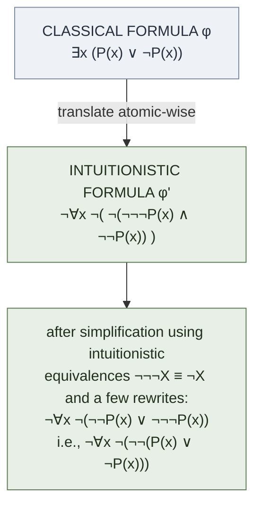
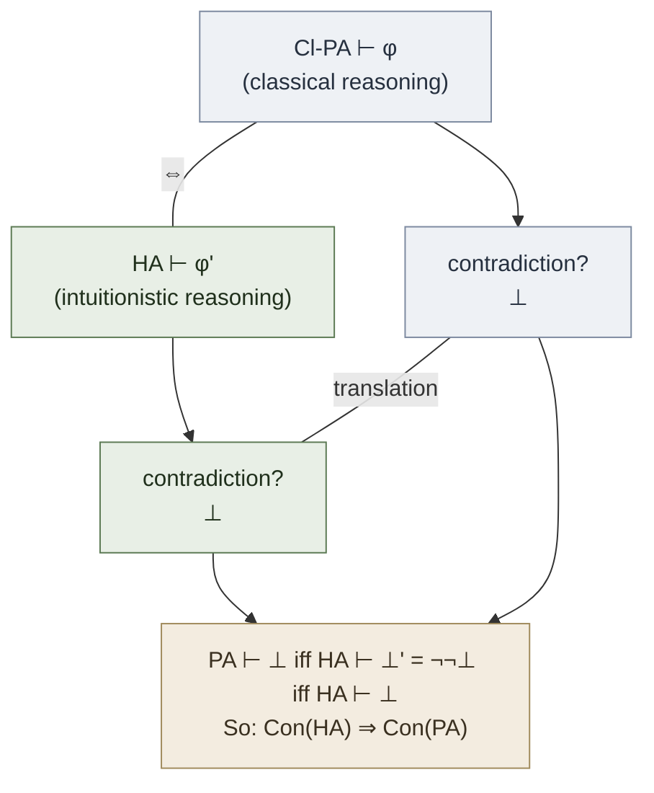

# Gödel-Gentzen Translation

**Summary**: A formula-by-formula syntactic translation φ ↦ φ' from classical first-order logic to intuitionistic first-order logic such that classical-PA ⊢ φ iff intuitionistic-Heyting-arithmetic ⊢ φ'. Discovered independently by Gentzen (1933, withdrawn) and Gödel (1933). The translation works by *double-negating* atomic formulas and rewriting ∃ and ∨ in terms of ¬∀¬ and ¬(¬·∧¬·). Its consequence: **classical arithmetic is no less safe than intuitionistic arithmetic** — if PA is inconsistent, so is HA. Settles the Brouwer-Weyl charge that classical math is unsafe in the most direct way possible.

**Sources**:
- [Mancosu, Galvan, Zach (2021)](./proof-theory-mancosu-galvan-zach.md) Ch 2.15 — primary source for this page.
- Gentzen, G. (1933) "On the relation between intuitionist and classical arithmetic" (withdrawn from publication after Gödel's 1933 paper appeared); first published in Gentzen (1969).
- Gödel, K. (1933) "Zur intuitionistischen Arithmetik und Zahlentheorie."
- Troelstra, A. S. (1973) *Metamathematical Investigation of Intuitionistic Arithmetic and Analysis.*

**Last updated**: 2026-05-27

---

## Unlocks (lead, not footer)

1. **Double-negation translation × [ANT-countering](./ants-and-lies-of-learning.md) × Burns-Beck cognitive distortion taxonomy.** The translation routes classical φ through *intuitionistic ¬¬φ* — provable iff classically provable but without claiming the strong constructive content. This is *exactly* the structure of effective ANT-countering: when the strong positive claim *"I am competent"* is unreachable, the **double-negation form** *"it's not the case that I'm not competent"* is reachable, defeats the negative thought, and avoids the overclaim. **Constructive vs classical reasoning in cognition** is the same architectural choice Gentzen and Gödel found in arithmetic.

2. **Conservativity result × wiki's audit pipeline.** Cl-PA is *conservative over* HA via the translation — Cl-PA proves no *intuitionistic* theorems that HA doesn't already prove. This is the formal-logic instance of the wiki's lint discipline: an ingest of a new source must not change which claims the wiki already implicitly endorses; if it does, the lint catches the change as a contradiction. **First proof-theoretic grounding of the wiki's "conservativity-under-ingest" expectation.**

3. **Embedding-not-translation × [cross-tradition-convergence-pattern](./cross-tradition-convergence-pattern.md).** The Gödel-Gentzen translation isn't a faithful mirror — it's a *one-way embedding* with a syntactic price (every atomic formula gets ¬¬-wrapped). This is the same structural pattern as the wiki's cross-tradition convergence pages: traditions don't translate cleanly, but they *embed* into a common operational layer with named syntactic costs. The translation is the first historical instance of this pattern in formal logic.

## Mnemonic

**SAFE** = *Same-arithmetical-content · Atomic-double-negated · Falsity-disjoint · Embedded-not-mirrored.*

Reads as "safe" — the translation proves that classical arithmetic is *safe* (in the consistency-relative-to-intuitionistic sense) by *embedding* into HA, *atomic-by-atomic*, with no leakage.

## Memory checksum

If you can answer these in <60 s each from memory, the page is encoded:

1. State the **(·)' clauses** of the translation. (*p' = ¬¬p (for atomic p); (φ ∧ ψ)' = φ' ∧ ψ'; (φ ∨ ψ)' = ¬(¬φ' ∧ ¬ψ'); (φ → ψ)' = φ' → ψ'; (¬φ)' = ¬φ'; (∀x φ)' = ∀x φ'; (∃x φ)' = ¬∀x ¬φ'.*)
2. State the **main theorem**. (*PA ⊢ φ iff HA ⊢ φ'.*)
3. State the **consistency corollary**. (*If HA is consistent, so is PA. Because PA ⊢ ⊥ would translate to HA ⊢ ⊥' = ¬¬⊥ which intuitionistically yields HA ⊢ ⊥. Contrapositive gives the result.*)
4. Why is **double-negation on atomic** the right place, not the formula as a whole? (*¬¬p is intuitionistically equivalent to p only for *atomic* p decidable in HA (which all arithmetic atoms are — equality of numerals is decidable). For *compound* formulas, ¬¬-elim fails intuitionistically. So the translation pushes ¬¬ down to atomic level where it's harmless.*)
5. What is the **constructive content cost** of the translation? (*The translation φ' is intuitionistically *weaker* than φ — proves the existence of a witness *negatively* (no model in which no witness exists) rather than constructively (here is the witness). E.g., (∃x φ(x))' = ¬∀x ¬φ(x) says "not every x makes φ(x) false," which intuitionistically doesn't yield a specific x.*)

## Visual — the translation in action

**The preservation diagram** — provability of a contradiction is preserved by the translation:

The translation is mechanical, recursive on formula structure, and *content-preserving* in the consistency sense: PA proves a contradiction iff HA does.

---

## What the translation does (clause by clause)

For an atomic formula p (in the language of arithmetic — equalities and inequalities of terms):

> p' := ¬¬p

For compound formulas, the translation commutes with ∧, →, ¬, ∀:

> (φ ∧ ψ)' := φ' ∧ ψ'
> (φ → ψ)' := φ' → ψ'
> (¬φ)' := ¬φ'
> (∀x φ)' := ∀x φ'

For ∨ and ∃ — the two classical operators with no intuitionistic equivalent — the translation rewrites:

> (φ ∨ ψ)' := ¬(¬φ' ∧ ¬ψ')
> (∃x φ)' := ¬∀x ¬φ'

**Reading**: the translation says "to do classical disjunction, do intuitionistic *not-both-not* (the De Morgan dual)"; "to do classical existence, do intuitionistic *not-every-not*." Classically these are equivalent. Intuitionistically the rewrites are weaker — they don't extract a witness or a winning disjunct — but they're still provable when the classical original is.

### Why atomic doubling, not formula-level doubling?

You might think: *just put ¬¬ in front of any classical formula and we're done.* This works (the **double-negation translation** φ ↦ ¬¬φ does give Cl-PA ⊢ φ ⇒ HA ⊢ ¬¬φ for the propositional case). But for first-order arithmetic, ¬¬∀x φ(x) is intuitionistically *weaker* than ∀x ¬¬φ(x). Atomic-level translation pushes the double-negation past quantifiers, preserving more structure.

The Gödel-Gentzen translation pushes ¬¬ all the way down to atomic formulas — where ¬¬-elimination is intuitionistically *valid* (atomic formulas in arithmetic are decidable, so ¬¬p ≡ p intuitionistically). The result is the strongest possible translation.

## The main theorem (Mancosu et al. Ch 2.15)

**Theorem (Gödel-Gentzen 1933).** PA ⊢ φ iff HA ⊢ φ'.

**Proof sketch (⇒):** induction on the PA-proof. Each axiom of PA translates to a HA-provable formula (atomic axioms become ¬¬p which is trivial; induction axiom translates faithfully). Each inference rule preserves translation. The classical absurdity rule (⊥, ¬A → A) is the hard case — but ¬¬A → A is *not* needed if A is the *translation* of a classical formula, because the translation already has ¬¬ at the atomic leaves and ¬¬-elim works there.

**Proof sketch (⇐):** if HA ⊢ φ', then a fortiori PA ⊢ φ' (HA ⊂ PA). Then PA ⊢ φ' ⇒ PA ⊢ φ because in classical logic each translation clause is provably equivalent to the original (¬¬p ↔ p for atomic; ¬(¬φ ∧ ¬ψ) ↔ φ ∨ ψ classically; ¬∀x ¬φ ↔ ∃x φ classically).

## The consistency corollary

**Corollary.** If HA is consistent, so is PA. Equivalently: Con(HA) ⇒ Con(PA).

**Proof.** Contrapositive. Suppose PA ⊢ ⊥. Then HA ⊢ ⊥' = ¬¬⊥. But ¬¬⊥ ≡ ⊥ intuitionistically (¬¬⊥ → ⊥ is true in HA: assume ¬¬⊥, then ¬⊥ would give ⊥ by modus ponens with ¬¬⊥, contradiction; so ⊥). So HA ⊢ ⊥. Done.

This is the *philosophical* payoff. Brouwer and Weyl said classical mathematics is suspect — it might be inconsistent. Gentzen and Gödel answered: *if HA is consistent (which Brouwer and Weyl both accept), then PA is consistent.* You don't get to use *consistency* as a charge against PA without simultaneously charging HA.

## What it doesn't give

Three things the translation *doesn't* establish:

1. **Witness extraction for classical ∃.** (∃x φ(x))' = ¬∀x ¬φ'(x). A HA-proof of this gives no specific witness. Classical-arithmetic-style ∃-claims remain non-constructive even after translation.
2. **Disjunction property for classical ∨.** (φ ∨ ψ)' = ¬(¬φ' ∧ ¬ψ'). A HA-proof of this need not yield a HA-proof of φ' nor of ψ'.
3. **Faithfulness in the philosophical sense.** Gentzen and Gödel didn't claim "classical and intuitionistic logic are the same thing." They claimed "classical arithmetic is *consistency-equivalent* to intuitionistic arithmetic." Brouwer and Weyl's *epistemological* concerns (the meaning of ∃ and ∨) remain — the translation doesn't make them disappear.

## Relation to other translations

The Gödel-Gentzen translation sits in a family:

| Translation | Source | Target | Property |
|---|---|---|---|
| **Gödel-Gentzen (1933)** | Classical PA | Heyting arithmetic (HA) | PA ⊢ φ iff HA ⊢ φ' |
| **Friedman A-translation (1978)** | HA + Markov's principle | HA | adds witness extraction in certain ∃-cases |
| **Glivenko (1929)** | Classical propositional | Intuitionistic propositional | for propositional only: Cl ⊢ φ iff Int ⊢ ¬¬φ |
| **Kuroda (1951)** | Classical first-order | Intuitionistic first-order | a sibling translation; ∀ becomes ¬∀¬¬ |
| **Krivine negative translation (1990)** | Classical | Intuitionistic + double-negation translation | reformulated via call/cc |

All preserve provability one direction (the source-to-target direction). The Gödel-Gentzen is the *canonical* arithmetic translation; the others extend, refine, or specialize it.

## Connection to the wiki

### ANT-countering pattern

The most striking unlock is the parallel with [cognitive ANT-countering](./ants-and-lies-of-learning.md):

| Cognitive layer (Burns-Beck) | Logic layer (Gödel-Gentzen) |
|---|---|
| ANT (Automatic Negative Thought): *I am not competent* | atom-level fact *p* |
| Burns-Beck counter: *It's not the case that I'm not competent* | translated form *¬¬p* |
| Strong positive: *I am competent* | classical fact *p* |
| Why use the counter? It's reachable (avoid overclaim) but defeats the ANT | Why use the translation? It's intuitionistically provable but consistency-equivalent to classical |

The pattern: when the strong positive form is unreachable (constructively in arithmetic, emotionally in self-talk), the double-negation form is reachable and operationally sufficient.

### Conservativity in wiki ingest

When a new source is ingested, the wiki's lint must verify that no claim *changes* under the new evidence. The Gödel-Gentzen translation provides the model: PA ⊢ φ → HA ⊢ φ' shows *no claim of HA is altered by accepting PA*. This is **conservativity**.

The wiki's analog: when ingesting Mancosu et al., the prior wiki claims (in [copi-introduction-to-logic](./copi-introduction-to-logic.md), [tractatus-logico-philosophicus](./tractatus-logico-philosophicus.md), etc.) should remain valid. Linting checks that the new pages don't *contradict* the old — they may extend, refine, or sub-feature them, but not negate.

## Related pages

- [proof-theory-mancosu-galvan-zach](./proof-theory-mancosu-galvan-zach.md) — source textbook (Ch 2.15)
- [gentzens-proof-theory](./gentzens-proof-theory.md) — historical context; the 1933 result
- [hilberts-program](./hilberts-program.md) — Brouwer-Weyl charge that the translation answered
- [natural-deduction](./natural-deduction.md) · [sequent-calculus](./sequent-calculus.md) — the calculi the translation operates over
- [consistency-of-peano-arithmetic](./consistency-of-peano-arithmetic.md) — Gentzen's 1936 follow-up gives an *absolute* consistency proof (no relative-to-HA caveat)
- [godels-incompleteness](./godels-incompleteness.md) — Gödel's other 1931 result that shaped the problem
- [ants-and-lies-of-learning](./ants-and-lies-of-learning.md) — cognitive-layer instance of the pattern
- [cross-tradition-convergence-pattern](./cross-tradition-convergence-pattern.md) — pattern instance: classical and intuitionistic logic embed via a syntactic cost
- [memory-paradox](./memory-paradox.md) — take seriously enough to translate, hold lightly enough to acknowledge what translation doesn't give
- [glossary](./glossary.md) — Logic layer registrations
