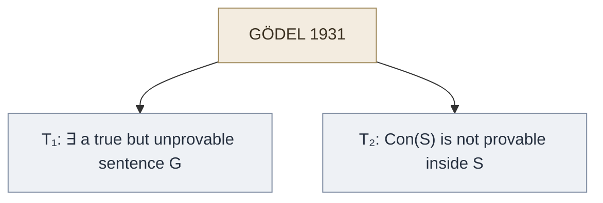

# Gödel's Incompleteness Theorems

**Summary**: Kurt Gödel's 1931 paper *Über formal unentscheidbare Sätze der Principia Mathematica und verwandter Systeme I* contains two theorems that demolished Hilbert's formalist program, wounded residual logicism, and refuted [TLP](./picture-theory-of-language.md)'s claim that every proposition is a truth-function of elementary propositions. **First incompleteness theorem**: any consistent formal system powerful enough to encode arithmetic contains true statements it cannot prove. **Second incompleteness theorem**: no such system can prove its own consistency from within. The narrative climax of [Logicomix](./logicomix-graphic-novel.md); the technical pivot from 19th-century optimism about complete formal foundations to the 20th-century understanding that *every formal system has a horizon*.

**Sources**:
- Kurt Gödel, "Über formal unentscheidbare Sätze der Principia Mathematica und verwandter Systeme I", *Monatshefte für Mathematik und Physik* 38 (1931), 173–198. English translation in Hilbert/Bernays/Tarski/Gödel collections, most accessibly van Heijenoort, *From Frege to Gödel* (1967).
- [Logicomix](./logicomix-graphic-novel.md) narrative — Gödel's Vienna Circle appearance and the demolition of Hilbert's program.
- [TLP](./tractatus-logico-philosophicus.md) 5–6 — the truth-function reduction Gödel's first theorem refuted.
- [principia-mathematica](./principia-mathematica.md) — Russell-Whitehead's logicist system Gödel proved incomplete.

**Last updated**: 2026-05-25

---

## One-line

> Two theorems, 1931, one paper, one page of arithmetical-self-reference machinery, and the entire late-19th-century dream of complete formal foundations for mathematics dies.

## Unlocks (lead, not footer)

1. **What TLP got wrong that picture theory survives.** TLP 5 claimed every proposition is a truth-function of elementary propositions. Gödel's first theorem produces a *true* proposition (the Gödel sentence G: "this sentence is not provable") that is *not* a truth-function — it asserts its own unprovability via arithmetical encoding. **Picture theory itself survives** (G is still a structured representation of a fact about the system); the *specific reduction* TLP 5 proposed does not. The wiki's encoder paradigm, grounded in picture theory not in truth-function reduction, is unaffected.

2. **What Hilbert lost.** Hilbert's program: formalize all of mathematics; prove the formalization consistent *within the formalization itself*. Gödel's second theorem: no sufficiently powerful consistent system can prove its own consistency. Hilbert's program is dead. The mathematical community keeps doing mathematics; the foundational ambition shifts.

3. **What logicism lost.** Russell-Whitehead's *Principia Mathematica* attempted to derive all of mathematics from logic via type-theoretic machinery. Gödel's first theorem applies to *PM*: it contains true statements it cannot prove. **Logicism survives as a constructive enclave** (Curry-Howard, Martin-Löf, modern type theory) but not as the foundational program Russell intended.

4. **What intuitionism kept.** Brouwer's intuitionism — mathematics as mental construction; only constructive proofs admit — was wounded but not killed by Gödel. It survives in modern computational mathematics (Coq, Lean, Agda) and in homotopy type theory. Among the three 1900-1931 programs, intuitionism is the survivor.

5. **The Gödel sentence as a *limit* picture.** TLP's "limits of language" intuition (TLP 5.6, the boundaries of my language are the boundaries of my world) is vindicated at a deeper level than Wittgenstein could have anticipated: every formal system has *internal* limits, statements about itself it cannot reach. Gödel makes the show-vs-say boundary technical. (Cross-link to [show-vs-say](./show-vs-say.md).)

## Mnemonic

**1-2** + **T-C** = *Theorem 1, Theorem 2 — Truth, Consistency.*

- **Theorem 1 (T)**: a *true* but unprovable sentence exists.
- **Theorem 2 (C)**: *consistency* cannot be self-proved.

Two theorems; one is about *truth* outrunning provability; the other is about *consistency* not being self-certifiable. The mnemonic *T-C* gives the punchline.

For dates: **1931** — Gödel was 25.

## Memory checksum

If you can answer these in <60 s each from memory, the page is encoded:

1. **State the first incompleteness theorem.** (Any consistent formal system powerful enough to encode arithmetic contains true statements it cannot prove.)
2. **State the second incompleteness theorem.** (Such a system cannot prove its own consistency from within.)
3. **What did Gödel demolish?** (Hilbert's formalist program — the dream of self-certifying mathematics. Wounded logicism. Refuted TLP 5's truth-function reduction. Left intuitionism partially intact.)
4. **What is the Gödel sentence?** (A sentence G that asserts, via arithmetical self-reference, *"this sentence has no proof in the system"*. If G were provable, the system proves a falsehood (inconsistent); if G were refutable, the system proves ¬G, but then G is true → contradiction. So G is true-but-unprovable in any consistent system.)
5. **What survives Gödel?** (Picture theory at the philosophical layer. Mathematical practice. Intuitionism partially. Constructive type theory. The recognition that every formal system has a horizon.)

## Visual — the Gödel pivot

| Program | Before 1931 | After 1931 |
|---|---|---|
| **Logicism** (Frege/Russell/Whitehead) | Math reduces to logic | Wounded by Russell's paradox 1901; now also: PM contains true unprovable statements |
| **Formalism** (Hilbert) | Math = consistent symbol manipulation; consistency provable internally | DEAD by Theorem 2 — no system can prove its own consistency |
| **Intuitionism** (Brouwer) | Math = mental construction; only constructive proofs admit | WOUNDED but survives; reborn in modern type theory |
| **TLP** (Wittgenstein) | All propositions are truth-functions of elementary propositions | TLP 5 truth-function reduction: REFUTED by Theorem 1. Picture theory itself survives |

The pivot that produced the "after" column:

The pivot is *the* event of 20th-century foundations. Everything before it presumed the completeness of formal foundations was attainable; everything after it works *within* known internal limits.

---

## The proof sketch (compressed)

Gödel's machinery, in its compressed form:

1. **Gödel numbering.** Assign each symbol of the formal system a unique number. Assign each sentence a unique number (by combining its symbols' numbers). Assign each proof a unique number. Now statements *about* the formal system are statements *about* numbers — which the formal system itself can express.

2. **The Bew predicate.** Define `Bew(x, y)` as the arithmetical predicate "*x* is the number of a proof of the sentence with number *y*". This is expressible in the formal system because it's an arithmetical statement.

3. **Self-reference via diagonalization.** Construct a sentence G whose number *g* makes G arithmetically equivalent to: *"no x is a proof of the sentence with number g"*. That is, G says of itself, via its number, "I have no proof".

4. **First theorem.** If the system is consistent:
   - If G were provable, the system proves a false statement (that G has no proof, when in fact it does) → inconsistency. Contradiction.
   - If ¬G were provable, the system proves G has a proof; if the system is also ω-consistent, this is also a contradiction.
   - Therefore neither G nor ¬G is provable. G is **undecidable**.
   - But G *is* true (by inspection — it says it has no proof, and we just proved it has no proof in the system).
   - So G is **true-but-unprovable**.

5. **Second theorem.** The statement "the system is consistent" is itself arithmetizable as Con(S) := ¬∃x.Bew(x, ⌜0=1⌝). Gödel shows Con(S) → G is provable inside the system. So if Con(S) were provable inside the system, G would be too — contradicting Theorem 1. Therefore Con(S) is not provable inside the system.

The proof is a single page of arithmetical-self-reference machinery. The implications run for a century.

## What Gödel did *not* show

The popular misreadings of the theorems are legion. Gödel did not prove:

- **"Mathematics is broken."** False. Mathematics is intact; the *foundational program* of self-certification is broken. Mathematicians continue to prove theorems within consistent fragments of set theory or type theory; they just can't certify the whole edifice from inside.
- **"Some things are true but unprovable in any sense."** Misleading. The Gödel sentence G *is* provable — just not in *S* itself. A larger system (S extended with Con(S)) proves G. Provability is relative to a system; the theorem says no *single* system suffices for all truths it can express.
- **"Logic has limits, so we should trust intuition / mysticism / X."** Non-sequitur. Gödel's theorems are themselves precisely-proved mathematical results; they don't license abandoning rigor in their name.
- **"The mind exceeds any formal system."** Gödel himself believed something like this (Lucas-Penrose argument); but the inference from "no formal system captures all mathematical truth" to "minds aren't formal systems" is not a theorem — it's an interpretation that requires substantial additional argument.

## Cross-link to TLP

[TLP](./tractatus-logico-philosophicus.md) 5 is the proposition Gödel killed:

> *Propositions are truth-functions of elementary propositions.* — TLP 5

Gödel's first theorem produces a true proposition (G) that is *not* a truth-function of elementary propositions of the system — G asserts its own unprovability via arithmetical encoding; the encoding is not truth-functional in the system's elementary propositions.

What survives in TLP:
- **Picture theory** (2.1–4.06) is untouched. G is still a structured representation of a fact about the system; the fact happens to be a fact the system can't prove. Picture theory describes the *representational structure*, not what's provable.
- **Show-vs-say** (4.121–4.1212) is *vindicated* at a deeper level. The Gödel sentence shows what the system cannot say about its own consistency. Wittgenstein's show-vs-say boundary now has a technical mathematical analogue.
- **The mystical** (6.44+) — what shows itself but cannot be said — gains a sibling: in any formal system, there are facts that show themselves in the system's *structure* but cannot be said as theorems of the system.

What dies in TLP:
- The specific reductionist program of TLP 5 — all propositions as truth-functions.
- The specific machinery of TLP 6 — the N-operator generating all propositions — is technically still correct for the propositions it can generate, but it can no longer generate *all* propositions (because some, like G, are not in its scope).

Wittgenstein himself was aware of Gödel by his later years and reportedly dismissed the theorems as "tricks". Most logicians regard this as Wittgenstein protecting his earlier system; the theorems stand.

## What Gödel did to Hilbert (the Logicomix scene)

Hilbert's program (formulated in his 1900 ICM 23 problems and his 1928 *Grundlagen der Mathematik*):

1. Formalize all of mathematics.
2. Prove that the formalization is *consistent* (no proves both P and ¬P).
3. Prove this *within the formalization itself* (finitary methods).

Gödel's second theorem: step 3 is impossible. Any consistent formalization powerful enough to encode arithmetic cannot prove its own consistency.

[Logicomix](./logicomix-graphic-novel.md) depicts the moment: Hilbert at Königsberg 1930, delivering his famous credo *Wir müssen wissen — wir werden wissen* (*We must know — we will know*). The next day, Gödel announces incompleteness in a side session. Hilbert was not present. He learned of it later; the program he had spent his life building was already dead by the moment he gave the closing speech.

Hilbert lived another twelve years. He did not collapse — but the field reorganized around the new limits. Constructive type theory, model theory, computability theory, set-theoretic foundations all emerged as the post-Gödel landscape.

## Sibling results in 1930s logic

Gödel's theorems are the most-cited but not isolated. The 1930s produced a cluster of "limit theorems" that together draw the boundary of formal-system reach:

| Year | Result | Author | What it limits |
|---|---|---|---|
| 1930 | Completeness theorem | Gödel | First-order logic IS complete (semantic = syntactic consequence). The "negative" Gödel result of 1931 is parameterized by *which* logic — first-order is fine; arithmetic-augmented is not. |
| 1931 | Incompleteness theorems | Gödel | Arithmetic-augmented systems are incomplete |
| 1933 | Truth-definition theorem | Tarski | Truth predicates aren't definable in their own language (semantic version of incompleteness) |
| 1936 | Halting problem | Turing | Computability has internal limits |
| 1936 | Recursion theorem | Kleene/Turing | Self-reference is general |
| 1936 | Equivalence of computability formalisms | Church/Turing | λ-calculus = Turing machine = general recursion |

The 1930s are the decade in which the formal-systems-have-internal-limits paradigm was established as the new norm.

## Cross-domain transfer (where Gödel-like results appear)

The incompleteness pattern recurs across domains:

| Domain | Gödel-analogue | Reference |
|---|---|---|
| Computation | Halting problem (Turing 1936) | undecidable: predicting whether arbitrary programs halt |
| Number theory | Goldbach's conjecture (status unknown) | candidate true-but-unprovable in current axioms |
| Set theory | Continuum hypothesis | proven independent of ZFC by Cohen 1963 |
| Type theory | Girard's paradox in System F | self-referential type-theoretic constructions break consistency |
| Programming languages | Rice's theorem | non-trivial semantic properties of programs are undecidable |
| Physics | Quantum measurement boundary | observer-cannot-fully-model-system has formal analogue |

The wiki cross-links this pattern to its own [show-vs-say](./show-vs-say.md) page: every sufficiently powerful representational system has facts about itself that show themselves but cannot be said within the system. Gödel made this technical.

## METER integration

| Drill | Pass floor | Source | Owner |
|---|---|---|---|
| State both theorems from memory | <30 s, verbatim | this page | this page |
| Sketch the Gödel-numbering trick | <90 s | proof-sketch above | this page |
| Distinguish what Gödel did/didn't show | <60 s for each common misreading | this page §What Gödel did not show | this page |
| Map Gödel onto TLP claims (which TLP claim killed, which survived) | <60 s | this page §Cross-link to TLP | this page |
| Date + author + paper title | <10 s | 1931 / Gödel / *Über formal unentscheidbare Sätze der Principia Mathematica und verwandter Systeme I* | this page |

## Related pages

- [logicomix-graphic-novel](./logicomix-graphic-novel.md) — narrative context for the Gödel arc
- [tractatus-logico-philosophicus](./tractatus-logico-philosophicus.md) — TLP 5 is the proposition Gödel killed; picture theory survives
- [picture-theory-of-language](./picture-theory-of-language.md) — what survives Gödel philosophically
- [show-vs-say](./show-vs-say.md) — gains a technical mathematical analogue from Gödel
- [principia-mathematica](./principia-mathematica.md) — the logicist system Gödel proved incomplete
- [russells-paradox](./russells-paradox.md) — sister 20th-century foundations-killer (1901 vs 1931)
- [foundations-crisis](./foundations-crisis.md) — the broader narrative
- [logicians-madness-substrate-thesis](./logicians-madness-substrate-thesis.md) — Gödel as case study (1978 self-starvation)
- [truth-function-machine](./truth-function-machine.md) — TLP 5–6 machinery Gödel refuted in scope
- [logic-atomic-design](./logic-atomic-design.md) §Gaps — names what Gödel-era work (model theory, type theory) is not covered in this ingest
- [glossary](./glossary.md) — Logic layer registration
