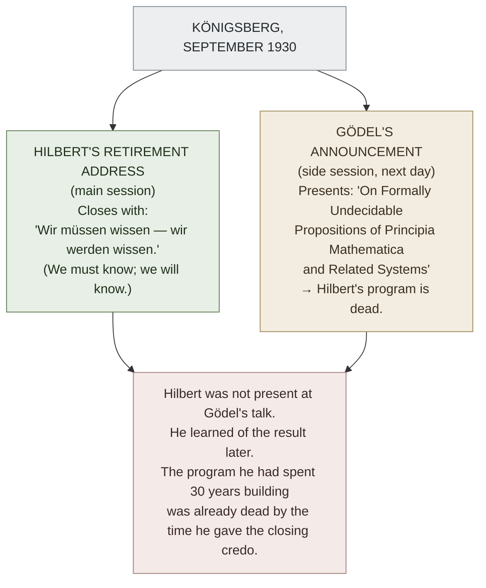

# David Hilbert (1862–1943)

**Summary**: The leading mathematician of the early 20th century; head of the **Göttingen school**; architect of the **[formalist program](./foundations-crisis.md)** (formalize all mathematics; prove consistency from within). Famous for the 1900 ICM **23 Problems** that set the 20th-century mathematical agenda, and for the 1930 Königsberg credo **"*Wir müssen wissen — wir werden wissen*"** ("We must know — we will know"). His formalist program was killed the next day by Gödel's incompleteness announcement at a side session of the same conference. Hilbert lived another 13 years; the program died; modern proof theory + model theory descend from its methodology.

**Sources**:
- Constance Reid, *Hilbert* (Springer 1970) — the standard biography.
- David Hilbert, *Grundlagen der Geometrie* (Leipzig 1899) — axiomatization of Euclidean geometry; the load-bearing methodological precedent.
- David Hilbert, "Mathematical Problems" address at the 1900 ICM Paris (transl. Mary Winston Newson in *Bull. AMS* 8, 1902). The 23 problems.
- David Hilbert + Paul Bernays, *Grundlagen der Mathematik* Vols I (1934) + II (1939) — the formalist program in mature form.
- [logicomix-graphic-novel](./logicomix-graphic-novel.md) — narrative depiction.

**Last updated**: 2026-05-25

---

## One-line

> Göttingen's leading mathematician; 1900 ICM 23 Problems set the 20th-century mathematical agenda; *Wir müssen wissen — wir werden wissen* (1930 Königsberg) is the last 19th-century-confidence sentence in mathematics; Gödel announced incompleteness at the same conference the next day; Hilbert's formalist program died but Hilbert lived to 81.

## Unlocks (lead, not footer)

1. **Hilbert is the survivor who lost. Russell is the survivor who left.** Among the foundations-cast survivors, Hilbert and Russell took opposite paths. Russell *left the field* repeatedly (pacifism, politics, popular writing, multiple marriages); Hilbert *stayed* in mathematics but absorbed the loss of his foundational program. Both lived long; Hilbert's biography is the *non-leaving* survival pattern — substrate stewardship via Göttingen's social fabric, not via field-leaving. **[The substrate thesis](./logicians-madness-substrate-thesis.md) predicts both patterns can work; isolation is the failure mode, not the work itself.**

2. **The 23 Problems are the most-influential research-agenda-setting move in mathematical history.** Each problem became a research program; some are solved (Problem 1: continuum hypothesis — Cohen 1963, *independent*; Problem 10: Diophantine decidability — Matiyasevich 1970, *unsolvable*); some remain open (Problem 8: Riemann hypothesis). **The list itself is a worked instance of [problem framing](./problem-solving-os.md) at civilizational scale.**

3. **Formalism survives in methodology, not in ambition.** Hilbert's specific program — *prove arithmetic consistent within itself* — died with Gödel's second theorem. But Hilbert's *methodology* (formalize problems precisely; analyze formal systems rigorously; treat metamathematics as itself a mathematical subject) is the foundation of modern **proof theory** (Gentzen, cut-elimination, normalization), **model theory** (Tarski, completeness, compactness), and **automated theorem proving** (Coq, Lean, Z3). Hilbert's defeat at the ambition layer is also his victory at the methodology layer.

4. ***"Wir müssen wissen — wir werden wissen"* as the last 19th-century sentence.** Hilbert closed his 1930 Königsberg retirement address with the credo. The very next day, Gödel quietly announced incompleteness at a side session. Hilbert was not present; he learned of it later. **The credo became, by historical accident, the most poignant *just-before-collapse* sentence ever uttered in mathematics.** It is inscribed on Hilbert's tombstone in Göttingen.

## Mnemonic

**1900 → 1930 → 1931 → 1943** = *23 problems · We will know · Gödel demolishes · death.*

Four anchor dates: the agenda-setting; the credo; the demolition; the death.

## Memory checksum

1. **What were the 23 Problems?** (Hilbert's 1900 ICM Paris address; 23 unsolved mathematical problems proposed as the agenda for 20th-century mathematics. Famous: Problem 1 = Continuum Hypothesis. Problem 2 = consistency of arithmetic. Problem 8 = Riemann Hypothesis. Problem 10 = Diophantine decidability.)
2. **What is Hilbert's program?** (Formalize all of mathematics; prove the formalization consistent *within the formalization itself*, using only "finitary" methods. Articulated 1900-1930; formalized in *Grundlagen der Mathematik* Vols I-II (1934, 1939).)
3. **What killed Hilbert's program?** (Gödel's second incompleteness theorem (1931): no sufficiently powerful consistent formal system can prove its own consistency. Hilbert's specific ambition is unrealizable.)
4. **State Hilbert's 1930 credo + the irony.** (*Wir müssen wissen — wir werden wissen* — "We must know — we will know". Closed his Königsberg retirement address. Gödel announced incompleteness the next day at a side session of the same conference. The credo became the iconic *just-before-collapse* sentence.)
5. **What does Hilbert's biography illustrate about substrate?** (Survival without field-leaving is possible. Hilbert stayed in mathematics, absorbed the loss of his foundational program, kept producing mathematics until late life. Substrate protection came from Göttingen's social fabric — the school, students, colleagues, family — rather than from leaving the field. The substrate-thesis 3-component mechanism (regress + isolation + perfectionism) was *partially* present (regress, perfectionism) but the isolation component was absent; outcome was attenuated.)

## Visual — the 1930 irony

The credo + the demolition arrive within 24 hours, at the same conference, with Hilbert ignorant of the second event. **One of the most poetic sequences in 20th-century intellectual history.**

---

## The work

| Period | Contribution |
|---|---|
| 1888-1893 | **Invariant theory** — finite-basis theorem; the methodological move that won Hilbert his early reputation. The proof was non-constructive; Gordan called it *"theology, not mathematics"*; Klein defended it. |
| 1893-1899 | **Algebraic number theory** — *Zahlbericht* (1897), the canonical reference for the field; algebraic number theory as Hilbert systematized it remains the mainstream framework. |
| 1899 | ***Grundlagen der Geometrie*** — axiomatization of Euclidean geometry replacing Euclid's *Elements*. **The methodological precedent for the formalist program.** Hilbert showed that geometry could be reduced to a small set of axioms over abstract objects ("points, lines, planes — or beer mugs, tables, chairs", as he reportedly quipped). What mattered was the axiomatic structure, not the intuitive content. |
| 1900 | **ICM Paris — the 23 Problems.** The agenda-setting address. |
| 1900-1920 | **Hilbert spaces** — functional analysis foundations; basis of modern quantum mechanics; named for him after his integral-equation work. |
| 1915-1925 | **General relativity formalization** — Hilbert independently derived the Einstein field equations from a variational principle (Hilbert action). |
| 1920s | **Formalist program articulated** — formalize all mathematics; prove consistency by finitary methods. |
| 1928 | ***Grundlagen der Mathematik*** Vol I (with Bernays) — the formalist program in formal detail. |
| 1930 | Königsberg retirement address; the *Wir müssen wissen* credo. |
| 1931 | **Gödel demolishes the program.** |
| 1934, 1939 | *Grundlagen der Mathematik* Vols I and II published despite the program being dead — they remain the standard reference for early proof theory. |

## The 23 Problems (compressed)

Hilbert's 1900 ICM Paris address listed 23 unsolved problems as the proposed agenda for 20th-century mathematics. Highlights:

| # | Problem | Status (as of ~2026) |
|---|---|---|
| **1** | Continuum Hypothesis | **Proven independent of ZFC** (Cohen 1963 via forcing) |
| **2** | Consistency of arithmetic | **Killed by Gödel** — cannot be proven within arithmetic |
| **3** | Equidecomposability of polyhedra | **Solved** (Dehn 1900, before the address was even published) |
| **5** | Lie groups without differentiability | **Solved** (Gleason-Montgomery-Zippin, 1952) |
| **7** | Transcendence of `aᵇ` for algebraic a, b | **Solved** (Gelfond-Schneider, 1934) |
| **8** | **Riemann Hypothesis** + Goldbach + twin primes | **OPEN** (the Riemann part is one of the seven Clay Millennium Prize Problems) |
| **10** | Diophantine decidability — is there an algorithm to determine if a polynomial equation in integers has solutions? | **Solved (negatively)** — no algorithm exists (Matiyasevich 1970, building on Davis-Putnam-Robinson) |
| **11** | Quadratic forms with algebraic numerical coefficients | **Solved** (Hasse-Minkowski theory) |
| **17** | Sums of squares for positive-definite rational functions | **Solved** (Artin 1927) |
| **18** | Sphere packing | **Solved** for 3D (Hales 1998, formal verification completed 2014) |
| **22** | Uniformization of analytic relations | **Solved** (Koebe, Poincaré, 1907) |

Of the 23, ~15 are fully solved, ~5 have partial solutions or have been refined into multiple sub-problems, ~3 remain genuinely open. **The list shaped a century of mathematical research.**

## The formalist program

The mature Hilbert program (1920s):

1. **Formalize** all of mathematics — every concept, axiom, and proof rendered as manipulation of finite strings of symbols.
2. **Prove consistency** of the formalized system — show that the formalization cannot prove both *P* and *¬P*.
3. **Use only finitary methods** for the consistency proof — methods that work over finite strings and combinatorial objects, not appealing to infinite sets.
4. **The consistency proof must be done *inside* the formalization itself** — no appeal to higher mathematics that itself needs grounding.

The motivation: post-paradox (Russell 1901), naive set theory was inconsistent. Hilbert's response was not to abandon set theory but to **formalize and verify** — turn mathematics into a precisely-specified game and prove the game can't generate contradictions.

The program had striking successes:
- **Bernays 1934**: formalization of arithmetic worked out in detail (*Grundlagen der Mathematik* Vol I).
- **Gentzen 1936**: proved consistency of arithmetic via transfinite induction up to ε₀.
- **Ackermann 1924+**: proof-theoretic methods for various fragments.

But Gödel's second theorem (1931) demolished the *core* claim: arithmetic's consistency cannot be proven by methods formalizable in arithmetic itself. Gentzen's proof appeals to transfinite induction — a method *outside* the system. The program in its strict form is unachievable.

## What Hilbert lost

- The dream of a single self-certifying mathematical foundation.
- The specific program of proving consistency from within.
- The claim that *"every mathematical problem has a solution"* (problematic post-Gödel; some problems are undecidable in given axiomatic systems).

## What Hilbert won (posthumously)

- **Proof theory** as an active subfield of mathematical logic (Gentzen → modern structural proof theory).
- **Model theory** as a separate discipline (Tarski → modern algebraic model theory).
- **Formalization methodology** as the standard mode of mathematical work — every modern field uses formal axiomatization.
- **Automated theorem proving** (Coq, Lean, Z3, Isabelle) — the digital descendants of the formalist methodology.
- **Hilbert spaces** in functional analysis — quantum mechanics' mathematical foundation.

Hilbert's *ambition* failed; his *methodology* permeated 20th-century mathematics.

## Cross-link to [logicians-madness-substrate-thesis](./logicians-madness-substrate-thesis.md)

Hilbert is a **partial survivor case** — like Russell, but via a different mechanism:

| Component | Present in Hilbert? |
|---|---|
| Regress-pursuing inside a closed formal system | YES — the formalist program, 30+ years |
| Social isolation from non-domain peers | **NO** — Göttingen was the world's leading mathematical school; Hilbert had Klein, Minkowski, Courant, Noether, Weyl, etc.; rich relational substrate |
| Abstract perfection as personal standard | PARTIALLY — Hilbert had high standards but was famously humorous and self-deprecating; the *Wir müssen wissen* credo was aspirational, not personal-perfection |

Two out of three present, missing the load-bearing isolation. Outcome: not collapse but **measured retreat** after 1931. Hilbert continued teaching at Göttingen; lived 13 more years; died of natural causes 1943 (age 81); attended by his colleagues, school, and family.

The Hilbert biography is the wiki's evidence that **Göttingen-style relational substrate** is an alternative protective move to **Russell-style field-leaving**. Both work; both require sustained substrate stewardship; both can survive the collapse of a foundational program.

## The "Göttingen school"

Hilbert built Göttingen into the world's leading mathematical center from 1895 to 1933 (when the Nazis purged it). Key figures associated:

- **Felix Klein** — Hilbert's senior; the *Erlangen program* (1872) for geometry.
- **Hermann Minkowski** — Hilbert's close friend; the Minkowski geometry of relativity.
- **Richard Courant** — analysis; later founded the Courant Institute at NYU.
- **Emmy Noether** — abstract algebra; Hilbert defended her appointment despite gender prejudice (*"This is a university, not a bath house"*).
- **Hermann Weyl** — group theory + physics.
- **Edmund Landau** — analytic number theory.
- **John von Neumann** — Hilbert's late student; quantum mechanics + computer science.

The 1933 Nazi purge expelled Jewish faculty (Courant, Landau, Noether all fled). When the Nazi minister of education asked Hilbert at a 1934 banquet *"How is mathematics in Göttingen now, freed of the Jewish influence?"*, Hilbert reportedly replied: *"Mathematics in Göttingen? There is none, really."*

The Göttingen school provided Hilbert's relational substrate throughout his life. The 1933 destruction of it was the deepest substrate blow he absorbed; he was 71 and managed it, but Göttingen mathematics did not recover until decades later.

## Logicomix portrayal

[Logicomix](./logicomix-graphic-novel.md) depicts Hilbert at multiple stages: the 1900 ICM, the 1930 Königsberg credo, and the aftermath of Gödel. Hilbert is portrayed as *measured retreat rather than collapse* — the Logicomix narrative respects his survival.

The most striking Logicomix scene: Hilbert giving the *Wir müssen wissen* credo, followed by the cut to Gödel quietly demolishing the program at the side session the next day. Hilbert is given his moment; the tragedy is in the structural irony.

## METER integration

| Drill | Pass floor | Source |
|---|---|---|
| Place Hilbert on the foundations-crisis timeline | <15 s | [foundations-crisis](./foundations-crisis.md) |
| Name 3 of the 23 problems + their status | <30 s | this page §23 Problems |
| State Hilbert's formalist program (3-step) | <60 s | this page §Formalist program |
| Quote *Wir müssen wissen — wir werden wissen* + the 1930 context | <30 s | this page §Visual |
| Distinguish Hilbert-survival from Russell-survival (Göttingen-substrate vs field-leaving) | <60 s | this page §Substrate thesis |

## Related pages

- [logicomix-graphic-novel](./logicomix-graphic-novel.md) — narrative source
- [foundations-crisis](./foundations-crisis.md) — Hilbert's program is one of the three programs
- [godels-incompleteness](./godels-incompleteness.md) — what killed Hilbert's program
- [logicians-madness-substrate-thesis](./logicians-madness-substrate-thesis.md) — Hilbert as partial-survivor case via Göttingen-substrate
- [principia-mathematica](./principia-mathematica.md) — sibling foundational program (logicism); Hilbert's was formalism
- [methods-of-deduction](./methods-of-deduction.md) — formalist methodology descends to modern proof theory
- [problem-solving-os](./problem-solving-os.md) — 1900 ICM 23 Problems as a worked instance of agenda-setting
- [logic-atomic-design](./logic-atomic-design.md) — formalism's methodological atoms registered
- [glossary](./glossary.md) — Logic layer registration
