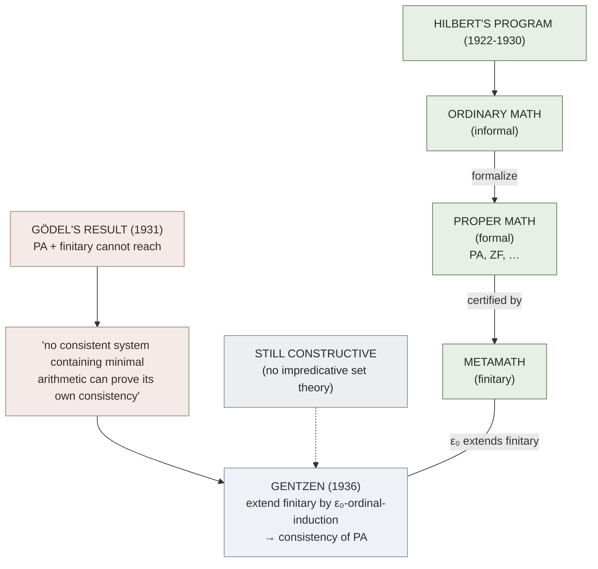

# Hilbert's Program

**Summary**: [David Hilbert](./hilbert-david.md)'s 1920s foundational program — prove the consistency of infinitary classical mathematics by *finitary metamathematics*. The program defines the agenda all of modern proof theory descends from: formalize a theory T completely, then study T's proofs as combinatorial objects from outside T using only methods both Brouwer's [intuitionists](./foundations-crisis.md) and Hilbert's school accept. Hilbert's strict form was shut by [Gödel's second incompleteness theorem (1931)](./godels-incompleteness.md) — no consistent system containing arithmetic can prove its own consistency within itself. But the residue (Gentzen's "extended finitary" methods using ordinal induction up to [ε₀](./epsilon-zero-and-ordinal-induction.md)) defines the whole subject after 1936.

**Sources**:
- [Mancosu, Galvan, Zach (2021)](./proof-theory-mancosu-galvan-zach.md) Ch 1.1 — primary source for this page.
- Mancosu, Galvan, Zach (2021) *An Introduction to Proof Theory: Normalization, Cut-Elimination, and Consistency Proofs*, OUP — §1.1–§1.3, Ch 1 (the published edition; cited inline as an-introduction-to-proof-theory...pdf).
- Hilbert, D. (1922) "Neubegründung der Mathematik" / "New grounding of mathematics."
- Hilbert, D. (1923) "Die logischen Grundlagen der Mathematik."
- Zach, R. (2019) "Hilbert's program" in *Stanford Encyclopedia of Philosophy*.
- Mancosu, P. ed. (1998) *From Brouwer to Hilbert: The Debate on the Foundations of Mathematics in the 1920s*. OUP.

**Last updated**: 2026-06-10

---

## Unlocks (lead, not footer)

1. **Three-level distinction: ordinary math / proper math / metamathematics.** Hilbert's reply to Poincaré's circularity charge. Ordinary mathematics is what mathematicians practice; *proper* (formalized) mathematics encodes proofs as finite combinatorial objects; metamathematics reasons about those objects using only finitary methods. This three-level structure is the formal-logic ancestor of the wiki's **substrate / algorithm / metalogic** layering visible in [substrate-algorithm-composition](./substrate-algorithm-composition.md) and in the [atomic-design](./logic-atomic-design.md) [tier-conflation](./problem-solving-atomic-design.md) rule.

2. **Finitary metamathematics × wiki audit pipeline.** Hilbert's metamathematics: only methods finitists accept can be used to certify infinitary methods. The wiki's `/lint` pass is structurally analogous — uses only mechanical, locally-checkable steps to certify claims that may rest on rich, hard-to-audit chains of inference. The proof-theoretic name for this discipline is *Hilbert's finitary standpoint*.

3. **The retreat from "strict-finitary" to "ε₀-finitary" × [ok-plateau](./ok-plateau.md) × [self-image](./self-image.md).** Hilbert wanted certifications using *only finite combinatorial inferences*. [Gödel 1931](./godels-incompleteness.md) showed this cannot reach PA's consistency. [Gentzen 1936](./gentzens-proof-theory.md) showed it can if you add one principle: induction along ordinal notations < ε₀. **The substrate gates the ceiling** — same mechanism as the wiki's self-image-ceiling rule. *You cannot lift the ceiling using only operations the ceiling permits.* The next level must arrive from outside.

## Mnemonic

**TILT** = *Three-level · Infinitary-justified-by-finitary · Lost-to-Gödel · Transformed-by-Gentzen.*

The program *tilted* in 1931 (Gödel) and was *tilted back* (partially, by ε₀-induction) in 1936 (Gentzen).

## Memory checksum

If you can answer these in <60 s each from memory, the page is encoded:

1. State Hilbert's program in one sentence. (*Prove the consistency of infinitary classical mathematics by finitary metamathematical methods that both classical mathematicians and intuitionists accept.*)
2. What three levels does Hilbert distinguish, and why? (*Ordinary math · proper (formalized) math · metamath. Distinction is needed to answer Poincaré's circularity objection — the induction used in the metamath proof of consistency of arithmetic is not the same induction as the one being proved consistent.*)
3. What did [Gödel 1931](./godels-incompleteness.md) show about the program? (*No specifiable consistent system in which a minimal amount of arithmetic can be developed can prove its own consistency. So if finitary methods are captured within PA — as was widely assumed — finitary methods alone cannot prove PA's consistency.*)
4. What did [Gentzen 1936](./gentzens-proof-theory.md) show that partly rescued the program? (*Adding ordinal induction up to [ε₀](./epsilon-zero-and-ordinal-induction.md) yields a consistency proof of PA. This is "extended finitary" — quantifier-free reasoning + a single transfinite principle, both still constructive.*)
5. Who attacked classical mathematics in the early 1920s, prompting Hilbert's response? (*Brouwer's intuitionism + Weyl's predicativism in *Das Kontinuum* (1918); Weyl joined Brouwer in 1921 calling intuitionism "die Revolution.")

## Visual — the program and its breakage

The program *survives in extended form*: finitary methods alone cannot reach PA, but finitary + ε₀-induction can. Each *stronger* arithmetical theory needs a *bigger* ordinal (Γ₀ for predicative systems, the Bachmann-Howard ordinal for Π¹₁-comprehension, etc.). The whole science of *ordinal proof theory* unfolds from this.

---

## What "finitary" means (and the ambiguity)

Hilbert was clear that finitary metamathematics had to reason only about finite combinatorial objects (formal proofs are finite strings of symbols) using only *contentual* operations on those objects. The translation of *inhaltlich* as "contentual" tries to capture: not formal symbol-shuffling, but reasoning about what symbols *mean* in their use, restricted to the finite.

The ambiguity: nobody pinned down precisely which methods count as finitary. Two candidates emerged in practice:

- **Primitive recursive arithmetic (PRA)** — Skolem's quantifier-free + bounded-induction system. Widely cited as the formalization of strict-finitism by Tait (1981).
- **PA with quantifier-free induction** — broader; what Gentzen worked within.

The historical question of which Hilbert *intended* is unsettled (see Zach 2019a, "Hilbert's Program"). The wiki adopts the standard reading: *strict finitary* ≈ PRA; *extended finitary* = PRA + transfinite induction along well-orders ≤ some ordinal.

## What [Gödel](./godels-incompleteness.md) actually broke

The first incompleteness theorem (1931) — *PA has true sentences it cannot prove* — already disturbed Hilbert's hope of a complete formalization. But the **second incompleteness theorem** is what shut the strict-finitary form of the program:

> If T is a consistent recursively axiomatized theory containing a small fragment of arithmetic, then T cannot prove Con(T) (the formal statement "T is consistent") within T.

Combined with the working assumption *finitary ⊆ PA*, this means: **PA cannot prove its own consistency by finitary means.** If we want a consistency proof of PA, we must use methods *not* available inside PA.

This is where ordinal induction enters. Induction along < ε₀ is not available inside PA (PA *cannot* prove ε₀ is well-ordered). Adding it gives a proof of Con(PA) that is still constructive — no set theory, no impredicative comprehension — but goes beyond what PA can certify of itself.

## What [Gentzen](./gentzens-proof-theory.md) rescued

Gentzen's 1936 consistency proof for PA (refined 1938) showed that PA + transfinite induction along ε₀ proves Con(PA). The added ingredient is:

> For every primitive-recursive well-ordering ≺ of order-type α < ε₀, induction along ≺ is permitted in the metatheory.

This is more than finitism allows, less than full set theory needs. It is *constructive* in the BHK sense: the well-foundedness of α is constructively defensible because α has a primitive-recursive ordinal notation (see [epsilon-zero-and-ordinal-induction](./epsilon-zero-and-ordinal-induction.md) for the notations and well-foundedness proof).

The philosophical interpretation is contested. Three positions:

- **Continuation**: Gentzen completed Hilbert's program in a slightly enlarged finitary setting (Gentzen's own view; defended by Tait).
- **Relativization**: Hilbert's program survives only "relative to ε₀" — we've shown PA consistent assuming the well-foundedness of ε₀, which is a stronger assumption than naive finitism (Kreisel's reading).
- **Reductive proof theory**: even if you don't buy the philosophical rescue, the technique generalizes — stronger theories reduce to weaker theories + bigger ordinals. This is what *most* working proof theorists pursue today (Schütte, Pohlers, Rathjen).

## Connection to the wiki

Hilbert's program is the *historical and conceptual root* of every page in the [Logic Atomic Design](./logic-atomic-design.md) metalogic tier. It motivates:

- The formalization discipline visible in [copi-introduction-to-logic](./copi-introduction-to-logic.md) (Ch 8 symbolic logic).
- The distinction between *theory* and *metatheory* that the wiki's `/lint` audit relies on.
- The cross-tradition convergence visible in [cross-tradition-convergence-pattern](./cross-tradition-convergence-pattern.md) — same problem (justify infinitary methods) attacked by Brouwer (revisionist), Weyl (predicative), Hilbert (finitary). Each tradition produces a viable answer.

The substrate-thesis the wiki uses elsewhere ([substrate-thesis-applied-to-ai-alignment](./substrate-thesis-applied-to-ai-alignment.md) etc.) is structurally **Hilbert's three-level distinction reapplied at a different scale**: the substrate (whatever it is) cannot certify its own consistency using only operations the substrate permits.

## Finitism vs predicativity — two distinct restrictions

Hilbert's *finitism* is often confused with Weyl's *predicativity*; they are different restrictions reacting to the same crisis. Predicativity was Weyl's position in *Das Kontinuum* (1918): restrict quantification to individuals in the domain, blocking *impredicative* definitions — a definition of a set X by quantifying over a totality of sets to which X itself belongs (source: an-introduction-to-proof-theory...pdf). The standard example is defining the natural numbers as the intersection of all sets containing 0 and closed under successor: since the naturals are themselves one such set, you define them by quantifying over a totality that includes them. Russell, Poincaré, and Weyl regarded this as a vicious circle to be eliminated from the foundations of classical analysis (source: an-introduction-to-proof-theory...pdf).

Finitism (Hilbert's position, also called *finitary* or *finitistic* reasoning) is a stricter discipline on the *metatheory*, not on the objects of the theory: certify infinitary mathematics using only *contentual* operations on finite combinatorial objects (formal proofs are finite strings of symbols) (source: an-introduction-to-proof-theory...pdf). The two restrictions cut at different layers — predicativity restricts what sets you may *define*; finitism restricts what inferences your *consistency proof* may use. Notably, Weyl himself abandoned predicativity in 1921 to join Brouwer's [intuitionism](./foundations-crisis.md), which he called *die Revolution*, on mainly epistemological grounds (source: an-introduction-to-proof-theory...pdf). The wiki's [atomic-design](./logic-atomic-design.md) [tier-conflation](./problem-solving-atomic-design.md) rule is the same hygiene at a different scale: a restriction on the *object* layer (what atoms exist) is not interchangeable with a restriction on the *composition* layer (how they may be assembled).

## Poincaré's circularity objection and Hilbert's 1922 answer

Already in 1905 [Hilbert](./hilbert-david.md) had the insight that one can "consider the proof itself to be a mathematical object," and gave metatheoretical arguments for consistency by appealing to mathematical induction on the *length* of proofs (source: an-introduction-to-proof-theory...pdf). Poincaré seized on exactly this point and charged the approach with circularity: attempting to prove the consistency of arithmetic — which itself *includes* the principle of induction — by arguing *by induction* looks like [begging the question](./fallacy-taxonomy.md) (assuming what you set out to prove) (source: an-introduction-to-proof-theory...pdf).

Hilbert's 1922 answer was to draw the three-level distinction this page already records — ordinary mathematics, proper (formalized) mathematics, and metamathematics (source: an-introduction-to-proof-theory...pdf). The induction used at the *metamathematical* level to prove the consistency of formalized arithmetic is *not* the same induction being proved consistent: Hilbert asserted in 1922 that what is involved at the metamathematical level is "only a small part of arithmetical reasoning which does not appeal to the full strength of the induction axiom," and that this part is "completely safe" (source: an-introduction-to-proof-theory...pdf). The circle is broken by stratification: the metatheory uses a weak, contentual fragment of induction (on the finite shapes of proofs), not the full impredicative induction of the object theory. This is structurally the wiki's [tier-conflation](./problem-solving-atomic-design.md) guard — a claim that holds at the composition tier must not be smuggled in to justify itself at the atom tier.

## Gödel's *Dialectica* interpretation (System T) — a post-Hilbert development

The 1950s saw consistency proofs reaching beyond arithmetic, and one of the most important extensions of the finitary point of view is Gödel's consistency proof for arithmetic, published in 1958, by means of a system called **T** of functionals of finite type (source: an-introduction-to-proof-theory...pdf). A *functional* is a function that may take functions as arguments and produce functions as values; Gödel's System T is built by starting from specific numerical functions and producing new functions and functionals by certain principles, repeated an arbitrary finite number of times, yielding the functionals of finite type (source: an-introduction-to-proof-theory...pdf). Gödel singled out a class called the *recursive functionals of finite type* — those computable whenever their arguments are (source: an-introduction-to-proof-theory...pdf).

The interpretation (later called the *Dialectica* interpretation, after the journal) associates with every arithmetical statement P an assertion about the existence of a specific recursive functional, such that a proof of P in arithmetic implies the existence assertion for the corresponding functional; the existence statement corresponding to 0 = 1 is then shown false, which shows the unprovability of 0 = 1 and hence the consistency of arithmetic (source: an-introduction-to-proof-theory...pdf). Crucially, the assumption of existence of the recursive functionals of finite type is demonstrably equivalent to induction along the well-ordering [ε₀](./epsilon-zero-and-ordinal-induction.md) — exhibiting a deep connection between Gentzen's original 1936 consistency proof and Gödel's new one (source: an-introduction-to-proof-theory...pdf). So the two great post-Hilbert rescues of arithmetic — [Gentzen's ordinal-induction route](./gentzens-proof-theory.md) and Gödel's functional-interpretation route — measure the *same* transfinite content, ε₀, by different instruments.

Gödel's proof straddles the reductive/general divide: it can be read as reductive proof theory (it certifies arithmetic), but it also carried the germ of a general-proof-theory extension. By the 1970s an association was established between recursive functionals and proofs via the λ-calculus: defining "normal form" for functionals appropriately, every proof in normal form (without detours) corresponds to a functional in normal form and vice versa (source: an-introduction-to-proof-theory...pdf). That proofs-as-functionals / normal-form correspondence is the [Curry-Howard](./curry-howard-correspondence.md) reading of System T — the same architectural move [gentzens-proof-theory](./gentzens-proof-theory.md) makes when it treats proofs as objects with canonical forms rather than as means to an epistemic end.

## Related pages

- [proof-theory-mancosu-galvan-zach](./proof-theory-mancosu-galvan-zach.md) — source textbook (Ch 1.1)
- [gentzens-proof-theory](./gentzens-proof-theory.md) — the partial rescue
- [godels-incompleteness](./godels-incompleteness.md) — the 1931 result that shut the strict form
- [hilbert-david](./hilbert-david.md) — biographical anchor
- [foundations-crisis](./foundations-crisis.md) — Brouwer-Weyl challenge that motivated the program
- [epsilon-zero-and-ordinal-induction](./epsilon-zero-and-ordinal-induction.md) — the ordinal that powers Gentzen's rescue
- [consistency-of-peano-arithmetic](./consistency-of-peano-arithmetic.md) — Gentzen's 1936 theorem
- [curry-howard-correspondence](./curry-howard-correspondence.md) — proofs-as-functionals reading of Gödel's System T
- [fallacy-taxonomy](./fallacy-taxonomy.md) — Poincaré's circularity charge as begging-the-question
- [problem-solving-atomic-design](./problem-solving-atomic-design.md) — tier-conflation guard, the modern analog of the three-level distinction
- [principia-mathematica](./principia-mathematica.md) — the formalization Hilbert engaged with after 1917
- [substrate-thesis-applied-to-ai-alignment](./substrate-thesis-applied-to-ai-alignment.md) — generalization at a different scale
- [glossary](./glossary.md) — Logic layer registrations
