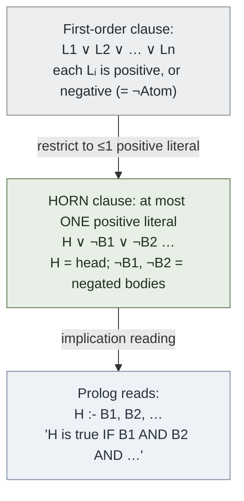

# Horn Clauses

**Summary**: A Horn clause is a clause of first-order logic with at most one positive (unnegated) literal; the Horn-clause fragment is exactly the subset of logic that Prolog computes over via SLD resolution, and it forms the logic-programming vertex of the Curry-Howard correspondence.

**Sources**: Programming in Prolog (Clocksin & Mellish, 5th Ed., 2003), Ch. 9 "The Relationship Between Prolog and Logic".

**Last updated**: 2026-06-21

---

## What a Horn clause is

A **Horn clause** is a clause of first-order logic that contains **at most one positive (unnegated) literal**. The name honours the logician Alfred Horn, who studied this class of formulas in 1951 (source: Programming in Prolog).

A general clause is a disjunction of literals, where each literal is either an atomic formula or a negated atomic formula:

```
L1 ∨ L2 ∨ ... ∨ Ln
```

The Horn restriction is purely a counting constraint on the positive literals: no more than one of the `Li` may be unnegated. That single restriction is what makes the fragment computationally tractable and gives it three named subtypes (source: Programming in Prolog):

1. **Definite clause / Rule** — exactly one positive literal: `H ∨ ¬B1 ∨ ¬B2 ∨ ... ∨ ¬Bk`.
   Read as the implication `B1 ∧ B2 ∧ ... ∧ Bk → H`.
   In prolog syntax: `H :- B1, B2, ..., Bk.`
2. **Fact** — exactly one positive literal and no negatives: `H`.
   In Prolog syntax: `H.`
3. **Goal clause** — zero positive literals, one or more negatives: `¬G1 ∨ ¬G2 ∨ ... ∨ ¬Gm`.
   In Prolog syntax: `?- G1, G2, ..., Gm.`
   The query is the thing we want to **refute** — the proof proceeds by contradiction (source: Programming in Prolog).

Note that the three subtypes are exhaustive over Horn clauses: a clause with one positive literal is a rule (if it has negatives) or a fact (if it does not); a clause with zero positive literals is a goal.

## From Prolog to logic (and back)

The bridge between the two readings is the move that turns an implication into a disjunction:

```prolog
% Prolog rule:
mortal(X) :- man(X).

% Is logically:
∀X. man(X) → mortal(X)

% As a clause (the negated body moves to the left of the disjunction):
mortal(X) ∨ ¬man(X)

% This is a Horn clause: exactly one positive literal — mortal(X).
```

The rule head becomes the single positive literal; every body goal becomes a negated literal. This is why a Prolog rule body reads as a conjunction of subgoals on the implication side but as a list of negated literals on the clause side (source: Programming in Prolog).

## Converting full first-order logic to clause form

Chapter 9 of Clocksin & Mellish gives the standard six-stage conversion from an arbitrary first-order formula into clausal form (source: Programming in Prolog):

1. **Remove implications** — replace every `A → B` with `¬A ∨ B`.
2. **Negate inward (De Morgan)** — push each `¬` inside past `∧` and `∨` until negation sits only on atoms.
3. **Skolemize** — replace existential quantifiers with Skolem functions or constants that depend on the enclosing universal variables.
4. **Move ∀ outward** — all remaining quantifiers are now universal; move them to the prefix.
5. **Conjunctive Normal Form** — distribute `∧` over `∨` to obtain a conjunction of disjunctions.
6. **Extract clause sets** — each top-level disjunct becomes a separate clause.

If every clause produced has **at most one positive literal**, the original formula is representable as a Horn clause set — and Prolog can compute over it. If any clause keeps two or more positive literals, the formula falls outside the Horn fragment (see Limitations below).

## SLD resolution

Prolog's inference engine **is** SLD resolution — **S**elective **L**inear **D**efinite resolution (source: Programming in Prolog):

- **S**elective — a single literal in the current goal is selected to resolve against; Prolog always selects the leftmost.
- **L**inear — each step resolves the current goal against one program clause, building a single linear chain of goals rather than a branching set.
- **D**efinite — the program clause set must consist of definite (Horn) clauses.

A resolution step works as follows: to prove a goal `G`, find a clause `H :- B1, ..., Bk` whose head `H` unifies with `G` (the unifier supplied by prolog-unification); then replace `G` with the instantiated body `B1, ..., Bk`. Repeat until the goal list is empty.

The search space is naturally drawn as an **AND-OR proof tree**: **OR nodes** represent the several clauses whose heads might match one goal (the choice points that drive backtracking); **AND nodes** represent the conjunctive body goals that must *all* succeed for a clause to apply (source: Programming in Prolog).

## Refutation completeness

SLD resolution is **refutation-complete** for Horn clause logic (source: Programming in Prolog):

- If a Horn clause set logically entails a ground goal `G`, then SLD resolution is guaranteed to find a refutation — a derivation showing that adding `¬G` to the set leads to the empty clause (contradiction).
- This is the theoretical guarantee underwriting Prolog: anything provable in Horn clause logic can be found by the engine.

This contrasts sharply with [godels-incompleteness](./godels-incompleteness.md), which applies to full first-order arithmetic — a far richer system that is *not* restricted to Horn clauses. The Horn fragment escapes the incompleteness result because it is a deliberately weakened slice of logic: completeness for what it covers is bought at the price of not covering everything (source: Programming in Prolog).

## Limitations: what Horn clauses cannot express

The Horn restriction is genuinely restrictive. Horn clauses cannot directly express (source: Programming in Prolog):

- `A ∨ B` where both `A` and `B` are positive — that needs two positive literals in one clause.
- **Disjunctive facts** such as "John is a student or a teacher".
- **Full classical negation** (`¬P`) drawn as a positive conclusion.

Because classical negation is unavailable, Prolog substitutes **negation as failure** (written `\+`): a goal is treated as "false" when the engine *fails* to prove it, rather than when its classical negation is proved. This is the pragmatic workaround that lets the language behave usefully within the Horn restriction, and it is not equivalent to classical `¬` (source: Programming in Prolog).

## Connection to Curry-Howard

Horn clause programs form the third vertex of the triad described on [curry-howard-correspondence](./curry-howard-correspondence.md):

- **Propositions-as-types** — logic corresponds to type theory.
- **Proofs-as-programs** — proof theory corresponds to the λ-calculus.
- **Horn-clauses-as-programs** — a Prolog clause `H :- B1, ..., Bk` is itself a proof rule that derives `H` from proofs of `B1, ..., Bk`, and an SLD derivation *is* the construction of that proof.

Under this reading, executing a Prolog program is the construction of a [natural-deduction](./natural-deduction.md) proof restricted to the Horn clause fragment: each resolution step discharges a goal exactly as an inference rule discharges a premise. The same proof object can be displayed in [sequent-calculus](./sequent-calculus.md) form, where the linear, left-leaning structure of SLD mirrors a sequent derivation. This places logic programming inside the broader proof-theoretic landscape mapped by [proof-theory-mancosu-galvan-zach](./proof-theory-mancosu-galvan-zach.md).

## Mnemonic

**HORN = Head Or-Nothing; Negated bodies.**

- A Horn clause has at **most one** positive literal — the **Head** (or *nothing* positive, in a goal clause).
- All remaining literals are negative — the body goals on Prolog's implication reading.
- The engine's three letters: **S**elect-leftmost → **L**inear-chain → **D**efinite-clauses.

## Checksum

Three questions; if you can answer all three, the page is loaded:

1. **What makes a clause a Horn clause?** At most one positive literal — the head; all body literals are negated.
2. **What is SLD resolution?** Selective Linear Definite resolution, Prolog's inference engine: select a goal, find a clause whose head unifies with it, replace the goal with the clause body.
3. **What does refutation completeness mean for Prolog?** If a Horn clause goal is logically entailed, SLD resolution will find a refutation — a completeness guarantee within Horn clause logic.

## Visual



SLD resolution step:

```mermaid
graph TD
    CG["Current goal: [G &#124; Rest]"]
    FC["Find clause: G = H θ<br/>(unification, substitution θ)"]
    NG["New goal: [B1θ, B2θ, …, Bkθ &#124; Restθ]"]
    CG --> FC --> NG
    NG -->|repeat| CG
    NG -->|goal list empty| S["SUCCESS"]
    NG -->|no clause matches| B["BACKTRACK"]
    classDef step fill:#eef1f5,stroke:#7d8aa0,color:#26303f;
    classDef ok fill:#e8efe6,stroke:#5c7a54,color:#20301c;
    classDef back fill:#f4ebe9,stroke:#a07d78,color:#3a2926;
    class CG,FC,NG step;
    class S ok;
    class B back;
```



## Related pages

- prolog
- prolog-unification
- backtracking
- programming-in-prolog
- [natural-deduction](./natural-deduction.md)
- [sequent-calculus](./sequent-calculus.md)
- [curry-howard-correspondence](./curry-howard-correspondence.md)
- [godels-incompleteness](./godels-incompleteness.md)
- [proof-theory-mancosu-galvan-zach](./proof-theory-mancosu-galvan-zach.md)
