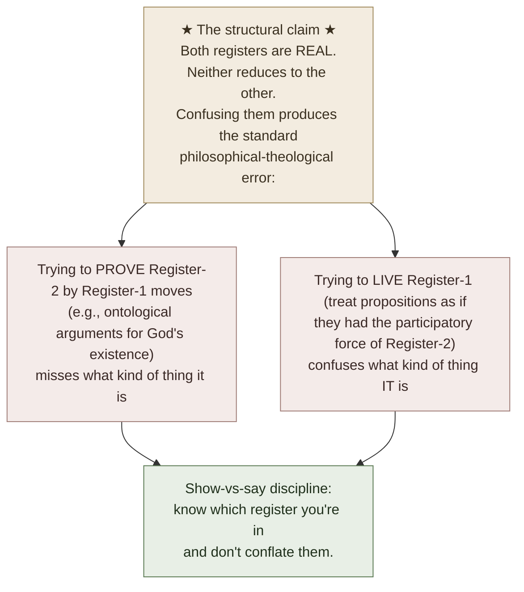

# Hypostasis-Elenchos and TLP Show-vs-Say

**Summary**: The cross-domain epistemic pairing — *Hebrews 11:1's ὑπόστασις (hypostasis) / ἔλεγχος (elenchos)* and *[TLP](./tractatus-logico-philosophicus.md)'s show-vs-say boundary* — as a candidate META-pattern. Both name a structural distinction between **what is accessible through participation/exhibition** and **what is asserted in propositions**. The pairing has been cross-linked from 4+ wiki pages without a dedicated owner; this page makes the cross-link explicit. **Not a doctrinal claim about Hebrews matching Wittgenstein** — the two texts come from entirely different traditions and aims. **A structural-shape claim** about the epistemic pairing: two independent registers, both real, only one sayable in propositions, the other shown.

**Sources**:
- *Hebrews 11:1* (KJV: *"Now faith is the substance of things hoped for, the evidence of things not seen."*; NRSV: *"Now faith is the assurance of things hoped for, the conviction of things not seen."*); Greek text from BibleWorks.
- BDAG (Bauer-Danker) lexicon entries for ὑπόστασις and ἔλεγχος.
- [Wittgenstein TLP](./tractatus-logico-philosophicus.md) propositions 4.121-4.1212 + 6.522 + 7.
- bible-study-hebrews-11-1 — wiki's Hebrews exegesis (cross-linked since the Bible-study layer was built).
- [show-vs-say](./show-vs-say.md) · [the-mystical-tlp](./the-mystical-tlp.md) · [picture-theory-of-language](./picture-theory-of-language.md) — TLP concept pages with cross-links to Hebrews.

**Last updated**: 2026-05-25

---

## One-line

> *Hebrews 11:1*: faith is the **hypostasis** (underlying reality, substance, foundation) of things hoped for, the **elenchos** (evidence, conviction, demonstrable proof) of things not seen.
> *TLP 4.1212*: what can be **shown** cannot be **said**.
> **Both name a structural distinction: two independent registers of access, one through propositional assertion, one through participation/exhibition.**

## Unlocks (lead, not footer)

1. **Independent corroboration of the show-vs-say structure across vastly different traditions.** Hebrews 11:1 is a 1st-century Christian-Jewish theological text; TLP is a 20th-century analytic-philosophy text. **They share no causal lineage** — Wittgenstein wasn't drawing on Hebrews; the author of Hebrews wasn't anticipating TLP. **The fact that the same structural epistemic pairing surfaces in both is evidence that the pairing names a real distinction**, not a Wittgensteinian invention. This makes the show-vs-say boundary more credible as a structural feature of cognition + language.

2. **A candidate META-pattern: cross-tradition convergence on epistemic shapes.** The Hebrews-TLP pairing is one instance. Other candidates: the Hindu *brahman/atman* identity that points to a reality known by participation, not propositional description; the Zen *finger pointing at the moon* — the finger (sayable instruction) vs the moon (shown reality); Plato's *Form of the Good* (apprehended by *noēsis*, beyond what can be discursively defined). **If 3+ traditions converge on the same epistemic shape independently, the shape is META-substantively real.**

3. **The wiki's visual-per-concept rule has cross-tradition grounding.** The rule was originally established from David's pedagogical experience; Wave 1 grounded it in TLP show-vs-say; this page extends the grounding to Hebrews 11:1. **The reflex** — *every concept page must include a visual, because structure shows but doesn't say* — is now corroborated by an independent tradition's articulation of the same structural distinction. Not derivative; convergent.

4. **Operational rule**: when a tradition (philosophical, theological, contemplative, mathematical) uses words like *"witness"*, *"substance"*, *"evidence"*, *"show"*, *"display"*, *"reveal"*, *"participate"* in opposition to *"prove"*, *"assert"*, *"describe"*, *"deduce"*, **suspect the show-vs-say structure**. The vocabulary may differ but the structural distinction often recurs. Recognizing it is part of cross-domain literacy.

## Mnemonic

**H = U-E** = *Hebrews = Hypostasis + Elenchos.*

**TLP = S-S** = *Show ≠ Say.*

For the structural shape: **P-P** = *Participation/Exhibition (one register) · Propositional-assertion (other register).*

## Memory checksum

1. **Translate ὑπόστασις (hypostasis).** (Greek: literally "stand under". BDAG: (a) substance, real being; (b) confidence, assurance, conviction; (c) the underlying reality. Hebrews 11:1: the *substance* / underlying-reality of things hoped for.)
2. **Translate ἔλεγχος (elenchos).** (Greek: literally "proof, conviction, evidence". BDAG: (a) the act of bringing to light, exposing; (b) proof, conviction; (c) inner conviction. Hebrews 11:1: the *evidence* / inward-conviction of things not seen.)
3. **State TLP 4.1212.** (*What can be shown cannot be said.*)
4. **State the structural distinction both texts name.** (Two independent registers: one accessible through participation/exhibition/showing/witness; the other through propositional assertion. The first is **real but not sayable in propositions**; the second is sayable. **Neither register is reducible to the other.**)
5. **Why is this not a doctrinal claim about Hebrews matching Wittgenstein?** (Hebrews and TLP come from completely different traditions, with different aims, in different millennia. The convergence is *structural*, not doctrinal. Both texts independently articulate the same epistemic distinction — which is *evidence that the distinction is real*, not that one influenced the other.)

## Visual — the structural pairing

**Two registers of epistemic access**

| Tradition | Register 1 — Propositional / Sayable | Register 2 — Participatory / Shown |
|---|---|---|
| Hebrews | things SEEN | things NOT SEEN — known by FAITH via HYPOSTASIS (underlying reality) + ELENCHOS (inward conviction) |
| TLP | what is SAID in propositions | what is SHOWN — logical form, the mystical, the show-vs-say boundary itself |
| Plato | discursive knowledge (dianoia) | noēsis (intellectual apprehension of Forms) |
| Hindu | words and concepts (vāc, manas) | brahman known via atman; participatory |
| Zen | the finger (instructional language) | the moon (shown by the finger but not reducible to the finger) |
| **Evaluable** | TRUE / FALSE | NOT TRUE/FALSE — accessed through participation, witness, display, embodied practice |
| **Accessed** | via assertion, deduction, description | via lived engagement, demonstrable exhibition, embodied practice |

The structural shape recurs across traditions. The recognition is part of cross-domain literacy.

---

## The Greek terms

### ὑπόστασις (hypostasis)

**Etymology**: ὑπό (under) + ἵστημι (stand) → *"that which stands under"*.

**BDAG senses** (selected):
1. **Substance, real being, actuality** — that which has objective reality. (Aristotle, *Metaphysics*; Stoic philosophy.)
2. **Confidence, assurance, conviction** — the firm subjective ground for action.
3. **Underlying reality** — what is *under* the surface; the foundation that supports appearances.

**Hebrews 11:1 use**: the author chooses *hypostasis* deliberately. Faith is the *substance* (= underlying reality / foundation) of things hoped for. **The hoped-for is not present yet, but faith provides the substance/foundation through which it is accessed.**

**Translation strategies**:
- KJV: *"substance"* (philosophical-ontological).
- NRSV: *"assurance"* (epistemic-psychological).
- ESV: *"assurance"*.
- NIV: *"confidence"*.

The translation choice reflects which BDAG sense is emphasized. The wiki retains *substance* in citations to keep the ontological dimension visible.

### ἔλεγχος (elenchos)

**Etymology**: from ἐλέγχω *"to convict, refute, bring to light"*.

**BDAG senses** (selected):
1. **The act of bringing to light, exposure** — making the invisible visible.
2. **Proof, conviction** — demonstrable evidence (legal sense).
3. **Inner conviction, certainty** — the felt-conviction with which one knows something.

**Hebrews 11:1 use**: faith is the *elenchos* of things not seen. **The unseen is not visible by ordinary observation, but faith provides the demonstrable conviction.**

**Translation strategies**:
- KJV: *"evidence"* (legal).
- NRSV: *"conviction"* (psychological).
- ESV: *"conviction"*.
- NIV: *"assurance"*.

**The semantic range of elenchos covers both objective and subjective dimensions**: it's not just *inner feeling* (a psychological state) but *demonstrable evidence* (something exhibited, brought to light). This dual character is what makes the structural mapping to TLP show-vs-say so striking.

## The TLP propositions

### TLP 4.121

> *Propositions cannot represent logical form: it mirrors itself in them. What expresses itself in language, we cannot express by language. Propositions show the logical form of reality. They display it.*

### TLP 4.1212

> *What can be shown cannot be said.*

### TLP 6.522

> *There is indeed the inexpressible. This shows itself; it is the mystical.*

### TLP 7

> *What we cannot speak about we must pass over in silence.*

**The four propositions together establish the show-vs-say boundary.** Whatever is "the inexpressible" (6.522) shows itself; it doesn't get *said* in propositions; we should pass over it in silence (7) but **its showing remains real**.

## The structural parallel

| Hebrews 11:1 | TLP 4.121-7 |
|---|---|
| *Things seen* | What can be *said* in propositions |
| *Things not seen* | What can be *shown* but not said |
| *Hypostasis* — underlying reality of hoped-for | Logical form / the mystical / what shows itself |
| *Elenchos* — demonstrable conviction of unseen | The showing in TLP's strict sense |
| *Faith* as the *means of access* to Register 2 | "The mystical" as Register-2 phenomena |
| Both registers are real | Both registers are real |
| Register 2 is accessed through *participation*, not propositional inspection | Register 2 is accessed through *showing*, not propositional assertion |

**The shapes are isomorphic at the structural layer.** The vocabulary differs; the underlying epistemic distinction is the same.

## Why this is not a doctrinal claim

Important boundary: **the wiki is not claiming**:
- That TLP supports Christian theology.
- That Hebrews supports analytic philosophy.
- That the author of Hebrews anticipated Wittgenstein.
- That Wittgenstein was a Christian thinker.

**The wiki is claiming**:
- That both texts independently articulate **the same structural epistemic distinction**.
- That the independent articulation is **evidence the distinction is structurally real** — not a Wittgensteinian invention or a Christian peculiarity.
- That the **wiki's show-vs-say discipline + visual-per-concept rule** has cross-tradition grounding beyond TLP alone.

The two texts come from completely different traditions with completely different aims. The convergence is structural, not doctrinal.

## Other candidate cross-tradition instances

If 3+ traditions converge on the same epistemic shape, the shape is META-substantively real. Candidate instances beyond Hebrews-TLP:

### Plato — knowledge of the Forms (noēsis vs dianoia)

In Plato's *Republic* Book VII, the divided-line passage distinguishes:
- **Dianoia** (διάνοια): discursive thinking; reasoning *through* propositions; mathematical and scientific knowledge.
- **Noēsis** (νόησις): intellectual apprehension of the Forms themselves; direct grasp, not reducible to propositional definition.

**The Form of the Good** is apprehended via noēsis; cannot be exhaustively defined; *shown* in lived virtue rather than asserted in propositions. **Structural parallel**: Register 2 = noēsis; Register 1 = dianoia.

### Hindu Vedanta — brahman/atman

In Advaita Vedanta:
- *Brahman* — the underlying reality — is *neti neti* (*"not this, not that"*) — cannot be exhaustively described in propositions.
- *Brahman* is known by *atman* — the participating self's identification with brahman, an experiential not-merely-propositional knowing.

**Structural parallel**: Register 2 = brahman/atman participation; Register 1 = vāc/manas propositional construction.

### Zen / Chan — finger pointing at the moon

A Zen koan: *"the finger pointing at the moon is not the moon."* The finger (= teaching, instructional language) helps direct attention to the moon (= awakening, the shown reality). **The finger is propositional; the moon is shown — by the disciple's own experience, not by the finger.**

**Structural parallel**: Register 2 = moon; Register 1 = finger.

### Christian mystical theology — *via negativa*

Pseudo-Dionysius, Meister Eckhart, John of the Cross all develop the **apophatic** (negative-theology) tradition: God can be approached through *what God is not* — what cannot be said. **God shows in lived contemplation; doesn't get said in dogmatic propositions.**

**Structural parallel**: Register 2 = divine reality apprehended apophatically; Register 1 = positive theological propositions.

### Buddhist *prajna*

In Mahayana Buddhism, *prajna* (insight, wisdom) is distinct from *vijñana* (discriminative consciousness). Prajna grasps reality non-discursively; vijñana works in propositions and categories.

**Structural parallel**: Register 2 = prajna; Register 1 = vijñana.

**Five traditions** (Hebrews, TLP, Plato, Vedanta, Zen) converge on roughly the same epistemic shape. **The structural reality is META-substantively real**, regardless of which tradition's vocabulary one uses to talk about it.

## Cross-link to the wiki

| Wiki layer | This page's contribution |
|---|---|
| bible-study-hebrews-11-1 | Wiki Bible exegesis explicitly cross-linked to TLP |
| [show-vs-say](./show-vs-say.md) | TLP boundary cross-linked to Hebrews |
| [the-mystical-tlp](./the-mystical-tlp.md) | Hebrews parallel structure made explicit |
| [picture-theory-of-language](./picture-theory-of-language.md) | Cross-tradition grounding of picture theory's claim |
| [representation-rules](./representation-rules.md) | Visual-per-concept rule has cross-tradition grounding |
| [memory-paradox](./memory-paradox.md) | Take-seriously-but-hold-lightly applied: take both texts seriously; hold any interpretation lightly |
| bible-historicist-hermeneutic | This page does not invoke historicist hermeneutic methods; it operates at structural-epistemic level |
| [internal-limits-pattern](./internal-limits-pattern.md) | Cross-tradition convergence on internal-limits-like structures |
| [logic-atomic-design](./logic-atomic-design.md) | Wave 5 cross-domain closure |
| [composability-index](./composability-index.md) | Cross-tradition convergence as candidate META-pattern (queued) |

## METER integration

| Drill | Pass floor | Source |
|---|---|---|
| Translate ὑπόστασις and ἔλεγχος | <30 s | this page §Greek terms |
| State TLP 4.1212 and Hebrews 11:1 in parallel | <30 s | this page §Visual |
| Map the two registers of access | <60 s | this page §Visual |
| Name 3 cross-tradition candidate instances | <60 s | this page §Other candidates |
| State the *not-claim* boundary | <30 s | this page §Not a doctrinal claim |

## Related pages

- bible-study-hebrews-11-1 — Hebrews exegesis
- [tractatus-logico-philosophicus](./tractatus-logico-philosophicus.md) — TLP source
- [show-vs-say](./show-vs-say.md) — TLP boundary
- [the-mystical-tlp](./the-mystical-tlp.md) — TLP 6.44-6.522
- [picture-theory-of-language](./picture-theory-of-language.md) — TLP picture theory
- [memory-paradox](./memory-paradox.md) — meta-rule for both texts
- [representation-rules](./representation-rules.md) — visual-per-concept rule
- bible-historicist-hermeneutic — wiki's Bible-interpretation discipline
- [internal-limits-pattern](./internal-limits-pattern.md) — sister cross-domain pattern
- [composability-index](./composability-index.md) — candidate META-pattern: cross-tradition convergence on epistemic shapes
- [logic-atomic-design](./logic-atomic-design.md) — Wave 5 cross-domain closure
- [glossary](./glossary.md) — Logic layer registration
