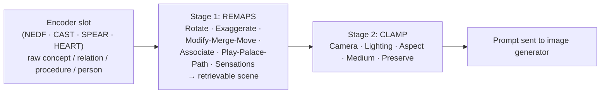

# Image Pipeline

**Summary**: The two-stage pipeline that turns a slot of encoded information into a generated image. Stage 1 is [REMAPS](./remaps.md) — six transformation moves that make the scene retrievable. Stage 2 is [CLAMP](./clamp-render-lens.md) — five render-direction slots that turn that scene into a production-grade prompt for a modern image generator. The two are not separate frameworks; they are the *transformation* and *render-direction* halves of one workflow.

**Sources**: Synthesized from [remaps](./remaps.md) and [clamp-render-lens](./clamp-render-lens.md) — no new content. This page exists to make the composition explicit so future readers don't treat the two acronyms as parallel cross-cutting layers when they are sequential stages. 2026-07-02 addition: the `transform → render` generalization (image is one instance; music is the second — see [music-generation-frameworks](./music-generation-frameworks.md)).

**Last updated**: 2026-09-05 (§The transform → render abstraction — the **Generator** column restored to the table, which had carried three columns for a four-stage abstraction and so hid the visual channel's three interchangeable generators; the lens × generator axis named as [GoF Bridge](./software-design-principles-for-neural-os.md)); 2026-07-02

---

## Why one pipeline, not two layers

REMAPS and CLAMP have appeared in the glossary as separate cross-cutting layers, but [CLAMP](./clamp-render-lens.md)'s own opening line says it plainly:

> *"REMAPS makes a scene retrievable; CLAMP fixes the render. The two compose into one prompt template: scene-from-REMAPS + render-directives-from-CLAMP."*

They are not orthogonal frameworks like [PULSE](./pulse-overview.md) (governance) and [METER](./meter-overview.md) (measurement). They are stages of one image-generation workflow:

1. **Stage 1 — REMAPS**: transformation moves applied to the source slot to make the scene memorable and unambiguous.
2. **Stage 2 — CLAMP**: render direction applied to that scene to make it generable as a production-grade image.

Skipping Stage 1 produces ordinary scenes that an image generator can render but the mind can't hold. Skipping Stage 2 produces vivid scenes the generator misinterprets — wrong camera, wrong lighting, wrong medium, drift in the constraints.

The encoded vocabularies of both stages stay intact — the merge is editorial, not technical. You still apply Rotate / Exaggerate / Modify-Merge-Move / Associate / Play-Palace-Path / Sensations at Stage 1; you still set Camera / Lighting / Aspect / Medium / Preserve at Stage 2. The new framing just names the workflow that already runs through them.

## The pipeline diagram

## When to invoke each stage

- **Encoding-only work** (memory palace, NEDF/CAST/SPEAR/HEART page) — Stage 1 alone is enough. No image is generated; REMAPS just makes the scene retrievable.
- **Image-generation work** (gpt-image, DALL-E, Midjourney) — both stages required. Skipping Stage 2 produces drift on the first or second try.
- **Existing image you want to remember** — read it through Stage 1's six moves to find what's making it stick (or not).

## Style profiles ride on Stage 2

[Velvet Aeon](./world-velvet-aeon.md) is loaded automatically into the CLAMP slots (M = watercolor field-journal medium; L = single-light sources; figure rules; etc.) per user feedback memory. That override happens at Stage 2 — it does not change what Stage 1 produces.

## The transform → render abstraction — image is one instance

The Image Pipeline is the *first* instance of a more general pattern, not a one-off. The abstraction is **`seed → transform → render → generator`**, and its two middle stages are pluggable by output medium:

| Instance | Transform (Stage 1) | Render lens (Stage 2) | Generator (Stage 3) | Default world profile |
|---|---|---|---|---|
| **Image** (this page) | [REMAPS](./remaps.md) | [CLAMP](./clamp-render-lens.md) — Camera · Lighting · Aspect · Medium · Preserve | gpt-image · DALL-E · Midjourney | [Velvet Aeon](./world-velvet-aeon.md) |
| **Music** | [REMAPS](./remaps.md) / [SCAMPER](./creative-thinking-os.md) | **MASTER** — Meter · Arrangement · Space · Timbre · Energy-arc · Restrict (Suno-grounded) | Suno | music-profile |

This is [Dependency Inversion + Strategy](./software-design-principles-for-neural-os.md): the pipeline depends on the *abstraction* "render-lens," and CLAMP (image) and MASTER (audio) are two concrete strategies selected by the output medium. **The generator is a second axis, not a detail of the first** — the table above carried three columns until 2026-09-05 although the abstraction named in the sentence before it has four stages, which is how the visual channel's three interchangeable generators stayed invisible here. Lens and generator vary independently, and the name for that is [GoF Bridge](./software-design-principles-for-neural-os.md), adopted the same day: a new generator costs no lens work, and a sharper lens costs no generator work. The transform stage is shared — REMAPS's six moves retarget from a mental image onto a musical motif unchanged (retrograde = Reverse, augmentation = Exaggerate, genre-fusion = Merge). A second clean implementation is evidence the `transform → render` split is a real extension point, not an image-only accident. See [music-generation-frameworks](./music-generation-frameworks.md) for the audio instance and [composability-index](./composability-index.md) for the registered unlock.

## Related pages

- [remaps](./remaps.md) — Stage 1, full slot definitions and worked examples
- [clamp-render-lens](./clamp-render-lens.md) — Stage 2, full slot definitions and worked examples
- [world-velvet-aeon](./world-velvet-aeon.md) — Stage-2 style profile (default) layered onto CLAMP slots
- [framework-comparison-matrix](./framework-comparison-matrix.md) — the **Render / Externalization layer**, where Image Pipeline is the **visual channel** (and where it sits relative to the encoders)
- [music-generation-frameworks](./music-generation-frameworks.md) — the second instance of the `transform → render` abstraction (audio: REMAPS/SCAMPER → MASTER)
