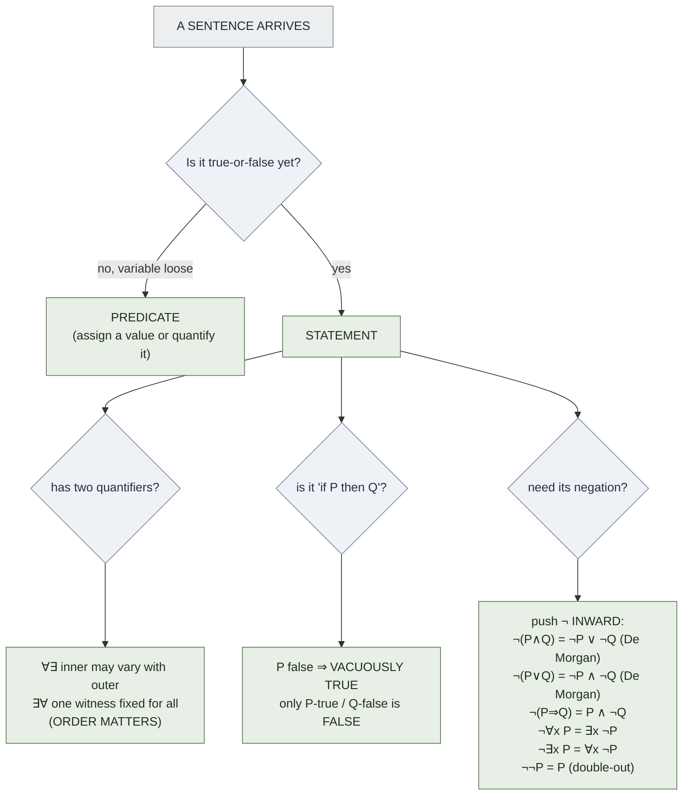

# Informal Logic Foundations

**Summary**: The conversational (plain-English) logic layer a proof-writer needs *before* the formal calculus kicks in — what counts as a mathematical statement, how a predicate becomes a statement, why quantifier *order* changes meaning, why an implication with a false hypothesis is "vacuously true," and the plain-language statements of De Morgan, contrapositive equivalence, and negation simplification. This is the *reasoning surface*; the formal intro/elim machinery that justifies these moves is owned by [natural-deduction](./natural-deduction.md).

**Sources**: dokumen.pub_introduction-to-proofs-and-proof-strategies (Shay Fuchs, *Introduction to Proofs and Proof Strategies*, Cambridge 2024) §§3.1–3.5.

**Last updated**: 2026-06-10.

---

## Altitude boundary (read this first)

This page owns the **informal / plain-English** layer of mathematical logic: the intuitions and conversational rules a writer uses to *read and write* statements correctly. It deliberately stops at the formal calculus. The **formal natural-deduction machinery** — the introduction/elimination rule pairs, assumption discharge, proof trees, the NM/NJ/NK systems — is owned by [natural-deduction](./natural-deduction.md) and must not be re-derived here. When this page says "an implication is equivalent to its contrapositive," that equivalence is *justified* by the formal apparatus on that page; here it is stated as a usable plain-English fact (source: ...introduction-to-proofs-and-proof-strategies...pdf).

Two altitudes, kept distinct:

| Altitude | Question it answers | Owner |
|---|---|---|
| **Informal (this page)** | What does this sentence *mean*, and is it even a statement? | this page |
| **Formal calculus** | By which rule is this inference *licensed*? | [natural-deduction](./natural-deduction.md) |
| **Proof construction** | Which *method* (direct / contradiction / induction) builds the proof? | [methods-of-mathematical-argument](./methods-of-mathematical-argument.md) |

## Mathematical statement vs predicate

A **mathematical statement** (also called a [proposition](./argument-anatomy.md)) is a declarative sentence that, *in a given context*, is either true or false but not both (source: ...introduction-to-proofs-and-proof-strategies...pdf). "The square root of 9 is 3" is a true statement; "the set {∅} is empty" is a false statement; "23 + 15 − 7" is *not* a statement at all — it makes no sense to ask whether it is true or false (source: ...introduction-to-proofs-and-proof-strategies...pdf).

A **predicate** is a *template* for a statement — a sentence with a free variable that becomes true or false only once the variable is pinned down. "x² ≥ x" is not a statement: when x = 5 it is true, when x = ½ it is false, so its truth value is undecided until x is fixed (source: ...introduction-to-proofs-and-proof-strategies...pdf). Two ways turn a predicate into a statement:

1. **Assign a value** — "5² ≥ 5" is a (true) statement.
2. **Quantify** — bind the variable with "for all" or "for some." (See below; the logic of *all* and *some* is registered as [quantification](./logic-atomic-design.md).)

Context matters: "1 + 1 = 0" is false over the real numbers but true in the two-element field — so identifying a statement's universe is part of identifying its truth value (source: ...introduction-to-proofs-and-proof-strategies...pdf).

## Quantifier order matters (∀∃ ≠ ∃∀)

Quantifiers are the words — "for all," "for every," "there exists," "for some" — that turn a predicate into a statement (source: ...introduction-to-proofs-and-proof-strategies...pdf). The standout informal trap: **swapping the order of two quantifiers can change the meaning of the statement** (source: ...introduction-to-proofs-and-proof-strategies...pdf).

Fuchs's parent/child example, with P(x, y) = "x is y's child":

- **(∀x ∈ A)(∃y ∈ B) P(x, y)** reads "for every child, there is *some* parent" — a different parent is allowed for each child. True by construction.
- **(∃y ∈ B)(∀x ∈ A) P(x, y)** reads "there is *one* person who is the parent of *every* child" — a single y must work for all x. This may be true or false depending on A and B (source: ...introduction-to-proofs-and-proof-strategies...pdf).

Plain-English rule of thumb: **the inner quantifier may depend on the outer one, but not vice versa.** In ∀x ∃y, the witness y is *chosen after* x and may vary with it; in ∃y ∀x, the single y is *fixed first* and must serve every x. They are not interchangeable. (A related fixed convention: a quantifier always appears *before* its variable in symbolic form, even when the spoken sentence puts "for every" at the end — "|a + 1| ≤ |a| + 1 for every real a" becomes (∀a ∈ ℝ)(…) (source: ...introduction-to-proofs-and-proof-strategies...pdf).)

## Vacuous truth — the teachable anomaly

This page **owns** the term *vacuous truth*.

An implication "if P then Q" (written P ⇒ Q) is declared **true whenever its hypothesis P is false**, regardless of Q. An if-then statement with a false hypothesis is said to be **vacuously true** (source: ...introduction-to-proofs-and-proof-strategies...pdf). Fuchs's example: "if money grows on trees, then cats have five legs" is a *true* statement — both the hypothesis and the conclusion are false, there is no cause and effect, but the truth-table structure of the implication makes the whole statement true (source: ...introduction-to-proofs-and-proof-strategies...pdf).

Why this is the anomaly worth dwelling on: in everyday speech "if-then" smuggles in *cause and effect*, and people unconsciously hear it as "if and only if." Fuchs's bicycle story makes the friction visible: a friend says "if you damage or lose my bike, you will have to pay for it," then demands payment for an *undamaged* bike, arguing that by the truth table, "pay even when undamaged" is consistent with the implication. The listener objects because they heard the *everyday* reading "you pay if and only if you damage it" (source: ...introduction-to-proofs-and-proof-strategies...pdf). The resolution: mathematics uses "if-then" to mean *exactly* if-then, and reserves "if and only if" for equivalence — so the only way an implication is *false* is when the hypothesis is true and the conclusion is false (source: ...introduction-to-proofs-and-proof-strategies...pdf).

The full truth table for P ⇒ Q (source: ...introduction-to-proofs-and-proof-strategies...pdf):

| P | Q | P ⇒ Q |
|---|---|---|
| T | T | T |
| T | F | **F** ← the only false row |
| F | T | T (vacuous) |
| F | F | T (vacuous) |

Mathematicians *use* vacuous truth deliberately: a universal claim "for all x in S, P(x)" is automatically true when S is empty, because there is no x available to make any instance false.

## Prescriptive vs descriptive readings of connectives

This page **owns** the term *prescriptive vs descriptive definition* (as it applies to logical connectives).

The bike and weather examples expose two competing sources of meaning for a connective like "if-then":

- **Descriptive reading** — how the word is *actually used* in everyday language. "If you do not brush your teeth, you will have cavities" *describes* an observed cause-and-effect link; "if-then" here often means the everyday "if and only if" (source: ...introduction-to-proofs-and-proof-strategies...pdf).
- **Prescriptive reading** — the meaning mathematics *stipulates by definition*, fixed once and for all by a truth table, regardless of cause, effect, or topical relevance (source: ...introduction-to-proofs-and-proof-strategies...pdf).

The truth table *defines the meaning* of each connective in mathematics — it is a prescription, not a report of usage (source: ...introduction-to-proofs-and-proof-strategies...pdf). The whole point of the §3.3 discussion is that mathematics must *override* the descriptive everyday reading with a single prescribed one, because "precision and accuracy are crucial in mathematical arguments and proofs, and so we have to make sure that we all interpret statements in the same way" (source: ...introduction-to-proofs-and-proof-strategies...pdf). Vacuous truth is the most visible place where the prescriptive definition departs from the descriptive intuition.

## De Morgan and contrapositive in plain English

Two logically equivalent statements *say the same thing in a different way* — they have the same truth value in every scenario, written R ≡ S (source: ...introduction-to-proofs-and-proof-strategies...pdf). Fuchs's Proposition 3.4.5 lists the equivalences a writer needs (source: ...introduction-to-proofs-and-proof-strategies...pdf). Stated in plain English:

- **De Morgan, "and":** the negation of "P and Q" is "not-P or not-Q." (¬(P ∧ Q) ≡ ¬P ∨ ¬Q.)
- **De Morgan, "or":** the negation of "P or Q" is "not-P and not-Q." (¬(P ∨ Q) ≡ ¬P ∧ ¬Q.)
- **Negated implication:** the negation of "if P then Q" is "P and not-Q." (¬(P ⇒ Q) ≡ P ∧ ¬Q.) Fuchs's gloss: "being rich does *not* imply being happy" means exactly "one can be rich and unhappy" (source: ...introduction-to-proofs-and-proof-strategies...pdf).
- **Contrapositive equivalence:** "if P then Q" is equivalent to "if not-Q then not-P." (P ⇒ Q ≡ ¬Q ⇒ ¬P.) Fuchs: "if a person has a driver's license, they are at least 16" says exactly the same thing as "if a person is not at least 16, then they do not have a driver's license" (source: ...introduction-to-proofs-and-proof-strategies...pdf).

The contrapositive equivalence is "of great importance, as it provides us with a proof technique commonly used in mathematics" — to prove P ⇒ Q you may instead prove its contrapositive ¬Q ⇒ ¬P, which is sometimes far easier (source: ...introduction-to-proofs-and-proof-strategies...pdf). Fuchs's example: "if n³ is odd then n is odd" resists a direct attack, but its contrapositive "if n is even then n³ is even" falls out in one line, since n = 2k gives n³ = 8k³ = 2·4k³ (source: ...introduction-to-proofs-and-proof-strategies...pdf). The *use* of contrapositive as a named proof method belongs to [methods-of-mathematical-argument](./methods-of-mathematical-argument.md); this page owns only the plain-English *equivalence* that licenses it.

The two quantifier equivalences (stated without truth-table proof, since quantified statements have no finite truth table): the negation of "for all x, P(x)" is "there exists an x with not-P(x)," and the negation of "there exists an x with P(x)" is "for all x, not-P(x)" (source: ...introduction-to-proofs-and-proof-strategies...pdf).

## Negation simplification — push negations inward

Slapping a "not" or a ¬ in front of a statement is a *correct* negation but often a *useless* one; the working move is to **push the negation inward until no leading "not" remains**, applying the equivalences above mechanically (source: ...introduction-to-proofs-and-proof-strategies...pdf). Fuchs's worked simplification of ¬Q where Q = "for all a, b: if a·b = 0 then a = 0 or b = 0":

1. Push past the quantifiers: ¬∀ becomes ∃¬, so "there exist a, b such that not(if a·b = 0 then …)."
2. Negate the implication (¬(P ⇒ Q) ≡ P ∧ ¬Q): "a·b = 0 and not(a = 0 or b = 0)."
3. Apply De Morgan to the disjunction: "not(a = 0) and not(b = 0)."
4. Eliminate the residual negations by absorbing them into the predicates: "a ≠ 0 and b ≠ 0."

Result: ¬Q = "there exist a, b with a·b = 0, a ≠ 0, and b ≠ 0" — *no word of negation left* (source: ...introduction-to-proofs-and-proof-strategies...pdf). The companion move is **eliminating double negatives**: negating reverses truth value, so a statement and its negation are never both true nor both false — re-negating returns the original, which is the check Fuchs recommends running on every negation you write (source: ...introduction-to-proofs-and-proof-strategies...pdf).

Practical payoff: to prove an object *fails* a definition, negate the definition and *simplify it into a positive, checkable form*. Fuchs turns "f is bounded if (∃M)(∀x)(|f(x)| ≤ M)" into "f is unbounded if (∀M)(∃x)(|f(x)| > M)" — note the quantifiers flipped *and* the inequality reversed, with no ¬ symbol surviving (source: ...introduction-to-proofs-and-proof-strategies...pdf).

## Mnemonic

**PQ-VOID** — the six conversational reflexes, in order of use:

- **P**redicate-vs-statement — *is this even true-or-false yet, or is a variable still loose?*
- **Q**uantifier-order — *∀∃ lets the witness vary; ∃∀ pins one witness for all. Not interchangeable.*
- **V**acuous — *false hypothesis ⇒ the whole if-then is true.*
- **O**verride — *prescriptive truth-table meaning Overrides the descriptive everyday reading.*
- **I**nward — *push negations Inward (De Morgan flips and/or; ¬(P⇒Q) = P ∧ ¬Q).*
- **D**ouble-out — *eliminate Double negatives; re-negating must return the original.*

Read it as *"P-Q into the VOID"* — feed any sentence through P-Q (statement? quantifier order?) and then through V-O-I-D (vacuous check, prescriptive override, inward push, double-out) before you trust it.

## Checksum

If you can answer these in under 60 s each from memory, the page is encoded:

1. **Why is "if money grows on trees, then cats have five legs" a true statement?** (*It is an implication with a false hypothesis; an if-then with a false hypothesis is **vacuously true**, regardless of the conclusion. The only false row of P ⇒ Q is P true, Q false.*)
2. **Give a single P(x,y) where swapping ∀∃ to ∃∀ changes truth.** (*"x is y's child." "Every child has some parent" is true; "there is one person who is the parent of every child" need not be. Inner quantifier may depend on outer; not the reverse.*)
3. **State the negation of "if P then Q" with no leading "not."** (*P ∧ ¬Q — "P holds and Q fails." Fuchs: "rich does not imply happy" = "rich and unhappy."*)
4. **Why does mathematics override the everyday reading of "if-then"?** (*The everyday/**descriptive** reading carries cause-and-effect and often means "iff"; mathematics uses a single **prescriptive** truth-table meaning so everyone interprets statements identically. Vacuous truth is where the two readings split.*)
5. **Simplify ¬(for all x, P(x)) and ¬(P or Q).** (*"There exists x with ¬P(x)"; "¬P and ¬Q" — quantifier flips, De Morgan flips the connective.*)
6. **What proof technique does the contrapositive equivalence license, and who owns it?** (*Proving P ⇒ Q by instead proving ¬Q ⇒ ¬P; the named method belongs to [methods-of-mathematical-argument](./methods-of-mathematical-argument.md), not here.*)

## Visual — the conversational logic surface

**── altitude line ──** Everything above is the INFORMAL reasoning surface (this page). WHY each move is valid → formal rule pairs in [natural-deduction](./natural-deduction.md).

Above the altitude line: the plain-English reflexes a writer runs by hand. Below it: the formal calculus that justifies them, owned elsewhere.

## How this page sits in the wiki

- **[natural-deduction](./natural-deduction.md)** is the formal floor beneath everything here. The contrapositive equivalence, De Morgan, and vacuous truth are *theorems* of that calculus; this page states them as conversational facts and links down for the justification. Do not re-derive intro/elim rules here.
- **[methods-of-mathematical-argument](./methods-of-mathematical-argument.md)** is the floor *above*: once you can read statements correctly (this page), you choose a construction method — direct, contradiction, induction. The contrapositive *equivalence* is owned here; contrapositive *as a proof method* is owned there.
- **[logic-atomic-design](./logic-atomic-design.md)** registers quantification and the categorical machinery; link there rather than redefining "for all" / "there exists."

## Related pages

- [natural-deduction](./natural-deduction.md) — the formal calculus that justifies these informal moves (altitude floor)
- [methods-of-mathematical-argument](./methods-of-mathematical-argument.md) — the proof-construction layer that consumes this reasoning surface; owns contrapositive-as-method
- [logic-atomic-design](./logic-atomic-design.md) — registry hub for quantification and categorical logic
- [methods-of-deduction](./methods-of-deduction.md) — Copi's informal-to-formal on-ramp; De Morgan and contraposition as replacement rules
- [worked-natural-deduction-proof](./worked-natural-deduction-proof.md) — a worked derivation of one direction of De Morgan's law, formal-style
- [glossary](./glossary.md) — Logic layer registrations (owns: vacuous truth, prescriptive vs descriptive definition)
