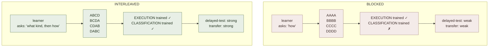

# Interleaving

**Summary**: Interleaving is the practice of **mixing different problem types, skills, or topics within a single practice session**, rather than **blocking** practice into long runs of the same type. In blocked practice, the learner solves 20 quadratic equations in a row; in interleaved practice, those 20 quadratics are scrambled with linears, exponentials, and word problems. Interleaving feels harder in the moment, scores lower on within-session tests — and produces substantially better delayed test performance and transfer to novel problems. It is one of the four canonical **[desirable-difficulties](./desirable-difficulties.md)** (Bjork) and is rated **high-utility** in Dunlosky et al.'s 2013 meta-review. The mechanism is **discrimination** — interleaved practice forces the learner to identify *which* procedure applies, not just *how* to execute it; blocked practice trains execution but leaves classification under-trained. This page is the canonical owner.

**Sources**:
- Rohrer, D., & Taylor, K. (2007). "The Shuffling of Mathematics Problems Improves Learning." *Instructional Science*, 35, 481-498.
- Taylor, K., & Rohrer, D. (2010). "The Effects of Interleaved Practice." *Applied Cognitive Psychology*, 24, 837-848.
- Rohrer, D. (2012). "Interleaving Helps Students Distinguish among Similar Concepts." *Educational Psychology Review*, 24, 355-367.
- Kornell, N., & Bjork, R. A. (2008). "Learning Concepts and Categories: Is Spacing the 'Enemy of Induction'?" *Psychological Science*, 19(6), 585-592. — interleaving improves category-induction learning despite feeling worse.
- Dunlosky et al. (2013) PSPI meta-review — high-utility rating.
- Brown, Roediger & McDaniel (2014). *Make It Stick* — popular synthesis, Ch 4 "Embrace Difficulties."
- Internal: [desirable-difficulties](./desirable-difficulties.md), [active-recall](./active-recall.md), [spaced-repetition](./spaced-repetition.md), [problem-type-recognition-drill-ladder](./problem-type-recognition-drill-ladder.md).

**Last updated**: 2026-06-09

---

## Blocked vs interleaved

| | BLOCKED | INTERLEAVED |
|---|---|---|
| Sequence | A₁ A₂ A₃ · B₁ B₂ B₃ · C₁ C₂ C₃ | A₁ B₁ C₁ · A₂ B₂ C₂ · A₃ B₃ C₃ |
| Feels | FAST | SLOW |
| Within-test score | HIGH | LOW |
| Delayed-test score | LOW | HIGH |
| Transfer | LOW | HIGH |

The within-vs-delayed inversion is the **canonical pattern**. It also shows up for [spacing](./spaced-repetition.md), [retrieval](./active-recall.md), and variation — the four [desirable difficulties](./desirable-difficulties.md) share this shape.

## The mechanism: discrimination

Two cognitive operations live inside any procedural skill:

1. **Classification** — "what kind of problem is this?"
2. **Execution** — "how do I run that procedure?"

**Blocked practice** trains execution but bypasses classification: the chapter heading or the worksheet's previous-problem-was-a-quadratic context tells the learner what to do before they look. They never have to ask "what kind?"

**Interleaved practice** forces classification every problem: each new item could be any of the trained types. The learner must identify the type *first*, then execute. This builds the discrimination skill, which is what real-world performance demands — exam problems, work problems, and life problems don't come pre-grouped by chapter.

Rohrer's canonical study (2007, 2010): students who interleaved 4 types of math problems scored ~43% lower on practice quizzes but ~76% higher on delayed transfer tests vs. students who blocked the same content.

## What gets interleaved

The unit of interleaving must be at the **classification-relevant** grain:

| Domain | Interleave units |
|---|---|
| Math | Problem types (quadratic / linear / exponential / system) within a worksheet |
| Music | Different pieces, different keys, different rhythmic patterns in one practice session |
| Sport | Forehand / backhand / volley / serve in one drill (not 20 forehands then 20 backhands) |
| Medical imaging | Different pathologies in one reading session, not blocked by pathology |
| Programming | Different problem-types in code drills (search / dp / graph) |
| Languages | Mixed-tense / mixed-case / mixed-vocab drills |

Items that should **not** be interleaved: micro-skills below the classification threshold (a beginner's first 10 attempts at a single move don't benefit from interleaving — they need blocked execution practice until the move is at least partially formed).

## When interleaving helps vs hurts

| Stage | Recommended |
|---|---|
| **First exposure** to a new technique | Blocked (1-3 sessions) — get basic execution online |
| **Past first execution**, before fluency | **Interleaved** — forces classification + retention |
| **Maintenance** of learned skills | **Interleaved with [spacing](./spaced-repetition.md)** — combined effect |
| **Performance** (test, exam, competition) | **Interleaved practice in advance** — mirrors the real demand |

The rule of thumb (Bjork 2011): **introduce blocked, train interleaved, perform interleaved.** Block only long enough to get the procedure online; then interleave immediately to install classification + retention from the start.

## Visual

## Failure modes

| Failure | Symptom | Mitigation |
|---|---|---|
| **Premature interleaving** | Learner hasn't formed the procedures yet; thrashes | Block first 1-3 sessions per new technique, then mix |
| **All-interleaving overload** | Cognitive overload; nothing sticks | Lower the number of co-interleaved types; ramp up gradually |
| **Wrong-grain interleaving** | Mixing irrelevant variations (font sizes, problem-page-numbers) instead of classification-relevant types | Identify the discrimination the learner actually needs to make; interleave at that grain |
| **Confounded with spacing** | "Interleaving works" claims sometimes confound with the spacing effect | Both genuinely work; in practice interleave AND space, don't pick one |
| **Within-session-test calibration** | Learner abandons interleaving because the practice quiz score dropped | Trust the delayed measure; the within-session drop is the desirable-difficulty signature |

## Interleaving + spacing + retrieval

The three core [desirable-difficulties](./desirable-difficulties.md) **stack multiplicatively**, not additively:

- **Spacing alone**: small effect (~10-15% delayed-test improvement)
- **Retrieval alone**: medium effect (~15-25%)
- **Interleaving alone**: medium-large effect (~25-40% on transfer)
- **All three together**: largest effect across domains; standard form in well-designed drill ladders

The [red-queen-skill-gym](./red-queen-skill-gym.md) Lamp/Scale/Sword progression is one canonical stacking; the wiki's [drill-generator](./drill-generator.md) composes all three by default.

## Neural OS implementations

- [problem-type-recognition-drill-ladder](./problem-type-recognition-drill-ladder.md) — classification-first ladder; interleaving is the core mechanism
- [red-queen-skill-gym](./red-queen-skill-gym.md) — Sword phase is interleaving + retrieval + pressure
- [drill-generator](./drill-generator.md) — emits interleaved drill blocks by default
- [automaticity-and-reflex-training](./automaticity-and-reflex-training.md) — Scale/Sword stages interleave; Lamp blocks
- construct-recognition-gym · algorithm-pattern-gym · [palace-classification-gym](./palace-classification-gym.md) — all interleave across their target taxonomies
- [desirable-difficulties](./desirable-difficulties.md) — parent principle

## Related pages

- [desirable-difficulties](./desirable-difficulties.md)
- [active-recall](./active-recall.md)
- [spaced-repetition](./spaced-repetition.md)
- [red-queen-skill-gym](./red-queen-skill-gym.md)
- [problem-type-recognition-drill-ladder](./problem-type-recognition-drill-ladder.md)
- [automaticity-and-reflex-training](./automaticity-and-reflex-training.md)
- [fluency-illusion](./fluency-illusion.md) — the within-session feeling that blocked is better
- [learning-sciences-validation](./learning-sciences-validation.md)

---

## U — See (CAST)
1. Mix types, don't block them
2. Within-session score drop = the desirable-difficulty signature

## D — Name (NEDF)
1. Interleaving = mixing problem types within a practice session
2. Distinguisher: trains classification, not just execution
3. Failure mode: premature interleaving before procedures form

## F — Do (SPEAR)
1. Block 1-3 sessions for new technique → interleave from session 4
2. Mix 3-5 classification-relevant types per session

## B — Watch (HEART)
1. "I'd rather just do all the X first" → blocked-preference urge to override
2. Practice-quiz score drop → keep going; trust delayed measure

## L — Predict (ORACLE)
1. Interleaved practice → strong transfer to mixed-format exam
2. Blocked practice → high practice scores, weak exam transfer

## R — Act (GRACE)
1. Worksheet/drill set arrives blocked → shuffle before working
2. Single-topic study session → add at least one cross-type review block
