# Internal Limits Applied to AI Safety

**Summary**: Application of the [internal-limits-pattern](./internal-limits-pattern.md) (Wave 4 promoted; 4th confirmed architectural primitive) to **AI safety + capability verification**. The pattern's invariant — *sufficiently expressive systems have internal limits seen from inside, not external walls beyond* — predicts specific impossibility results in AI verification, alignment certificates, and capability prediction. **6th worked instance of the internal-limits pattern**, after language · mathematics · computation · physics · phenomenology. Plus a candidate 7th instance: complexity-theoretic limits on optimization in sufficiently general agents.

**Sources**:
- [internal-limits-pattern](./internal-limits-pattern.md) — wiki's Wave 4 architectural primitive.
- [godels-incompleteness](./godels-incompleteness.md) — mathematics instance.
- Alan Turing, "On Computable Numbers" (1936) — computation instance + halting problem.
- Henry G. Rice, "Classes of recursively enumerable sets and their decision problems" (1953) — Rice's theorem (the formal generalization).
- General AI safety literature on verification + alignment + interpretability (e.g., Hendrycks et al. on benchmarks, Christiano et al. on verification, Anthropic's interpretability work, MIRI's decision theory work).
- [substrate-thesis-applied-to-ai-alignment](./substrate-thesis-applied-to-ai-alignment.md) — sister Wave-7 cross-domain extension.

**Last updated**: 2026-05-25

**Source-discipline note**: This page applies the internal-limits pattern to AI safety. The technical claims about AI verification + alignment certificates rest on **Rice's theorem** + general undecidability results, which are well-established. The *specific predictions* about AI safety research strategies are partly speculative; per the [memory-paradox](./memory-paradox.md) rule, **take seriously enough to recognize when impossibility-flavored arguments are operative; hold lightly enough to allow for unexpected workarounds**.

---

## One-line

> AI safety inherits the **internal limits** of computability theory. *No general algorithm decides whether an arbitrary AI system has any non-trivial semantic property* (Rice's theorem). This rules out **universal verification certificates** for AI alignment but does *not* rule out **bounded verification for specific architectures + contexts**. The wiki's reflex: when an AI safety claim invokes universal verification, suspect Rice-style impossibility; look for the bounded version.

## Unlocks (lead, not footer)

1. **Rice's theorem applies directly to AI systems treated as programs.** Rice's theorem (1953): for any non-trivial semantic property *P* of programs (a property that distinguishes some programs from others but isn't satisfied by all or none), **there is no algorithm that decides whether an arbitrary program has property *P***. AI systems treated as programs (which they are, modulo continuous-valued weights vs. discrete state) **inherit this impossibility**. Any AI safety property *P* that is "non-trivial" — and most interesting ones are — **cannot be checked by a general algorithm for arbitrary AI systems**.

2. **The internal-limits pattern's structure transfers cleanly.** The pattern's invariant — *limits seen from inside, not walls with another domain beyond* — applies: AI safety's verification impossibility is *internal* to the algorithmic framework, not a wall with "unverifiable AI on the other side". **There's no "outside" of the algorithm-being-checked where verification could occur from a meta-level.** Just as Gödel sentences are unprovable *within* the system but provable in a meta-system that itself has its own Gödel sentences, AI verification can in principle be done by *another* AI system, but the *other* AI system itself faces verification impossibility, ad infinitum.

3. **The pattern doesn't preclude *bounded* verification.** Rice's theorem applies to **arbitrary** programs. For **restricted classes** of programs (e.g., programs that always terminate within polynomial time + use bounded memory + have specific architectural constraints), many properties become decidable. **The wiki's reflex**: when an AI safety claim faces internal limits, ask *what bounded version of the claim is decidable?* This is the same move that produced [natural deduction](./methods-of-deduction.md) (complete for first-order logic) within the broader Gödelian limits.

4. **The pattern blocks naive "AI safety is solved by clever enough verification" claims.** A common move in AI safety discourse: *"if we just had a clever-enough verification system, we could prove the AI is safe."* The internal-limits pattern blocks this in two ways: (a) Rice-style impossibility for arbitrary AI systems + arbitrary safety properties; (b) infinite-regress of the meta-verification problem. **The pattern does NOT block all progress** — it predicts that progress will come via **bounded verification within specific contexts**, not universal certificates.

5. **The pattern + the [substrate thesis applied to AI alignment](./substrate-thesis-applied-to-ai-alignment.md) interact.** Both Wave-7 cross-domain extensions apply to AI safety. **Their interaction is the wiki's most-load-bearing operational insight for the field**: AI safety researchers face (a) internal limits on what they can prove (this page) + (b) substrate cost from pursuing the work without stewardship (the other Wave-7 page). **Both limit acknowledgement + substrate stewardship are required for sustainable foundations-grade AI safety work.**

## Mnemonic

**6th instance** — *Rice → AI safety verification limits*.

For the pattern: **I-N-E** = *Internal · Not External · Edges seen from inside.*

For the operational principle: **bounded > universal** — bounded verification within specific contexts is achievable; universal verification certificates aren't.

## Memory checksum

1. **State Rice's theorem.** (For any non-trivial semantic property *P* of programs (satisfied by some programs but not all and not none), there is no algorithm that decides whether an arbitrary program has property *P*. 1953. Generalization of the halting problem.)
2. **Why does this apply to AI systems?** (AI systems treated as programs inherit the impossibility. Any AI safety property *P* that's "non-trivial" — true of some AI systems but not others — cannot be checked by a general algorithm for arbitrary AI systems.)
3. **What does the internal-limits pattern predict for AI safety?** (No universal alignment certificate for arbitrary AI architectures + arbitrary safety properties. Bounded verification within specific architectures + specific contexts + specific safety properties remains possible. Progress comes via the bounded route, not the universal route.)
4. **State the *not-claim* boundary.** (The pattern does NOT claim AI safety is impossible. It claims *universal* verification certificates are impossible. Bounded verification (within architecture/context/property restrictions) remains achievable. The pattern is about *what kind of progress is possible*, not whether progress is possible.)
5. **How does this interact with [the substrate thesis applied to AI safety](./substrate-thesis-applied-to-ai-alignment.md)?** (Both Wave-7 cross-domain extensions apply. Together: AI safety researchers face internal limits on what they can prove + substrate cost from pursuing the work without stewardship. Both must be acknowledged + addressed for sustainable foundations-grade AI safety work.)

## Visual — the pattern applied to AI safety

**Internal-limits pattern — AI safety instance.** The 5 prior confirmed instances (from [internal-limits-pattern](./internal-limits-pattern.md)):

| Domain | Source | Limit (seen from inside) |
|---|---|---|
| Language | TLP 5.6 | limits of my language = limits of my world |
| Mathematics | Gödel 1931 | truths unprovable inside the system |
| Computation | Turing 1936 | halting problem undecidable |
| Physics | Einstein 1905 | light-speed limit; internal to causal structure of spacetime |
| Phenomenology | Husserl-Heidegger | horizon-structure of consciousness; cannot step outside |

**↓ 6th instance ↓**

```mermaid
graph TD
    AISV["AI SAFETY VERIFICATION<br/>(Rice 1953 + Turing 1936 + ongoing research)"]
    RICE["Rice's Theorem (1953):<br/>For any non-trivial semantic property P of programs,<br/>there is no algorithm that decides whether an arbitrary<br/>program has property P."]
    APPLIED["Applied to AI — each is non-trivial, semantic,<br/>undecidable for arbitrary AI:<br/>• Will this AI deceive its operators?<br/>• Will this AI pursue convergent instrumental goals?<br/>• Will this AI develop deceptive mesa-optimizers?<br/>• Is this AI aligned with intended values?"]
    INTERNAL["THE INTERNAL CHARACTER:<br/>• The limit is INSIDE the algorithmic framework.<br/>• Not a wall beyond which 'unverifiable AI' lives.<br/>• Meta-verification (another AI verifies the first) faces its own internal limits at the meta-level.<br/>• The regress doesn't escape; each level has its own Rice-style impossibility."]
    BOUNDED["THE BOUNDED VERSION — for RESTRICTED classes of AI systems:<br/>• Bounded-memory + bounded-runtime programs: many properties become decidable.<br/>• Specific architectures (small transformers, specific RL setups): some properties tractable.<br/>• Specific contexts (constrained input distributions, specific tasks): more properties decidable.<br/>• Specific safety properties (narrowly-scoped): more achievable than universal alignment."]
    SIMILAR["This is structurally similar to:<br/>• Natural deduction (complete for first-order logic) within the broader Gödelian limits for arithmetic.<br/>• Special-case algorithms within the broader undecidability of the halting problem.<br/>• Bounded verification methods (model checking, symbolic execution, abstract interpretation) within the broader Rice impossibility."]
    BLOCKS["WHAT THE PATTERN BLOCKS:<br/>• Universal alignment certificates for arbitrary AI.<br/>• 'Clever-enough verification' claims for all AI.<br/>• Meta-verification regress escapes."]
    NOTBLOCK["WHAT THE PATTERN DOESN'T BLOCK:<br/>• Bounded verification within specific architectures.<br/>• Probabilistic safety guarantees within specific contexts.<br/>• Domain-specific safety arguments.<br/>• Empirical safety testing (still useful, even though not a universal certificate).<br/>• Interpretability work (still useful for understanding specific AI systems, even though not generalized)."]
    OPPRIN["THE OPERATIONAL PRINCIPLE:<br/>'Bounded &gt; universal.'<br/>AI safety progress comes via the BOUNDED route, not the UNIVERSAL route.<br/>Recognize this pattern when an AI safety claim invokes universal verification;<br/>redirect to the bounded version."]
    AISV --> RICE --> APPLIED --> INTERNAL --> BOUNDED --> SIMILAR
    SIMILAR --> BLOCKS
    SIMILAR --> NOTBLOCK
    BLOCKS --> OPPRIN
    NOTBLOCK --> OPPRIN
    classDef limit fill:#f3ece0,stroke:#a08a5c,color:#3a3020;
    classDef undecidable fill:#f4ebe9,stroke:#a07d78,color:#3a2926;
    classDef bounded fill:#e8efe6,stroke:#5c7a54,color:#20301c;
    classDef principle fill:#eef1f5,stroke:#7d8aa0,color:#26303f;
    class AISV,RICE,INTERNAL limit;
    class APPLIED,BLOCKS undecidable;
    class BOUNDED,SIMILAR,NOTBLOCK bounded;
    class OPPRIN principle;
```

The pattern applies. The bounded version is the operational target.

---

## What Rice's theorem actually says

**Rice's theorem (Rice 1953)**:

> For any non-trivial semantic property *P* of computable functions, the set *{x : program-with-Gödel-number-x computes a function with property P}* is undecidable.

**"Non-trivial"** means: *P* is true of some computable functions but not all and not none.

**"Semantic"** means: *P* is about what the program *does* (its input-output behavior), not about its syntactic form.

**The proof**: a reduction to the halting problem. If you had an algorithm deciding *P*, you could use it to decide whether arbitrary programs halt (by encoding halting as a semantic property of suitably constructed programs). Halting is undecidable, so *P* must be too.

**The strength**: Rice's theorem is **enormously general**. It applies to:
- *Does this program output the correct sorted list?* (non-trivial semantic; undecidable)
- *Does this program never crash?* (non-trivial semantic; undecidable)
- *Does this program correctly implement a parser for grammar G?* (non-trivial semantic; undecidable)
- *Does this program have any side effects?* (non-trivial semantic; undecidable)
- *Does this AI system pursue convergent instrumental goals?* (non-trivial semantic; undecidable)
- *Does this AI system develop deceptive mesa-optimizers?* (non-trivial semantic; undecidable)
- *Is this AI system aligned with intended values?* (non-trivial semantic; undecidable)

**Anything you'd want to check about an AI's behavior** is, formally, a semantic property. Rice's theorem then applies.

## The internal character

Rice's theorem is an **internal limit** in the sense of [internal-limits-pattern](./internal-limits-pattern.md):

- The undecidability is *within* the algorithmic framework.
- There's no "outside the framework" where the verification could happen by some other means — anything that could verify semantic properties of arbitrary programs would itself be an algorithm, which faces the same impossibility.
- **Meta-verification (use AI₂ to verify AI₁) doesn't escape**: AI₂ as a program faces its own Rice limit when it tries to verify arbitrary AI₁s. You can verify AI₁ with AI₂ in restricted cases; you can't escape the limit by going up a level.

This is structurally identical to [Gödel's incompleteness](./godels-incompleteness.md): a meta-system can prove things the original system can't, but the meta-system has its own unprovable truths. **The regress is the pattern's signature.**

## The bounded version

Rice's theorem applies to **arbitrary** programs and **arbitrary** semantic properties. For **bounded** versions, decidability often returns:

### Bounded by memory + runtime

Programs with **bounded memory + bounded runtime** are finite-state machines. Many properties become decidable for finite-state machines:
- Will the program reach state *S*? (decidable; explicit search)
- Will the program output value *V*? (decidable for bounded outputs)
- Does the program satisfy temporal property *T*? (decidable via model checking)

**Bounded model checking** is a mature field: SPIN, NuSMV, Coq + program-extraction, SMT solvers verify programs of substantial complexity for specific bounded properties. **This works because of the bound, not despite it.**

### Bounded by architecture

For **specific AI architectures** (e.g., small transformer models with fixed parameter counts, specific RL training setups), many safety properties become amenable to:
- **Interpretability**: examining specific neurons + circuits + attention patterns.
- **Mechanistic analysis**: understanding what specific architectural features compute.
- **Differential testing**: comparing behavior across input perturbations.
- **Behavioral cloning + auditing**: verifying alignment to specific behavioral targets.

Anthropic's interpretability work, the various "circuits" research lines, mechanistic interpretability — these all work because they restrict to specific architectures + specific properties, not arbitrary AI in general.

### Bounded by context

For **specific input distributions + specific task contexts**, safety properties become more tractable:
- Will this AI behave safely on inputs from distribution D? (more tractable than arbitrary inputs)
- Will this AI satisfy property P when used for task T? (more tractable than arbitrary tasks)
- Is this AI safe when constrained to outputs in space S? (more tractable than arbitrary outputs)

**Contextual safety arguments** are weaker than universal certificates but achievable. Much current AI safety work operates in this regime.

### Bounded by property

**Narrow safety properties** are more achievable than broad alignment claims:
- Does this AI refuse to output instructions for synthesizing chemical weapons? (narrow; testable empirically; achievable)
- Does this AI satisfy specific behavioral constraints on benchmark X? (narrow; testable; achievable)
- vs Is this AI "aligned" in general? (broad; faces Rice impossibility for arbitrary alignment definitions)

**Property scoping is the work**: making safety claims sufficiently bounded to be verifiable.

## What the pattern predicts for AI safety research

### Prediction 1 — Universal alignment certificates are impossible

**Strong prediction**: any AI safety research strategy that targets *universal* alignment certificates for *arbitrary* AI systems will face Rice-style impossibility. The strategy either:
- (a) Implicitly restricts to bounded versions (in which case it's bounded verification, not universal).
- (b) Faces fundamental undecidability that no clever engineering will overcome.

**This doesn't mean AI safety is impossible.** It means the *strategy* of pursuing universal certificates is the wrong target.

### Prediction 2 — Progress comes via bounded verification

**Operational prediction**: progress in AI safety will come from **bounded verification techniques** applied within **specific contexts** for **specific properties**. Examples already underway:
- Interpretability research (architecture-bounded, neuron/circuit-level).
- Behavioral testing on benchmarks (input-distribution-bounded).
- Formal verification of specific narrow properties (property-bounded).
- Adversarial robustness within specific perturbation classes (input-bounded).
- Reward hacking detection within specific RL setups (architecture-bounded).

**Each bounded approach buys you something. None buys you everything.** Progress is incremental and contextual.

### Prediction 3 — Meta-verification has the same limits

**Recursive prediction**: using AI₂ to verify AI₁ faces AI₂'s own internal limits. You can:
- Use AI₂ as an **assistant** for verification within bounded contexts.
- Use AI₂ to **generate hypotheses** about AI₁'s behavior (which then need bounded testing).
- Use AI₂ to **interpret** AI₁'s representations (within architectural bounds).

But:
- AI₂ cannot provide a **universal verification certificate** for AI₁'s arbitrary behavior — AI₂ as a program faces Rice limits.
- AI₃ verifying AI₂ verifying AI₁ doesn't escape; the regress is the pattern.

**This affects scalable oversight research**: scalable oversight techniques work *within* bounded contexts; they don't escape internal limits.

### Prediction 4 — Interpretability is the most-promising direction

**Interpretability research** (mechanistic interpretability, circuit analysis, representation engineering) is currently the most-active AI safety direction. The internal-limits pattern *predicts* this should be the most-fruitful direction — because interpretability inherently *bounds* by architecture (specific models, specific weight configurations).

**The wiki's prediction**: interpretability research will continue producing useful results because it operates within bounds; scalable-oversight research targeting universal-AI-arbitrary-property certificates will run into harder walls.

### Prediction 5 — Empirical safety testing remains useful

Even though empirical safety testing doesn't provide universal guarantees, **it remains useful within bounded contexts**. The internal-limits pattern doesn't predict empirical testing is useless; it predicts empirical testing cannot scale to universal certificates.

**Operational implication**: red-teaming, benchmark evaluation, behavioral testing — all useful within their scope. Just don't claim they verify "alignment" in general; claim they verify "alignment to behavior X within input distribution D".

## What the pattern does NOT claim

Important boundaries:

- **Not claiming AI safety is impossible.** Bounded verification within specific contexts is achievable. The pattern is about *what kind of progress is possible*, not whether progress is possible.
- **Not claiming all safety properties are undecidable.** Some narrowly-defined properties + bounded contexts admit decidable verification.
- **Not claiming AI risk is high or low.** The pattern applies regardless of object-level disagreements about AI risk.
- **Not claiming interpretability solves alignment.** It claims interpretability operates within bounded contexts where progress is possible.
- **Not claiming empirical testing is useless.** It claims empirical testing has bounded scope.
- **Not claiming Rice's theorem is the only relevant impossibility.** Other limits apply: complexity-theoretic (P vs NP), information-theoretic, statistical learning theory bounds.

## Candidate 7th instance — complexity-theoretic limits on optimization

**Speculative**: complexity theory may provide a *second* internal-limits pattern instance in AI safety beyond Rice's theorem.

**The pattern**: for sufficiently general agent architectures, the **optimization problem** the agent solves (find the best action given observed state) may be NP-hard or worse. **Approximation strategies + bounded-rationality models** become forced rather than chosen.

**Implications for AI safety**:
- Agents may be **structurally limited** in how thoroughly they can optimize, regardless of compute.
- "Convergent instrumental goals" may be **bounded** by computational tractability rather than only by value alignment.
- Some doom scenarios assume **arbitrary optimization power**; the pattern suggests this assumption may not hold.

**Status: candidate**. Pending closer technical analysis. May or may not be a genuine independent instance vs a refinement of the computational-limits-of-arbitrary-systems theme.

## Cross-link to the wiki

| Wiki layer | Connection |
|---|---|
| [internal-limits-pattern](./internal-limits-pattern.md) | This page is the 6th instance |
| [godels-incompleteness](./godels-incompleteness.md) | Mathematics instance; structurally similar |
| [truth-function-machine](./truth-function-machine.md) | TLP's truth-function reduction was the 1st historical instance of "scope of universal claim" being demolished |
| [substrate-thesis-applied-to-ai-alignment](./substrate-thesis-applied-to-ai-alignment.md) | Sister Wave-7 cross-domain extension; both apply to AI safety simultaneously |
| [problem-solving-os](./problem-solving-os.md) §step 3 | When a problem invokes universal verification, suspect internal limits; redirect to bounded version |
| [memory-paradox](./memory-paradox.md) | Take seriously enough to recognize the pattern; hold lightly enough to allow unexpected workarounds |
| [composability-index](./composability-index.md) | [internal-limits-pattern](./internal-limits-pattern.md) gains a 6th instance |

## METER integration

| Drill | Pass floor | Source |
|---|---|---|
| State Rice's theorem | <30 s | this page §Rice |
| Why does it apply to AI? | <30 s | this page §Rice + AI |
| State the bounded-version principle | <30 s | this page §Bounded |
| Predict where AI safety progress will come from | <60 s | this page §Predictions |
| State the *not-claim* boundary | <30 s | this page §Not claiming |

## Related pages

- [internal-limits-pattern](./internal-limits-pattern.md) — Wave 4 architectural primitive (this page = 6th instance)
- [godels-incompleteness](./godels-incompleteness.md) — mathematics instance
- [truth-function-machine](./truth-function-machine.md) — historical instance (TLP 5 scope demolished by Gödel)
- [substrate-thesis-applied-to-ai-alignment](./substrate-thesis-applied-to-ai-alignment.md) — sister Wave-7 cross-domain extension
- [composability-index](./composability-index.md) — primitive registry; internal-limits gains 6th instance
- [problem-solving-os](./problem-solving-os.md) — internal-limits affects problem-solving strategy at step 3
- [memory-paradox](./memory-paradox.md) — take-seriously-but-hold-lightly applied
- [logic-atomic-design](./logic-atomic-design.md) — Wave 7 cross-domain extension
- [glossary](./glossary.md) — Logic layer registration
