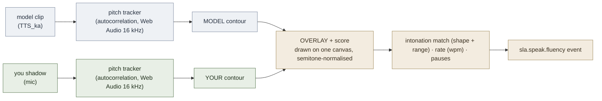

# Intonation & Fluency Gym

**Summary**: A runnable shadowing gym that trains the **prosodic frontier** of speaking — intonation (pitch melody, nuclear stress, rising/falling tunes), rhythm, and fluency (speech rate + pausing) — the suprasegmental skills that segmental minimal-pair drills (its sister tool [l2-phonology-gym](./l2-phonology-gym.md)) structurally cannot reach. It plays a model phrase (a real neural-voice clip), draws the model's **pitch contour** as a visual target, records the learner shadowing it, then **overlays the learner's contour on the model's** and scores it for intonation match (contour-shape correlation + pitch-range/expressiveness), speech rate, and pausing. It is the concrete "shadowing + latency measurement" tool named second in [language-learning-architecture](./language-learning-architecture.md)'s highest-value additions, and the direct answer to the prosody gap that [the learner profile](./semantic-reading-l2.md) surfaces (ELSA intonation 74 / fluency 77 — the weak axis when segmental pronunciation is already 93). Runs fully offline at runtime via the Web Audio API. **Status: BUILT** — [`gyms/intonation-fluency-gym.html`](../../gyms/intonation-fluency-gym.html). This page is the canonical owner of the Intonation & Fluency Gym.

**Sources**:
- This session's design dialogue (2026-06-24): ELSA score breakdown → prosody is the weak axis → the missing tool
- wiki/learning-systems/language-learning-architecture.md — "shadowing plus latency measurement" (highest-value addition #2)
- wiki/learning-systems/red-queen-skill-gym.md — RISE pedagogy + Lamp/Scale/Sword phases
- wiki/learning-systems/language-learning-protocol-english.md — stress timing, weak-form reduction
- wiki/assets/prosody-en-seed.json — the 14-phrase model corpus
- wiki/assets/learner-profile-en.json — the ELSA prosody scores this targets

**Last updated**: 2026-06-24

---

## Why this gym exists

The wiki's segmental tool, [l2-phonology-gym](./l2-phonology-gym.md), polishes individual sounds — the axis the learner's ELSA report already scores 93. But ELSA scores **intonation 74 and fluency 77**: the gap is **prosody**, not phonemes. Prosody is suprasegmental (it lives across syllables — melody, stress-timing, rhythm, pausing) and is exactly what a Georgian-L1 speaker tends to flatten, because Georgian's intonation system differs sharply from English's. No prior tool in the stack trained it. Like the phoneme gym, the learner cannot fully close this loop alone — you cannot reliably hear your own flat contour — so the tool's job is to **make the melody visible and scorable**.

## The shadowing loop

Both the model and the learner pass through the **same** autocorrelation pitch tracker, and both contours are converted to **semitones relative to each speaker's own median** — so a male learner's lower-pitched voice compares to a higher-pitched model by *shape*, not absolute Hz. The visible overlay is the teaching signal: you see precisely where your melody went flat or rose when it should have fallen.

## What it scores

- **Intonation match** — Pearson correlation of the two time-normalised contours (does your melody track the model's rises and falls?) blended with **pitch range** (are you expressive, or flat? — the range term is the direct anti-flatness meter, the #1 Georgian-L1 fix).
- **Speech rate** — words-per-minute and the rate ratio vs the model (too slow/choppy or too fast).
- **Pausing** — count of long gaps; connected speech should flow.

## The corpus

Model phrases live in [`prosody-en-seed.json`](../assets/prosody-en-seed.json): 14 phrases, each tagged with the intonation **pattern** it trains, a coarse **contour shape**, the **stressed words** (nuclear stress last), and a **corrective cue**. They span the patterns English uses and Georgian flattens: statement-fall, yes/no-rise, wh-fall, contrastive stress, list (rise-rise-fall), continuation, echo high-rise, tag question, weak-form/connected speech, emphatic, polite-request, nuclear-stress shift, neutral rhythm, exclamation. Model clips are generated by [`gyms/build-intonation-audio.py`](../../gyms/build-intonation-audio.py) (TTS_ka / Edge neural; Guy male + Aria female so the learner can shadow a closer-pitched model).

## Stages & progression

Inherits [RISE](./red-queen-skill-gym.md) Lamp/Scale/Sword:

- **Trace** (Lamp) — listen and watch the model contour; internalise the melody. No recording.
- **Shadow** (Scale) — hear it, then copy it; your contour overlays the model's and is scored.
- **Produce** (Sword) — say it cold from the text alone, then reveal the model and compare. Transfer.

Per-phrase best scores + a spaced-repetition `weight`/`due` persist in `localStorage`; phrases on the weak axis (intonation/fluency focus) start weighted up. `sla.speak.fluency` [METER](./meter-overview.md) events `{phrase, wpm, pauses, intonation, overall}` are buffered for the dashboard roll-up.

## Build & limits

- **Offline at runtime**, no key — plays committed neural-voice clips and analyses mic input locally. Needs a **microphone** (Shadow/Produce) and the **localhost server** (it `fetch`+decodes audio for analysis, which `file://` blocks).
- The pitch tracker is autocorrelation-based (adequate for clean speech); contour comparison is correlation + range, not yet DTW (timing-tolerant alignment is a future refinement).
- `*.mp3` is gitignored — run `build-intonation-audio.py` once to (re)generate clips.

## Related pages

- [l2-phonology-gym](./l2-phonology-gym.md) — the segmental sister tool (this is the prosodic one)
- [vowel-grid-gym](./vowel-grid-gym.md) — the segmental reference map (static articulation; this gym is temporal)
- [language-learning-architecture](./language-learning-architecture.md) — "shadowing + latency" is this gym (highest-value addition #2)
- [comprehensible-input-protocol](./comprehensible-input-protocol.md) — the input engine; prosody acquisition rides on heard input
- [language-learning-protocol-english](./language-learning-protocol-english.md) — stress timing + weak-form reduction targets
- [red-queen-skill-gym](./red-queen-skill-gym.md) — RISE pedagogy
- [semantic-reading-l2](./semantic-reading-l2.md) — owner of the learner profile that diagnosed this gap
- [skill-progression-stages](./skill-progression-stages.md) — canonical Stage / RISE numbering
- [web-gym-generation-schema](./web-gym-generation-schema.md) — the gym-generation contract

---

## U — See (CAST)
1. Model contour + your contour on one canvas; the gap between them is the lesson
2. Flat line where the model rises/falls = the Georgian-L1 prosody tell

## D — Name (NEDF)
1. Intonation & Fluency Gym = shadowing trainer that overlays your pitch contour on a model's and scores melody + rate + pauses
2. Distinguisher: the suprasegmental sister to the segmental [l2-phonology-gym](./l2-phonology-gym.md)
3. Failure mode: training segmentals (already strong) instead of the prosody that's actually weak

## F — Do (SPEAR)
1. Trace the model melody → shadow it → read the overlay → fix the flat/wrong-direction span
2. Widen pitch range first (anti-flatness), then match rate and trim pauses

## B — Watch (HEART)
1. Intonation score high but range low → you matched direction but stayed monotone
2. Ending goes the wrong way (rise where model falls) → wh-question/statement tune not internalised

## L — Predict (ORACLE)
1. Range + shape match under Produce (cold) → it transfers to live speech
2. Self-grading only, no contour overlay → flat delivery persists invisibly

## R — Act (GRACE)
1. New pattern weak every session → re-read its cue, drop to Trace, rebuild
2. Plateau → check whether range (expressiveness) or rate is the limiter, and drill that one

## Mnemonic

**SEE-THE-MELODY** — the gym's whole value is making the invisible pitch line visible. And **S-O-S**: Shadow → Overlay → Score.

## Checksum

1. Why does prosody need a *tool* when the learner already scores 93 on segmental pronunciation? (Name the axis and the self-observation problem.)
2. Why are both contours converted to semitones relative to each speaker's median before comparison?
3. State the three things scored, and which one is the direct anti-flatness ("don't be monotone") meter.

## Visual

The contour overlay IS the visual: the model melody in one colour, the learner's in another, on a shared semitone axis. The corpus is [`prosody-en-seed.json`](../assets/prosody-en-seed.json); the gym is [`gyms/intonation-fluency-gym.html`](../../gyms/intonation-fluency-gym.html).
