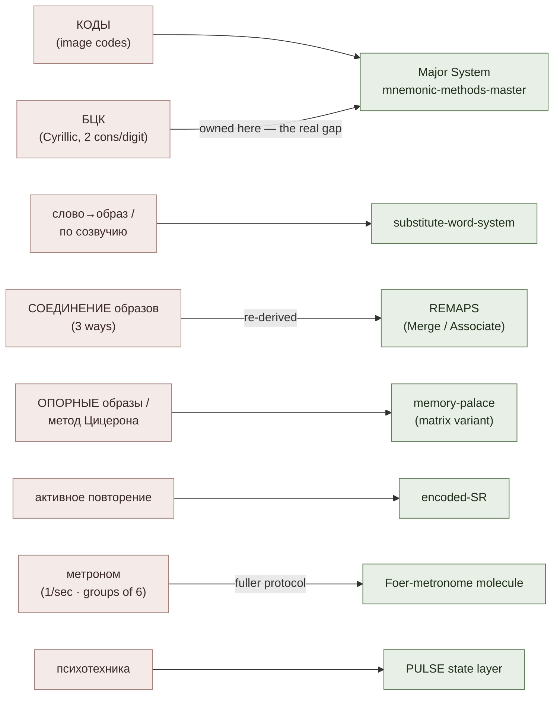

# Kozarenko Mnemotechnics (Giordano School)

**Summary**: Source-overview / lineage page for Vladimir Kozarenko's *Мнемотехника* — the most complete Russian-language mnemonics curriculum (the "Школа мнемотехники" / Giordano tradition). The school is a full, internally-consistent re-implementation of the same memory layer this wiki already owns: a pre-learned vocabulary of fixed *образные коды* (image codes), a Cyrillic phonetic number alphabet (БЦК), *опорные образы* (support-image / loci systems), image-combination operations, and a metronome-paced repetition protocol. **It enters the wiki as a source feeding existing owners, not as a new framework or encoder** — there is no new acronym at framework level (`/validate-idea` verdict, 2026-06-28: keep-with-modification). This page is the Facade that maps each Kozarenko construct onto its Neural OS owner, and the canonical home of the one genuinely additive artifact the wiki lacked: the **БЦК Cyrillic Major-System instance**.

**Sources**:
- `Documents/Memory_mnemotechnics/Мнемотехника (Владимир Козаренко) (HTML)/` — offline HTML export of Kozarenko's *Мнемоника* © В. Козаренко © 2022. Cited by internal file id below.
  - `codes_0001.html` — Буквенно-Цифровой Код (БЦК): mapping, provenance, encoding drill
  - `codes_0000.html`, `arch_0010.html` — соединение образов (three combination methods), выделение подобраза, метод Цицерона, Цепочка, Матрешка
  - `arch_0010.html`, `arch_0042.html` — формирование систем опорных образов (support-image matrices)
  - `arch_0057.html` — «Эффективные и неэффективные приёмы запоминания»
  - `arch_0121.html` — Pi to 9000 digits via codes 000-999 (demonstration)
  - `step_by_step_0001.html` — классификация информации по образности
  - `step_by_step_0002.html` — ритмичность запоминания / метроном; matrix-row coding
  - `pst_0000.html`, `pst_0001.html` — психотехника (attention prerequisite)
- `GMS_V.Kozarenko.pdf` — condensed instructor syllabus for the *Giordano Memorization System* course (mnemonikon.ru, 1990–2020). Added 2026-07-10; the concrete/exercise-driven companion to the HTML *Мнемоника* export above. Confirms the БЦК table digit-for-digit and adds the memory-theory, correct-image, and *затирание* material below.
- `Мнемотехника шаг за шагом.pdf` — the 5-course / 60-lesson graded curriculum in the same school; see [giordano-graded-curriculum](./giordano-graded-curriculum.md). Its letter-digit code table is byte-identical to БЦК (lesson 7 credits Kozarenko). Added 2026-07-10.
- `Ягодкин Н.А., Згода А.Н. - Учись учиться - 2023.pdf` — **not a Kozarenko source.** The Advance school's book (Николай Ягодкин / Анастасия Згода), cited here only for the sibling-lineage comparison and the *образный алфавит* convergence note below. Its lineage home is [yagodkin-advance-mnemonics](./yagodkin-advance-mnemonics.md). Added 2026-07-16.
- Internal: [mnemonic-methods-master](./mnemonic-methods-master.md) (Major System owner), [memory-palace](./memory-palace.md) (Method of Loci owner), [substitute-word-system](./substitute-word-system.md), [REMAPS](./remaps.md).

**Last updated**: 2026-07-16 — added the Advance sibling-lineage section (shared primitives vs. divergent organizing axis, the effectiveness-skepticism tension, the 6 s / 1 s granularity flag) and the *образный алфавит* convergence note; 2026-07-10 GMS-syllabus layer (3-part memory theory + 3-mode taxonomy, correct-image criteria, *затирание* failure mode + *Приём возврата*) and 4 sibling pages; 2026-06-28 original.

---

## What this page is

Kozarenko's *Мнемотехника* is a complete school of the same craft the wiki's memory layer already covers — not a rival system and not a new encoder. Read against the [Tier 1–4 method map](./mnemonic-methods-master.md), almost every Kozarenko construct already has an owner here. The value of ingesting it is therefore **lineage + a handful of genuine gaps**, the largest of which is its Cyrillic phonetic number alphabet. (source: codes_0000.html; the `/validate-idea` analysis, 2026-06-28)

This page does three jobs:

1. **Maps** each Kozarenko construct onto its existing Neural OS owner (so the school's vocabulary is reachable from the wiki and vice-versa).
2. **Owns** the one substantial artifact with no prior home — the **БЦК** Cyrillic instance of the [Major System](./mnemonic-methods-master.md).
3. **Names** the two convergence findings registered in [composability-index](./composability-index.md) (Kozarenko's image-combination = independent re-derivation of [REMAPS](./remaps.md); his metronome = a fuller protocol for the Foer-metronome molecule).

## Doctrine map — Kozarenko construct → Neural OS owner

| Kozarenko construct (RU) | What it is | Neural OS owner |
|---|---|---|
| **Образные коды чисел** (00-99, 000-999) | Fixed pre-learned image per number | [mnemonic-methods-master](./mnemonic-methods-master.md) (Major System / peg), [PAO](./person-action-object-system.md) |
| **Буквенно-Цифровой Код (БЦК)** | Cyrillic consonant→digit phonetic alphabet | **This page** §БЦК — the Cyrillic instance of the [Major System](./mnemonic-methods-master.md) |
| **Представление слова в виде образа; подбор по согласным; кодирование по созвучию** | Turning an abstract/unpicturable word into a concrete image via sound | [substitute-word-system](./substitute-word-system.md) |
| **Соединение образов** (три способа); **выделение подобраза** | Combining images into one scene; extracting a sub-image | [REMAPS](./remaps.md) — Modify-**Merge**-Move and **Associate** moves |
| **Метод Цицерона; опорные образы; системы опорных образов** | Method of Loci; fixed support-image sequences and matrices | [memory-palace](./memory-palace.md) (Domain-grid / matrix palace variant) |
| **Приём «Цепочка»; «Матрешка»** | Chain / nesting sequence techniques | [memory-palace](./memory-palace.md) §When not to use a palace; ranked, not led (see §Doctrinal stance) |
| **Метод активного повторения; повторение с полной расшифровкой** | Active spaced repetition with full decode | [encoded-SR](./encoded-spaced-repetition.md) / SR scheduler |
| **Ритмичность запоминания / метроном** | Metronome-paced encoding and review | Foer-metronome molecule ([memory-atomic-design](./memory-atomic-design.md)); this page §Metronome |
| **Психотехника** (концентрация, внимание) | Attention / concentration training as prerequisite | [PULSE](./pulse-overview.md) state layer; attention prerequisites |
| **Классификация информации по образности** | Information typed as образная / вербальная / точная | [representation-rules](./representation-rules.md) (concrete-first encoding constraint) |

The reading: when you meet a Kozarenko term, it is almost always a Cyrillic name for a move the wiki already owns. Encode by the owner page; use this map as the translation table.

## БЦК — the Cyrillic Major-System instance (the real gap)

This is the artifact the wiki genuinely lacked. The [Major System](./mnemonic-methods-master.md) the wiki documents is **Latin/English-phoneme based**; it cannot be transliterated into Cyrillic by swapping letters — Kozarenko is explicit that doing so "не совсем правильно, или даже совсем не правильно" (not quite right, or outright wrong), because the phonetic logic differs. (source: codes_0001.html)

**Provenance.** Kozarenko credits the most rational Cyrillic code to **Franz Löser's *Тренировка памяти*** (the appendix), calling it "фактически стандарт для русскоязычной мнемотехники" — effectively the standard for Russian-language mnemonics. (source: codes_0001.html)

**The mapping.** Each digit is coded by **two** consonants (the pair is what lets three-digit numbers become single words):

| Digit | Cyrillic pair | Logic (source: codes_0001.html) |
|:---:|:---:|---|
| 0 | н м | **Н**оль → «н»; «эн» ↔ «эм» |
| 1 | г ж | «г» resembles a *1*; «гэ» ↔ «жэ» |
| 2 | д т | **Д**ва → «д»; «дэ» ↔ «тэ» |
| 3 | к х | «к» has *three* strokes; «кэ» ↔ «хэ» |
| 4 | ч щ | **Ч**етыре → «ч»; «че» ↔ «ще» |
| 5 | п б | **П**ять → «п»; «пэ» ↔ «бэ» |
| 6 | ш л | **Ш**есть → «ш»; «шэ» ↔ «лэ» |
| 7 | с з | **С**емь → «с»; «сэ» ↔ «зэ» |
| 8 | в ф | **В**осемь → «в»; «вэ» ↔ «фэ» |
| 9 | р ц | «Р» resembles a mirror-*9*; «ц» is the one pair to memorize raw |

Kozarenko's load-reduction claim: 19 of the 20 letters are recovered by analysis (first letter of the digit's name, or a shape/sound argument); **only «ц» must be memorized outright.** (source: codes_0001.html)

**The fluency drill** (read consonants → call out digits to automaticity): take any text, mentally isolate every consonant, and name each as its digit, dropping vowels and soft/hard signs — e.g. `МеЖДу ГоСуДаРСТВаМи` → `012 17297280…`. Automaticity is reached when there are no hesitations. (source: codes_0001.html)

> **Boundary discipline (no parallel definition).** The *Major System* is defined and owned by [mnemonic-methods-master](./mnemonic-methods-master.md); BЦК does not redefine it. БЦК is one **instance** of the same phonetic-number-code pattern, realized for Cyrillic — sibling to the Latin Major and to [the math-notation extension](./major-system-for-mathematical-notation.md), not a competitor to either.

## Phonetic image-codes — a БЦК sibling for pronunciation/spelling

БЦК is not Kozarenko's only fixed-image-code alphabet. For **foreign-language pronunciation and spelling** he pre-learns a second one: a **fixed image per phonetic sign** — one *образный код* for each English IPA transcription sign (drilled as an alphabet in sequences of 10 + 10 + 10 + 10 + 8, with each diphthong given a single image), and one image per **hiragana** for Japanese. (source: GMS_V.Kozarenko.pdf)

Structurally the move is identical to БЦК; only the alphabet differs. Where БЦК maps *digits* to fixed images, this maps *sounds* to fixed images. To encode a new word you take its meaning-image (*образ-значение*, built by the usual word→image techniques on [method-of-guiding-associations](./method-of-guiding-associations.md)) and write the pronunciation **directly onto that image** as transcription signs already coded to their fixed pictures — e.g. *tow* (тау) = the "tow-line" meaning-image carrying the phonetic codes Топор · компАс · фУражка. (source: GMS_V.Kozarenko.pdf)

Two boundary notes, same discipline the БЦК section uses:

> **Instance, not redefinition.** This is one more realization of the same fixed-phonetic-code pattern owned by [mnemonic-methods-master](./mnemonic-methods-master.md) (the Major System) — sibling to БЦК (the Cyrillic-*number* instance) and to the math-notation extension. It codes phonetic signs rather than digits; do not read it as a new or rival system, and do not restate what the Major System is here.

The codes are also a **temporary scaffold**: they exist to capture many new words fast in visual-analyzer memory, and are dropped once the direct *образ → произношение* link forms in verbal-image memory and pronunciation is recalled straight from the meaning-image. (source: GMS_V.Kozarenko.pdf) This phonetic-code layer is **consumed by** the phrase- and word-level foreign-language techniques on [phrase-based-acquisition](./phrase-based-acquisition.md) and by the word→image bundle on [method-of-guiding-associations](./method-of-guiding-associations.md) — it is the pronunciation channel those pages ride on top of the meaning channel. (source: GMS_V.Kozarenko.pdf)

## Соединение образов — Kozarenko's image-combination operations

Kozarenko treats *connecting* images as the load-bearing skill and forbids leaving an image isolated. He names **three ways to combine** — *соединение двух образов* (fuse two images into one), *образование ассоциации* (form an association between them), *соединение ассоциаций* (chain associations) — plus *выделение подобраза* (extract a sub-image to attach to). (source: arch_0010.html; codes_0000.html)

These are not a new framework. They are an **independent Russian re-derivation of [REMAPS](./remaps.md)'s Merge and Associate moves** — the same primitives REMAPS already lists under "Creative variation: substitute, combine, adapt…". Two lineages deriving the same move set is evidence the moves are real, not arbitrary — the same convergence logic the wiki applies elsewhere. Registered in [composability-index](./composability-index.md). (source: remaps.md §What REMAPS Absorbs)

## Metronome — paced encoding and review

Kozarenko operationalizes pacing with a literal metronome at **1 beat/second**, often grouped in **sixes** (accent on the first of six), encoding at **6 seconds per element**. The same cadence drives three drills: (a) encoding words/numbers, (b) reviewing *опорные образы* (loci) under the *метод Цицерона*, and (c) flashing number-cards in random order to train code recall — numbers that "stall" are pulled aside for extra work (drawing the digit onto the imagined image). (source: step_by_step_0002.html)

This is a **fuller protocol for the Foer-metronome molecule** already registered in [memory-atomic-design](./memory-atomic-design.md) — Kozarenko adds the 6-beat grouping, the per-drill tempo table, and the stall-and-isolate rule the wiki's note did not carry. Registered in [composability-index](./composability-index.md).

A companion technique: encode by **table rows**, one visual image per row, compressing away redundant structure first — drop the `+7`/`8` prefix of phone numbers; drop the leading `1` of a 20th-century year and encode only the trailing three digits (`1380 → 380`). The row's first cell must hold the *unique* discriminator. (source: step_by_step_0002.html)

## Doctrinal stance — where Kozarenko genuinely differs

- **System-of-support-images first, chaining subordinated.** Kozarenko teaches the chain (*Цепочка*) but ranks it among many *приёмы* and leans on fixed *опорные образы* systems instead. This contrasts with the Lorayne/Buzan lineage in [substitute-word-system](./substitute-word-system.md), where the link/story method *leads*. The wiki can name this contrast rather than silently averaging the two schools.
- **"Recall, not imagine."** Kozarenko frames mnemonic images as *recalled* fixed codes, not freshly *imagined* pictures — a stance that composes with [memory-palace-for-aphantasia](./memory-palace-for-aphantasia.md), where on-demand vivid imagery is the unavailable resource.
- **Effectiveness skepticism.** His essay «Эффективные и неэффективные приёмы запоминания» argues pop memory books never test their *приёмы* — a stance aligned with the wiki's [METER](./meter-overview.md) discipline that an unmeasured method is a personal trick, not part of the system. (source: arch_0057.html)

## The GMS course layer (added 2026-07-10)

The `GMS_V.Kozarenko.pdf` syllabus is more theory-explicit and more drill-explicit than the HTML export. Four additions the earlier page lacked:

### Memory theory — a 3-part model and a 3-mode taxonomy

Kozarenko frames the whole craft on a **3-part memory model** (visual-analyzer memory · speech/verbal memory · verbal-image memory), and a **3-mode memorization taxonomy**: *непроизвольное* (involuntary), *произвольное* (voluntary), and *сверхпроизвольное* ("supra-voluntary") — the last being the deliberate, controlled use of the fast visual channel that mnemonics *is*. The point is not "memory training" but routing information into the visual channel that already works. (source: GMS_V.Kozarenko.pdf) This is the school's own justification for the concrete-first constraint the wiki owns at [representation-rules](./representation-rules.md).

### Criteria of a correct image

The syllabus gives an operational checklist for a usable mnemonic image: **concrete, large (sized ~"a watermelon at arm's length"), stable, and detailed enough to attach sub-images to.** An abstract or vague image is the most common encode failure. (source: GMS_V.Kozarenko.pdf) This is the Giordano-school statement of the same discipline [NEDF](./nedf-overview.md)'s Name-hook slot enforces.

### The "never chain image-codes" failure mode — *затирание*

The single most transferable operational rule here: **never chain two reused image-codes directly to each other.** When a code repeats in the linking/background role of a *Цепочка* (chain), the second occurrence silently overwrites (*затирание*, "erasure") the first's forward link and a sequence fragment is lost — undetectable at encode time. This is distinct from *стирание* (deliberate clearing of a locus for reuse). (source: GMS_V.Kozarenko.pdf; Мнемотехника шаг за шагом.pdf) It is the sequence-encoding twin of CAST's animal-collision rule — see the convergence note in [nodes-and-edges](./nodes-and-edges.md) §External validation, registered in [composability-index](./composability-index.md).

### The fix — *Приём возврата* (return technique)

The school's structural fix for safe reuse of a small fixed image vocabulary: attach a repeating code as an **isolated element on a branch of the *previous* image**, never as a direct link to another repeat-code. This lets a 00–99 code set be reused an unlimited number of times within one session. (source: Мнемотехника шаг за шагом.pdf)

### Cell payload — what fits in one memory cell

A construct the earlier passes missed entirely, and the one that answers a question none of the wiki's routers ask. Having built an addressable store ([table-of-support-images](./table-of-support-images.md), [four-level-blocks](./four-level-blocks.md), or a walked palace), Kozarenko asks directly: *«Что можно запомнить в одну ячейку памяти?»* — what can be stored at **one** address. His answer is a graded payload list, ascending in density (source: GMS_V.Kozarenko.pdf):

| Payload at one cell | Example |
|---|---|
| One image (a number, word, or syllable) — **explicitly marked as irrational and uneconomical** | a single code |
| An association | a phone number, a password, a historical date |
| A list — a chain of images | the images encoding an anecdote |
| A table of 5–10 rows | a data table |
| A *ярлык* whose parts hold 5 associations | five separate facts under one label |
| A *ярлык* whose parts hold five tables of 5–10 rows | a whole reference section |
| A *ярлык* whose parts hold lists | nested sequences |

Two things follow, and neither is stated anywhere else in the wiki:

- **Density is a decision, separate from encoding.** Every existing router in the wiki answers *which technique*; this answers *how much goes at one address*, and the two choices are independent. The same association can sit alone in a cell or as one part of a *ярлык* holding four others.
- **The floor is named as a defect.** One image per cell is not the safe default — the source calls it uneconomical outright. A store's real capacity is its cell count times its payload depth, so under-packing wastes the store as surely as collision corrupts it.

> **No new primitive here.** The *ярлык* container-with-parts move is already owned by [spatial-coding](./spatial-coding.md) and [four-level-blocks](./four-level-blocks.md); this section adds only the **payload ladder over it**. It mints no level numbers — ordered-ladder numbering belongs to [skill-progression-stages](./skill-progression-stages.md), and this is an external source's list, read the same way [giordano-graded-curriculum](./giordano-graded-curriculum.md)'s ramp is: comparanda, not a prescribed ladder.

### Person identity — the distinctive-feature method

Surfaced by the 2026-07-22 completeness pass over the Course-2 catalogue, and undocumented here until then. The school's stance on faces is a refusal, argued from neurophysiology: recall returns **generalized contours** — only low spatial frequencies reach the visual analyzer from the brain, "like a low-resolution picture with large pixels", enough to tell that a face is a face but not to see its detail. The conclusion drawn is to **stop trying to memorize faces directly** and to substitute an *отличительный признак* — a distinctive feature — instead (source: Мнемотехника шаг за шагом.pdf).

The feature is chosen **by occupation or hobby**, not by appearance: a yard-keeper is designated by a broom, a jazz player by a saxophone. On a photograph, the feature is whatever distinguishes *that* photo from others. The link between face and feature is deliberately **not** memorized — it forms on its own from looking (source: Мнемотехника шаг за шагом.pdf).

The feature then does three jobs at once (source: Мнемотехника шаг за шагом.pdf):

1. It calls up the generalized image of the person's face.
2. Features are easy to memorize **in sequence** — e.g. onto a run of support-images.
3. It is the **attachment point for everything else** about the person; in the simplest case an association encoding surname, first name, and patronymic.

Surnames are coded via [МНА](./method-of-guiding-associations.md) (*Логинова* → каталог + новый); given names get arbitrary but fixed image codes (*Светлана* → лампочка, *Павел* → павлинье перо). Scaled up, this is the *блок информации о человеке* — a person-record with the feature as its address.

> **What this does and does not settle.** It is the Giordano answer to the **identity** half of person-memory — name, face, and attached record — and it is a genuine sibling to the wiki's own [name-face-fast-encode](./name-face-fast-encode.md). It is **not** an answer to the behavioral half that [HEART](./heart-overview.md) owns: nothing here models how a person acts or predicts what they will do. Storing a record about someone and modeling someone are different jobs.

### Repetition modes — four, not one

The doctrine map above routes *метод активного повторения* to [encoded-SR](./encoded-spaced-repetition.md) as a single entry. The syllabus actually names **four distinct repetition modes**, and they do different jobs against the 3-part memory model in §Memory theory (source: GMS_V.Kozarenko.pdf):

1. **Full decode** — replay the association and decode the images back into speech, mentally, aloud, or in writing.
2. **Support-images and association-bases only** — walk the loci and the association bases *without* decoding to speech.
3. **Mental pronunciation and mental drawing** — used to automatize phrases (speech memory) and to build verbal-image links (number codes, new foreign words).
4. **Regeneration files** — dictate the structure of links between visual images to a recorder and rehearse by listening to the audio.

Mode 2 is the cheap maintenance pass most SR schedulers have no representation for; mode 4 is the only *audio* channel anywhere in the Giordano corpus, and it appears on the **review** side only — never as an encoding channel. These are orthogonal to [ESR](./encoded-spaced-repetition.md)'s four retrieval *operations* (recognition · recall · discrimination · diagnosis), which slice by cognitive demand rather than by decode depth; a card carries one coordinate on each axis.

### New sibling pages from this ingest

Four Giordano constructs got their own pages rather than bloating this one:

- [table-of-support-images](./table-of-support-images.md) — ТОО: ~900 synthetic loci generated from the automated number-codes, no photography.
- [method-of-guiding-associations](./method-of-guiding-associations.md) — МНА: the 7-technique word→image bundle (a named instance of [substitute-word-system](./substitute-word-system.md)).
- [giordano-graded-curriculum](./giordano-graded-curriculum.md) — the 5-course / 60-lesson volume ramp + 4-band graded-test rubric, as an external reference curve for the wiki's drill ladders.
- [mnemonic-pin-password-encoding](./mnemonic-pin-password-encoding.md) — the Course 5 worked playbook for storing PINs, passwords, and account numbers.

### Further sibling pages (Tier-1 gap-fill, same day)

A same-day pass through `GMS_V.Kozarenko.pdf` surfaced three more Giordano constructs that earned their own pages:

- [prose-memorization](./prose-memorization.md) — the routing guide for expository/textbook prose, third case beside code-memorization and verse-memorization; owns the two-axis образный конспект.
- [spatial-coding](./spatial-coding.md) — Пространственное кодирование: position (quadrant, reading direction, triangle geometry) as a free information channel riding on top of loci and images already placed.
- [four-level-blocks](./four-level-blocks.md) — Блок стикеров: a second self-generating addressable-loci store (125 theme-scoped loci) parallel to [table-of-support-images](./table-of-support-images.md).

## Sibling lineage — the Advance school (added 2026-07-16)

A **second** complete Russian-language mnemonics school entered the wiki on 2026-07-16: **Advance** (Николай Ягодкин / Анастасия Згода), whose lineage Facade is [yagodkin-advance-mnemonics](./yagodkin-advance-mnemonics.md). Advance is Kozarenko's sibling and rival, not his descendant. The relationship is noted here because this page is where Kozarenko's own doctrinal stance lives — and the two schools disagree about evidence.

### What the two schools share

Both are complete Russian-language mnemonics curricula built on the same primitives: fixed pre-learned image codes, phonetic substitution of an unpicturable word by a same-sounding concrete one ([substitute-word-system](./substitute-word-system.md)), support-image / loci systems, image-combination operations, and a paced repetition protocol. (source: Ягодкин Н.А., Згода А.Н. - Учись учиться - 2023.pdf) Neither school holds a primitive the other lacks.

Read that the way this page already reads *соединение образов* ≙ [REMAPS](./remaps.md): two lineages independently landing on the same move set is evidence the moves are real rather than one author's taste.

### Where they diverge

| | Kozarenko (Giordano) | Advance (Ягодкин / Згода) |
|---|---|---|
| **Organizing axis** | **Technique-taxonomy-first** — a systematic catalogue of named *приёмы*, each with its own drill; the theory is added to justify the catalogue | **Cognitive-architecture-first** — a model of the mind ([cognitive-house-model](./cognitive-house-model.md)) with the techniques hung off it |
| **Repetition** | metronome + *активное повторение* (§Metronome above) | [storm-and-siege-protocol](./storm-and-siege-protocol.md) |
| **Word-type handling** | *классификация информации по образности* → [representation-rules](./representation-rules.md) | [vocabulary-word-type-routing](./vocabulary-word-type-routing.md) |
| **Artifacts** | code tables printed in full — БЦК is reproducible from the source, and two Kozarenko sources confirm it digit-for-digit | course-gated — the English-sounds *образный алфавит* is **not** printed in the book; it sits behind platform registration (source: Ягодкин Н.А., Згода А.Н. - Учись учиться - 2023.pdf) |

Both schools sell courses, so *commercial* is not the discriminator (this page's own `GMS_V.Kozarenko.pdf` is a course syllabus). What differs is **what gets published**: the wiki can reproduce Kozarenko's БЦК table because he printed it; the Advance book withholds its own image alphabet and points at a QR code. (source: Ягодкин Н.А., Згода А.Н. - Учись учиться - 2023.pdf) The consequence is practical — Advance's alphabet enters the wiki as a *pattern* we can describe, not a *table* we can copy.

### The evidence quarrel — a real tension, not averaged away

§Doctrinal stance above records Kozarenko's «Эффективные и неэффективные приёмы запоминания»: pop memory books never test their *приёмы*, so their claims are anecdote. (source: arch_0057.html)

Advance publishes exactly the genre of figure that stance targets:

- **>99% retention** of learned vocabulary, conditional on completing the full repetition cycle. (source: Ягодкин Н.А., Згода А.Н. - Учись учиться - 2023.pdf)
- **100 digits of π in 15–20 min** with the image alphabet **vs ~60 min without** — the book's own "three times faster" claim. (source: Ягодкин Н.А., Згода А.Н. - Учись учиться - 2023.pdf)
- Students who memorize a thousand digits "without a single error". (source: Ягодкин Н.А., Згода А.Н. - Учись учиться - 2023.pdf)

None arrives with a test protocol, a sample, or a control. **(needs verification — Advance-internal.)** The wiki therefore holds both positions rather than reconciling them: Kozarenko's stance says these numbers have no standing until someone tests them; Advance's numbers say the stance is leaving throughput on the table. Averaging the two would destroy the actual finding — **that the two schools disagree about what counts as evidence.** The wiki's [METER](./meter-overview.md) discipline sides with Kozarenko on *standing*, without asserting the figures are false.

### Metronome — 6 s vs 1 s is granularity, not contradiction

Both schools drill under a literal metronome, at figures that look like they clash:

- Kozarenko: **6 seconds per element** (1 beat/sec, accented in sixes). (source: step_by_step_0002.html)
- Advance: read a word list under a metronome and drive the rate to **one second per word or faster**. (source: Ягодкин Н.А., Згода А.Н. - Учись учиться - 2023.pdf)

They price different units of work. Kozarenko's 6 s buys a *full encode* — call up the fixed code, connect it, place it on a locus, fix it. Advance's 1 s buys a *bare word→image call-up*: the instruction is to grab the first image that comes to mind and explicitly **not** to choose the best or most fitting one, with detail and connection deferred to later drills. (source: Ягодкин Н.А., Згода А.Н. - Учись учиться - 2023.pdf) Same instrument, different granularity — do not average them into a "3 s/element" compromise. The same flag is raised from [substitute-word-system](./substitute-word-system.md).

### Образный алфавит — a second independent instance of the fixed-image-per-sound pattern

Advance pre-builds a fixed image per standard syllable/sound of the target language. Its argument: coding a word for the first time is unique creative work that costs time and attention, but foreign words — for all their variety — are assembled from a closed set of standard syllables, so the creative cost can be paid once **per syllable** instead of once **per word**. (source: Ягодкин Н.А., Згода А.Н. - Учись учиться - 2023.pdf)

> **Instance, not redefinition — and emphatically not БЦК.** Advance's *образный алфавит* is **not** БЦК and not a variant of the БЦК table. БЦК is Kozarenko's Cyrillic phonetic **number** alphabet, owned by this page and confirmed digit-for-digit by two Kozarenko sources; it maps *digits* to consonant pairs. Advance's alphabet maps the *syllables and sounds* of a target language to images. Different artifacts, different alphabets, different schools — siblings under one pattern, and that pattern is owned by [mnemonic-methods-master](./mnemonic-methods-master.md) (the Major System). This is the third instance this page touches, after БЦК and Kozarenko's own phonetic image-codes (§Phonetic image-codes). Do not merge the tables, and do not restate what the Major System is here.

**The convergence finding.** Two Russian schools with no shared table independently derive the same rule: *pre-build a fixed image for every unit of an alphabet you will re-encode forever, and stop paying the creative-coding cost per item.* Kozarenko derives it for digits (БЦК) and for phonetic signs and hiragana; Advance derives it for syllables — and, independently, for digits too, noting that a 00–99 image alphabet encodes two- and four-digit numbers about twice as fast as an 0–9 one because each image carries two digits rather than one. (source: Ягодкин Н.А., Згода А.Н. - Учись учиться - 2023.pdf) Advance also states the pattern's **closure criterion** more sharply than either Kozarenko source does: it earns the name *alphabet* precisely because it is a finished system that does not require extension. (source: Ягодкин Н.А., Згода А.Н. - Учись учиться - 2023.pdf) That criterion reads back onto БЦК cleanly and is worth keeping.

**What Advance adds that is genuinely new** — recorded here as Advance's, under the convergence framing; the lineage home is [yagodkin-advance-mnemonics](./yagodkin-advance-mnemonics.md):

- **Tonality marking.** An image *added onto* the base image marks tone: **перо** (feather) = high tone, **гиря** (weight) = low tone, ordinary tone unmarked. (source: Ягодкин Н.А., Згода А.Н. - Учись учиться - 2023.pdf) The unmarked default is the design point — only the marked cases cost anything.
- **Foreign-borrowed-sound tagging.** For a sound-combination absent from your language but present in another language you already know, take the existing image and flag it with that language's symbol — a country flag, or a landmark such as Big Ben or a pyramid. (source: Ягодкин Н.А., Згода А.Н. - Учись учиться - 2023.pdf)
- **Both are one move.** Advance generalizes them as assigning a *признак* (feature) to every object in a group to mark class membership — the alternative being to drop the whole group into a themed [МегаЛоция](./vocabulary-word-type-routing.md). (source: Ягодкин Н.А., Згода А.Н. - Учись учиться - 2023.pdf) The wiki's nearest Giordano neighbour is [spatial-coding](./spatial-coding.md), which rides class information on *position* rather than on an attached sub-image — a different free channel for the same job.
- **Organic construction.** The alphabet need not be authored at all: memorize the first ~200 words normally and it forms itself, starting from concrete nouns, then action verbs and frequent adjectives, and only then abstract nouns and adverbs. Two anti-patterns are named — do not force a ready-made alphabet that "didn't take", and do not derive one from your first five words (you will mis-identify both the syllables and their frequency). Partial adoption is allowed: learn the elements that hurt, not the whole table. (source: Ягодкин Н.А., Згода А.Н. - Учись учиться - 2023.pdf)

**Rare-phoneme worked examples.** The alphabet's payoff case is the sound your own language lacks:

- **[æ]** — no Russian equivalent; the nearest neighbour «э» is still a different sound. Advance codes it with a roller-coaster image on two grounds at once: the letter's graphic shape, and the pronunciation instruction (mouth wide open, as if motion-sick on that very roller coaster). Some call it «тошнотное Э» — "nauseous Э". (source: Ягодкин Н.А., Згода А.Н. - Учись учиться - 2023.pdf) The attached image therefore carries a *pronunciation rule*, not merely a sound — which is what makes it pay for dictionary words and exceptions.
- **"ай"** — coded by a standing image of **Айболит** (the children's-book doctor) and reused across words: *eye* → «ай» → Айболит; *either* → «а́йзэ» → Айболит + зеркало. The medical theme is the handle. (source: Ягодкин Н.А., Згода А.Н. - Учись учиться - 2023.pdf)
- **English "th"** — substituted into Russian «с» and coded from there: *think* → «синк» → синий кот; *thing* → «син» → синица; *thought* → «сот» → соты; *through* → «сру» → сурикат. **The source contradicts itself here**: other word tables in the same book render the same sound as «ф» (*teeth* → «тииф», *think* → «финик», *through* → «фру»). Both renderings sit in the book's legible Cyrillic columns, so this is not an OCR artifact — the book is internally inconsistent about which Russian consonant stands in for English *th*, and never says which is intended. **(needs verification against the PDF.)**

**Benchmark.** Memorizing 100 digits of π: **15–20 min with the image alphabet vs ~60 min without.** (source: Ягодкин Н.А., Згода А.Н. - Учись учиться - 2023.pdf) **(needs verification — Advance-internal.)** See §The evidence quarrel — this is precisely the figure Kozarenko's stance is aimed at.

> **OCR caveat for future editors.** The IPA/transcription columns of this book's markdown conversion are systematically corrupted (diacritics interlaced, symbols floating onto the following line). No phonetic transcription has been copied from that conversion into this page; the Russian-language renderings above come from the legible Cyrillic columns and the running prose. Re-derive any IPA from the PDF rather than from the `.md`.

## Routing the other direction

This page's doctrine map is indexed **by construct** — you met a Kozarenko term, here is its owner. The inverse index, keyed by the material in front of you and showing this school's answer beside Advance's and the Neural OS spine's, is [cross-school-encoding-router](./cross-school-encoding-router.md). Read that page when the question is *"what do I encode this with"* rather than *"what does this term mean here"*.

## METER fit

Nothing here mints a measurable new framework, so no new pass-floors are introduced. Two existing measurement hooks gain a richer source:

- БЦК fluency rides the **Major-System code-recall** metric already in [mnemonic-methods-master](./mnemonic-methods-master.md)'s operational contract (automaticity = no hesitation; Kozarenko's stall-aside drill is the remediation move).
- Metronome pacing is a **session-cadence** knob, not a metric of its own; it modulates encoding throughput, which METER already counts per session.

## Mnemonic

**"К-О-Д"** — three letters that hold the whole school: **К**оды (fixed image codes, incl. БЦК), **О**порные образы (loci/support systems), **Д**вижение/соединение под метроном (combine images, paced by the metronome). Everything Kozarenko adds hangs off one of these three; and *код* is literally his central word.

## Memory checksum

- If you wrote a digit→consonant rule from the **English** Major and pasted Cyrillic letters onto it → **wrong**; БЦК is phonetically re-derived (Löser), not transliterated. (source: codes_0001.html)
- If БЦК gives **one** consonant per digit → wrong; it gives **two** (needed for 3-digit→word coding).
- If you described Kozarenko as a **new encoder / 7th acronym** → wrong; it's a source feeding existing owners (verdict: no new framework letter).
- If "соединение образов" sounds like a brand-new technique → it's [REMAPS](./remaps.md) Merge/Associate, re-derived.
- The single БЦК letter you must brute-memorize is **«ц»** (digit 9's second consonant).
- If Advance's **образный алфавит** got filed as БЦК, as a БЦК variant, or as a correction to it → **wrong**; different school, different alphabet (syllables/sounds vs digits), sibling instance of the same pattern.
- If Kozarenko's **6 s/element** and Advance's **1 s/word** got averaged or called a contradiction → wrong; full locus-placement encode vs bare word→image call-up.

## Visual

New framework minted: NONE. New acronym: NONE.

## Related pages

- [mnemonic-methods-master](./mnemonic-methods-master.md) — owner of the Major System; БЦК is its Cyrillic instance
- [major-system-for-mathematical-notation](./major-system-for-mathematical-notation.md) — sibling Major-System instance/extension (math operators)
- [memory-palace](./memory-palace.md) — owner of Method of Loci; Kozarenko's *опорные образы* are a matrix-palace variant
- [substitute-word-system](./substitute-word-system.md) — owner of the abstract→concrete move (Kozarenko's *слово→образ*)
- [remaps](./remaps.md) — Merge/Associate moves that Kozarenko's *соединение образов* re-derives
- [memory-atomic-design](./memory-atomic-design.md) — home of the Foer-metronome molecule Kozarenko enriches
- [person-action-object-system](./person-action-object-system.md) — championship-tier digit encoding built on number-image codes
- [memory-palace-for-aphantasia](./memory-palace-for-aphantasia.md) — composes with Kozarenko's "recall not imagine" stance
- [table-of-support-images](./table-of-support-images.md) · [method-of-guiding-associations](./method-of-guiding-associations.md) · [giordano-graded-curriculum](./giordano-graded-curriculum.md) · [mnemonic-pin-password-encoding](./mnemonic-pin-password-encoding.md) — the four Giordano sibling pages from the 2026-07-10 GMS ingest
- [prose-memorization](./prose-memorization.md) · [spatial-coding](./spatial-coding.md) · [four-level-blocks](./four-level-blocks.md) — three further Giordano sibling pages from the same-day Tier-1 gap-fill pass
- [phrase-based-acquisition](./phrase-based-acquisition.md) — the phrase/word foreign-language techniques that consume this page's phonetic image-code layer
- [nodes-and-edges](./nodes-and-edges.md) — CAST's animal-collision rule; the *затирание* convergence note lives there
- [yagodkin-advance-mnemonics](./yagodkin-advance-mnemonics.md) — the sibling/rival Russian school (Advance); shared primitives, opposite organizing axis
- [cognitive-house-model](./cognitive-house-model.md) — Advance's mind-model, the axis its curriculum hangs off (where Kozarenko hangs off a technique taxonomy)
- [storm-and-siege-protocol](./storm-and-siege-protocol.md) — Advance's paced repetition protocol; sibling to this page's §Metronome + *активное повторение*
- [vocabulary-word-type-routing](./vocabulary-word-type-routing.md) — Advance's word-type router; owner of *МегаЛоция*
- [composability-index](./composability-index.md) — registry of the two convergence unlocks named above

---

## U — See (CAST)
1. One Russian school re-implementing the wiki's memory layer in Cyrillic
2. Edges: each construct points to an existing owner; only БЦК is owned here
3. A sibling school (Advance) sits beside it — same primitives, opposite organizing axis, rival evidence standards

## D — Name (NEDF)
1. Kozarenko Mnemotechnics = complete Russian mnemonics school, ingested as source not framework
2. Distinguisher: БЦК (Cyrillic phonetic number alphabet, 2 consonants/digit, Löser standard)
3. Failure mode: minting it as a new encoder, or transliterating the English Major into Cyrillic
4. Advance's *образный алфавит* ≠ БЦК — sibling instance over syllables/sounds, not the same table

## F — Do (SPEAR)
1. Meet a Kozarenko term → look it up in the doctrine map → encode via the owner page
2. Need Cyrillic number encoding → use БЦК table here, drill consonant→digit to automaticity
3. Need a per-syllable image alphabet → grow it organically over the first ~200 words (Advance), don't author a table up front

## B — Watch (HEART)
1. Drift toward treating Kozarenko as a rival system (it's a source)
2. БЦК redefining the Major System on a non-owner page (parallel-definition risk)
3. Merging Advance's *образный алфавит* into БЦК, or averaging 6 s/element with 1 s/word
4. Quietly adopting Advance's throughput figures as wiki fact — they are Advance-internal and unverified

## L — Predict (ORACLE)
1. New Russian-mnemonics source → predict it re-derives owners already here
2. БЦК fluency curve → automaticity once «ц» and the analysis rules are over-learned
3. A third Russian school → predict shared primitives + a new organizing axis, not new primitives

## R — Act (GRACE)
1. Russian/Cyrillic memory material → route through this page's БЦК + doctrine map
2. "New technique" claim from the school → check the map before authoring a new page
3. Advance material → route via [yagodkin-advance-mnemonics](./yagodkin-advance-mnemonics.md); only convergence-on-the-pattern claims land here
