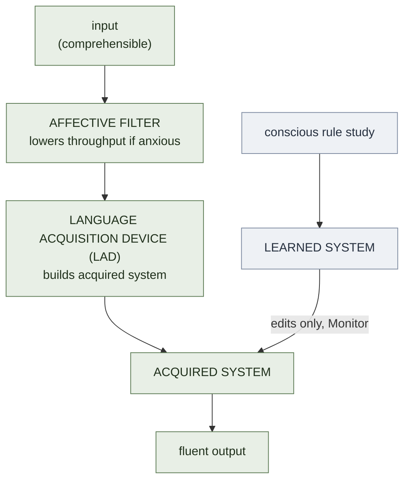

# Krashen's Five SLA Hypotheses

**Summary**: Stephen Krashen's 1980s **Five Hypotheses model** is the dominant cognitive-affective framework in second-language acquisition (SLA). It separates the *unconscious, naturalistic* process of **Acquisition** from the *conscious, rule-based* process of **Learning**, then claims acquisition is the primary engine and consciously-learned grammar serves only as a slow **Monitor** on output. The five hypotheses — Acquisition/Learning Distinction, Natural Order, Monitor, **Input** (the [Comprehensible Input](./comprehensible-input-protocol.md) principle, "i+1"), and **Affective Filter** — collectively claim that the necessary and largely sufficient condition for SLA is *quantities of comprehensible input delivered at moderate emotional stakes*. The model has been heavily critiqued (especially by sociocultural and interactionist schools) but its operational consequences remain the basis of immersion programs, Sheltered Instruction, and most modern self-study language methods including [fluent-forever-wyner](./fluent-forever-wyner.md). This page is the canonical owner.

**Sources**:
- Krashen, S. D. (1981). *Second Language Acquisition and Second Language Learning*. Pergamon.
- Krashen, S. D. (1982). *Principles and Practice in Second Language Acquisition*. Pergamon. (PDF freely available from sdkrashen.com.)
- Krashen, S. D. (1985). *The Input Hypothesis: Issues and Implications*. Longman.
- Krashen, S. D. (2003). *Explorations in Language Acquisition and Use*. Heinemann. — restatement + 20-year retrospective.
- McLaughlin, B. (1987). *Theories of Second-Language Learning*. — the canonical critique.
- Ягодкин Н.А., Згода А.Н. (2023). *Учись учиться*. Эксмо. — the Advance school's accelerated-learning doctrine; source for §Rival account only. Not an SLA-literature work.
- Internal: [comprehensible-input-protocol](./comprehensible-input-protocol.md), [fluent-forever-wyner](./fluent-forever-wyner.md), [language-instinct-pinker](./language-instinct-pinker.md), [language-learning-architecture](./language-learning-architecture.md), [yagodkin-advance-mnemonics](./yagodkin-advance-mnemonics.md).

**Last updated**: 2026-07-16

---

## The five hypotheses

### 1. Acquisition–Learning Distinction

Two independent systems develop second-language competence:

- **Acquisition** — implicit, subconscious, picked up the way children pick up L1. Produces fluent, intuitive production. Driven by exposure to meaningful input.
- **Learning** — explicit, conscious, rule-aware. Produces declarative knowledge ("the past tense adds -ed"). Useful for editing output but not for spontaneous fluency.

The distinction is **not a hierarchy**: learning does not, in Krashen's model, *become* acquisition through practice. They are separate stores. (This non-interface claim is the most-contested part of the model; most modern frameworks allow some learned→acquired transfer.)

### 2. Natural Order Hypothesis

Grammatical structures are acquired in a **predictable order** that is largely **independent of the order taught**. -ing precedes regular past -ed; copula precedes auxiliary; etc. (See Dulay & Burt morpheme-order studies.) Teaching grammar "in order" doesn't speed acquisition past this natural sequence — learners acquire what they're ready to acquire when comprehensible input contains it.

### 3. Monitor Hypothesis

Consciously-learned rules can only **monitor and edit output** — never initiate it. Three conditions for the Monitor to fire: (1) sufficient time, (2) focus on form, (3) knowledge of the rule. Spontaneous speech rarely meets all three; written editing usually does.

Three learner types:
- **Monitor-overuser** — over-applies learned rules; halting, hyper-corrected speech
- **Monitor-underuser** — never edits; fluent but error-prone writing
- **Monitor-optimal user** — uses Monitor for editing but doesn't let it interrupt speech production

### 4. Input Hypothesis ("i+1")

The central operational claim: learners acquire a new structure when they receive **comprehensible input** that is **one step beyond** their current level (`i+1`). Comprehensibility comes from context, simplification, gesture, prior knowledge, and the negotiation of meaning. Production is not required for acquisition — input alone is sufficient. Output emerges naturally once acquired competence supports it.

The Input Hypothesis is the operational core of the [comprehensible-input-protocol](./comprehensible-input-protocol.md) page and the basis of immersion programs, extensive reading methods, and TPR.

### 5. Affective Filter Hypothesis

Acquisition is blocked when the learner is anxious, defensive, or unmotivated. The **affective filter** — a mental block raised by negative emotion — prevents otherwise-comprehensible input from reaching the language-acquisition device. Pedagogically: low-anxiety environments, no forced production, and intrinsic motivation outperform high-stakes drill-and-test contexts.

## Visual

## Operational consequences

If the model is even approximately right, the highest-leverage moves for L2 learners are:

1. **Maximize comprehensible input** at i+1 (graded readers, sheltered instruction, dubbed shows with subtitles, native-speaker conversation with context)
2. **Lower the affective filter** (no forced output until ready, low-stakes practice partners)
3. **Don't over-teach grammar** as the primary engine; teach it as Monitor-feed
4. **Don't sequence the syllabus by perceived difficulty** — natural-order acquisition will route content as it's ready
5. **Make output optional, not mandatory** in early stages

Wyner's [Fluent Forever](./fluent-forever-wyner.md) method is an explicit Krashen-aligned protocol with the additions of [SR](./spaced-repetition.md)-driven vocabulary and the [Phonetic Bridge](./substitute-word-system.md) for cross-language sound-shape mapping.

## Critiques

The model has been productively contested for ~40 years:

- **Non-interface claim** (learning ≠> acquisition) — most modern frameworks allow some transfer (skill-acquisition theory, processing-instruction, etc.)
- **Vagueness of i+1** — "one step beyond" is hard to operationalize at the input-design stage
- **Affective filter as black box** — hard to falsify; what counts as "filter raised"?
- **Output ignored** — Swain's (1985) Output Hypothesis argues production is itself an acquisition driver, not just an outcome
- **Interaction undervalued** — Long's (1996) Interaction Hypothesis: negotiation of meaning during real exchange is a privileged input form, not just a delivery method

Operationally, even the critics agree that **a lot of comprehensible input is necessary**; they disagree about whether it is *sufficient*. The current consensus: necessary, very high-leverage, but supplemented by output and interaction practice once acquired competence supports them.

## Rival account — Yagodkin / Advance

The critiques above are all *internal* to the SLA literature: they grant input as the engine and argue about what else belongs beside it. A newer and sharper rival comes from outside that literature — the Russian accelerated-learning school **Advance** (Nikolay Yagodkin and Alexander Zgoda), which treats a language not as knowledge but as a skill: "four abilities — to speak, to understand, to read and to write," with words and grammar demoted to *building material* for them (source: Ягодкин Н.А., Згода А.Н. - Учись учиться - 2023.pdf).

Advance's own doctrine is owned by [yagodkin-advance-mnemonics](./yagodkin-advance-mnemonics.md), and its intensive loop as this wiki files it is [storm-and-siege-protocol](./storm-and-siege-protocol.md) — go there for the method. This section does exactly one job: state precisely where Advance and Krashen collide.

**This wiki does not adjudicate the conflict.** Krashen remains the owner of the five hypotheses. Advance is recorded here as a rival account — *noted, not resolved*. Neither side is marked wrong below.

### The four contact points

| # | Krashen's position | Advance's position |
|---|---|---|
| **1. Immersion** | Comprehensible input is the necessary and largely sufficient engine; immersion programs are the flagship implementation | Immersion is the first-named myth. Emigrants of decades "either do not speak the foreign language at all, or stopped at a low level easily reached in a few weeks of study"; exchange students with low starting levels show no gain in language, only in gesture (source: Ягодкин Н.А., Згода А.Н. - Учись учиться - 2023.pdf) |
| **2. Passive input** | Production is not required for acquisition; output emerges once acquired competence supports it | Passive perception "creates neural connections, but few, and not as strong as a good skill needs." The inversion is explicit: better to **actively reproduce three times than to passively perceive a hundred times** — three being the minimum for a stable connection (source: Ягодкин Н.А., Згода А.Н. - Учись учиться - 2023.pdf). Deliberate, effortful, isolated, high-tempo production is the *primary* engine, not a Monitor |
| **3. The Monitor** | Consciously-learned rules can only edit output, never initiate it; drill without input caps the learner at Monitor-grade | Drilled, automatized material *becomes* fluent output: having learned a construction, "convert it into an applied skill as fast as possible, rather than keeping it on the spare shelf of an inner library" (source: Ягодкин Н.А., Згода А.Н. - Учись учиться - 2023.pdf). This is a direct denial of the non-interface claim |
| **4. Text difficulty** | Per [comprehensible-input-protocol](./comprehensible-input-protocol.md), above ~98% known words acquisition stalls for want of i+1; 95–98% is the target zone | Scan the text, highlight **every** unknown word, learn all of them first, then read: "your task is to achieve one-hundred-percent understanding of the text at a fast read," and re-read at native-language speed (source: Ягодкин Н.А., Згода А.Н. - Учись учиться - 2023.pdf). Advance wants a text 100% known *before* it is read at all |

Contact point 3 is worth locating rather than treating as exotic. The non-interface claim is already the most-contested part of Krashen's model (see §Critiques above), and most modern frameworks allow some learned→acquired transfer. Advance sits at the far end of a dispute that was already live — it is an extreme position on an open question, not a fringe one on a settled one.

### The honest case on each side

**Advance's edge is real, not a misunderstanding.** Krashen's own Affective Filter Hypothesis predicts that low-anxiety, no-forced-production conditions beat high-stakes drill-and-test. Advance runs close to the opposite — timed, self-graded sprints of 30 seconds to 2 minutes at maximum speed, stopped at the first sign of fatigue — and reports strong results (source: Ягодкин Н.А., Згода А.Н. - Учись учиться - 2023.pdf). Its counter is that intellectual training rewards maximum *speed* rather than maximum effort, and that driving to exhaustion is "unnecessary and even harmful" (source: Ягодкин Н.А., Згода А.Н. - Учись учиться - 2023.pdf) — i.e. that its drill is not the stressful drill Krashen's filter predicts against. If those results hold, the filter prediction is at minimum incomplete. This is an empirical challenge to Krashen on his own turf.

**Krashen's edge is the sourcing asymmetry.** Advance's supporting numbers are in-house and uncited: 100 hours per CEFR level is "more than enough"; 1,000 words is "at most a week of study," and after two weeks of training, 1,000 words in a single day; 100 core irregular verbs into long-term memory across two three-hour evenings — against fewer than 400 words retained from ~1,000 hours of school English (source: Ягодкин Н.А., Згода А.Н. - Учись учиться - 2023.pdf). The throughput figures circulating around the method (roughly 50–100 words/hour, 3–4× faster acquisition, >99% retention) belong to the same family. None of these carry a citation, a control group, or independent replication **(needs verification — Advance-internal)**. Krashen's model, whatever its faults, has a 40-year peer-reviewed literature behind it — including the critics listed above, which is itself the point: it has been exposed to disconfirmation.

**The narrowing observation — the most clarifying thing available here.** Advance's book opens by naming the objection against itself: that "memorizing words is not yet learning a language" (запоминание слов — это ещё не изучение языка). It raises this as an anticipated attack and says its answers are inside the book rather than conceding it outright (source: Ягодкин Н.А., Згода А.Н. - Учись учиться - 2023.pdf) — but its own text then concedes much of the ground anyway: words and grammar are *building material* for the four abilities; "learning words is important at the initial stage, but it does not replace learning grammar"; and "neither reading, nor conversation with native speakers, nor even our beloved mnemonics replace all-round study of the language" (source: Ягодкин Н.А., Згода А.Н. - Учись учиться - 2023.pdf). That narrows the claim considerably. Much of what Advance actually demonstrates is **vocabulary-acquisition throughput** — a component of competence. Krashen's Input Hypothesis is a claim about *whole-language competence*. On the plain reading the two may be measuring different quantities, and the conflict may be narrower than the rhetoric on either side suggests.

**Where Advance sits relative to the consensus.** This page already records the state of play: input is necessary and very high-leverage; the live dispute is whether it is *sufficient*. Advance takes the most aggressive available position on that question — not merely "insufficient" but "inefficient," denying that unstructured high-volume exposure pays even at very high dosage. Note also that [comprehensible-input-protocol](./comprehensible-input-protocol.md)'s own ≥95%-known threshold already concedes the *direction* of Advance's point: pre-known vocabulary is what makes input work at all. The two disagree on how far to push that — to ~95%, or to 100%.

### What would settle it

A controlled comparison of **time-to-CEFR-level between an input-dominant and a drill-dominant protocol**, at matched hours, with **vocabulary throughput measured separately from communicative competence**. The separation is the load-bearing part: without it, Advance's throughput results and Krashen's competence results never touch.

Neither side supplies this. Krashen's literature measures acquisition but rarely against a serious drill-dominant competitor at matched hours; Advance measures throughput in-house and reports level-times without controls **(needs verification — Advance-internal)**. Until such a comparison exists, this wiki records both accounts and picks neither. In the meantime [pattern-drilling](./pattern-drilling.md) and [fluent-forever-wyner](./fluent-forever-wyner.md) occupy the middle ground both sides walk past — but a middle is a hedge, not a verdict, and should not be mistaken for one.

## Failure modes

| Failure | Symptom | Mitigation |
|---|---|---|
| **Input too hard (i+too-far)** | Learner zones out; no acquisition signal | Step down to i+1; use context-rich material |
| **Input too easy (i+0)** | Comprehension feels great; no growth | Step up; introduce structures one ahead |
| **High affective filter** | Anxious learner, plateaued progress | Low-stakes practice; remove forced-production demands |
| **Monitor-overuse** | Halting, self-correcting speech | Practice fluency-first speaking; defer editing |
| **Premature output emphasis** | Stuck in basic phrases | Bias toward input until acquired competence catches up |

## Neural OS implementations

- [comprehensible-input-protocol](./comprehensible-input-protocol.md) — operational form of the Input Hypothesis
- [fluent-forever-wyner](./fluent-forever-wyner.md) — Krashen-aligned SR + phonetic-bridge protocol
- [language-learning-architecture](./language-learning-architecture.md) — wiki's stack-architecture for L2 acquisition
- [language-learning-protocol](./language-learning-protocol.md) — the daily-loop variant
- [language-family-clustering](./language-family-clustering.md) — leverages typological proximity (transfer effects within family)
- [language-instinct-pinker](./language-instinct-pinker.md) — Pinker's nativist framework (overlaps and disagrees in interesting ways)

## Related pages

- [comprehensible-input-protocol](./comprehensible-input-protocol.md)
- [fluent-forever-wyner](./fluent-forever-wyner.md)
- [language-instinct-pinker](./language-instinct-pinker.md)
- [language-learning-architecture](./language-learning-architecture.md)
- [language-learning-protocol](./language-learning-protocol.md)
- [language-family-clustering](./language-family-clustering.md)
- [yagodkin-advance-mnemonics](./yagodkin-advance-mnemonics.md)
- [storm-and-siege-protocol](./storm-and-siege-protocol.md)
- [pattern-drilling](./pattern-drilling.md)
- [active-recall](./active-recall.md)
- [spaced-repetition](./spaced-repetition.md)
- [desirable-difficulties](./desirable-difficulties.md)

---

## U — See (CAST)
1. Input that you understand at i+1 → acquired competence
2. Anxiety raises filter → comprehensible input bounces off

## D — Name (NEDF)
1. Krashen 5 hypotheses = Acq/Learn · Natural Order · Monitor · Input · Affective Filter
2. Distinguisher: acquisition (implicit) ≠ learning (explicit, Monitor-only)
3. Failure mode: over-teaching grammar instead of supplying input

## F — Do (SPEAR)
1. Find content at i+1 → consume in volume → keep filter low
2. Edit written output via Monitor; speak without it

## B — Watch (HEART)
1. Anxiety mid-conversation → filter rising
2. Self-correction loop on speech → Monitor overuse

## L — Predict (ORACLE)
1. High-volume i+1 input + low filter → acquisition rate climbs
2. Heavy grammar drill without input → ceiling at Monitor-grade — *Krashen's own prediction; contested, see §Rival account — Yagodkin / Advance*

## R — Act (GRACE)
1. Plateau → audit: input volume? i+1 difficulty? affective filter?
2. Embarrassed to speak → switch to listening/reading bias until ready
