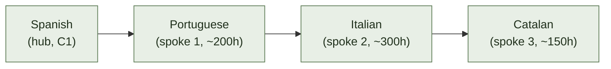
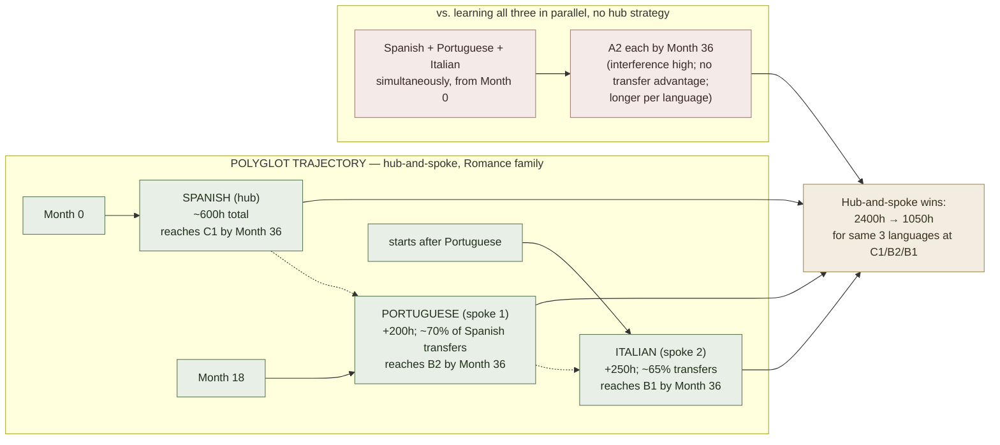

# Language Family Clustering

**Summary**: Language family clustering is the **strategic grouping of target languages by genetic relatedness and typological similarity** to plan an efficient polyglot learning trajectory. The core insight is that transfer — phonological, morphological, syntactic, and lexical — is **proportional to relatedness**, so learning within a family dramatically reduces the marginal cost of each additional language. A learner who acquires Spanish (Romance) can reach Italian functional fluency in ~30% of the time it took for Spanish; a learner who adds Portuguese gets it in ~15%. The **Foreign Service Institute (FSI) categories** (I–IV, 600–2200 hours to professional proficiency) are the canonical difficulty-by-distance estimate from English. Clustering-aware sequencing is a load-distribution optimization on any polyglot roadmap. This page is the canonical owner.

**Sources**:
- US Foreign Service Institute (FSI). *Language Learning Difficulty for English Speakers* (updated periodically). — the 4-category classification.
- Graddol, D. (1997/2006). *The Future of English* / *English Next*. British Council. — language-dominance landscape.
- Kachru, B. (1985). "Standards, Codification and Sociolinguistic Realism." In Quirk & Widdowson (eds.), *English in the World*. — World Englishes framework.
- Comrie, B. (1989). *Language Universals and Linguistic Typology* (2nd ed.). Blackwell. — typological families.
- de Bot, K., Lowie, W., & Verspoor, M. (2005). *Second Language Acquisition: An Advanced Resource Book*. Routledge. — L1/L2/L3 transfer.
- Internal: [krashen-sla-hypotheses](./krashen-sla-hypotheses.md), [deliberate-practice](./deliberate-practice.md), [spaced-repetition](./spaced-repetition.md), [fluent-forever-wyner](./fluent-forever-wyner.md), [language-instinct-pinker](./language-instinct-pinker.md).

**Last updated**: 2026-06-10

---

## The FSI difficulty categories

The FSI estimates hours-to-professional-proficiency for a native English speaker:

| Category | Hours | Language families included (examples) |
|---|---|---|
| **I — Closely related** | ~600 | Romance (Spanish, French, Italian, Portuguese, Romanian), Germanic (Dutch, Norwegian, Swedish, Afrikaans) |
| **II — Similar** | ~750 | German, Malay/Indonesian, Swahili |
| **III — Moderate difference** | ~900 | Hindi, Russian, Greek, Thai, Tagalog |
| **IV — Hardest** | ~2200 | Arabic, Mandarin, Japanese, Korean, Cantonese |

Important caveats:
- These are averages for intensive classroom study (25h/week), not casual learning
- Individual variance is large — motivation, prior language experience, substrate, and methodology matter more than category for any single learner
- The FSI categories are based on typological distance, not every relevant factor (writing system distance adds cost for Mandarin/Arabic/Korean/Japanese beyond what morphosyntax alone explains)

## Major language families and their productive clusters

| Family | Subgroup | Key languages | Transfer hub |
|---|---|---|---|
| **Indo-European** | Romance | Spanish, Portuguese, Italian, French, Catalan, Romanian | Spanish or French as hub |
| | Germanic | English, German, Dutch, Norwegian, Swedish, Danish, Afrikaans | Already in English; add Dutch for NW hub |
| | Slavic | Russian, Polish, Czech, Bulgarian, Ukrainian, Serbian/Croatian | Russian as hub |
| | Iranian | Persian (Farsi/Dari), Kurdish, Pashto | Farsi as hub |
| | Indic | Hindi-Urdu, Bengali, Punjabi, Marathi, Gujarati | Hindi-Urdu as hub |
| **Sino-Tibetan** | Sinitic | Mandarin, Cantonese, Wu (Shanghainese), Min (Hokkien) | Mandarin as hub (reading transfers) |
| | Tibeto-Burman | Tibetan, Burmese | — |
| **Afro-Asiatic** | Semitic | Arabic (MSA + dialects), Hebrew, Amharic | MSA Arabic as hub; abjad writing transfers |
| | Berber | Tamazight | — |
| **Turkic** | | Turkish, Azerbaijani, Uzbek, Kazakh, Uyghur | Turkish as hub (agglutinative morphology transfers) |
| **Japonic + Koreanic** | | Japanese, Korean | Each is a family of 1 (no close relatives) |
| **Niger-Congo** | Bantu | Swahili, Zulu, Xhosa, Yoruba | Swahili as East-Africa hub (agglutinative structure transfers within Bantu) |
| **Austronesian** | Malayo-Polynesian | Malay, Indonesian, Filipino/Tagalog, Hawaiian | Malay/Indonesian as hub |

## Transfer mechanics

Within a family, a learner transfers:

1. **Phonological inventory** — similar consonant/vowel sets require less articulatory retraining (Spanish → Italian: near-identical inventory)
2. **Morphological paradigms** — verb conjugation patterns, case endings, gender agreement (Spanish → Italian: same Romance conjugation spine)
3. **Syntactic defaults** — SOV vs. SVO vs. VSO; pro-drop; null-subject (Spanish → Italian: both null-subject SVO)
4. **Lexical cognates** — shared root vocabulary (Spanish *ciudad* ↔ Italian *città*, French *cité*, Portuguese *cidade*)
5. **Pragmatic/discourse norms** — politeness systems, indirectness conventions (overlaps within cultures, not just language families)

Transfer is not always positive — **false cognates** ("false friends") are the systematic negative transfer within families: Spanish *embarazada* (pregnant) ≠ English *embarrassed*; Italian *confetti* ≠ English *confetti* (in Italian, it's sugared almonds). This page owns the concept as a strategic risk; [vocabulary-word-type-routing](./vocabulary-word-type-routing.md) owns the encoding technique for memorizing false friends once spotted (guess-then-reveal pretest → contrast → encode keyed to the false-translation image).

## Sequencing strategies for a polyglot roadmap

### Hub-and-spoke

Learn a **hub language** (highest-reach language in the family) first, then add spokes (related languages that maximize transfer):

Total hours if sequenced well: ~900h for 4 Romance languages. If attempted without Spanish first: ~600h × 4 = 2400h.

### Cross-family scheduling

Interleave families to avoid interference:
- **Active family 1**: Romance (Spanish, Italian concurrent at different levels)
- **Passive family 2**: Germanic (Swedish, reading-mode only)
- **On-deck family 3**: Slavic (Russian — just phonology + script, no active grammar yet)

The reason: within-family interference peaks when both languages are near the same level; cross-family interference is minimal (the systems don't compete).

### Writing system priority

For Category IV languages with non-Latin scripts, **script acquisition is a prerequisite**, not an overlay:
- Arabic: MSA Arabic requires abjad fluency before phonology can be trained at speed
- Mandarin: spoken Mandarin can proceed independently, but reading requires radical recognition (~2000 characters for functional literacy) — dedicate 3–6 months to character acquisition before listening/speaking dominates
- Japanese: two syllabaries (hiragana + katakana: ~2 weeks each) + kanji (~1000 for daily use, 2000 for newspaper literacy)

## Visual

## Failure modes

| Failure | What it produces |
|---|---|
| **Cross-family simultaneous start** | No transfer advantage; similar-script languages don't interfere but similar-sounding languages do |
| **Hub skipped** | Learning Italian first, then Spanish — transfer works both directions, but the FSI easiest + most-spoken language first maximizes downstream payoff |
| **Neglecting script** | Starting Mandarin speaking-only; plateau when reading becomes mandatory |
| **False cognate blind spot** | Over-trusting inter-family vocabulary resemblance without checking false friends |
| **FSI hours as individual target** | FSI figures are group averages for specific conditions; high-motivation, method-optimized learners often halve the estimate |

## Related pages

- [krashen-sla-hypotheses](./krashen-sla-hypotheses.md) — acquisition conditions that apply within any family
- [language-instinct-pinker](./language-instinct-pinker.md) — the UG substrate that makes transfer possible
- [deliberate-practice](./deliberate-practice.md) — structuring the drill within a language
- [fluent-forever-wyner](./fluent-forever-wyner.md) — pronunciation-first methodology applies differently by family (Romance phonology vs. tonal languages)
- [spaced-repetition](./spaced-repetition.md) — vocabulary encoding; cross-family vocab requires more reps than cognate pairs
- [comprehensible-input-protocol](./comprehensible-input-protocol.md) — the acquisition engine works at the same i+1 level regardless of family distance
- [interleaving](./interleaving.md) — within-family language interleaving strategy
- [vocabulary-word-type-routing](./vocabulary-word-type-routing.md) — owns the false-friend encoding technique (this page owns the concept and the strategic risk)

---

## U — See (CAST)
1. Transfer ∝ family relatedness → sequence within families first
2. FSI categories: I (600h) → IV (2200h) from English; hub language halves spoke costs

## D — Name (NEDF)
1. Language family clustering = grouping target languages by genetic/typological relatedness to exploit transfer
2. Distinguisher: hub-and-spoke (sequential within family) vs. parallel (no transfer)
3. Failure mode: skipping hub; cross-family simultaneous start without interference management

## F — Do (SPEAR)
1. Map target languages to FSI category + family → pick hub per family → sequence spokes after hub reaches B2
2. For Category IV: script acquisition before speaking ramp-up

## B — Watch (HEART)
1. Same-family simultaneous at equal levels → interference peaks → stagger levels
2. Cognate confidence → check false-friend list per language pair

## L — Predict (ORACLE)
1. Spanish C1 → Italian B2 reachable in ~250h (vs ~600h cold)
2. No hub strategy → same hours per language regardless of family

## R — Act (GRACE)
1. New polyglot roadmap → identify families → pick hubs → schedule spokes after hub B2
2. Stalled in second language in same family → check interference from first; introduce level gap
