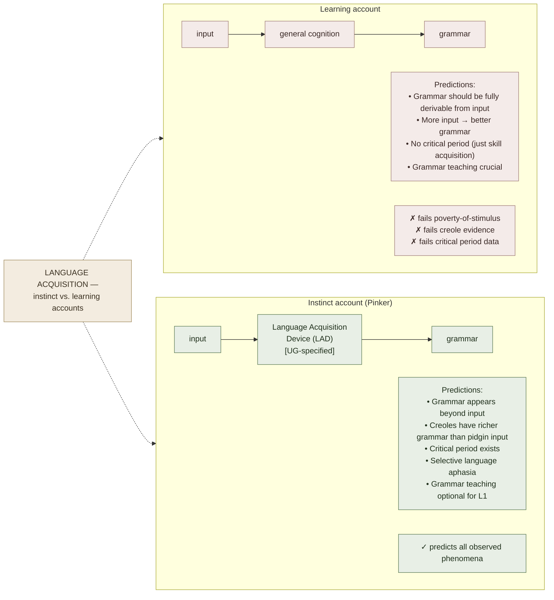

# *The Language Instinct* — Pinker

**Summary**: Steven Pinker's *The Language Instinct* (1994) argues that **language is a biological instinct** — a specialized, species-unique faculty that evolved by natural selection, not a cultural artifact or general cognitive skill. The book integrates Chomsky's Universal Grammar (UG) hypothesis with Darwinian evolutionary theory (which Chomsky resisted) and synthesizes findings from creole formation, sign languages, language acquisition, and neurolinguistics. The core thesis: human infants don't learn language the way they learn arithmetic or chess — they grow it, because the structural scaffold (UG) is innate. The pedagogical relevance is **two-directional**: (1) understanding what is innate clarifies what *doesn't* need to be explicitly taught (grammar rules that all native speakers "know" without instruction), and (2) the instinct only grows in an adequate input environment — [Krashen's i+1](./krashen-sla-hypotheses.md) is the operationalization of what "adequate input" means. This page is the canonical owner.

**Sources**:
- Pinker, S. (1994). *The Language Instinct: How the Mind Creates Language*. William Morrow. — primary source.
- Chomsky, N. (1965). *Aspects of the Theory of Syntax*. MIT Press. — UG substrate.
- Bickerton, D. (1981). *Roots of Language*. Karoma. — creole formation supporting UG.
- Newport, E. L. (1990). "Maturational Constraints on Language Learning." *Cognitive Science*, 14(1), 11-28. — critical period.
- Lenneberg, E. H. (1967). *Biological Foundations of Language*. Wiley. — biological framing.
- Pinker, S., & Jackendoff, R. (2005). "The faculty of language: What's special about it?" *Cognition*, 95(2), 201-236. — debate with Hauser-Chomsky-Fitch.
- Internal: [krashen-sla-hypotheses](./krashen-sla-hypotheses.md), [language-family-clustering](./language-family-clustering.md), [comprehensible-input-protocol](./comprehensible-input-protocol.md), [fluent-forever-wyner](./fluent-forever-wyner.md).

**Last updated**: 2026-06-10

---

## The central thesis

Language is **not** a cultural invention like writing or mathematics. It is a **biological system** that:
1. Emerges universally in all human populations under normal conditions
2. Cannot be effectively suppressed (children in language-poor environments create their own: Nicaraguan Sign Language, 1980s)
3. Follows species-unique patterns (syntax, recursion, displacement — talking about things absent in time and space) not found in any other species' natural communication
4. Has a critical period of rapid acquisition (birth to ~puberty) during which input triggers growth, after which acquisition becomes effortful and accent is rarely native-grade
5. Shows selective breakdown in aphasia (language-selective brain damage without general cognitive damage) — pointing to dedicated neural architecture

Pinker's evolutionary claim (extending beyond Chomsky, who was agnostic about evolution): UG evolved by natural selection, because it confers communicative fitness advantages that compound over generations.

## Universal Grammar (UG) — what it claims

Chomsky's UG hypothesis: all human languages share a deep structural scaffold that is genetically specified. Evidence:
- **Poverty of the stimulus**: children produce grammatically correct utterances and apply rules they have never been explicitly taught and could not have inferred from their input (the undergeneralization/overgeneralization pattern shows internal rule-generation, not pure imitation)
- **Logical problem of language acquisition**: the input is too ambiguous and too sparse to fully specify the grammar; something constrains the hypothesis space — that something is innate
- **Cross-linguistic universals**: all languages have noun phrases, verb phrases, recursion (sentences-within-sentences), displacement (past/future tense), and a small set of morphological options — not an infinite design space

UG does **not** specify which language a child learns — it specifies the range of possible grammars any human language can instantiate. The child's input selects among those options.

## What UG means for language learning

| Implication | Consequence for learner |
|---|---|
| Grammar rules that are UG-specified don't need explicit teaching | Focus explicit instruction on *parameters* (what varies: word order, case marking, pro-drop, topic-comment vs. subject-comment) rather than UG constants |
| The instinct requires adequate input | Comprehensible input ([i+1](./krashen-sla-hypotheses.md)) is not optional; without it, the acquisition device cannot be triggered |
| Critical period is real | An adult L2 learner uses explicit rule-learning as a compensatory strategy; the outcome (especially accent) is systematically different, not because of laziness but because the acquisition mechanism is past its peak |
| L1 is deeply entrenched | Positive transfer within family ([language-family-clustering](./language-family-clustering.md)); negative transfer (interference) is real and requires explicit attention to divergence points |
| Children don't need grammar instruction for L1 | Forced metalinguistic instruction before age ~7 is premature; comprehensible input + use is sufficient |

## Creoles as UG evidence

Pidgins — contact languages with no native speakers, stripped of complex grammar — **when they acquire native speakers (children), they reliably develop into creoles with full UG-compliant grammar**. The children introduce the grammar the input doesn't contain. This is Bickerton's finding and one of Pinker's strongest empirical arguments: the grammar came from the children's brains, not from the input, because the input (pidgin) didn't have it.

Nicaraguan Sign Language is the modern case: deaf children in the 1980s, placed together in new schools with no established sign language, created a fully grammatical sign language *within one generation* — and the grammar has grown more complex with each cohort, as younger children joined and regularized what older signers had established.

## The critical period

Lenneberg (1967) first described it; Newport (1990) quantified it for L2. Results:
- L1 acquisition initiated before age 7: near-universal native outcome
- L2 acquisition initiated before puberty: native-grade accent and morphology possible but not guaranteed
- L2 acquisition initiated after puberty: explicit rule-learning compensates; accent is systematically accented; morphological accuracy is lower and slower to stabilize

The critical period is **not a cliff** — it is a gradient, with the steepest slope roughly in the 7-14 age window. Adult L2 acquisition works; it just runs on different (and less efficient) machinery.

## Pinker vs. Chomsky on evolution

Chomsky argued language evolved as a by-product of general intelligence (spandrel), not as a direct adaptation. Pinker (with Bloom 1990, Jackendoff 2005) argued it is a direct adaptation shaped by natural selection for communication. The debate is unresolved but the stakes are pedagogical: if Pinker is right, language acquisition devices are biological systems with input-requirements and developmental windows; if Chomsky's spandrel view is right, the acquisition constraints are more flexible.

Pinker's view is more consistent with the **critical period data** and **creole evidence**.

## Visual

## Failure modes (and misreadings)

| Failure | What it misses |
|---|---|
| **"Instinct means effortless"** | The instinct triggers easily for L1 in a rich input environment; L2 after the critical period requires deliberate effort even with the instinct active at reduced capacity |
| **"UG explains everything"** | UG constrains the hypothesis space; it doesn't specify vocabulary, pragmatics, discourse conventions, accent, or fluency — all of which require input and practice |
| **"Critical period is a wall"** | It is a gradient; adult acquisition is slower and accent is harder to neutralize, but full functional mastery (including near-native grammar) is achievable |
| **"Pinker disproves the need for input"** | The opposite: the instinct *requires* input to be triggered; the acquisition device needs the input feed |
| **"Grammar rules should not be taught"** | For L2, explicit grammar instruction at the right level (parameters, not UG constants) speeds up the final accuracy stage — especially for morphology |

## Related pages

- [krashen-sla-hypotheses](./krashen-sla-hypotheses.md) — input hypothesis: the operational complement to UG
- [language-family-clustering](./language-family-clustering.md) — transfer explained by shared UG parameter settings
- [comprehensible-input-protocol](./comprehensible-input-protocol.md) — practical delivery of i+1 input
- [fluent-forever-wyner](./fluent-forever-wyner.md) — pronunciation-first respects the critical period's phonological window
- [learning-styles-myth](./learning-styles-myth.md) — related claim about innate-vs-learned distinctions
- chomsky-linguistics — if the page exists; Pinker extends this
- [growth-mindset](./growth-mindset.md) — adult L2 acquisition is a domain where "it's never too late" is partially true and the constraint is biological, not motivational

---

## U — See (CAST)
1. Language = biological instinct (not learned skill); UG constrains the grammar search space
2. Critical period: before puberty, acquisition machinery at peak; after, explicit learning compensates

## D — Name (NEDF)
1. UG = genetically-specified structural scaffold shared by all human languages
2. Distinguisher: instinct grows from input (not taught); UG provides scaffold, input selects parameters
3. Failure mode: "instinct = effortless for adults" — misreads the critical period

## F — Do (SPEAR)
1. L1 teaching: maximise comprehensible input; avoid early metalinguistic overload
2. L2 teaching: respect parameter differences; explicit instruction on divergence points (not UG universals)

## B — Watch (HEART)
1. Post-critical-period L2 learner struggling with accent → biological, not motivational bottleneck
2. Grammar rules that learners "just know" without instruction → those are UG-specified; don't drill them

## L — Predict (ORACLE)
1. Rich input environment before puberty → near-native outcome
2. Post-puberty immersion → grammar closes in; accent rarely neutralizes fully

## R — Act (GRACE)
1. Designing language curriculum → focus explicit instruction on cross-linguistic parameter differences
2. Adult L2 learner plateau → check: is the bottleneck accent (biological limit) or grammar/vocab (still acquirable)?
