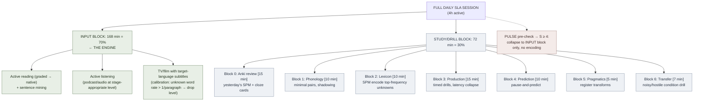

# Language Learning Protocol

**Summary**: An operational protocol for applying the [language-learning-architecture](./language-learning-architecture.md) in practice. It defines daily and weekly drill loops, metrics, review cadence, and progression rules for building phonology, automaticity, prediction, pragmatics, and robust real-world transfer.

**Sources**:
- raw/06 Buffer/language_learning.md
- language-learning-architecture.md
- FRAMEWORK_OVERVIEW.md
- 03_NEDF_TEMPLATE.md
- 05_SPEAR_TEMPLATE.md
- CAST and Georgian Node System.md
- universal-mental-tagging-framework.md
- wiki/learning-systems/comprehensible-input-protocol.md (input layer, 70/30 split)
- wiki/learning-systems/krashen-sla-hypotheses.md (acquisition theory)
- wiki/learning-systems/fluent-forever-wyner.md (frequency governance, Anki)

**Last updated**: 2026-08-20 (`glyph:` assigned — [representation-rules](./representation-rules.md) Rule 11); 2026-06-22

---

## Purpose

This page operationalizes the architecture in [language-learning-architecture](./language-learning-architecture.md). The architecture says what layers are needed. This protocol says what to do repeatedly so those layers actually develop. It is a synthesis workflow derived from the current framework family plus the new language-learning source. (source: raw/06 Buffer/language_learning.md; language-learning-architecture.md)

## Core Principle

Do not optimize only for retention.

Optimize for:

- perception
- speed
- prediction
- social fit
- robustness under pressure

The protocol exists because language fluency depends on loops that are underweighted by a memory-first system. (source: raw/06 Buffer/language_learning.md)

## Load-bearing update (2026-05-29): Acquisition layer added

The six daily blocks below are the *study and production* side of the protocol. The 2026-05-29 ingest reveals that a **comprehensible input block** must be the dominant daily block, not a supplement. Per [Krashen's Input Hypothesis](./krashen-sla-hypotheses.md):

- Acquisition (the mechanism that produces automatic fluent output) runs on **comprehensible input at i+1**, not on drill
- The correct time split is **70% input consumption / 30% explicit study** — not the inverse
- The [comprehensible-input-protocol](./comprehensible-input-protocol.md) defines exactly what counts as i+1 input, how to select content by stage, and how to run the sentence mining loop

**Vocabulary encoding governance** ([Wyner](./fluent-forever-wyner.md)): Before deep NEDF encoding, apply the frequency filter: is this word in the top 5,000 frequency list for the target language? If not, skip SPM encoding and acquire it through input exposure alone. Encoding low-frequency words before the high-frequency base is established is the most common over-encoding mistake.

**Block 0 addition (prepend to daily protocol)**: 168 minutes of [comprehensible input](./comprehensible-input-protocol.md) (reading + listening at 95% known-word rate). The six blocks below run in the remaining 30% of session time.

---

## The Five Active Loops

Every serious language cycle should include these loops:

1. **Phonology loop** — hear distinctions accurately
2. **Production loop** — say forms quickly and correctly
3. **Prediction loop** — anticipate before full input arrives
4. **Pragmatics loop** — choose socially appropriate forms
5. **Transfer loop** — perform under imperfect conditions

If one loop is missing, progress becomes lopsided. (source: raw/06 Buffer/language_learning.md)

## Daily Protocol

### Block 1: Phonology

Duration:

- 10-15 minutes

Tasks:

- minimal pair drill
- phoneme confusion review
- shadowing one short audio clip
- stress and intonation mimicry

Framework mapping:

- `CAST` for confusion maps
- `UMTF` for auditory and prosodic tags
- `SPEAR` for shadowing routine

Output:

- 3-10 pairs drilled
- 1 short clip shadowed multiple times
- 1 prosody pattern noticed and tagged

### Block 2: Lexicon and Concepts

Duration:

- 10-20 minutes

Tasks:

- encode or review high-value vocabulary
- build contrastive pairs
- encode one grammar concept if needed

Framework mapping:

- `NEDF` for meanings and distinctions
- `UMTF` for collision-breaking sensory/state cues

Output:

- 5-15 high-value items reviewed
- 1-3 items deeply encoded if still unstable

**Rival scheduling account for this block's cadence**: Advance's [storm-and-siege-protocol](./storm-and-siege-protocol.md) proposes a two-regime alternative for vocabulary volume specifically — a small daily norm (Осада/Siege, ~10–30 words/10 min, this block's shape) paired with occasional single-session volume pushes (Штурм/Storm). Noted as a rival cadence for the vocabulary layer, not adopted here — this protocol keeps its steady per-block norm.

### Block 3: Production and Automaticity

Duration:

- 10-20 minutes

Tasks:

- timed sentence generation
- constrained speaking drill
- short-response drill with low latency target
- repair drill after deliberate disruption

Framework mapping:

- `SPEAR` for executable response routines

Output:

- one constrained drill completed
- latency observed
- common hesitation pattern identified

### Block 4: Prediction

Duration:

- 5-15 minutes

Tasks:

- pause audio and predict next phrase
- hide subtitle and predict line ending
- complete sentence stems
- predict dialogue continuation

Framework mapping:

- `SPEAR` for procedure
- `CAST` for expectation structures

Output:

- 10-20 predictions attempted
- misses classified: vocabulary, grammar, pragmatics, speed

### Block 5: Pragmatics

Duration:

- 5-10 minutes

Tasks:

- transform direct -> softened -> indirect
- practice apology, disagreement, hesitation, request, and politeness variants
- compare literal meaning vs social meaning

Framework mapping:

- `CAST` for transform chains
- `UMTF` for salience and tone cues

Output:

- 1 speech act family practiced per session

### Block 6: Transfer

Duration:

- 5-15 minutes

Tasks:

- noisy listening
- speaking while walking
- interruption recovery
- partial-comprehension repair
- rapid turn-taking

Framework mapping:

- `SPEAR` for hostile-condition routines
- `UMTF` for state and priority cues

Output:

- at least 1 adverse-condition repetition per day

## Weekly Protocol

### 1. Build or Update One Confusion Map

Example:

- `r/l`
- vowel length
- stress placement
- common function-word collapse

Store it as a small `CAST` graph:

`sound -> common confusion -> corrective cue`

### 2. Add One Pattern Library Entry

Possible entries:

- sentence archetype
- discourse pattern
- politeness transform
- common repair routine
- conversation opener/closer

This is how explicit knowledge gradually becomes reusable intuition. (source: raw/06 Buffer/language_learning.md)

### 3. Run One Deep Shadowing Session

Duration:

- 20-30 minutes

Focus:

- timing
- breathing
- rhythm
- articulation delay collapse

### 4. Run One Real-World Stress Session

Choose one:

- noisy café audio
- live conversation
- fast native clip
- walking while listening
- time-boxed speaking

### 5. Review Metrics and Retire Noise

At the end of the week:

- inspect what improved
- identify what is still collapsing
- remove low-value items from active focus

This is the governance loop. (source: raw/06 Buffer/language_learning.md)

## Metrics

Track only metrics that change behavior.

### Core Metrics

| Metric | Meaning | Target direction |
|---|---|---|
| phoneme discrimination accuracy | do you hear contrasts correctly | rising |
| shadowing delay | time between hearing and repeating | collapsing |
| production latency | time to produce target structure | collapsing |
| hesitation frequency | filler / stalls per response | decreasing |
| repair latency | time to recover from mistake | collapsing |
| prediction accuracy | correct completions before reveal | rising |
| pragmatic appropriateness | how natural the social choice is | rising |
| noise robustness | performance under bad conditions | rising |

### Suggested Thresholds

These are operational heuristics, not strict scientific thresholds.

- translation latency: move toward `<500ms` for drilled patterns
- shadowing delay: move toward near-immediate repetition
- hesitation: fewer obvious stalls in constrained drills
- repair: recover inside one clause when possible

These thresholds come from the spirit of the source rather than from formal measured norms. (source: raw/06 Buffer/language_learning.md)

## Review Cadence

### Daily

- quick drill log
- identify one weak loop
- decide next session emphasis

### Weekly

- review metrics
- review confusion map
- review pragmatic transforms
- prune low-value items
- promote stable patterns from explicit drill to lighter maintenance

### Monthly

- audit architecture balance
- ask which loop is undertrained
- change emphasis if one layer lags badly

## Drill Templates

### Minimal Pair Drill

1. hear pair
2. identify contrast
3. repeat both
4. exaggerate distinction
5. test again later in random order

### Shadowing Drill

1. hear line
2. repeat immediately
3. mimic rhythm exactly
4. reduce articulation delay
5. repeat until timing tightens

### Constraint Drill

1. choose one grammar or discourse constraint
2. respond under 3-second limit
3. forbid native-language fallback
4. note hesitation and repair

### Prediction Drill

1. pause input before completion
2. predict next word or phrase
3. reveal actual continuation
4. classify error source

### Pragmatic Transform Drill

1. start with literal direct form
2. produce softened form
3. produce indirect form
4. note tone difference

### Noise Transfer Drill

1. introduce noise or movement
2. attempt comprehension or production
3. recover from partial loss
4. keep going without resetting

For a full zero-to-hero production progression with pass rules, weekly review, and failure-mode routing, use [language-production-drill-ladder](./language-production-drill-ladder.md).

## Progression Rules

Move material from heavy encoding to lighter maintenance when:

- you can recognize it instantly
- you can produce it with low delay
- you can use it under pressure
- you can recover after disruption

Keep material in heavy focus when:

- perception still collapses
- latency remains high
- you overtranslate through the native language
- the social usage still sounds robotic

## Governance Rules

Before deep encoding, ask:

- Is this high-frequency?
- Is this reusable?
- Is this foundational?
- Is this difficult to reconstruct?
- Is this worth the mnemonic cost?

If not, do not build a large encoding structure for it. This rule is critical for avoiding language-learning bloat in a system that is already strong at memory engineering. (source: raw/06 Buffer/language_learning.md; universal-mental-tagging-framework.md)

## Minimum Viable Protocol

If time is limited, the smallest useful daily version is:

1. 10 min phonology
2. 10 min production
3. 5 min prediction
4. 5 min pragmatics
5. 5 min noisy transfer

This is better than doing only concept review because it trains the missing loops directly. (source: raw/06 Buffer/language_learning.md)

## Related Pages

- [language-learning-protocol-english](./language-learning-protocol-english.md)
- [language-production-drill-ladder](./language-production-drill-ladder.md)
- [pattern-drilling](./pattern-drilling.md)
- [language-learning-architecture](./language-learning-architecture.md)
- [comprehensible-input-protocol](./comprehensible-input-protocol.md)
- [polyglot-architecture](./polyglot-architecture.md)
- [krashen-sla-hypotheses](./krashen-sla-hypotheses.md)
- [fluent-forever-wyner](./fluent-forever-wyner.md)
- [substitute-word-system](./substitute-word-system.md)
- [framework-comparison-matrix](./framework-comparison-matrix.md)
- [storm-and-siege-protocol](./storm-and-siege-protocol.md) — rival vocabulary-scheduling cadence (Storm/Siege), noted not adopted
- [software-design-principles-for-neural-os](./software-design-principles-for-neural-os.md)
- [UMTF](./universal-mental-tagging-framework.md)
- [NEDF](./nedf-overview.md)
- [CAST System](./cast-overview.md)
- [SPEAR](./spear-overview.md)
- [pulse-overview](./pulse-overview.md)
- [bdnf-and-neurogenesis](./bdnf-and-neurogenesis.md)
- [spaced-repetition](./spaced-repetition.md)

---

## U — See (CAST)
1. Daily/weekly drill loops for applying language architecture
2. Metrics, review cadence, progression rules

## D — Name (NEDF)
1. Language learning protocol = operational daily protocol
2. Distinguisher: explicit metrics + cadence
3. Failure mode: drilling without metrics

## F — Do (SPEAR)
1. Daily → run protocol's drill loop
2. Weekly → progression check

## B — Watch (HEART)
1. Drill drift from architecture
2. Skipping metrics

## L — Predict (ORACLE)
1. Cadence + metrics → predict progression
2. Stage → predict next milestone

## R — Act (GRACE)
1. Daily start → run protocol
2. Metric drop → adjust drill mix

## Mnemonic

**INPUT·PPP·PT** — the loop order in one sequence:

- **INPUT** (comprehensible input — 70% of session; the engine, not the supplement)
- **P**honology (Block 1: minimal pairs, shadowing)
- **P**roduction (Block 3: timed drills, latency collapse)
- **P**rediction (Block 4: pause-and-predict)
- **P**ragmatics (Block 5: social-register transforms)
- **T**ransfer (Block 6: noisy and hostile conditions)

Phrase: *"Input Powers Practical Proficiency — Practice Transfers."*

Block 2 (Lexicon/Concepts) runs inside the INPUT block via sentence mining; it is not a standalone drill anymore — frequency-filtered, image-only, SPM-encoded.

## Checksum

1. What is the correct time split between comprehensible input and explicit study in a full SLA session, and what happens if you invert it (drill-heavy, input-light)?
2. You finish the phonology block (Block 1). What is the METER pass-floor before advancing to lexicon encoding — and which single metric collapses if you skip phonology entirely?
3. Name the three production-loop metrics and their target direction (rising/collapsing). Which one is the most sensitive early signal that the Monitor is over-engaged?

## Visual

