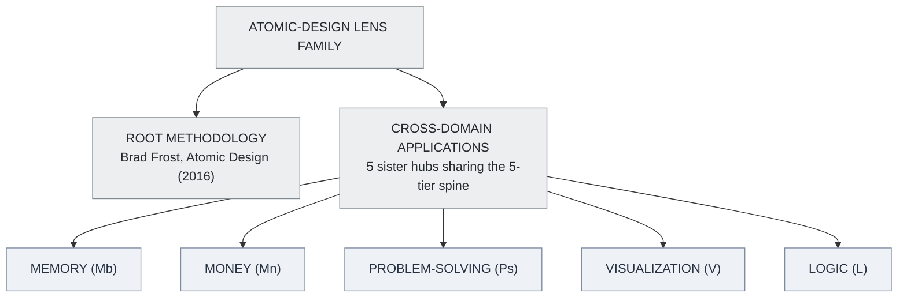
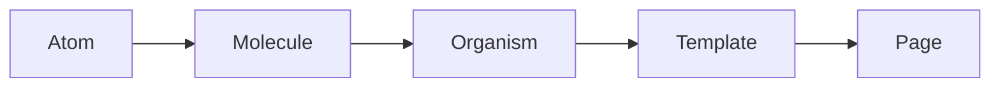
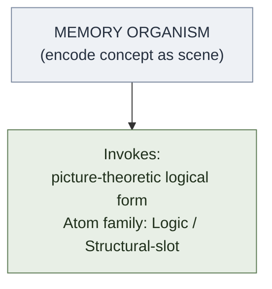
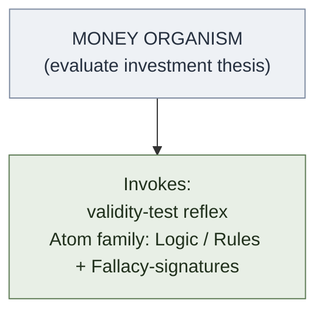
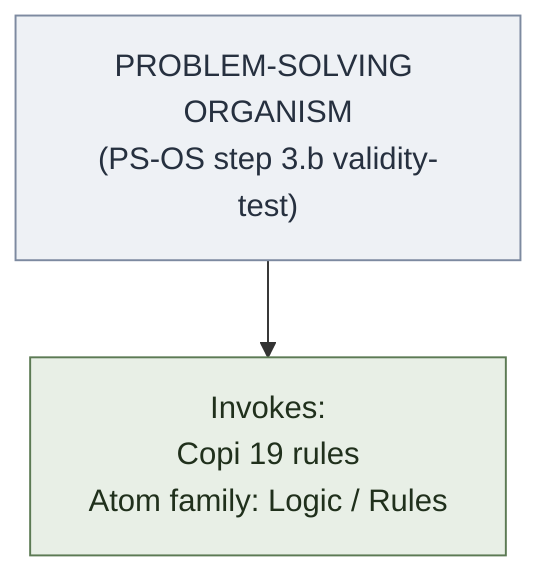
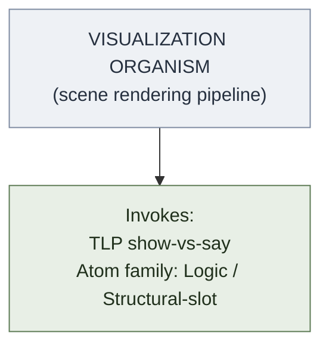
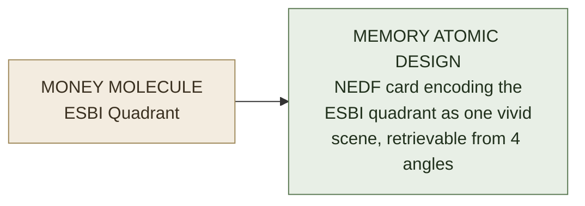
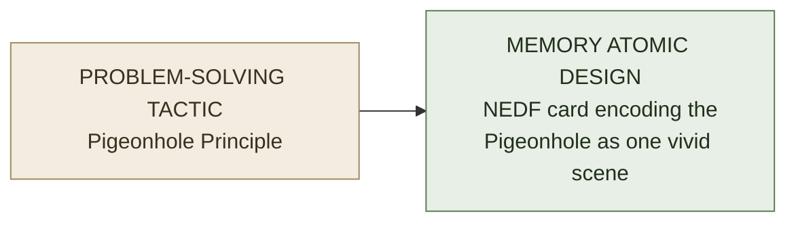

# Logic Among the Atomic-Design Domains

**Summary**: A **cross-domain synthesis page** comparing all 5 [atomic-design lens](./problem-solving-atomic-design.md) applications: [memory](./memory-atomic-design.md) · [money](./money-atomic-design.md) · [problem-solving](./problem-solving-atomic-design.md) · [visualization](./visualization-atomic-design.md) · [logic](./logic-atomic-design.md). **Where the 5 sister hubs structurally agree, where they differ, and where the cross-references compose into deeper unlocks.** Logic is the *substrate domain* on which the others depend: every memory operation invokes argument-anatomy atoms; every money decision invokes validity-test reflexes; every problem-solving organism uses Mill's-methods atoms; every visualization decision exemplifies show-vs-say at the visual layer. **This page is the synthesis the Wave 1 logic-hub claim made possible.**

**Sources**:
- [memory-atomic-design](./memory-atomic-design.md) (memory layer)
- [money-atomic-design](./money-atomic-design.md) (money layer)
- [problem-solving-atomic-design](./problem-solving-atomic-design.md) (problem-solving layer)
- [visualization-atomic-design](./visualization-atomic-design.md) (visualization layer)
- [logic-atomic-design](./logic-atomic-design.md) (logic layer)
- Brad Frost, *Atomic Design* (2016) — the original methodology
- [composability-index](./composability-index.md) — for the cross-domain META-pattern observations

**Last updated**: 2026-05-25

---

## One-line

> 5 hubs · 5 domains · 1 spine (Atoms · Molecules · Organisms · Templates · Pages) · 4 atom-family color conventions consistent across all hubs · **logic is the substrate** the other 4 invoke whether they name it or not.

## Unlocks (lead, not footer)

1. **Logic as the substrate domain.** Every other atomic-design hub *invokes logic atoms* whether it names them or not. Memory's *encode-as-vivid-scene* presupposes [picture-theoretic logical form](./picture-theory-of-language.md); money's *Mr. Market parable* invokes [valid-vs-sound argumentation](./validity-vs-soundness.md); problem-solving's *crux-recognition* invokes [anti-tactic / fallacy detection](./fallacy-taxonomy.md); visualization's *show-don't-say* invokes [TLP show-vs-say](./show-vs-say.md) directly. **The cross-domain unlock**: knowing one domain *operationally* presupposes the logic substrate; building the logic hub completes the lens family.

2. **The 5 hubs share a single 5-tier spine + 4-color atom-family convention.** Every hub uses **Atoms · Molecules · Organisms · Templates · Pages** as its spine. Every hub uses **4 chemical families** color-coded with the same palette (blue · orange · purple · green for memory/problem-solving/visualization; orange · blue · purple · green for money; blue · orange · red · green for logic — minor variations). **The convergence on this spine is itself a META-confirmation** of the Atomic Design lens as a domain-portable structural primitive.

3. **Cross-domain pattern recurrence.** Three architectural primitives from [composability-index](./composability-index.md) recur across domains: [substrate-algorithm-composition](./substrate-algorithm-composition.md) (~15 instances), [recognition-gym-pattern](./recognition-gym-pattern.md) (3 instances, all in different domains: code · puzzle · fallacy), [internal-limits-pattern](./internal-limits-pattern.md) (6 cross-domain instances after Wave 7: language · math · computation · AI safety · physics · phenomenology). **Each domain has its own primary recurring primitives; cross-domain recurrence is the META-signal of structural realness.**

4. **METER cross-aggregation.** A METER consumer can aggregate across all 5 atomic-design domains using the uniform schema. Skill gains in one domain (e.g., faster fallacy-recognition in logic) can be tracked alongside gains in others (e.g., faster crux-recognition in problem-solving). **The atomic-design lens family makes cross-domain learning measurable in a way no single-domain framework can.**

## Mnemonic

**M-Mo-PS-V-L** = *Memory · Money · Problem-Solving · Visualization · Logic.*

Five hubs, five chemical-family vocabularies, one structural spine.

## Memory checksum

1. **State the 5 atomic-design hubs.** ([memory-atomic-design](./memory-atomic-design.md) · [money-atomic-design](./money-atomic-design.md) · [problem-solving-atomic-design](./problem-solving-atomic-design.md) · [visualization-atomic-design](./visualization-atomic-design.md) · [logic-atomic-design](./logic-atomic-design.md).)
2. **State the shared 5-tier spine.** (Atoms · Molecules · Organisms · Templates · Pages. Every hub uses this spine. Frost's *Atomic Design* (2016) is the methodological source.)
3. **Why is logic the substrate domain?** (Every other hub invokes logic atoms operationally: memory uses picture-theoretic logical form; money uses validity-test reflex; problem-solving uses fallacy-detection; visualization uses show-vs-say. Logic atoms appear in all other hubs' organisms even when not named.)
4. **Name 3 architectural primitives that recur across domains.** ([substrate-algorithm-composition](./substrate-algorithm-composition.md) · [recognition-gym-pattern](./recognition-gym-pattern.md) · [internal-limits-pattern](./internal-limits-pattern.md). Each appears in multiple domains; cross-domain recurrence is the META-signal of structural realness.)
5. **What does cross-domain METER aggregation enable?** (Tracking skill gains across multiple domains simultaneously; recognizing cross-domain transfer (e.g., faster classification in one recognition-gym instance after passing-floor in another); domain-portable metrics that no single-domain framework provides.)

## Visual — the 5-hub family

Each hub's four atom-families and their colors (color choices align across hubs; color-meaning differs per hub):

| Hub | Atom families | Colors |
|---|---|---|
| Memory (Mb) | Encoding · Transform · Storage+Retrieval · Substrate | blue · orange · purple · green |
| Money (Mn) | Definition · Metric · Behavioral · Structural | blue · orange · purple · green |
| Problem-solving (Ps) | Math · Cognitive · Diagnostic · Communicative | blue · orange · purple · green |
| Visualization (V) | Element · Principle · Composition · Aesthetic | blue · orange · purple · green |
| Logic (L) | Connectives · Rules · Fallacy-signatures · Structural-slot | blue · orange · **red** · green |

**Shared spine** — every hub uses the same 5 tiers; tier-conflation is the most common operational anti-pattern in any domain:

**Cross-domain primitives** — 3 primitives recur across multiple hubs:

| Primitive | Instances |
|---|---|
| [substrate-algorithm-composition](./substrate-algorithm-composition.md) | ~15 instances across memory · money · problem-solving (Soroban, Vedic, peg-matrix, calendar reflex, encoded SR, etc.) |
| [recognition-gym-pattern](./recognition-gym-pattern.md) | 3 instances across 3 domains: code (construct-recognition) · puzzles (crux-recognition) · logic (fallacy-recognition) |
| [internal-limits-pattern](./internal-limits-pattern.md) | 6 cross-domain instances: language · math · computation · AI safety · physics · phenomenology |

The 5-hub family forms a coherent META-architecture. Cross-domain primitives are the structural backbone.

---

## How the 5 hubs map onto domain-specific challenges

### Memory atomic design

**Sources**: Anki research · spaced repetition science · NEDF/CAST/SPEAR/HEART encoder framework · REMAPS transformation moves.

**Atom families** (memory): Encoding · REMAPS+CLAMP Transformation · Storage+Retrieval · Substrate+Calibration.

**The 4 families color-code**: Encoding (orange) · Transformation (blue) · Storage+Retrieval (purple) · Substrate+Calibration (green).

**Distinctive primitives**: NEDF cards · SPEAR procedures · Encoded SR · Method of Loci palace construction.

**Cross-domain substrate dependence**:
- *Memory uses logic*: encode-as-vivid-scene presupposes [picture-theoretic logical form](./picture-theory-of-language.md); the NEDF Distinguisher slot uses [valid-argument structures](./validity-vs-soundness.md) to differentiate the encoded concept from its nearest neighbors.
- *Memory uses problem-solving*: the recall-failure → diagnose-source → retrain pipeline uses [PS-OS](./problem-solving-os.md) Diagnose layer ([Mill's methods](./causal-reasoning-mill-methods.md) applied to memory failures).

### Money atomic design

**Sources**: 9 canonical books (Rich Dad Poor Dad · Millionaire Fastlane · Zero to One · E-Myth Revisited · 100m Money Models · Company of One · Psychology of Money · Intelligent Investor · Little Book of Common Sense Investing) · CISSP-style risk-treatment framework · tithe doctrine.

**Atom families** (money): Definition · Metric/Formula · Behavioral · Structural.

**Color-coding**: Definition (orange) · Metric/Formula (blue) · Behavioral (purple) · Structural (green).

**Distinctive primitives**: ESBI Quadrant · NECST Checklist · Thiel-7 Questions · Six-Anchor Route · Money Canon 8-Gate Decision Sequence · Tithe-first allocation.

**Cross-domain substrate dependence**:
- *Money uses logic*: every investment thesis is an argument in [Copi's sense](./argument-anatomy.md); the *Mr. Market parable* invokes [sound-argument](./validity-vs-soundness.md) discipline; the *Margin of Safety* is a [fallacy-prevention](./fallacy-taxonomy.md) move at the financial layer.
- *Money uses problem-solving*: the *Phase-Gate* sequence is a [PS-OS](./problem-solving-os.md) specialization for financial decisions.
- *Money uses memory*: the *Anki/SR Money Pipeline* uses [memory atomic design](./memory-atomic-design.md) for retention of financial atoms.

### Problem-solving atomic design

**Sources**: Zeitz *Art and Craft of Problem Solving* · Pólya *How to Solve It* · Livingstone-Thomson 211-puzzle corpus · Mill's methods · McKinsey/DMAIC/8D/CRISP-DM/SOAP delivery-layer pipelines.

**Atom families** (problem-solving): Math · Cognitive · Diagnostic · Communicative.

**Color-coding**: Math (orange) · Cognitive (blue) · Diagnostic (purple) · Communicative (green).

**Distinctive primitives**: Zeitz 3-level decomposition · 4 universal mathematical tactics (Symmetry · Extreme · Pigeonhole · Invariants) · crux move · 4 methods of mathematical argument · anti-tactic detection.

**Cross-domain substrate dependence**:
- *Problem-solving uses logic*: [problem-solving-os](./problem-solving-os.md) §step 3.b *Validity-test reflex* (added Wave 1) is a logic-layer atom; the [Fallacy-Recognition Gym](./fallacy-taxonomy.md) is the [3rd recognition-gym instance](./recognition-gym-pattern.md) in this domain's sister-domain.
- *Problem-solving uses memory*: the *crux move* is the part that should never be Coagulated ([OK Plateau Coagulation-routing rule](./ok-plateau.md)).

### Visualization atomic design

**Sources**: REMAPS transformation moves · CLAMP render-direction lens · SMASHIN' SCOPE (Buzan) ancestor · scene grammar · Velvet Aeon world profile.

**Atom families** (visualization): Element · Principle · Composition · Aesthetic.

**Distinctive primitives**: 7 Scene-Grammar Elements · 9 Principles · 6 REMAPS moves · 5 CLAMP slots · Velvet Aeon world.

**Cross-domain substrate dependence**:
- *Visualization uses logic*: directly invokes [TLP show-vs-say](./show-vs-say.md) — visualization IS the operational form of "what can be shown but not said". The visual-per-concept rule is logic's show-vs-say boundary applied to wiki page architecture.
- *Visualization uses memory*: every encoder card's visual exemplifies [picture theory](./picture-theory-of-language.md).

### Logic atomic design

**Sources**: Copi *Introduction to Logic* 14e · TLP · Logicomix · the 5 Waves of the 2026-05-25 logic ingest.

**Atom families** (logic): Connectives · Rules · Fallacy-signatures · Structural-slots.

**Color-coding**: Connectives (blue) · Rules (orange) · Fallacy-signatures (red — **distinctive: the other hubs use purple for the third family**) · Structural-slots (green).

**Distinctive primitives**: 19 deduction rules · 24/15 valid syllogism forms · 25+ named fallacies · 7 TLP top-level propositions · picture-theory + show-vs-say.

**Substrate-of-substrates**: the other 4 hubs invoke logic atoms in their organisms. **Logic is the operating language of meta-knowledge itself.**

## The shared spine — what makes the lens family coherent

Every hub uses the **5-tier spine**:

| Tier | Definition (Frost) | What it is at each domain |
|---|---|---|
| **Atom** | Foundational building blocks; cannot be broken further | Memory: encoding moves · Money: terms/formulas · PS: techniques · Visualization: elements/principles · Logic: connectives/rules |
| **Molecule** | Simple groups functioning as a unit | Memory: NEDF/CAST cards · Money: ESBI/NECST · PS: tactics · Visualization: REMAPS moves · Logic: syllogisms/fallacies |
| **Organism** | Complex components with distinct sections | Memory: Encoded SR pipeline · Money: Six-Anchor Route · PS: FRAME FORGE · Visualization: scene-rendering pipeline · Logic: deduction system |
| **Template** | Page-level skeletons with named slots | Memory: NEDF card schema · Money: Phase-Gate schema · PS: 11 sibling pipelines · Visualization: scene-grammar schema · Logic: A/E/I/O grid, truth-table, natural-deduction proof |
| **Page** | Worked instances populated with real content | Worked encodings in every domain |

**Tier-conflation** is the most common operational anti-pattern in *every* hub. Running a Molecule as if it were an Organism, or treating a Template as if it were a Molecule, produces confused operational results regardless of domain. **METER metric**: *tier-respect rate* applies uniformly across all 5 hubs (target ≥90%, floor 70%).

## Cross-domain architectural primitives

The 4 confirmed architectural primitives in [composability-index](./composability-index.md) each have cross-domain instances:

### Substrate-algorithm composition (~15 instances, multi-domain)

| Domain | Instance |
|---|---|
| Memory | Soroban × place-value · Vedic × peg-matrix · NEDF × 4-slot template · REMAPS × any-weak-image · Encoded SR × spaced repetition |
| Money | (less explicit but implicit in all 9 canonical-book molecules + Anki-money pipeline) |
| Problem-solving | Various tactic × substrate compositions |
| Visualization | scene-grammar × REMAPS × CLAMP triple composition |
| Logic | (less explicit but implicit in argument-extraction × validity-test compositions) |

**Substrate-algorithm composition** is most explicit in memory; recurs in others. The primary pattern.

### Recognition-gym pattern (3 instances, 3 different domains)

| Instance | Domain |
|---|---|
| construct-recognition-gym | Programming (code patterns) |
| [crux-recognition-gym](./crux-recognition-gym.md) | Problem-solving (puzzle crux) |
| [Fallacy-Recognition Gym](./fallacy-taxonomy.md) | Logic (informal fallacies) |

**Each instance is in a different domain**. The cross-domain spread is what made the pattern's promotion N=2 → N=3 in Wave 1 + Wave 2 architecturally significant.

### Internal-limits pattern (6 cross-domain instances)

| Instance | Domain |
|---|---|
| Language (TLP 5.6) | Linguistics/philosophy |
| Gödel incompleteness | Mathematics |
| Halting problem | Computation |
| Rice's theorem + AI alignment | AI safety verification (Wave 7) |
| Light-speed limit | Physics |
| Phenomenological horizon | Phenomenology |

**Cross-domain META-pattern**. The highest cross-domain spread of any registered primitive.

### Glyph-grammar pattern (3 instances)

| Instance | Domain |
|---|---|
| code-glyph-grammar | Programming |
| aws-glyph-grammar | Cloud architecture |
| [math-proof-glyph-grammar](./math-proof-glyph-grammar.md) | Mathematical proof |

**3 sub-instances within 1 broader domain** (visualization/system-architecture); the cross-domain spread is narrower than recognition-gym or internal-limits.

## How the 5 hubs compose

Three composition patterns observable across the hub family:

### Pattern 1 — Logic-as-substrate

Every other hub's organisms invoke logic atoms.

*Invokes [picture-theoretic logical form](./picture-theory-of-language.md) — Atom family: Logic / Structural-slot*

*Invokes [validity-test reflex](./validity-vs-soundness.md) — Atom family: Logic / Rules + Fallacy-signatures*

*Invokes [Copi 19 rules](./methods-of-deduction.md) — Atom family: Logic / Rules*

*Invokes [TLP show-vs-say](./show-vs-say.md) — Atom family: Logic / Structural-slot*

### Pattern 2 — Memory-as-storage-substrate

Other hubs' molecules and organisms get stored in memory using memory atomic-design:

### Pattern 3 — Cross-hub anti-pattern: tier-conflation across domains

Running a Memory molecule as if it were a Logic organism, or treating a Money template as if it were a Visualization atom, produces nonsense. **Tier-respect is domain-internal; domain-respect is cross-hub.** The wiki's reflex: when an operational move feels off, check both *tier* (within the hub) and *domain* (across hubs).

## Cross-domain METER aggregation

Each hub's METER metrics share fields that allow cross-domain aggregation:

| METER field | Memory | Money | PS | Visualization | Logic |
|---|---|---|---|---|---|
| `tier_respect_rate` | ✓ | ✓ | ✓ | ✓ | ✓ |
| `atoms_used` | ✓ | ✓ | ✓ | ✓ | ✓ |
| `crux_atom` | ✓ | ✓ | ✓ | ✓ | ✓ |
| Recognition gym pass-floor | (memory recognition gyms) | (financial-pattern recognition) | (crux-recognition-gym) | (visual-pattern) | (fallacy-recognition-gym) |
| Drill time-to-completion | ✓ | ✓ | ✓ | ✓ | ✓ |

**A cross-domain aggregator** can:
- Track skill development across multiple domains simultaneously.
- Detect cross-domain transfer (does passing-floor in one recognition-gym instance lower time-to-pass in another?).
- Identify *substrate domains* — which domain's skill gains correlate most strongly with gains in others.
- Surface domain-portable patterns (the [composability-index](./composability-index.md) candidate-patterns).

## What the lens family makes visible

Beyond the obvious — *organizing concepts into 5 tiers* — the 5-hub lens family makes visible:

1. **The substrate hierarchy**: logic is more fundamental than memory; memory is more fundamental than money or problem-solving; visualization is *parallel* to memory (different aspect of the same substrate).
2. **The cross-domain primitives**: 4 architectural patterns recur, supporting the META-pattern claim that *structural-design primitives are domain-portable*.
3. **The integration points**: where Pattern 1 (logic-as-substrate) and Pattern 2 (memory-as-storage-substrate) compose, you get the wiki's most-powerful tools (NEDF cards storing logic-atom concepts; PS-OS using logic atoms via memory templates).
4. **The tier-respect rule as universal**: same anti-pattern across all 5 hubs.

## METER integration

| Drill | Pass floor | Source |
|---|---|---|
| Name the 5 hubs | <30 s | this page §Mnemonic |
| State the shared 5-tier spine | <30 s | this page §Memory checksum |
| Identify which hub a given concept belongs to | <30 s | this page §How the 5 hubs map |
| Name 3 architectural primitives that recur across domains | <30 s | this page §Cross-domain primitives |
| Identify a cross-domain composition (e.g., Money molecule × Memory atomic design) | <60 s | this page §Composition patterns |
| Apply cross-domain METER aggregation principles | <120 s | this page §Cross-domain METER |

## Related pages

- atomic-design — Brad Frost's canonical five-tier methodology; owner of the Atoms · Molecules · Organisms · Templates · Pages spine
- [memory-atomic-design](./memory-atomic-design.md) · [money-atomic-design](./money-atomic-design.md) · [problem-solving-atomic-design](./problem-solving-atomic-design.md) · [visualization-atomic-design](./visualization-atomic-design.md) · [logic-atomic-design](./logic-atomic-design.md) — the 5 sister hubs
- [composability-index](./composability-index.md) — architectural-primitive registry
- [substrate-algorithm-composition](./substrate-algorithm-composition.md) · [recognition-gym-pattern](./recognition-gym-pattern.md) · [internal-limits-pattern](./internal-limits-pattern.md) · glyph-grammar-pattern — the 4 confirmed architectural primitives
- [picture-theory-of-language](./picture-theory-of-language.md) · [show-vs-say](./show-vs-say.md) · [validity-vs-soundness](./validity-vs-soundness.md) · [fallacy-taxonomy](./fallacy-taxonomy.md) — logic atoms invoked by other hubs
- [meter-overview](./meter-overview.md) — measurement layer for cross-domain aggregation
- [glossary](./glossary.md) — Logic + Memory + Money + Problem-Solving + Visualization sections
