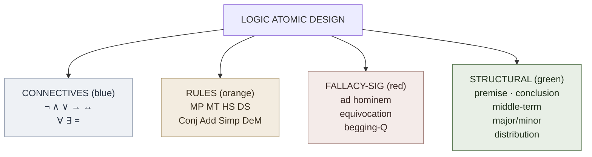

# Logic Atomic Design

**Summary**: A structural classification of the wiki's logic-domain inventory along Brad Frost's five-tier *Atomic Design* spine — **Atoms · Molecules · Organisms · Templates · Pages**. **Fourth sister application of the atomic-design lens**, joining [memory-atomic-design](./memory-atomic-design.md) · [money-atomic-design](./money-atomic-design.md) · [problem-solving-atomic-design](./problem-solving-atomic-design.md) (with [visualization-atomic-design](./visualization-atomic-design.md) a fifth on the visualization-layer side). Atoms are the irreducible primitives (connectives, single inference rules, fallacy signatures, structural slots); molecules are the named argument-forms (Modus Ponens, Categorical Syllogism, each named fallacy); organisms are the pipelines ([Copi](./copi-introduction-to-logic.md)'s deduction system, [TLP](./tractatus-logico-philosophicus.md)'s truth-function machine, the Fallacy-Recognition Gym); templates are the schemas (A/E/I/O grid, truth-table layout, natural-deduction proof skeleton); pages are worked instances. This page is a *lens*, not a new framework — it organizes existing material and tightens METER vocabulary without inventing parallel definitions.

**Sources**:
- Brad Frost, *Atomic Design* (2016). Local clipping at `Clippings/Atomic Design Methodology  Atomic Design by Brad Frost.md`.
- [Copi/Cohen/McMahon *Introduction to Logic* 14th ed](./copi-introduction-to-logic.md) — atom/molecule/organism/template/page inventory.
- [Wittgenstein TLP](./tractatus-logico-philosophicus.md) — picture-theory grounding + truth-function machinery.
- [Doxiadis et al *Logicomix*](./logicomix-graphic-novel.md) — historical-narrative atom-family.
- [picture-theory-of-language](./picture-theory-of-language.md) · [show-vs-say](./show-vs-say.md) · [argument-anatomy](./argument-anatomy.md) · [validity-vs-soundness](./validity-vs-soundness.md) · [fallacy-taxonomy](./fallacy-taxonomy.md) — load-bearing concept pages this hub organizes.
- Sister hubs: [problem-solving-atomic-design](./problem-solving-atomic-design.md) · [memory-atomic-design](./memory-atomic-design.md) · [money-atomic-design](./money-atomic-design.md) · [visualization-atomic-design](./visualization-atomic-design.md).

**Last updated**: 2026-05-27 (extended with metalogic tier from [Mancosu-Galvan-Zach (2021) *Introduction to Proof Theory*](./proof-theory-mancosu-galvan-zach.md) ingest — see §Metalogic tier below).

---

## Unlocks (lead, not footer)

1. **Fourth sister application of the lens.** Memory · money · problem-solving · logic — the atomic-design family now covers all four meta-knowledge domains the wiki is most active in. The lens family closes a structural ring: every meta-knowledge layer of the wiki has its atom/molecule/organism/template/page taxonomy. Confirmed unlock; see [composability-index](./composability-index.md).

2. **Logic atoms are the *substrate* of every other framework's atoms.** Every encoder (NEDF, CAST, SPEAR, HEART) presupposes argument-anatomy atoms (premise · conclusion · inference). Every problem-solving organism presupposes validity-test atoms. Every Bible-study Davidson-Decalogue move presupposes fallacy-taxonomy atoms. **Logic is where the other domains' atoms come from.** This makes logic-atomic-design the *deepest* of the four sister hubs.

3. **[Picture-theory](./picture-theory-of-language.md) as Atom-tier philosophical primitive.** TLP picture theory enters the wiki's atom inventory as a *Structural-slot* atom that ties every encoder's scene structure back to logical form. Cross-link to [nedf-overview](./nedf-overview.md) §Glyph and [scene-grammar](./scene-grammar.md).

4. **Fallacy-Recognition Gym = 3rd recognition-gym instance.** Per [composability-index](./composability-index.md) candidate-pattern rule, three instances triggers owner-page promotion. The pattern is now eligible.

## Mnemonic

**A-M-O-T-P** (the universal atomic-design spine) applied to four logic chemical-families:

- **Atoms** = **C-R-F-S** = *Connectives · Rules · Fallacy-signatures · Structural-slots*
- **Molecules** = named argument forms (Modus Ponens / Categorical Syllogism / each fallacy)
- **Organisms** = named pipelines (Deduction system / Truth-function machine / Fallacy-Recognition Gym)
- **Templates** = named schemas (A/E/I/O grid / Truth-table / Natural-deduction proof / Venn diagram)
- **Pages** = worked instances

## Memory checksum

If you can answer these in <60 s each from memory, the page is encoded:

1. **State the five tiers in order.** (Atoms · Molecules · Organisms · Templates · Pages.)
2. **Name the four logic atom-families.** (Connectives · Rules · Fallacy-signatures · Structural-slots.)
3. **Give one example at each tier.** (Atom: *Modus Ponens* the inference rule. Molecule: *Categorical Syllogism in mood AAA-1*. Organism: *Copi's deduction system*. Template: *truth-table schema*. Page: *a worked syllogism evaluation*.)
4. **What's the relationship to the other three atomic-design hubs?** (Sister applications — same lens transposed to different domain. Memory · money · problem-solving · logic are four meta-knowledge domains running the same five-tier classification.)
5. **What is "tier-conflation" and why does it matter?** (Running a molecule as if it were an organism, or treating a template as if it were a molecule. Most common operational error after the lens is adopted; tracked as METER metric per [problem-solving-atomic-design](./problem-solving-atomic-design.md) §Anti-patterns. Same anti-pattern applies in the logic domain.)

## Visual — the four chemical families

(A fifth column was reserved in the original grid but left empty.)

| Tier | Examples |
|---|---|
| Molecules | Modus Ponens · Modus Tollens · Hypothetical Syllogism · Disjunctive Syllogism · Categorical Syllogism (AAA-1, EAE-1, …) · Reductio · Constructive Dilemma · Each named fallacy (~25) |
| Organisms | Copi's 19-rule deduction system · TLP truth-function machine · Categorical-syllogism evaluation pipeline · Fallacy-Recognition Gym · Validity-test reflex · Argument-extraction reflex |
| Templates | A/E/I/O schema · Truth-table · Natural-deduction proof skeleton · Venn diagram · Syllogism mood/figure table · Argument-extraction template |
| Pages | Worked syllogism evaluations · Worked truth-tables · Worked NL→symbolic translations · Real-world argument extractions · Fallacy diagnoses |

The four families are color-coded to match the convention from the other three atomic-design hubs (`#1971c2` blue · `#e8590c` orange · `#e03131` red · `#2f9e44` green) — see [glossary](./glossary.md) §Atomic-design tiering layer (logic) for the explicit assignment.

---

## The five-tier mapping (master table)

| Tier | Definition (Frost) | Logic instance | Catalog page |
|---|---|---|---|
| **Atom** | "Foundational building blocks; cannot be broken further without ceasing to be functional" | One connective · one inference rule · one fallacy signature · one structural slot | §Atoms below |
| **Molecule** | "Relatively simple groups of UI elements functioning together as a unit" | A *named argument form* — Modus Ponens, Categorical Syllogism, each named fallacy | §Molecules below |
| **Organism** | "Relatively complex components composed of molecules and atoms forming distinct sections" | A *named pipeline* — Copi's 19-rule deduction system, TLP's truth-function machine, the Fallacy-Recognition Gym, the Validity-Test Reflex | §Organisms below |
| **Template** | "Page-level objects that place components into a layout and articulate the underlying content structure" | A *schema* — A/E/I/O grid, truth-table layout, natural-deduction proof skeleton, Venn diagram, argument-extraction schema | §Templates below |
| **Page** | "Specific instances of templates that show what a UI looks like with real representative content" | A *worked instance* — a specific syllogism evaluation, a specific truth-table, a specific real-world argument extracted into Copi structure | §Pages below |

The five tiers compose strictly upward — a molecule is built of atoms; an organism of molecules and atoms; a template positions organisms; a page realizes a template. They do *not* compose downward.

---

## Atoms

An **atom** is irreducible: split it and the move ceases to exist. Logic atoms cluster into four chemical families.

### Connectives family (blue · #1971c2) — the truth-functional and quantificational primitives

| Symbol | Atom | Reading | Source |
|---|---|---|---|
| **¬** | Negation | *not P* | [Copi](./copi-introduction-to-logic.md) Ch 8 |
| **∧** | Conjunction | *P and Q* | Copi Ch 8 |
| **∨** | Disjunction | *P or Q* | Copi Ch 8 |
| **→** | Material implication | *if P then Q* | Copi Ch 8 |
| **↔** | Material biconditional | *P iff Q* | Copi Ch 8 |
| **⊕** | Exclusive or (XOR) | *P xor Q* | not in Copi (derivable from ∧ ∨ ¬) |
| **\|** | Sheffer stroke (NAND) | *not both P and Q* | TLP 5.1311; foundation for the N-operator |
| **↓** | Peirce arrow (NOR) / joint denial | *neither P nor Q* | TLP 5.5; the *N* operator |
| **∀** | Universal quantifier | *for all x* | Copi Ch 10 |
| **∃** | Existential quantifier | *there exists x* | Copi Ch 10 |
| **=** | Identity | *x equals y* | Copi Ch 10 (Wittgenstein's destructive criticism: TLP 5.5301-5.534) |

TLP 6's *N-operator* (joint negation) generates all truth-functions from the Sheffer stroke alone — Wittgenstein's compression of the connective inventory. The wiki uses Copi's six classical connectives plus quantifiers; the TLP compression is registered as a *meta-atom* fact about the family.

### Rules family (orange · #e8590c) — single inference moves

| Symbol | Atom | Form | Source |
|---|---|---|---|
| **MP** | Modus Ponens | *P → Q ; P ; ∴ Q* | [Copi](./copi-introduction-to-logic.md) Ch 9; Chrysippus c. 250 BCE |
| **MT** | Modus Tollens | *P → Q ; ¬Q ; ∴ ¬P* | Copi Ch 9 |
| **HS** | Hypothetical Syllogism | *P → Q ; Q → R ; ∴ P → R* | Copi Ch 9 |
| **DS** | Disjunctive Syllogism | *P ∨ Q ; ¬P ; ∴ Q* | Copi Ch 9 |
| **CD** | Constructive Dilemma | *(P → Q) ∧ (R → S) ; P ∨ R ; ∴ Q ∨ S* | Copi Ch 9 |
| **DD** | Destructive Dilemma | *(P → Q) ∧ (R → S) ; ¬Q ∨ ¬S ; ∴ ¬P ∨ ¬R* | Copi Ch 9 |
| **Simp** | Simplification | *P ∧ Q ; ∴ P* | Copi Ch 9 |
| **Conj** | Conjunction (rule) | *P ; Q ; ∴ P ∧ Q* | Copi Ch 9 |
| **Add** | Addition | *P ; ∴ P ∨ Q* | Copi Ch 9 |
| **DeM** | De Morgan's Laws | *¬(P ∧ Q) ↔ ¬P ∨ ¬Q* and dual | Copi Ch 9 (replacement) |
| **Comm** | Commutation | *P ∧ Q ↔ Q ∧ P* and dual | Copi Ch 9 (replacement) |
| **Assoc** | Association | *P ∧ (Q ∧ R) ↔ (P ∧ Q) ∧ R* | Copi Ch 9 |
| **Dist** | Distribution | *P ∧ (Q ∨ R) ↔ (P ∧ Q) ∨ (P ∧ R)* | Copi Ch 9 |
| **DN** | Double Negation | *P ↔ ¬¬P* | Copi Ch 9 |
| **Trans** | Transposition (contraposition) | *P → Q ↔ ¬Q → ¬P* | Copi Ch 9 |
| **Impl** | Material Implication | *P → Q ↔ ¬P ∨ Q* | Copi Ch 9 |
| **Equiv** | Material Equivalence | *P ↔ Q ↔ (P → Q) ∧ (Q → P)* | Copi Ch 9 |
| **Exp** | Exportation | *(P ∧ Q) → R ↔ P → (Q → R)* | Copi Ch 9 |
| **Taut** | Tautology | *P ↔ P ∧ P* and dual | Copi Ch 9 |
| **UI** | Universal Instantiation | *∀x.Fx ; ∴ Fa* | Copi Ch 10 |
| **UG** | Universal Generalization | (with restrictions) | Copi Ch 10 |
| **EI** | Existential Instantiation | (with restrictions) | Copi Ch 10 |
| **EG** | Existential Generalization | *Fa ; ∴ ∃x.Fx* | Copi Ch 10 |

Copi's 9 elementary rules + 10 replacement rules + 4 quantification rules = **23 atoms in the Rules family**. Each is drillable as a reflexive ID under 8 s in the Lamp phase of a logic gym.

### Fallacy-signatures family (red · #e03131) — invalid-form atoms

| Symbol | Atom | Form / Description | Source |
|---|---|---|---|
| **AC** | Affirming the Consequent | *P → Q ; Q ; ∴ P* — invalid (mirror of MP) | [fallacy-taxonomy](./fallacy-taxonomy.md) §Formal |
| **DA** | Denying the Antecedent | *P → Q ; ¬P ; ∴ ¬Q* — invalid (mirror of MT) | [fallacy-taxonomy](./fallacy-taxonomy.md) §Formal |
| **AH** | Ad Hominem | Attack person, not argument (abusive · circumstantial) | [fallacy-taxonomy](./fallacy-taxonomy.md) §Relevance |
| **APA** | Appeal to Authority (misplaced) | Authority cited outside their domain or as conclusive | [fallacy-taxonomy](./fallacy-taxonomy.md) §Relevance |
| **APE** | Appeal to Emotion | Move audience rather than provide reasons | [fallacy-taxonomy](./fallacy-taxonomy.md) §Relevance |
| **API** | Appeal to Ignorance | Absence of evidence treated as evidence | [fallacy-taxonomy](./fallacy-taxonomy.md) §Relevance |
| **APF** | Appeal to Force (*ad baculum*) | Threaten rather than reason | [fallacy-taxonomy](./fallacy-taxonomy.md) §Relevance |
| **RH** | Red Herring | Distract with related-but-different topic | [red-herring-resistance](./red-herring-resistance.md) |
| **SM** | Straw Man | Misrepresent opponent's argument as weaker | [fallacy-taxonomy](./fallacy-taxonomy.md) §Relevance |
| **CQ** | Complex (Loaded) Question | Question presupposes a contested claim | [fallacy-taxonomy](./fallacy-taxonomy.md) §Relevance |
| **BQ** | Begging the Question (*petitio principii*) | Assume conclusion in premises | [fallacy-taxonomy](./fallacy-taxonomy.md) §Presumption |
| **ACC** | Accident | Apply general rule to non-fitting case | [fallacy-taxonomy](./fallacy-taxonomy.md) §Presumption |
| **CACC** | Converse Accident | Atypical case treated as representative | [fallacy-taxonomy](./fallacy-taxonomy.md) §Presumption |
| **FC** | False Cause | Correlation/succession treated as causation | [fallacy-taxonomy](./fallacy-taxonomy.md) §Presumption |
| **FA** | False Analogy | Similarity claimed where relevant similarity absent | [fallacy-taxonomy](./fallacy-taxonomy.md) §Presumption |
| **FD** | False Dichotomy | Two options presented as exhaustive when they aren't | [fallacy-taxonomy](./fallacy-taxonomy.md) §Presumption |
| **EQ** | Equivocation | Word used in two senses across argument | [fallacy-taxonomy](./fallacy-taxonomy.md) §Ambiguity |
| **AMPH** | Amphiboly | Structural ambiguity exploited | [fallacy-taxonomy](./fallacy-taxonomy.md) §Ambiguity |
| **ACC2** | Accent (fallacy) | Meaning shift by emphasis change | [fallacy-taxonomy](./fallacy-taxonomy.md) §Ambiguity |
| **COMP** | Composition | Property of parts attributed to whole | [fallacy-taxonomy](./fallacy-taxonomy.md) §Ambiguity |
| **DIV** | Division | Property of whole attributed to parts | [fallacy-taxonomy](./fallacy-taxonomy.md) §Ambiguity |

The fallacy-signature family has ~25 named atoms. Most are *informal* (Relevance / Presumption / Ambiguity); the two **formal** fallacies (AC, DA) are structural mirrors of valid rules and deserve special drilling.

### Structural-slots family (green · #2f9e44) — argument-anatomy atoms

| Symbol | Atom | Meaning | Source |
|---|---|---|---|
| **prem** | Premise | Proposition offered as support | [argument-anatomy](./argument-anatomy.md) §Premises and conclusion |
| **conc** | Conclusion | Proposition supported | [argument-anatomy](./argument-anatomy.md) |
| **inf** | Inference | Relation tying premises to conclusion | [argument-anatomy](./argument-anatomy.md) |
| **enth** | Enthymeme slot | Unstated-but-understood premise | [argument-anatomy](./argument-anatomy.md) §Enthymeme |
| **prem-ind** | Premise indicator | Word/phrase signaling premise role (*since · because · for · as · …*) | [argument-anatomy](./argument-anatomy.md) §Indicators |
| **conc-ind** | Conclusion indicator | Word/phrase signaling conclusion role (*therefore · hence · thus · …*) | [argument-anatomy](./argument-anatomy.md) §Indicators |
| **major** | Major term | The predicate term of a categorical syllogism's conclusion | [Copi](./copi-introduction-to-logic.md) Ch 6 |
| **minor** | Minor term | The subject term of a categorical syllogism's conclusion | Copi Ch 6 |
| **middle** | Middle term | The term shared by the two premises but absent from conclusion | Copi Ch 6 |
| **dist** | Distribution | A term is *distributed* if proposition refers to *all* members of its class | Copi Ch 6 |
| **cop** | Copula | Form of *to be* connecting subject + predicate in standard form | Copi Ch 5 |
| **A** | Universal affirmative | *All S is P* | Copi Ch 5 |
| **E** | Universal negative | *No S is P* | Copi Ch 5 |
| **I** | Particular affirmative | *Some S is P* | Copi Ch 5 |
| **O** | Particular negative | *Some S is not P* | Copi Ch 5 |
| **val** | Validity | *Whenever premises true, conclusion must be true* | [validity-vs-soundness](./validity-vs-soundness.md) |
| **snd** | Soundness | Validity + all true premises | [validity-vs-soundness](./validity-vs-soundness.md) |
| **str** | Strength (inductive) | Premises make conclusion *probable* (not necessary) | [validity-vs-soundness](./validity-vs-soundness.md) §Inductive |
| **cog** | Cogency (inductive) | Strength + all true premises | [validity-vs-soundness](./validity-vs-soundness.md) §Inductive |
| **form** | Logical form | What the picture and the fact have in common (TLP) | [picture-theory-of-language](./picture-theory-of-language.md) |
| **show** | Show | What is displayed by structure (TLP) | [show-vs-say](./show-vs-say.md) |
| **say** | Say | What is asserted by content (TLP) | [show-vs-say](./show-vs-say.md) |

**Total atom count**: ~80 logic atoms registered. METER's smallest namable unit for logic events (`crux_atom`, `atoms_used` fields).

---

## Molecules

A **molecule** is a small bundle of atoms with its own trigger and shape — a *named argument form* in the logic domain.

### Propositional-logic molecules

| Molecule | Composition | When it fires |
|---|---|---|
| **Modus Ponens chain** | MP applied repeatedly through a chain of conditionals | When premises are conditionals + the antecedent of the first |
| **Modus Tollens chain** | MT applied repeatedly back through a chain | When the conclusion's negation is given + a chain of conditionals leads to it |
| **Hypothetical Syllogism** | HS used to derive a longer conditional from shorter ones | Multiple conditionals chained without intermediate truth-claim |
| **Disjunctive Syllogism** | DS used to eliminate alternatives | When premises offer a disjunction + the negation of one disjunct |
| **Constructive Dilemma** | CD combining two conditionals + a disjunction | When you have two conditionals and a disjunction of antecedents |
| **Reductio ad Absurdum** | Conditional Proof + Contradiction + DN | Assume negation; derive contradiction; conclude original | [methods-of-mathematical-argument](./methods-of-mathematical-argument.md) §Contradiction |
| **Argument by Cases** | Disjunction + multiple CPs + DS | Split into cases; derive conclusion in each; combine | Copi Ch 9 |

### Categorical-logic molecules (Copi Ch 6)

A **categorical syllogism** is a deductive argument with three categorical propositions (two premises, one conclusion) containing three terms (major · minor · middle), each appearing exactly twice. Specified by *mood* (the three letters from {A, E, I, O}) and *figure* (the position of the middle term in the premises).

The 256 candidate mood-figure combinations include exactly **15 unconditionally valid forms** (24 valid if existential import is granted for universal premises):

| Figure 1 | Figure 2 | Figure 3 | Figure 4 |
|---|---|---|---|
| AAA-1 (Barbara) | EAE-2 (Cesare) | IAI-3 (Datisi) | AEE-4 (Camenes) |
| EAE-1 (Celarent) | AEE-2 (Camestres) | AII-3 (Disamis) | IAI-4 (Dimaris) |
| AII-1 (Darii) | EIO-2 (Festino) | OAO-3 (Bocardo) | EIO-4 (Fresison) |
| EIO-1 (Ferio) | AOO-2 (Baroco) | EIO-3 (Ferison) | |

(Plus 9 conditionally-valid forms requiring existential import.)

**Each named syllogism is a molecule.** The mood-figure pair fully determines the structure; the Latin name is a mnemonic ([Copi](./copi-introduction-to-logic.md) uses the medieval names which encode the mood letters in the vowels).

### Fallacy molecules

Each named fallacy is a *failure-mode molecule* — an argument shape that looks valid but isn't, or a shape that smuggles in a contested claim, or a shape that exploits ambiguity. The ~25 named fallacies in [fallacy-taxonomy](./fallacy-taxonomy.md) are all molecules.

### Picture-theoretic molecules (TLP)

| Molecule | Composition | When it fires |
|---|---|---|
| **Atomic proposition** | One predicate + n objects, no connectives | The simplest TLP molecule; TLP 4.21-4.221 |
| **Truth-function** | Atomic propositions + connectives + truth-table | TLP 4.31; any compound proposition |
| **Tautology** | A truth-function true under all assignments | TLP 6.1; the propositions of logic |
| **Contradiction** | A truth-function false under all assignments | TLP 6.12 |
| **General form of proposition** | *[p̄, ξ̄, N(ξ̄)]* — the recursive truth-function generator | TLP 6 |

---

## Organisms

A **organism** is a named pipeline — a complex section with its own internal sequence of molecules and atoms. The wiki's logic organisms:

| Organism | Composition | Owner |
|---|---|---|
| **Copi's 19-rule deduction system** | 9 elementary + 10 replacement rules; conditional proof; reductio | [copi-introduction-to-logic](./copi-introduction-to-logic.md) Ch 9 |
| **TLP truth-function machine** | All propositions generated from elementary propositions via repeated N-operator | [picture-theory-of-language](./picture-theory-of-language.md); TLP 5-6 |
| **Categorical-syllogism evaluation pipeline** | Standardize → identify mood + figure → check distribution → Venn-diagram → declare valid/invalid | [copi-introduction-to-logic](./copi-introduction-to-logic.md) Ch 6 |
| **Validity-test reflex** | Suppose premises true → seek counter-example → declare invalid (with example) or valid (no counter-example found) | [validity-vs-soundness](./validity-vs-soundness.md) |
| **Argument-extraction reflex** | Read passage → identify indicators → name conclusion → name premises → surface enthymeme → write structure | [argument-anatomy](./argument-anatomy.md) |
| **Fallacy-Recognition Gym** | Lamp/Scale/Sword phases × ~25 named fallacies + 2 formal + 7 lateral trap classes | [fallacy-taxonomy](./fallacy-taxonomy.md) §Fallacy-Recognition Gym |
| **Picture-theory grounding pipeline** | Concept → identify objects → identify relations → render scene → verify form-match → emit visual | [picture-theory-of-language](./picture-theory-of-language.md) |
| **METER logic-event emitter** | Logic events (argument extracted, fallacy identified, validity tested) → METER schema → aggregator | [meter-overview](./meter-overview.md) |

---

## Templates

A **template** is a page-level schema with named slots — defines *which organisms run in what order on which inputs*.

| Template | Slots | Use |
|---|---|---|
| **A/E/I/O proposition schema** | quantifier · subject term · copula · predicate term | Standardize English to categorical form |
| **Syllogism mood/figure table** | mood (3 letters from AEIO) · figure (1-4) → declare valid form name | Quick lookup |
| **Truth-table schema** | atomic propositions (columns) × all 2^n assignments (rows) × compound proposition columns | Propositional validity testing |
| **Natural-deduction proof skeleton** | numbered lines, each with: assertion · rule · justification (lines used) · scope (sub-proof boxes) | Symbolic derivation |
| **Venn-diagram schema** | three overlapping circles (S, M, P) · shading (universal claims) · ×s (particular claims) | Syllogism validity |
| **Argument-extraction template** | source passage · indicators highlighted · premises (P1, P2, …) · enthymeme premises · conclusion · structural diagram | English → structure |
| **Fallacy-diagnosis schema** | argument · fallacy name · family · detection signal · counter-construction | Fallacy work |
| **Predicate-logic translation grid** | English quantifier · predicate · domain · symbolic form | Ch 10 problems |
| **TLP proposition index** | decimal number · German · Ogden · Pears/McGuinness | Citation work |

---

## Metalogic tier (added 2026-05-27 from Mancosu-Galvan-Zach ingest)

The 2026-05-27 [Mancosu, Galvan, Zach (2021)](./proof-theory-mancosu-galvan-zach.md) ingest adds a **metalogic tier** that sits **above** the five Copi-tier tiers above. The metalogic tier has its own atoms/molecules/organisms/templates/pages — and its discipline studies the *Copi-tier objects themselves* as combinatorial things (proofs as trees, derivations as ordinal-bounded reductions, etc.). This is the difference between *doing logic* (Copi-tier) and *studying logic done* (metalogic-tier).

| Metalogic-tier element | What it adds | Owner |
|---|---|---|
| **Inference-rule atom** | A single intro or elim rule (→I, ∧E1, ∨I2, ⊥E, ∀I, ∃E). At the Copi tier, modus ponens is a *molecule* (named rule); at the metalogic tier, →E is an *atom* — an indivisible unit of inference whose meaning is given by its slots. | [natural-deduction](./natural-deduction.md) |
| **Cut atom** | The single sequent-calculus inference that introduces a formula C in two premises and eliminates it in the conclusion. Atom because cut is *one rule*, not a pattern of rules. | [cut-elimination-hauptsatz](./cut-elimination-hauptsatz.md) |
| **Sub-formula atom** | An immediate sub-formula of a compound formula. Atomic structural unit beneath every metalogic theorem. | [sub-formula-property](./sub-formula-property.md) |
| **Ordinal-notation atom** | A primitive-recursive syntactic object representing an ordinal in Cantor normal form. | [epsilon-zero-and-ordinal-induction](./epsilon-zero-and-ordinal-induction.md) |
| **Intro/elim duality molecule** | A pair (intro, elim) for a connective with harmony. Two atoms in disciplined relation. The molecular tier of proof-theoretic semantics. | [proof-theoretic-semantics](./proof-theoretic-semantics.md) |
| **Detour molecule** | An intro rule for ⋆ followed immediately by the elim rule for ⋆ on the introduced formula. Composed of two inference-rule atoms; itself eliminable by reduction. | [normalization-theorem](./normalization-theorem.md) |
| **Cut-segment molecule** | A maximal sequence of consecutive cut-or-permutable inferences. The unit on which permutation-conversion operates. | [cut-elimination-hauptsatz](./cut-elimination-hauptsatz.md) |
| **Harmony molecule** | The relation between an intro-elim pair that lets detours be reduced. The PT-semantic discipline. | [proof-theoretic-semantics](./proof-theoretic-semantics.md) |
| **Normalization-algorithm organism** | The full pipeline that transforms an arbitrary NJ/NK derivation into a normal one (detour conversions + permutation conversions + classical conversions for NK), composed of molecules in strict-decreasing-complexity order. | [normalization-theorem](./normalization-theorem.md) |
| **Cut-elimination-algorithm organism** | The full LK/LJ pipeline (degree reduction + rank reduction, on mix-rule for clean bookkeeping). | [cut-elimination-hauptsatz](./cut-elimination-hauptsatz.md) |
| **Gödel-Gentzen translation organism** | The recursive (·)' translation from classical to intuitionistic formulas; preserves provability; consistency-equivalent. | [godel-gentzen-translation](./godel-gentzen-translation.md) |
| **ε₀-bounded reduction organism** | Gentzen's consistency-proof pipeline — assign ordinal notations to PA-proofs, run a strictly-decreasing reduction, exhibit terminal atomic-cut-only proof. | [consistency-of-peano-arithmetic](./consistency-of-peano-arithmetic.md) |
| **Natural-deduction tree template** | The schema for an ND proof — root = end-formula, internal nodes = rule conclusions with their premises, leaves = assumptions (some discharged). | [natural-deduction](./natural-deduction.md) |
| **Sequent-calculus tree template** | The schema for an LK/LJ proof — root = end-sequent, internal nodes = sequent rule conclusions, leaves = axiom sequents. | [sequent-calculus](./sequent-calculus.md) |
| **Cantor normal form template** | The unique decomposition of an ordinal < ε₀ as ω^β₁·n₁ + … + ω^βₖ·nₖ with β₁ > … > βₖ ≥ 0 and recursive ordinal-notation βᵢ. | [epsilon-zero-and-ordinal-induction](./epsilon-zero-and-ordinal-induction.md) |
| **Worked normalization page** | A page populating the ND-tree template with an actual derivation, then showing each detour conversion strictly decreasing the complexity. | (queued worked-example page) |
| **Worked cut-elimination page** | A page populating the LK-tree template with an actual proof containing a high-degree cut, then showing the Hauptsatz algorithm reduce it. | (queued worked-example page) |
| **Worked ε₀-consistency page** | A page populating the PA-reduction organism with an actual PA-proof of *2 + 3 = 5*, showing the ordinal decrease step-by-step (Mancosu et al. Ch 7.7 + Ch 9.5 are templates for this page). | [consistency-of-peano-arithmetic](./consistency-of-peano-arithmetic.md) §Worked example |

### How the metalogic tier composes with the Copi tier

The metalogic tier *operates on* the Copi tier:

- A Copi-tier organism (e.g., "evaluate this syllogism by Venn diagram") produces a *judgment* about validity. A metalogic-tier organism (e.g., "extract the normal form of this NJ-derivation") produces a *structural-analysis* of the Copi-tier object.
- A Copi-tier page (e.g., a worked syllogism evaluation) demonstrates Copi-tier discipline. A metalogic-tier page demonstrates how to *study* the worked syllogism evaluation as a combinatorial object.
- The Copi tier *uses* logical objects. The metalogic tier *studies them*.

This is structurally identical to how [memory-atomic-design](./memory-atomic-design.md) organizes encoders (objects you use) vs the discipline of studying encoder-performance via METER (study of those objects). The lens is consistent.

### Tier-conflation risk (new with metalogic tier)

The most subtle conflation is treating an **inference-rule atom** (metalogic tier) as if it were a **molecule** (Copi tier). Example: "modus ponens" is a *named molecule* at the Copi tier (it's a recognized pattern with a name) but a *single atom* at the metalogic tier (it's one indivisible inference rule, →E). The right answer depends on which tier you're working in. Misplacing it produces meaningless cross-tier composition arguments.

The METER metric `tier-respect` (already defined for Copi tier) extends with a *cross-tier* check: every reference to a logical object must specify *which tier* it operates at if the term is tier-ambiguous (e.g., modus ponens). Pass <10% cross-tier ambiguity; floor 25%.

## Pages

A **page** is a worked instance — a template populated with the real content of a specific argument, proof, or diagnosis. Quality-control tier; a page that can't be cleanly tier-decomposed reveals a bug in the design system.

Examples to be authored as Wave-1 cleanup or Wave-2 expansion:

- **Worked categorical syllogism: AAA-1 (Barbara)** — *All M is P; All S is M; ∴ All S is P*, with Venn-diagram derivation
- **Worked truth-table: De Morgan's first law** — *¬(P ∧ Q) ↔ (¬P ∨ ¬Q)*
- **Worked NL→symbolic translation** — Copi Ch 8 sample exercise
- **Worked argument extraction** — a real news article paragraph reduced to P1, P2, [P_hidden], ∴ C
- **Worked fallacy diagnosis** — a real op-ed paragraph diagnosed (which fallacy, which family, what's missing)
- **Worked TLP fragment trace** — a TLP proposition mapped to its picture-theoretic content + the wiki encoder it grounds

Each Page realizes a Template by filling its slots with real content; each Template is composed of Organisms; each Organism uses Molecules; each Molecule is built of Atoms.

---

## Anti-patterns

### Tier-conflation in logic

The most common operational error after the lens is adopted, per the sister hubs ([problem-solving-atomic-design](./problem-solving-atomic-design.md) §Anti-patterns, [memory-atomic-design](./memory-atomic-design.md) §Anti-patterns):

- **Running a molecule as if it were an organism**: applying *Modus Ponens* without the surrounding extract-classify-test sequence; or evaluating a single syllogism without standardization and Venn diagram.
- **Treating a template as if it were a molecule**: writing out a truth-table without recognizing it as a *schema* that any specific argument fills; or treating Copi's natural-deduction skeleton as a single rule.
- **Treating a page as if it were a template**: generalizing one worked example to all arguments of "that shape".

METER metric: *tier-respect rate* (target ≥90%, floor 70%) — how often a logic event uses the right tier of move for its problem.

### Atom-naming drift

The wiki's stable atom inventory (the ~80 atoms above) must not be silently extended or renamed. New atom proposals should go through [UMTF](./universal-mental-tagging-framework.md) alignment + the [glossary](./glossary.md) registration process.

### Confusing logical form with logical machinery

A picture-theoretic concept (e.g. *logical form*, from TLP) is a **Structural-slot atom** — not a connective and not a rule. Naming a TLP concept as a "rule" or "molecule" misclassifies the tier and produces parallel-definition drift.

### Picture-without-form

Adding a visual to a concept page that *doesn't share form* with the concept (decoration rather than showing — see [show-vs-say](./show-vs-say.md) §Picture as decoration). The visual must carry the *structural* load.

---

## Gaps (registered honestly)

This Wave-1 ingest covers ~80% of what an analytic-philosophy undergraduate calls "logic". The gaps, registered for future ingests:

| Gap | What it adds | Recommended supplement |
|---|---|---|
| **Modal logic** | □ · ◇ · Kripke semantics · S4/S5 · counterfactuals | Sider, *Logic for Philosophy* (2010) |
| **Model theory** | Tarski's truth definition · completeness · compactness · Löwenheim-Skolem | Smullyan, *Logical Labyrinths* (2009) |
| **Type theory / Curry-Howard** | Propositions = types · proofs = programs · dependent types · Coq/Lean/Agda | Pierce, *Types and Programming Languages* (2002) or Sørensen-Urzyczyn (2006) |
| **Non-classical logics** | Intuitionistic · paraconsistent · relevance · fuzzy | Priest, *An Introduction to Non-Classical Logic* (2008) |
| **Computational logic** | SAT / SMT / automated theorem proving | Kroening-Strichman, *Decision Procedures* (2016) |
| **Modern proof theory** | Gentzen sequent calculus · cut elimination · normalization | Negri-von Plato, *Structural Proof Theory* (2008) |
| **Bayesian / inductive logic** | P(H\|E) as central object · Carnap · Jaynes | Jaynes, *Probability Theory: The Logic of Science* (2003) |
| **Category-theoretic foundations** | Topoi · HoTT · alternative to set theory | Leinster, *Basic Category Theory* (2014) |

These gaps are **honestly named in the wiki itself** so that the Logic Atomic Design's limits are visible. Wave 2 of the logic ingest closes them on user request.

---

## METER integration

| Drill | Tier | Pass floor | Owner |
|---|---|---|---|
| Atom recognition (recognize the named atom from its symbol) | Atom | <8 s, ≥95% | this page |
| Rule application (apply MP/MT/HS/DS to a given premise pair) | Atom → Molecule | <15 s, ≥90% | [copi-introduction-to-logic](./copi-introduction-to-logic.md) Ch 9 |
| Categorical syllogism mood-figure ID | Molecule | <60 s, ≥80% | [copi-introduction-to-logic](./copi-introduction-to-logic.md) Ch 6 |
| Fallacy ID under timer | Molecule | <60 s, ≥70% | [fallacy-taxonomy](./fallacy-taxonomy.md) |
| Argument extraction | Organism | <60 s, ≥80% | [argument-anatomy](./argument-anatomy.md) |
| Validity-test reflex | Organism | <30 s | [validity-vs-soundness](./validity-vs-soundness.md) |
| Tier-respect rate | meta | ≥90%, floor 70% | this page |
| Picture-theory grounding (concept → which TLP fragment) | Atom (Structural) | <30 s | [picture-theory-of-language](./picture-theory-of-language.md) |
| Show-vs-say boundary call | Atom (Structural) | <30 s | [show-vs-say](./show-vs-say.md) |

---

## Reading paths through the logic domain (Wave 5)

The logic domain has grown to ~40 pages across 5 ingest waves. Different readers benefit from different entry-paths. Use [the TLP proposition tree](./tractatus-proposition-tree.md) for TLP-specific navigation; this section gives logic-domain-wide paths.

### Path A — "What is logic and how do I use it?" (~6 pages)

1. [argument-anatomy](./argument-anatomy.md) — premise · conclusion · inference · enthymeme · indicators
2. [validity-vs-soundness](./validity-vs-soundness.md) — form vs content
3. [copi-analyzing-arguments](./copi-analyzing-arguments.md) — diagramming real arguments
4. [fallacy-taxonomy](./fallacy-taxonomy.md) — the dark twins of valid arguments
5. [methods-of-deduction](./methods-of-deduction.md) — 19 rules for symbolic derivation
6. [problem-solving-os](./problem-solving-os.md) — apply step 3.b *Validity-test reflex*

**Result**: argument-extraction reflex + fallacy-recognition + validity-test in <60 s per item. Drillable.

### Path B — "Show me TLP's picture theory and how it grounds the wiki's encoders" (~5 pages)

1. [tractatus-logico-philosophicus](./tractatus-logico-philosophicus.md) — source summary
2. [picture-theory-of-language](./picture-theory-of-language.md) — TLP 2.1-4.06
3. [show-vs-say](./show-vs-say.md) — TLP 4.121-4.1212
4. [nedf-overview](./nedf-overview.md) — see the External-canon citation row for TLP picture-theory ancestry
5. [hypostasis-elenchos-and-tlp-show-vs-say](./hypostasis-elenchos-and-tlp-show-vs-say.md) — cross-tradition grounding

**Result**: understand the philosophical antecedent of the wiki's entire encoder paradigm + the visual-per-concept rule.

### Path C — "Show me the foundations crisis and what it means" (~6 pages)

1. [logicomix-graphic-novel](./logicomix-graphic-novel.md) — narrative entry-point
2. [foundations-crisis](./foundations-crisis.md) — three-program structure
3. [russells-paradox](./russells-paradox.md) — 1901 trigger
4. [principia-mathematica](./principia-mathematica.md) — Russell-Whitehead's response
5. [godels-incompleteness](./godels-incompleteness.md) — 1931 demolition
6. [logicians-madness-substrate-thesis](./logicians-madness-substrate-thesis.md) — the substrate-cost lesson

**Result**: understand 1880-1939 mathematics + the substrate-stewardship lesson the wiki extracts from it.

### Path D — "Who are the people?" (~7 character bios)

1. [cantor-georg](./cantor-georg.md) — case 1 / set theory founder
2. [frege-gottlob](./frege-gottlob.md) — case 2 / formal logic founder
3. [hilbert-david](./hilbert-david.md) — partial survivor / formalism
4. [wittgenstein-ludwig](./wittgenstein-ludwig.md) — case 5 / TLP author
5. [bertrand-russell](./bertrand-russell.md) — narrator + survivor
6. [boltzmann-ludwig](./boltzmann-ludwig.md) — case 3 / parallel domain
7. [ramsey-frank](./ramsey-frank.md) — counter-instance / died young

**Result**: 7-person mental model of the foundations cast + substrate-stewardship insights.

### Path E — "Show me the cross-domain META-patterns" (~4 pages)

1. [recognition-gym-pattern](./recognition-gym-pattern.md) — 3 confirmed instances; pattern recipe
2. [internal-limits-pattern](./internal-limits-pattern.md) — 6 confirmed cross-domain instances (after Wave 7's AI safety addition)
3. [hypostasis-elenchos-and-tlp-show-vs-say](./hypostasis-elenchos-and-tlp-show-vs-say.md) — 5+ tradition convergence on epistemic shapes
4. [composability-index](./composability-index.md) — full architectural-primitive registry

**Result**: see how patterns recur across language, mathematics, computation, physics, phenomenology, theology — and how the wiki tracks them.

### Path F — "Show me how the wiki handles uncertainty (Wittgenstein vs Wittgenstein)" (~3 pages)

1. [early-vs-late-wittgenstein](./early-vs-late-wittgenstein.md) — direct comparison
2. [philosophical-investigations-overview](./philosophical-investigations-overview.md) — late period
3. [memory-paradox](./memory-paradox.md) — the meta-rule the arc exemplifies

**Result**: understand how the wiki applies take-seriously-but-hold-lightly to its own foundational sources.

### Path G — "Show me Copi from start to finish" (~12 pages)

1. [copi-introduction-to-logic](./copi-introduction-to-logic.md) — source summary
2. [argument-anatomy](./argument-anatomy.md) — Ch 1 atoms
3. [copi-analyzing-arguments](./copi-analyzing-arguments.md) — Ch 2 diagramming
4. [copi-language-and-definitions](./copi-language-and-definitions.md) — Ch 3 language uses + definitions
5. [fallacy-taxonomy](./fallacy-taxonomy.md) — Ch 4 fallacies
6. [categorical-syllogism](./categorical-syllogism.md) — Ch 5-6 (A/E/I/O + syllogism evaluation)
7. [copi-syllogisms-in-ordinary-language](./copi-syllogisms-in-ordinary-language.md) — Ch 7 (English-to-standard-form translation)
8. [truth-function-machine](./truth-function-machine.md) — Ch 8 (truth-tables + TLP 4.31 origin)
9. [methods-of-deduction](./methods-of-deduction.md) — Ch 9-10 (19 deduction rules + 4 quantification rules)
10. [analogical-reasoning](./analogical-reasoning.md) — Ch 11
11. [causal-reasoning-mill-methods](./causal-reasoning-mill-methods.md) — Ch 12 (Mill's 5 methods)
12. [science-and-hypothesis](./science-and-hypothesis.md) — Ch 13 (scientific method)
13. [probability-as-logic](./probability-as-logic.md) — Ch 14

**Result**: complete textbook-equivalent coverage of an undergraduate analytic-philosophy logic course.

---

## Related pages

- [copi-introduction-to-logic](./copi-introduction-to-logic.md) — atom/molecule/template source for symbolic, categorical, and inductive layers
- [tractatus-logico-philosophicus](./tractatus-logico-philosophicus.md) — picture-theory grounding + truth-function machinery
- [logicomix-graphic-novel](./logicomix-graphic-novel.md) — historical-narrative atom-family
- [argument-anatomy](./argument-anatomy.md) — Atom-tier root for Structural-slot family
- [validity-vs-soundness](./validity-vs-soundness.md) — Atom-tier for `val` / `snd` / `str` / `cog`
- [fallacy-taxonomy](./fallacy-taxonomy.md) — Molecule-tier with ~25 named fallacies + 2 formal
- [picture-theory-of-language](./picture-theory-of-language.md) — Atom-tier philosophical primitive (`form`)
- [show-vs-say](./show-vs-say.md) — Atom-tier philosophical primitive (`show` / `say`)
- atomic-design — Brad Frost's canonical five-tier methodology; owner of the Atoms · Molecules · Organisms · Templates · Pages spine
- [memory-atomic-design](./memory-atomic-design.md) — sister hub (memory layer)
- [money-atomic-design](./money-atomic-design.md) — sister hub (money layer)
- [problem-solving-atomic-design](./problem-solving-atomic-design.md) — sister hub (problem-solving layer)
- [visualization-atomic-design](./visualization-atomic-design.md) — sister hub (visualization layer)
- [composability-index](./composability-index.md) — confirmed unlock (4 unlocks added by this ingest)
- [glossary](./glossary.md) — Logic layer registration
- [methods-of-mathematical-argument](./methods-of-mathematical-argument.md) — Zeitz's proof-construction page; sister at the math-argument layer
- [anti-tactic-detection](./anti-tactic-detection.md) — puzzle-domain instance of fallacy-taxonomy
- [problem-solving-os](./problem-solving-os.md) — operating sequencer; validity-test sub-step added by this ingest
- [nedf-overview](./nedf-overview.md) — encoder grounded by picture theory; external-canon citation row added
