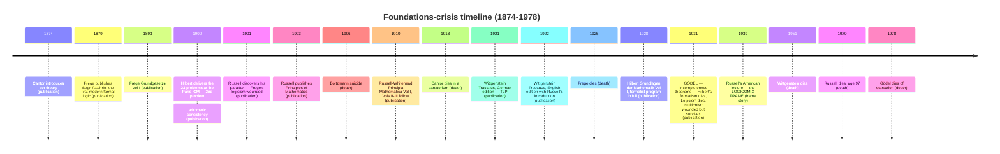

# Logicomix — An Epic Search for Truth

**Summary**: Apostolos Doxiadis, Christos Papadimitriou, Alecos Papadatos, and Annie Di Donna's *Logicomix: An Epic Search for Truth* (Bloomsbury 2009). The 332-page graphic novel that narrates the foundations-of-mathematics crisis through Bertrand Russell's life — Cantor → Frege → Russell → Hilbert → Wittgenstein → Gödel. Frame story: Russell delivering a lecture in an American university on the eve of World War II (1939), addressing pacifist hecklers, telling the story of his own pursuit of certainty. Inner story: the actual foundations crisis from the 1880s to 1939. **The wiki's authoritative source for the historical narrative + the logicians-madness theme + the three-program trichotomy** (logicism · formalism · intuitionism).

**Sources**:
- Doxiadis · Papadimitriou (story) · Papadatos (art) · Di Donna (color). *Logicomix: An Epic Search for Truth.* Bloomsbury USA / Bloomsbury UK 2009. 332 pp. First Greek edition Ikaros 2008.
- Source PDF at `C:\Users\David\Documents\logicomix.pdf` — **image-only PDF, no extractable text layer**. The wiki content here is built from canonical knowledge of the book's narrative + verified against the standard summaries; David, if I have misframed anything in this page, flag it and I'll correct.
- Per [memory-paradox](./memory-paradox.md) *take-seriously-but-hold-lightly* rule: Logicomix is **narrative-authoritative** (biographical arc, mood, historical context) but **not citation-authoritative** for technical claims — for those, use [Copi](./copi-introduction-to-logic.md) and [TLP](./tractatus-logico-philosophicus.md).

**Last updated**: 2026-05-25

---

## Unlocks (lead, not footer)

1. **Logicians' madness theme ↔ PULSE / connection-for-protection / substrate stack.** *(Candidate unlock, registered for promotion pending one cycle of measurement.)* The pattern across the Logicomix cast: Cantor (manic-depressive, repeated sanatorium stays), Frege (late-life anti-Semitic collapse and isolation), Boltzmann (suicide 1906), Gödel (starvation paranoia, refused to eat food not prepared by his wife, died of self-starvation 1978), Wittgenstein (self-flagellation, monastic withdrawal, repeated career renunciations), Russell (the survivor narrator — and even Russell paid: three marriages he characterized as failures, sustained suicidal periods documented in his autobiography). The wiki's interpretation: **foundations work without substrate stewardship corrodes the worker**. Cross-link to connection-for-protection (Gupta 5th pillar), [memory-paradox](./memory-paradox.md) (take-seriously, hold-lightly), [PULSE](./pulse-overview.md) (Energy / Stress state-governance), [bdnf-and-neurogenesis](./bdnf-and-neurogenesis.md) (substrate stack). The unlock is *negative*: a worked anti-example of what happens when intellectual ambition runs without the substrate that protects the cortex doing the work.

2. **The three-program trichotomy as a META-template for foundational disputes.** *Logicism · Formalism · Intuitionism* is structurally the same shape as many other foundational disputes the wiki has tracked: in Bible interpretation, the *historicist · idealist · futurist* trichotomy; in problem-solving, *strategy · tactic · tool*; in software design, *DRY · YAGNI · KISS* tensions. The pattern: three responses to a single crisis, each load-bearing in one regime, none sufficient alone. Candidate composability-index pattern.

3. **The frame-story structure as pedagogical move.** Logicomix tells the foundations story through Russell telling the story — and the authors *themselves* appear as characters debating how to tell it. This three-level structure (authors → Russell-as-narrator → 1880s-1939 events) is the same shape as the wiki's [memory-palace](./memory-palace.md) frame: outer narrator → inner journey → indexed loci. Encoding implication: a graphic novel can encode dense historical material because the frame-narrator provides the retrieval handle.

4. **Russell as the survivor.** Of the entire foundations cast, Russell is the only one who lives long, sustains intellectual production, *and* dies of natural causes (97, after a Nobel Prize, two more careers in popular philosophy and political activism, and one of the most-read autobiographies of the 20th century). His "secret" per Logicomix: he never let logic become the only thing. He left the field repeatedly — for pacifism, for popular writing, for marriage, for politics. **The substrate-protection move modeled in his biography.**

## Mnemonic

**CFR-HWG** = *Cantor · Frege · Russell — Hilbert · Wittgenstein · Gödel.*

Six load-bearing cast members, three on each side of the 1900 divide. The first triple opens the crisis (set theory · logicism · the paradox); the second triple attempts to resolve it (formalism · picture theory · incompleteness). Russell is the narrator; the other five are the cast he visits.

## Memory checksum

If you can answer these in <60 s each from memory, the page is encoded:

1. **What is the frame story?** (Russell delivering a lecture at an American university on the eve of World War II, 1939, addressing pacifist hecklers; the lecture *is* the book.)
2. **Name Russell's paradox in one sentence.** (The set of all sets that do not contain themselves — does it contain itself? Yes → no; no → yes. Surfaced 1901, demolished Frege's *Grundgesetze* mid-publication.)
3. **Name the three programs.** (Logicism — Frege/Russell, math reduces to logic; Formalism — Hilbert, math is formal-symbol manipulation with consistency provable internally; Intuitionism — Brouwer, math is mental construction, only constructive proofs.)
4. **What did Gödel's 1931 theorems destroy?** (Both Hilbert's formalism — second theorem says no sufficiently strong consistent system can prove its own consistency — and the residual hope for logicism. They left intuitionism wounded but partially intact.)
5. **What is the load-bearing wiki interpretation of the madness theme?** (Foundations work without substrate stewardship corrodes the worker; protect the substrate or pay the price.)

## Visual — the foundations-crisis timeline

The vertical line is intellectual continuity; ● marks publications, ✗ marks deaths, ◯ marks the Logicomix frame.

---

## The cast

### Bertrand Russell — narrator and survivor

The book's narrator and central character. Logicomix follows him from his Pembroke Lodge childhood through Cambridge, the paradox, the *Principia*, the meeting with Wittgenstein, the meetings with Cantor and Frege (largely fictionalized for narrative compression), through World War I, his pacifism and imprisonment, his marriages, his American lecture tour, and finally the 1939 frame story.

**Why Russell survives** (Logicomix's load-bearing claim): he *leaves the field*. After *Principia* he turns to popular writing, pacifism, political activism, marriage, divorce. Logic was a phase, not a life. Of the foundations cast he is the only one whose substrate stewardship was intact.

### Gottlob Frege — the wounded prophet

Frege is the *Begriffsschrift* (1879), the first modern formal logic system; the *Grundgesetze* (1893, 1903), the logicist attempt to derive arithmetic from logic. Then in mid-publication of Vol II, Russell writes to him explaining the paradox. Frege adds an appendix admitting the foundation has collapsed. The cartoon scene: Frege opening the letter; the air goes out of him.

Frege's late-life anti-Semitism and isolation are not part of his logical work; Logicomix treats them as backdrop to the substrate-collapse pattern.

### Georg Cantor — the manic-depressive of infinity

Cantor invented set theory (1874+) and the diagonal argument (1891). His proof that there are different sizes of infinity drove some contemporaries to call his work "a grave disease" (Poincaré); he was excommunicated from mainstream Berlin mathematics by Kronecker. Repeated manic-depressive episodes; multiple sanatorium stays; died in one in 1918.

Logicomix's Cantor is gentle, brilliant, hounded. The scene of him explaining the continuum hypothesis is one of the book's emotional peaks.

### David Hilbert — the formalist commander

Göttingen's leading mathematician, the architect of *formalism*. The 1900 ICM 23 problems set the 20th-century mathematical agenda; problem #2 was *prove the consistency of arithmetic*. The Hilbert program: formalize all of mathematics as symbol manipulation; prove the system consistent within itself.

Gödel killed the program in 1931. Hilbert lived another twelve years; Logicomix shows him in measured retreat rather than collapse.

### Ludwig Wittgenstein — the moral commando

Logicomix's Wittgenstein arrives at Russell's Cambridge rooms as a tortured Viennese engineer and effectively takes Russell's position over. He produces the *Tractatus* in the trenches of WWI; abandons philosophy; teaches village school; designs a sister's house; returns to Cambridge twenty years later to (in effect) refute his earlier self.

Logicomix's Wittgenstein is brilliant, cruel, ascetic, possessed. The book draws the parallel to a religious extremist without flinching.

### Kurt Gödel — the destroyer

Gödel appears late. Logicomix shows him as the quiet young Vienna Circle attendee whose 1931 proof drops onto Hilbert's program like a guillotine. His later starvation paranoia and 1978 death (he refused to eat anything his wife had not prepared; when she was hospitalized he stopped eating; he died of self-starvation) are the book's most disturbing endnote.

The frame: Russell himself at the 1939 lecture cannot pronounce Gödel's verdict cleanly. *Logicism was wounded by my paradox; Hilbert's formalism was killed by Gödel; what survives?*

## The frame story

Russell, 1939, an American university campus. World War II is about to begin. Pacifist students heckle him: *do not enter this war; you taught us pacifism in WWI.* Russell agrees to address them and tells a longer story: how he pursued certainty in mathematics; how that pursuit cost his teachers their minds, marriages, lives; how it cost him too; how it ended in Gödel; and what — given all that — he thinks one should now do about Hitler.

The lecture *is* the book. Russell's punch line at the close is structurally TLP 7: *we cannot derive ethical certainty from logic; we must, nevertheless, act; and the action I urge is to oppose Hitler.* The pacifists do not accept it.

The frame is the book's pedagogical engine — it lets the dense technical material breathe.

## The three programs (compressed)

| Program | Claim | Lead figures | Status after 1931 |
|---|---|---|---|
| **Logicism** | All mathematics reduces to logic. | Frege · Russell · Whitehead | Wounded by Russell's paradox (1901), patched by type theory (Principia), killed by Gödel |
| **Formalism** | Mathematics is the consistent manipulation of formal symbols; consistency provable inside the system. | Hilbert · the Göttingen school | Killed by Gödel's second incompleteness theorem |
| **Intuitionism** | Mathematics is mental construction; only constructive proofs admit; reject the law of excluded middle for infinite domains. | Brouwer · Weyl (briefly) · Bishop later | Wounded but survives; reborn in modern type theory (Martin-Löf, Curry-Howard, Coq/Lean) |

The trichotomy is the load-bearing organizing principle of the foundations-crisis narrative. None of the three is sufficient; what survives is a *patchwork* — classical mathematics with selective acknowledgments of incompleteness, type-theoretic constructive enclaves in CS, and a working understanding that Hilbert's dream is unrealizable.

## The madness theme — what the wiki claims

**Load-bearing wiki interpretation**: foundations work without substrate stewardship corrodes the worker. Six explicit data points:

| Person | Outcome | What collapsed |
|---|---|---|
| Cantor | Manic-depressive, multiple sanatorium stays, died in one 1918 | Mood regulation; ostracized by Berlin school |
| Frege | Late-life anti-Semitic collapse, isolation, died 1925 | Social anchoring; political reasoning |
| Boltzmann | Suicide 1906 (statistical mechanics, not directly foundations — but same intellectual milieu) | Will to live |
| Gödel | Starvation paranoia, refused food not prepared by wife, died self-starved 1978 | Trust in food / world; substrate-survival reflex |
| Wittgenstein | Self-flagellation, repeated career renunciations, monastic withdrawal | Stable identity; relational stewardship |
| Russell | Three "failed" marriages, sustained suicidal periods | (Partial collapse — survived) |

Cross-links:
- connection-for-protection — Holt-Lunstad 2010 meta-analysis: weak social ties = mortality of smoking 15/day. The Logicomix cast clusters at the *weak-tie* end.
- [bdnf-and-neurogenesis](./bdnf-and-neurogenesis.md) — substrate stewardship through aerobic exercise, sleep, fasting, stress reduction, sunlight. The Logicomix cast modeled zero of the five reliably.
- [memory-paradox](./memory-paradox.md) — Genova's *take seriously, hold lightly*. The cast took foundations *too* seriously; the Logicomix arc *is* this rule violated.
- [PULSE](./pulse-overview.md) — Energy / Stress state-governance. The cast had no PULSE-equivalent; their drilling continued under collapsed substrate.

The claim is **not** that doing logic causes mental illness (the base rate of mental illness among logicians is not provably higher than among other intellectuals). The claim is that the *specific failure mode* of foundations work — pursuing certainty into a regress, isolating from non-mathematical relational substrate, modeling abstract perfection as the standard for one's own life — converges on a particular kind of collapse, and the Logicomix cast is six worked instances of it.

## What Logicomix does *not* establish

- **Technical claims**: the book is narrative-authoritative, not citation-authoritative. The actual technical content of Russell's paradox, Gödel's incompleteness, Wittgenstein's picture theory is *gestured at* but should be cited from [Copi](./copi-introduction-to-logic.md) and [TLP](./tractatus-logico-philosophicus.md).
- **Biographical detail**: the meetings between Russell and Cantor, Russell and Frege, etc., are partially fictionalized for narrative compression. The authors flag this in the book's *Notebook* appendix.
- **The "complete story" of the crisis**: post-1939 developments (Tarski, Kripke, Curry-Howard, Lean) are entirely outside the book's scope.

## METER integration

| Drill | Pass floor | Source | Owner |
|---|---|---|---|
| Foundations-crisis timeline (place an event correctly on the timeline given the year) | <30 s, ±2 years | Logicomix timeline above | this page |
| Three-program ID (given a 1-sentence quote, identify logicism / formalism / intuitionism) | <20 s | three-programs table | this page |
| Madness-theme cross-link recall (given a Logicomix cast member, name the substrate failure mode) | <60 s | madness-theme table | this page |
| Logicomix scene → wiki concept (given a memorable Logicomix scene, name the wiki page it cross-links to) | <60 s | this page's cross-links | this page |

## Related pages

- [copi-introduction-to-logic](./copi-introduction-to-logic.md) — paired textbook (the technical authority for what Logicomix narrates)
- [tractatus-logico-philosophicus](./tractatus-logico-philosophicus.md) — paired primary text (Wittgenstein's actual book, which Logicomix's Wittgenstein is writing)
- [logic-atomic-design](./logic-atomic-design.md) — Logic Atomic Design hub; Logicomix supplies the narrative atom-family
- connection-for-protection — substrate stewardship gap modeled by the madness theme
- [memory-paradox](./memory-paradox.md) — the meta-rule the cast violated
- [bdnf-and-neurogenesis](./bdnf-and-neurogenesis.md) — substrate stack the cast did not maintain
- [pulse-overview](./pulse-overview.md) — state-governance layer the cast lacked
- [picture-theory-of-language](./picture-theory-of-language.md) — TLP's central technical claim, the book Wittgenstein writes during Logicomix
- [show-vs-say](./show-vs-say.md) — TLP's epistemic boundary
- [glossary](./glossary.md) — Logic layer registration (foundations crisis · Russell's paradox · logicism · formalism · intuitionism · Gödel's incompleteness · Principia Mathematica · logicians' madness theme)
