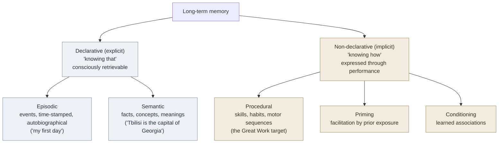

# Long-Term Memory — Storage, Retrieval, and Consolidation

**Summary**: Long-term memory is the durable, high-capacity store that everything in the wiki is ultimately trying to write to — the downstream end of the [memory-systems](./memory-systems.md) pipeline. It is not one store but a branching taxonomy (declarative vs non-declarative; episodic vs semantic; procedural), and it is not a recording but a *reconstruction*: every retrieval re-derives the trace and can alter it. The wiki's encoders write to it, [spaced-repetition](./spaced-repetition.md) keeps it from decaying, and [sleep](./sleep-dependent-memory-consolidation.md) is when the writes actually commit.

**Sources**:
- Endel Tulving, "Episodic and Semantic Memory" (1972); the episodic/semantic split.
- Larry Squire, declarative / non-declarative taxonomy (1992).
- Hermann Ebbinghaus, *Über das Gedächtnis* (1885) — the forgetting curve.
- Lisa Genova, *Remember* (2021) — encoding/consolidation/storage/retrieval framing (owner: [memory-systems](./memory-systems.md)).
- [memory-systems](./memory-systems.md) — the hub this page anchors.

**Last updated**: 2026-08-24 (synonym ghost link *retrieval-practice* dissolved into its owner [active-recall](./active-recall.md) — same concept, two names); 2026-06-05

---

## Why this page exists

The wiki has deep pages on *specific* long-term-memory phenomena — [memory-reconsolidation](./memory-reconsolidation.md) (retrieval alters the trace), [spaced-repetition](./spaced-repetition.md) (spacing beats the forgetting curve), [prospective-memory](./prospective-memory.md) (remembering future intentions), [tip-of-the-tongue](./tip-of-the-tongue.md) (retrieval failure with partial access) — but no page naming the *store* they are all phenomena *of*. This is the storage-side anchor, the sibling of [working-memory](./working-memory.md) on the capacity side.

## The taxonomy (which kind of memory)

Long-term memory branches. Knowing which branch a target lives in tells you which encoder and which drill apply.

The wiki's machinery splits along this seam:
- **Semantic** targets get the encoder spine ([NEDF](./nedf-overview.md) for facts, [CAST](./cast-overview.md) for structured systems) and [spaced-repetition](./spaced-repetition.md).
- **Episodic** richness is what the [memory-palace](./memory-palace.md) *borrows* — it parasitizes the brain's strong episodic/spatial memory to carry semantic payload.
- **Procedural** targets go through [The Great Work](./automaticity-and-reflex-training.md) and the [Red Queen Gym](./red-queen-skill-gym.md) — drill, not flashcards, because procedural memory is built by *doing*, not by *describing* (see [factual-knowledge-precedes-skill](./factual-knowledge-precedes-skill.md)).

## Storage is reconstruction, not playback

The single most important property: long-term memory does not store a recording. Retrieval *reconstructs* the trace from distributed fragments, and the act of reconstruction can rewrite it — the mechanism owned by [memory-reconsolidation](./memory-reconsolidation.md). Consequences the wiki leans on:

- **Retrieval strengthens** — pulling a memory out is a stronger write than re-reading it. This is why [active recall / retrieval practice](./active-recall.md) beats restudy.
- **Retrieval can corrupt** — a reactivated memory is briefly labile; this is the lever behind misinformation effects and the reason eyewitness memory is unreliable.
- **Cues matter** — a trace can be intact but inaccessible without the right cue ([tip-of-the-tongue](./tip-of-the-tongue.md)). Encoding specificity: you retrieve best in the context you encoded in.

## Consolidation — when the write commits

Encoding puts a fragile trace in play; **consolidation** stabilizes it. Two timescales:

- **Synaptic consolidation** — minutes to hours, local synaptic strengthening.
- **Systems consolidation** — days to years; the hippocampus gradually hands the trace off to distributed neocortex. This is largely a *sleep* process — see [sleep-dependent-memory-consolidation](./sleep-dependent-memory-consolidation.md) and the biological substrate in [bdnf-and-neurogenesis](./bdnf-and-neurogenesis.md).

The forgetting curve (Ebbinghaus 1885) is the default decay if nothing intervenes; [spaced-repetition](./spaced-repetition.md) schedules retrievals at the points of near-forgetting to flatten it. The pairing — *space the retrieval, then sleep on it* — is the complete commit path.

## METER hooks

- `ltm.retrieval_success_rate` — fraction of targeted items recalled cold at the scheduled interval.
- `ltm.consolidation_sleep_logged` — whether a learning session was followed by adequate sleep before the next retrieval.

## Related pages

- [memory-systems](./memory-systems.md) — the hub; long-term memory is its storage stage
- [working-memory](./working-memory.md) — the upstream gate that feeds this store
- [memory-reconsolidation](./memory-reconsolidation.md) — why retrieval can rewrite the trace
- [spaced-repetition](./spaced-repetition.md) — scheduling retrievals against the forgetting curve
- [sleep-dependent-memory-consolidation](./sleep-dependent-memory-consolidation.md) — when systems consolidation happens
- [active-recall](./active-recall.md) (a.k.a. retrieval practice) — retrieval as the strongest write
- [tip-of-the-tongue](./tip-of-the-tongue.md) — intact trace, failed cue
