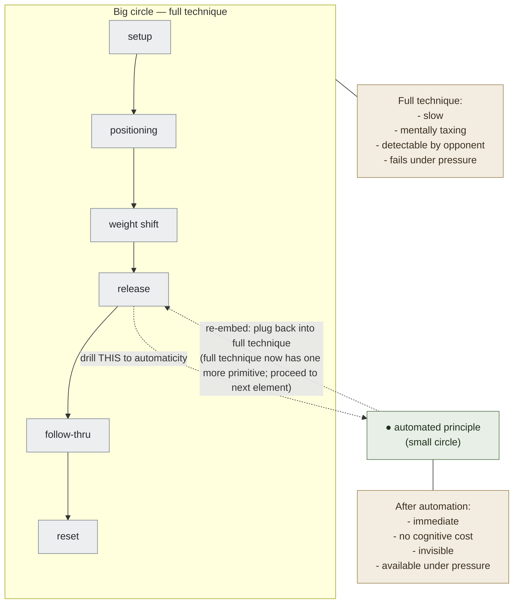

# Making Smaller Circles — Waitzkin

**Summary**: "Making Smaller Circles" is Josh Waitzkin's technique from *The Art of Learning* (2007) for **drilling deeply into a micro-principle until it is automatic, then layering that automation as a foundation for larger structure**. The name comes from Waitzkin's Tai Chi Push Hands training: after mastering a large releasing motion, the teacher told him to make the circle smaller — to get the same release power from a progressively tighter movement, until the release was imperceptible and could not be countered. The pedagogical principle is a specific instantiation of [chunking](./chunking.md): reduce the motion / concept / technique to its *minimal viable form*, automate that form completely, then expand. Waitzkin applies it to chess (internalizing tactical patterns down to their barest structure), Tai Chi, and argues it is generalizable to any domain. The canonical owner of this formulation as a named learning principle is this page.

**Sources**:
- Waitzkin, J. (2007). *The Art of Learning: An Inner Journey to Optimal Performance*. Free Press. — primary source; the technique is named in Ch 9–11.
- Chase, W. G., & Simon, H. A. (1973). "Perception in Chess." *Cognitive Psychology*, 4(1), 55-81. — chunking as expert perception foundation.
- Ericsson, K. A., Krampe, R. T., & Tesch-Römer, C. (1993). "The Role of Deliberate Practice in the Acquisition of Expert Performance." *Psychological Review*, 100(3), 363-406. — deliberate practice; micro-drilling within a domain.
- Internal: [chunking](./chunking.md), [deliberate-practice](./deliberate-practice.md), automaticity, [soft-zone-vs-hard-zone](./soft-zone-vs-hard-zone.md), [investment-in-loss](./investment-in-loss.md).

**Last updated**: 2026-06-10

---

## The core mechanism

Waitzkin describes learning a release technique in Tai Chi. Initially the motion is large and obvious — "making a big circle." The opponent can see it coming and counter it. The teacher's instruction: **make the circle smaller**. Same principle, same power, tighter execution. Keep making it smaller until the opponent can no longer detect it — until the release initiates from *inside* the contact, invisible.

The principle transfers:

1. **Identify the essential element** — the underlying principle, not the full technique. In chess: the tactical pattern (fork, pin, skewer). In Tai Chi: the release vector. In coding: the invariant in the algorithm.
2. **Drill it at the smallest possible scale** — isolate the element from everything else. Remove context until only the essential element remains.
3. **Automate completely** — the element must be *immediate*: no conscious deliberation, no felt effort. This is automaticity at the micro level.
4. **Expand** — once the essential element is automatic, re-embed it in progressively larger contexts: first controlled scenarios, then realistic ones, then under pressure.

The power is in the **compression**: once the small circle is automated, it becomes a single unit (a [chunk](./chunking.md)) that the mind handles as a primitive. Larger patterns are then built from these compressed primitives rather than from raw material.

## Why it works: the chunking basis

Chase & Simon (1973) showed that chess experts don't see individual pieces — they see *patterns* of 4–9 pieces as single perceptual units (chunks). Grandmasters have ~50,000 such chunks; novices have ~100. The chunks are what enables expert speed and depth of search.

Making Smaller Circles is the **deliberate production** of chunks. By isolating a micro-principle and drilling it to automaticity, the learner creates one new chunk. Repeat across the domain and the expert chunk library assembles. This is the mechanism under Ericsson's [deliberate-practice](./deliberate-practice.md): effective deliberate practice is not general rep accumulation — it is the targeted assembly of domain-specific mental representations.

## Application across domains

| Domain | "Big circle" | "Small circle" (essential element) |
|---|---|---|
| Chess | Full game | A single tactical pattern (fork with specific piece pair); drill in 5-move isolation |
| Martial arts | Full technique | The release vector; the weight shift; drill on a single joint |
| Music | Full piece | The difficult bar; the awkward fingering; drill at half-speed |
| Programming | Full feature | The data-structure invariant; the recursion base case; write it in isolation |
| Language | Full conversation | The irregular verb pattern; the subordinate clause; produce 50 examples |
| Mental arithmetic | Full calculation | The ×9 trick; the complementary pair; drill to 2-second response |

The criterion for "small enough": when you can drill it **without deliberate attention** — the conscious bottleneck is fully offloaded. If it still requires thought, it is not yet a chunk; keep drilling.

## Making Smaller Circles vs. isolated drill

Making Smaller Circles is **not** general repetition or blocked practice. The distinction:
- **Blocked practice** (see [interleaving](./interleaving.md)): many reps of the same type → improves performance during practice, poor retention and transfer
- **Making Smaller Circles**: targeted isolation of the *essential principle* at its barest form, drilled to automaticity → the automated chunk then supports transfer *because* it was extracted from all contexts

The difference is the **abstraction move**: smaller circles drill the abstract principle, not a specific instance. A chess fork drill on King-Knight is making a small circle if the abstraction is "fork = two simultaneous threats"; it is blocked practice if the player is memorizing positions, not extracting the pattern.

## The progression: small → large

Waitzkin's teaching follows a specific sequence:

```
1. Large context (full game / fight / piece) — exposure and feel
2. Isolation — remove all but the essential element
3. Micro-drill — automate the essential element
4. Controlled expansion — re-embed in a slightly larger context (still controlled)
5. Realistic context — re-embed in full context, but now from a foundation of automation
6. Pressure — test under performance conditions; small circle must hold under stress
```

Step 6 (pressure testing) is where Waitzkin links to [investment-in-loss](./investment-in-loss.md): a learner who can only execute in controlled drill has not yet made the circle small enough. The circle is small enough when it works under full distraction and stress.

## Visual

**MAKING SMALLER CIRCLES — compression toward automaticity.**



## Failure modes

| Failure | What it produces |
|---|---|
| **Skipping isolation** | Drilling the full technique without decomposing it; the essential element never gets extracted; expertise stays surface-level |
| **Stopping before automaticity** | Able to do it when thinking about it; fails under pressure because it was never automated |
| **Drilling an instance, not a principle** | Memorizing a specific position/example; cannot transfer when context changes slightly |
| **Never re-expanding** | Staying in micro-drill forever; the chunk is available but not integrated into larger patterns |
| **Using big-circle drills to feel busy** | Playing full games / sparring full matches / writing full programs before the essential elements are automated — high activity, slow skill-building |

## Related pages

- [chunking](./chunking.md) — the cognitive mechanism; Making Smaller Circles is deliberate chunk-assembly
- [deliberate-practice](./deliberate-practice.md) — the broader framework; making smaller circles is a named practice move within it
- automaticity — the target state for each small circle
- [interleaving](./interleaving.md) — after small circles are automated, interleaving locks classification + execution
- [soft-zone-vs-hard-zone](./soft-zone-vs-hard-zone.md) — the pressure test: small circles that survive only in controlled env. are not yet automated
- [investment-in-loss](./investment-in-loss.md) — accepting the discomfort of drilling isolation vs. playing full context
- [mental-models-for-learning](./mental-models-for-learning.md) — the accumulated chunks form the expert's mental model

---

## U — See (CAST)
1. Making Smaller Circles = isolate essential principle → drill to automaticity → re-embed in larger context
2. The circle is small enough when it executes without thought, even under pressure

## D — Name (NEDF)
1. Making Smaller Circles = Waitzkin's named technique for deliberate micro-principle automation
2. Distinguisher: abstract principle extraction (not repetition of full technique or specific instance)
3. Failure mode: drilling instances (not principles) → no transfer

## F — Do (SPEAR)
1. Identify current performance bottleneck → isolate the essential element → drill in isolation until automatic → re-embed
2. Test under pressure: if it fails, the circle was not small enough

## B — Watch (HEART)
1. Feels busy but not improving → check: drilling full context vs. isolated principle
2. Works in practice, fails under pressure → not yet automated; return to isolation

## L — Predict (ORACLE)
1. Essential element automated → reappears in full context without effort
2. Isolated drill skipped → technique available only with deliberate effort; degrades under pressure

## R — Act (GRACE)
1. Current skill plateau → name the essential element that is not yet automatic → make a smaller circle
2. Pressure-test every circle before calling it "learned"
