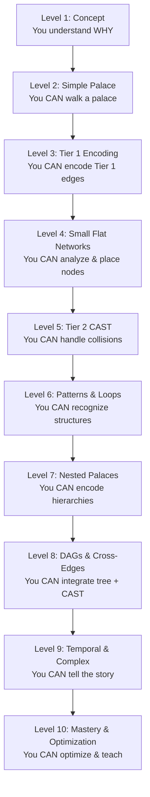

# CAST Maturity Levels: Learning Progression (1-10)

**Summary**: A 10-level progression system from abstract understanding to mastery-level [CAST](./cast-overview.md) encoding. Levels indicate both skill depth and graph complexity you can handle. Each level is a prerequisite for the next.

**Sources**: CAST Maturity Levels.md

**Last updated**: 2026-09-04 (ingest-ghost pass: the ten `maturity-N-*` self-links de-linked — this page carries every rung, the sub-pages were never written; two malformed table links repaired; the two unwritten worked examples named as gaps); 2026-08-20 (§Visual authored — diagram replaces the TODO stub); 2026-08-20 (§Checksum authored — 3 falsifiable retrieval questions replace the TODO stub); 2026-08-20 (§Mnemonic authored — TODO stub replaced with a real device); 2026-08-20 (`glyph:` assigned — [representation-rules](./representation-rules.md) Rule 11); 2026-04-29

---

## Quick Reference Table

| Level | Name | Focus | Time | Graph Type | Example |
|-------|------|-------|------|-----------|---------|
| **1** | Concept | Understanding connection matters | 1-2 days | None | Recognizing systems are hard |
| **2** | Loci Foundation | Simple memory palaces | 3-5 days | Simple palace | To-do list, speech outline |
| **3** | Tier 1 Encoding | Verb-only distinct edges | 1 week | Flat 5-8 nodes | Small web service |
| **4** | Small Flat Networks | Graph analysis & placement | 1-2 weeks | Flat 6-12 nodes | 10-node API architecture |
| **5** | Tier 2 Collisions | CAST decision-making | 2-3 weeks | Flat with 1-3 collisions | Multi-database system |
| **6** | Feedback Loops & Patterns | Pattern recognition | 1-2 weeks | Networks + 1-2 loops | Financial bubble, circular dependency |
| **7** | Nested Palaces | Tree edge geometry | 1-2 weeks | Pure trees + DAGs | Org chart, file system |
| **8** | DAGs & Cross-Edges | Multiple parent nodes | 4-6 weeks | DAG with diamonds | Math prerequisites, inheritance |
| **9** | Temporal & Complex | Integration & narrative | 4-6 weeks | Any + evolution | Financial crisis, system evolution |
| **10** | Mastery & Optimization | Teaching & optimization | 50+ hours ongoing | Any size/type | 100-node systems, novel applications |

---

## What Maturity Means

### Not Just Skill Level

Maturity is **not** a measure of how smart you are. It's a measure of:

✅ How many techniques you've mastered
✅ What types of graphs you can handle
✅ How fast you can encode them
✅ How durable your memory stays

A Level 3 student can encode a 100-node graph **if it has only Tier 1 edges** (no collisions, no loops, no hierarchy). They just don't have the techniques for complex relationships.

A Level 10 master can encode a 20-node complex graph faster than a Level 3 student can encode a simple 8-node graph.

**The goal**: Raise your maturity so you can handle increasingly complex graphs efficiently.

---

## How to Progress

### Prerequisites

**You cannot skip levels.** Each level builds on all previous levels.

- Level 3 requires Level 2 (if you can't walk a simple palace, Tier 1 scenes won't stick)
- Level 5 requires Levels 3-4 (collision handling only works if you already do Tier 1 well)
- Level 8 requires Levels 2-7 (you need nested palace PLUS Tier 2 to handle DAGs)

### Self-Assessment

Ask yourself:

| Level | Question | If yes, you're ready |
|-------|----------|---------------------|
| **1** | Do I understand that connections are the hard part? | → Move to 2 |
| **2** | Can I build and walk a 10-15 room palace with one image per room? | → Move to 3 |
| **3** | Can I encode 5-8 nodes with distinct Tier 1 verb edges? | → Move to 4 |
| **4** | Can I analyze in-degree, place nodes strategically, and walk a graph? | → Move to 5 |
| **5** | Can I identify edge collisions and upgrade them to Tier 2 CAST? | → Move to 6 |
| **6** | Can I recognize Lego Skill patterns and encode feedback loops? | → Move to 7 |
| **7** | Can I build nested palaces for pure trees and DAGs? | → Move to 8 |
| **8** | Can I handle 10-20 node DAGs with multiple cross-edges and diamonds? | → Move to 9 |
| **9** | Can I encode temporal graphs with biography, sub-palaces, and full integration? | → Move to 10 |
| **10** | Can I teach CAST to others and optimize encoding for different contexts? | → You're here |

---

## Time Estimates

### Foundation (Levels 1-3)
- **1-2 weeks** to get basic understanding
- **Daily practice**: 20-30 min
- **Milestone**: Encode a simple 5-node graph with Tier 1 edges

### Core (Levels 4-6)
- **4-6 weeks** to build solid skill
- **Daily practice**: 30-45 min
- **Milestone**: Identify collisions and upgrade to Tier 2; recognize patterns

### Advanced (Levels 7-9)
- **10-16 weeks** (2-4 months) to integrate advanced techniques
- **Daily practice**: 45-60 min
- **Milestone**: Encode 20-30 node complex graphs with feedback loops

### Mastery (Level 10)
- **50+ hours** of deliberate practice (ongoing)
- **Deep work**: 60-90 min sessions, 4-5x per week
- **Milestone**: Teach others, optimize for novel contexts, solve custom encoding problems

---

## Worked Examples by Level

### Level 3 Example: Web Service
- 5 nodes, 4 edges, all Tier 1
- Flat network, no collisions
- *(worked example unwritten — the 4-service kitchen graph in [cast-overview](./cast-overview.md) is this one node smaller)*

### Level 4 Example: City Streets
- 5 intersections, 8 streets (one-way and two-way)
- Spatial graph, real-world palace
- See [City Streets Example](./cast-example-city-streets.md)

### Level 8 Example: University Math Program
- 13 courses, prerequisites form a DAG
- Three diamond patterns (multiple prerequisites)
- Nested palace + cross-edges
- See [University Math Program Example](./cast-example-math-program.md)

### Level 9 Example: 2008 Financial Crisis
- 12 nodes, 2 amplifying feedback loops
- Temporal evolution (before/during/after)
- Biography encoding (story arc)
- *(worked example unwritten — st-example-financial-system is an empty 2026-04-30 stub, not a substitute)*

---

## Maturity vs. Graph Complexity

**Important distinction:**

- **Your maturity level** = which techniques you can use
- **Graph complexity** = how many nodes, edges, relationship types, feedback loops

```
Level 5 student + simple 8-node graph
= faster, more reliable than
Level 3 student + simple 8-node graph

BUT:

Level 3 student + 100-node flat graph
= still impossible (no tools for that size)

whereas

Level 10 master + 100-node complex graph
= fast and durable (has all the tools)
```

The maturity levels exist to **multiply your capability**. You don't jump from "can't encode graphs" to "can encode anything." You progress through techniques.

---

## Progression Chart



---

## Using Maturity Tags in the Wiki

Each page in the wiki is tagged with its **minimum required maturity level**:

```markdown
[[level-tag: 3]]  Simple Tier 1 verb scenes
[[level-tag: 5]]  CAST decision guide (requires collision handling)
[[level-tag: 9]]  Biography encoding (requires integration)
```

When you're at Level 4, you can read Level 1-4 pages easily. Level 5+ pages will be harder—that's OK. **You're building toward them.**

---

## Deliberate Practice for Each Level

### Level 3: Tier 1 Mastery
1. Encode 5 different small graphs (5-8 nodes each)
2. Practice identifying distinct verbs
3. Build edge bundles (list all outgoing edges at each node)
4. Walk each graph from memory

### Level 4: Graph Analysis
1. Analyze 5 graphs by hand (in-degree, bridges, leaves)
2. Assign Georgian letters correctly
3. Draw palace placement for each graph
4. Walk from highest in-degree node

### Level 5: Collision Handling
1. Take graphs from Level 4, introduce ONE collision at a time
2. Identify which edges collide
3. Upgrade only those edges to Tier 2
4. Use the CAST decision guide to pick slots
5. Walk the mixed-tier graph

### Level 6: Pattern Recognition
1. Find 3 graphs that contain Lego Skill patterns
2. Name each pattern (hub-spoke, linear chain, cascade, etc.)
3. Encode the pattern as a single chunk
4. Encode individual nodes and deviations separately
5. Compare: pattern-chunked version vs. node-by-node encoding

### Level 7: Nested Palace
1. Take a pure tree (org chart, file system, taxonomy)
2. Build a nested palace (rooms inside rooms)
3. Use sibling sequences for breadth
4. Use size encoding for depth
5. Walk from root to every leaf, then back

### Level 8: DAG Cross-Edges
1. Take a DAG with 2-3 diamond patterns
2. Encode tree edges with nested palace geometry
3. Encode cross-edges with Tier 2 CAST
4. Note which edges changed categories
5. Walk and verify all paths converge correctly

### Level 9: Integration
1. Take a temporal graph (process unfolding over time)
2. Apply SCAMPER (simplify before encoding)
3. Build nested palace for hierarchy
4. Add Tier 2 CAST for cross-edges
5. Apply Biography (story arc)
6. Compress story into one mnemonic spine

### Level 10: Mastery
1. Encode the same graph three different ways
2. Time each encoding
3. Compare durability (which is easier to recall?)
4. Teach a Level 3 student one technique
5. Solve a custom encoding problem (graph type you haven't seen)

---

## Related Pages

- [CAST Overview](./cast-overview.md) — full system
- The ten rungs are **on this page** (§Quick Reference Table); the per-level `maturity-N-*` pages promised by the 2026-04-30 ingest were never written and are not needed — this page carries each rung plus its deliberate practice
- [Example: City Streets](./cast-example-city-streets.md) — worked, flat network
- [Example: Math Program (Level 8)](./cast-example-math-program.md) — worked, DAG
- *Example: Web Service (Level 3)* and *Example: 2008 Crisis (Level 9)* — **unwritten**; the Level 3 slot is served by the 4-service graph in [cast-overview](./cast-overview.md), the Level 9 slot has no substitute


---

## U — See (CAST)
1. 10 maturity levels for CAST encoding skill
2. Each level a prerequisite for next

## D — Name (NEDF)
1. Maturity levels overview = 10-level CAST progression
2. Distinguisher: skill depth + graph complexity together
3. Failure mode: skipping levels

## F — Do (SPEAR)
1. Self-assess current level
2. Drill to clear next-level criteria

## B — Watch (HEART)
1. Level-skipping
2. Self-assessment inflation

## L — Predict (ORACLE)
1. Current level → predict next-level skills
2. Material → predict required level

## R — Act (GRACE)
1. CAST work → check current level
2. Stuck → drill prerequisite level

## Mnemonic

**"Depth and width climb together."** Each level names *both* how deep the skill runs and how complex a graph it can hold — they are one ladder, not two. Skipping a rung shows up as a graph you can draw but cannot walk. Level numbering is owned by [skill-progression-stages](./skill-progression-stages.md).

## Checksum

1. What two things does a single level number tell you at once?
2. Why is each level a prerequisite rather than a label you assign yourself?
3. What does skipping a rung look like in practice, when you try to use the skill?


## Visual

**One ladder carrying two readings at once** — how deep the skill runs, and how complex a graph it can hold. Level numbering is owned by [skill-progression-stages](./skill-progression-stages.md).

```
   skill depth                          graph complexity
        ▲                                       ▲
        │  ┤ mastery        ─────────  temporal, layered
        │  ┤                ─────────  DAGs
        │  ┤ fluent         ─────────  hierarchies
        │  ┤                ─────────  recurring patterns
        │  ┤ working        ─────────  second-tier scenes
        │  ┤                ─────────  flat networks
        │  ┤ novice         ─────────  first-tier edges
        │  ┤                ─────────  loci
        │  ┤ orientation    ─────────  one concept
        └──┴──────────────────────────────────────▶
```

They climb **together**. Skipping a rung shows up later as a graph you can draw but cannot walk.

