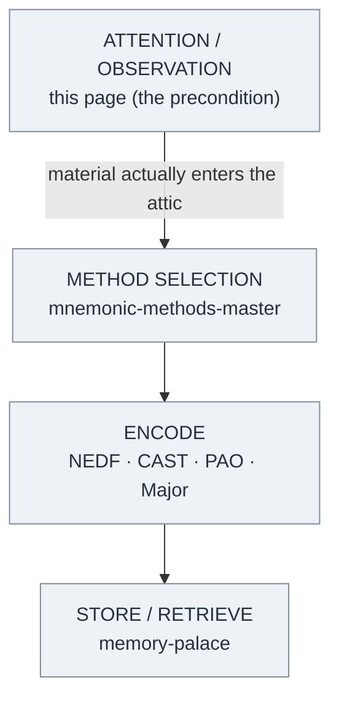

# Memory Is the Residue of Thought

**Summary**: The precondition that sits upstream of every mnemonic technique — you remember what you *think about*, so encoding cannot happen to material you never actually attended to. Unites Daniel Willingham's classroom principle ("memory is the residue of thought") with Maria Konnikova's Motivation to Remember (MTR) mechanism, and names the failure mode where vivid imagery is bolted onto unattended material (the "junk attic").

**Sources**:
- Maria Konnikova - Mastermind How to Think Like Sherlock Holmes - 2013.epub (Ch. 2, "The Brain Attic") — MTR + brain-attic metaphor
- Daniel Willingham, *Why Don't Students Like School?* — origin of the phrase "memory is the residue of thought" *(external canon; internal owner: [willingham-cognitive-principles](./willingham-cognitive-principles.md))*
- [mnemonic-methods-master](./mnemonic-methods-master.md)
- [attention-framework](./attention-framework.md)
- [memory-palace](./memory-palace.md)

**Last updated**: 2026-07-10

---

## The Precondition Upstream of Every Encoder

Neural OS treats mnemonic technique as a stack: pick a method from [mnemonic-methods-master](./mnemonic-methods-master.md), encode with an encoder like [NEDF](./nedf-overview.md) or [CAST](./cast-overview.md), and store it in a [memory-palace](./memory-palace.md). Every layer of that stack quietly assumes one thing that no encoder supplies: that the raw material actually entered your mind in the first place.

That assumption is what this page owns. **Memory is the residue of thought** is Willingham's principle: whatever a learner *thinks about* is what they remember, so you cannot design *what* is remembered except by designing *what is thought about*. The corollary that makes it operational: you cannot palace-encode, PAO-encode, or CAST-encode material you never attended to. Attention gates encoding. The technique stage is downstream of the observation stage — and when a memory attempt fails, it usually failed here, before any encoder ran.

## MTR — Motivation Gates Encoding, Not Retrieval

Konnikova supplies the mechanism. In her "Brain Attic" chapter she states the motivated nature of encoding directly: "we remember more when we are interested and motivated" (source: Maria Konnikova - Mastermind How to Think Like Sherlock Holmes - 2013.epub). She names this the **Motivation to Remember (MTR)** and locates its leverage precisely: MTR "is far more important at the point of encoding — and no amount of MTR at retrieval will be efficient if the information wasn't properly stored to begin with" (source: Maria Konnikova - Mastermind How to Think Like Sherlock Holmes - 2013.epub).

The place where motivation matters most is "the moment we are storing memories in our attics to begin with, and not afterward" (source: Maria Konnikova - Mastermind How to Think Like Sherlock Holmes - 2013.epub). This is the load-bearing point: straining to recall an under-attended fact later is wasted effort. The intervention has to happen at intake. Konnikova's own prescription is that we can activate MTR consciously — make a point of paying attention, tell ourselves "This, I want to remember," and solidify it immediately by talking it through, restating it, or turning it into a story (source: Maria Konnikova - Mastermind How to Think Like Sherlock Holmes - 2013.epub). That conscious attention pass *is* the doorway to every encoder that follows.

## The Brain Attic — Curation, Not Storage

Konnikova's governing metaphor is memory as a **brain attic**: the hippocampus is the attic's first entry point, where everything is placed before you know whether you will need it, and only material you "actively consider important" is consolidated into the long-term storage of the cortex (source: Maria Konnikova - Mastermind How to Think Like Sherlock Holmes - 2013.epub). The attic is not a passive warehouse — it is *curated*. What you let in (attention) and how you file it (association) determine what you can later retrieve.

Her worked example is the contrast between Holmes and Inspector Gregson. Both men once knew the Van Jansen case; Gregson lost it because he "lacked the requisite motivation and presence to retain his knowledge," while Holmes made "a conscious, motivated choice to remember" (source: Maria Konnikova - Mastermind How to Think Like Sherlock Holmes - 2013.epub). Same input, opposite residue — the difference was entirely at the attention/motivation stage, not the retrieval stage. The reassuring half of the metaphor: "it is possible to assert more control over the memories that do get encoded" (source: Maria Konnikova - Mastermind How to Think Like Sherlock Holmes - 2013.epub). That controllable lever is exactly what [attention-framework](./attention-framework.md) operationalizes.

## The Junk Attic — Named Failure Mode

The characteristic failure this page exists to diagnose is the **junk attic**: vivid mnemonic imagery bolted onto raw material that was never actually attended to or verified, producing a confident-but-false memory. Konnikova warns that if you let the world come unfiltered into the attic, "your mind will be filled with so much useless junk that even the information that happened to be useful is buried so deeply … that it might as well not even be there" (source: Maria Konnikova - Mastermind How to Think Like Sherlock Holmes - 2013.epub).

The junk attic is dangerous *because* the encoder worked. A memory palace built on an unobserved detail is still vivid, still retrievable, still confident — it is simply wrong. This is why a failed memory-palace attempt is almost never a failure of the palace. It is a failure one stage earlier: the material was never observed cleanly, so the encoder faithfully preserved a guess. The fix is not a better encoder. It is a deliberate attention pass *before* encoding.

## Where This Sits In The Stack



Every arrow assumes the one above it succeeded. Debug from the top: if recall is failing, check whether the detail was ever attended to before blaming the encoder.

## METER Integration

Measured as **observation-recall**. The metric is not "did you build a vivid image" — vividness is cheap and can be wrong. The metric is *fidelity of the attended detail over time*.

- **Pass-floor**: after a deliberate attention pass on a target detail, that specific detail is recalled correctly at +24h.
- **Failure signal**: high subjective vividness paired with wrong content — the junk-attic signature. A confident, detailed, incorrect answer scores worse than a flagged "I didn't attend to that," because the former will silently corrupt downstream encodings.
- **Instrument**: emit an observation-recall event per attention pass; track the vividness/accuracy divergence as the leading indicator of junk-attic risk. See [METER](./meter-overview.md) and [meter-overview](./meter-overview.md) for the event schema and pass/floor thresholds.

## Mnemonic

**Doorway, not shelf.** The attic already has shelves (encoders, palaces). What it lacks by default is a *guarded doorway*. Picture Sherlock Holmes standing in the attic doorway, hand raised: every fact that wants in has to be *looked at* before it may pass. Material he waves through gets shelved and kept; material that tries to sneak past unattended bounces off the closed door and evaporates. **The shelf is the technique; the doorway is the thought.** Memory is the residue of what got through the door.

## Checksum

Three falsifiable questions — if any answer is "no," this page's model is wrong:

1. **Encoding-not-retrieval**: For material given equal review time, does content the learner *attended to and found relevant* at intake show higher +24h recall than content merely re-read without motivated attention? (Konnikova's MTR claim: motivation matters at encoding, not retrieval.)
2. **Attention as gate**: Can you produce a durable, correct memory-palace recall of a detail the learner demonstrably never observed? If a clean palace can be built on unobserved material and still yield *correct* recall, attention is not the gate.
3. **Junk-attic signature**: When a memory-palace attempt fails, does the error trace back to the observation stage (wrong/absent input) more often than to the encoding stage (right input, broken image)? If failures cluster at the encoder, the "debug from the top" claim is false.

## Visual

Attention is the doorway; the encoders are the shelves behind it. Unattended material bounces off the closed door.

```p5 height=320
p.setup = () => { p.createCanvas(Math.min(el.clientWidth||600, 600), 320); p.noLoop(); };
p.draw = () => {
  const ink = p.isDark ? '#ECE4D3' : '#2B2620';
  const bounce = p.isDark ? '#a07d78' : '#a07d78';
  const good = '#5c7a54';
  p.background(p.isDark ? 30 : 245);

  const atticX = 60, atticY = 60, atticW = p.width - 120, atticH = 190;
  const doorX = atticX + atticW * 0.42;

  // attic room
  p.noFill(); p.stroke(ink); p.strokeWeight(1.5);
  p.rect(atticX, atticY, atticW, atticH);

  // doorway (double vertical line)
  p.stroke(ink); p.strokeWeight(3);
  p.line(doorX, atticY, doorX, atticY + atticH);
  p.line(doorX + 6, atticY, doorX + 6, atticY + atticH);

  // shelves inside attic, right of doorway
  p.noStroke(); p.fill(ink);
  p.textSize(11); p.textAlign(p.CENTER);
  const shelfLabels = ['NEDF', 'palace', 'CAST', 'PAO'];
  for (let i = 0; i < 4; i++) {
    const sx = doorX + 40 + (i % 2) * 90;
    const sy = atticY + 55 + Math.floor(i / 2) * 60;
    p.noFill(); p.stroke(ink); p.strokeWeight(1);
    p.rect(sx - 30, sy - 18, 60, 36);
    p.noStroke(); p.fill(ink);
    p.text('[shelf]', sx, sy - 2);
    p.text(shelfLabels[i], sx, sy + 12);
  }

  // unattended fact bouncing off closed... (door is open for attended, but left side shows bounce)
  p.noStroke(); p.fill(bounce);
  p.ellipse(atticX - 25, atticY + 40, 14, 14);
  p.fill(ink); p.textAlign(p.LEFT); p.textSize(10);
  p.text('unattended fact', atticX - 90, atticY + 20);
  p.stroke(bounce); p.strokeWeight(2);
  p.line(atticX - 18, atticY + 40, doorX - 15, atticY + 40);
  p.noStroke(); p.fill(bounce);
  p.triangle(doorX - 15, atticY + 34, doorX - 15, atticY + 46, doorX - 3, atticY + 40);
  p.textAlign(p.CENTER); p.fill(bounce);
  p.text('bounces off —', doorX - 55, atticY + 30);
  p.text('never enters', doorX - 55, atticY + 58);

  // attended fact entering through doorway
  p.noStroke(); p.fill(good);
  p.ellipse(atticX - 25, atticY + 140, 14, 14);
  p.fill(ink); p.textAlign(p.LEFT); p.textSize(10);
  p.text('attended fact', atticX - 85, atticY + 120);
  p.stroke(good); p.strokeWeight(2);
  p.line(atticX - 18, atticY + 140, doorX + 30, atticY + 140);
  p.noStroke(); p.fill(good);
  p.triangle(doorX + 24, atticY + 134, doorX + 24, atticY + 146, doorX + 36, atticY + 140);

  // labels
  p.fill(ink); p.textAlign(p.CENTER); p.textSize(13);
  p.text('BRAIN ATTIC', atticX + atticW * 0.2, atticY - 15);
  p.text('ATTENTION = the DOORWAY', doorX + 90, atticY - 15);

  p.textSize(11);
  p.text('Holmes stands in the doorway:', p.width / 2, atticY + atticH + 30);
  p.text('only what he LOOKS AT gets shelved & kept.', p.width / 2, atticY + atticH + 48);
};
```

---

## U — See (CAST)
1. Attention gates encoding; you remember only what you think about
2. MTR's leverage is at encoding, not retrieval (source: Maria Konnikova - Mastermind How to Think Like Sherlock Holmes - 2013.epub)

## D — Name (NEDF)
1. Memory-is-residue-of-thought = the precondition upstream of every encoder
2. Distinguisher: it is about *intake*, not *technique* — the doorway, not the shelf
3. Failure mode: the junk attic — vivid image on unattended material → confident-but-false memory

## F — Do (SPEAR)
1. Before encoding, run a deliberate attention pass: "This, I want to remember"
2. Solidify at intake — restate, talk it through, turn it into a story — then hand to the encoder

## B — Watch (HEART)
1. High vividness paired with wrong content (junk-attic signature)
2. Blaming the encoder for a failure that actually occurred at the observation stage

## L — Predict (ORACLE)
1. Under-attended material → predict low +24h recall regardless of encoder quality
2. Motivated attention at intake → predict durable, correct recall

## R — Act (GRACE)
1. Recall failing → debug from the top: was the detail ever observed?
2. New high-value material → gate it through a conscious attention pass before palace-encoding

## Related pages

- [attention-framework](./attention-framework.md) — operationalizes the controllable attention lever this page depends on
- [mnemonic-methods-master](./mnemonic-methods-master.md) — the encoder spine that all sits downstream of this precondition
- [memory-palace](./memory-palace.md) — the storage layer that inherits (and can silently preserve) junk-attic errors
- [willingham-cognitive-principles](./willingham-cognitive-principles.md) — origin of the phrase "memory is the residue of thought"
- [nedf-overview](./nedf-overview.md) — the default encoder that assumes attended input
- [cast-overview](./cast-overview.md) — graph encoder that assumes the observed nodes are real
- [meter-overview](./meter-overview.md) — observation-recall metric and pass/floor thresholds
