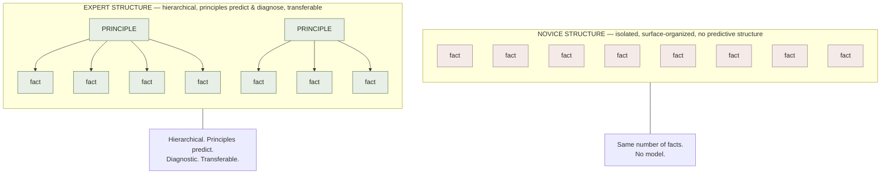

# Mental Models for Learning

**Summary**: A *mental model* (also: **mental representation** — Ericsson; **schema** — Piaget/Anderson; **cognitive structure** — Bruner) is the internal scaffold a learner uses to organize, predict, and act on knowledge in a domain. The **mental-models-for-learning** claim — converged across cognitive science, expertise research, and instructional design — is that the **quality of the learner's mental model**, not the quantity of facts known, is the primary determinant of skilled performance, transfer, and self-correction. Experts differ from novices ([novice-vs-expert-cognition](./novice-vs-expert-cognition.md)) not by knowing more isolated facts but by having denser, better-organized, more predictive mental models. Building these models — explicitly, deliberately, by visualization, diagram, analogy, and self-explanation — is the load-bearing meta-strategy that makes [active-recall](./active-recall.md) / [spaced-repetition](./spaced-repetition.md) / [deliberate-practice](./deliberate-practice.md) do their work. This page is the canonical owner.

**Sources**:
- Ericsson, K. A., & Pool, R. (2016). *Peak*. — "purposeful practice without mental representation → ceiling well below expert."
- Chi, M. T. H., Feltovich, P. J., & Glaser, R. (1981). "Categorization and Representation of Physics Problems by Experts and Novices." *Cognitive Science*, 5, 121-152. — canonical expert/novice categorization study.
- Bransford, J. D., Brown, A. L., & Cocking, R. R. (eds., 2000). *How People Learn: Brain, Mind, Experience, and School*. NAP. — Ch 2: "How Experts Differ from Novices."
- Larkin, J. H., & Simon, H. A. (1987). "Why a Diagram Is (Sometimes) Worth Ten Thousand Words." *Cognitive Science*, 11, 65-100.
- Munger, C. (1995, 2007). Various talks on "latticework of mental models" — popular cross-disciplinary framing.
- Internal: [novice-vs-expert-cognition](./novice-vs-expert-cognition.md), [deliberate-practice](./deliberate-practice.md), [self-explanation](./self-explanation.md), [bridge-load](./bridge-load.md), [5-gates-of-comprehension](./5-gates-of-comprehension.md).

**Last updated**: 2026-06-09

---

## What a mental model is (operationally)

A mental model is **three things at once**:

1. **A structure** — how the domain's concepts relate (hierarchies, networks, dimensions, processes).
2. **A predictor** — given a new case, the model produces an expectation; that expectation gets confirmed or disconfirmed.
3. **A diagnostic** — when something goes wrong, the model tells the learner *which* part of the structure is failing.

A learner who memorizes a procedure has only #1 (partially). A learner with a mental model has #1, #2, and #3 — and that's what allows self-correction, novel-problem solving, and the kind of "I see what's wrong" intuition that defines expertise.

## The expert-novice divergence

Chi-Feltovich-Glaser 1981 classic: physics novices and experts were given 24 mechanics problems and asked to group them.

- **Novices** grouped by **surface features** — diagram type, named objects (pulleys, inclines, springs).
- **Experts** grouped by **underlying principle** — conservation of energy, F=ma scenarios, conservation of momentum.

Same facts. Same problems. *Different mental model*, and the expert's model was the difference between solving and not solving novel problems.

This pattern replicates across chess, programming, medicine, history, and every other studied expertise domain ([novice-vs-expert-cognition](./novice-vs-expert-cognition.md) page covers the full pattern). The lever is the *organization*, not the *count*.

## Building mental models deliberately

Six convergent moves the literature recommends:

| Move | What it does |
|---|---|
| **Visualize / diagram** | Force the structural relationships out of language into spatial form (Larkin & Simon 1987) — the diagram is the model made external |
| **Analogy / [BRIDGE](./bridge-load.md)** | Map structure of unfamiliar domain onto known one; the mapping IS the new mental model |
| **[Self-explanation](./self-explanation.md)** | Why does this step follow? What rule is operating? — produces gap-detection in the current model |
| **Worked-example study** | Read expert's reasoning trace; reverse-engineer the model that produced it |
| **Compare-and-contrast** | Hold two similar cases side-by-side; the differences sharpen the model's discriminations |
| **Concept maps / framework lists** | Externalize the network of concepts; iterating the map sharpens the model |

These all share a property: they make the **structure** of the domain *explicit* — which is what allows the brain to acquire it as structure rather than as a heap of isolated facts.

## Why mental models multiply with other strategies

[Active recall](./active-recall.md), [SR](./spaced-repetition.md), [interleaving](./interleaving.md), and [deliberate practice](./deliberate-practice.md) all *depend on a mental model existing*:

- **Active recall** retrieves *what?* The model determines what's retrievable.
- **SR** schedules *which cards?* Cards organized around the model's structure compound; isolated facts don't.
- **Interleaving** trains discrimination *between* model-defined categories. No model → nothing to discriminate.
- **Deliberate practice** has *5 constituents*, and #5 is exactly the field-specific mental representation. Without it, deliberate practice degrades to purposeful practice.

The wiki's pedagogical stance: build the mental model FIRST (via diagram + analogy + self-explanation + worked examples), THEN engage drill / SR / recall to make it durable. The reverse order produces drilled fragments without architectural coherence.

## Visual

## Failure modes

| Failure | Symptom | Mitigation |
|---|---|---|
| **Fact-heap learning** | Many facts, no structure — can recite, can't transfer | Build the structural diagram / framework first |
| **Procedural-only** | Can run the steps, can't explain why; collapses outside trained format | [self-explanation](./self-explanation.md) of each step's principle |
| **Borrowed-model confusion** | Inheriting a teacher's metaphor without testing where it breaks | Test the model on edge cases; mark its breaking points |
| **Over-elaborated model** | Mental model so detailed it's slower than just retrieving facts | Compress to load-bearing structure; archive the rest |
| **Model-without-drill** | Beautiful diagram, no automaticity | Pair model-construction with retrieval practice on the structure |

## Neural OS implementations

- [5-gates-of-comprehension](./5-gates-of-comprehension.md) — Gate 2 (REPRESENT) is explicitly mental-model construction before encoding
- [bridge-load](./bridge-load.md) — analogy-as-model-construction protocol
- [self-explanation](./self-explanation.md) — model-debugging move
- [novice-vs-expert-cognition](./novice-vs-expert-cognition.md) — sister page on the expert/novice asymmetry
- [deliberate-practice](./deliberate-practice.md) — Constituent #5 is the mental representation
- compression-for-comprehension-framework — model-construction via cross-example compression
- atomic-design — domain-portable structural lens (mental-model archetype)
- [burger-5-elements-effective-thinking](./burger-5-elements-effective-thinking.md) — mental-model construction moves

## Related pages

- [novice-vs-expert-cognition](./novice-vs-expert-cognition.md)
- [deliberate-practice](./deliberate-practice.md)
- [self-explanation](./self-explanation.md)
- [bridge-load](./bridge-load.md)
- [5-gates-of-comprehension](./5-gates-of-comprehension.md)
- compression-for-comprehension-framework
- [active-recall](./active-recall.md)
- [chunking](./chunking.md)
- atomic-design

---

## U — See (CAST)
1. Structure of knowledge > count of knowledge
2. Mental model = structure + predictor + diagnostic

## D — Name (NEDF)
1. Mental model = internal organized scaffold of a domain
2. Distinguisher: predicts and diagnoses (not just stores)
3. Failure mode: fact-heap learning without structural model

## F — Do (SPEAR)
1. Build model first (diagram + analogy + self-explanation) → drill onto it
2. Test model on novel/edge cases; mark breaking points

## B — Watch (HEART)
1. Can recite but can't apply → model missing
2. Procedural-only response → no diagnostic layer

## L — Predict (ORACLE)
1. Strong model + retrieval drill → transfer to novel problems
2. Drill without model → solves trained format, fails on transfer

## R — Act (GRACE)
1. New domain → diagram its structure before memorizing its facts
2. Stuck mid-problem → ask "what model am I using?"; rebuild if absent
