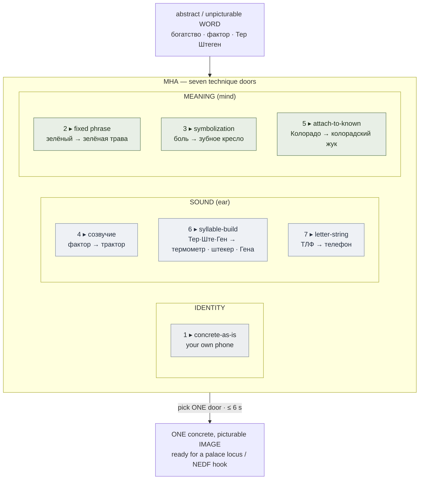

# Method of Guiding Associations (МНА)

**Summary**: МНА (*Метод Наводящих Ассоциаций*) is Kozarenko's named bundle of seven techniques for turning one abstract or unpicturable **word** into one concrete, picturable **image** — the word→image on-ramp that feeds every downstream encoder. It is not a new move: it is Kozarenko's specific, drillable taxonomy of the same abstract→concrete conversion the wiki already owns under [substitute-word-system](./substitute-word-system.md), the way [БЦК](./kozarenko-mnemotechnics.md) is a Cyrillic instance of the [Major System](./mnemonic-methods-master.md) rather than a rival to it.

**Sources**: `GMS_V.Kozarenko.pdf`; [substitute-word-system](./substitute-word-system.md); [nedf-overview](./nedf-overview.md); [remaps](./remaps.md).

**Last updated**: 2026-07-10.

---

## What МНА is

Kozarenko groups the operations for coding a word into an image under the label *Метод Наводящих Ассоциаций* — "a little box (коробочка) with a set of techniques for coding words" (source: GMS_V.Kozarenko.pdf). The name comes by analogy with the windings of a transformer: current in one coil *induces* (наводит) current in the other, and likewise the image held in the fast visual-analyzer memory *induces* — prompts — the word in the slow speech-analyzer memory (source: GMS_V.Kozarenko.pdf). The whole point is to hand the slow verbal channel over to the fast visual channel, because only visual-analyzer memory binds quickly (source: GMS_V.Kozarenko.pdf).

This page documents МНА as a **Tier-2 encoder primitive**: it produces the concrete image that a [memory-palace](./memory-palace.md) locus stores, or that a [NEDF](./nedf-overview.md) Name-hook slot fires on. It sits beside [substitute-word-system](./substitute-word-system.md) (owner of the word→image move) and [REMAPS](./remaps.md) (which transforms the image once you have it).

## Boundary — this does not redefine the substitute-word move

МНА and [substitute-word-system](./substitute-word-system.md) do the **same job**: convert an abstract/unpicturable target into a concrete picturable stand-in. This page does **not** redefine that move; [substitute-word-system](./substitute-word-system.md) remains the owner. МНА is one school's named, seven-slot taxonomy of that move — the relationship is exactly parallel to how [БЦК](./kozarenko-mnemotechnics.md) is a Cyrillic *instance* of the [Major System](./mnemonic-methods-master.md), not a competitor to it (source: GMS_V.Kozarenko.pdf). Where the Lorayne/Buzan lineage in [substitute-word-system](./substitute-word-system.md) leads with sound-alike substitution and its Phonetic Bridge, Kozarenko enumerates a fuller menu that also carries explicit *semantic* routes (collocation, symbolization, known-referent) alongside the phonetic ones.

## The seven techniques

Kozarenko's canonical list, in his own numbering (source: GMS_V.Kozarenko.pdf). The count is a **technique inventory, not an ordered ladder** — you pick one route per word, you do not climb through all seven (source: GMS_V.Kozarenko.pdf).

| # | Technique (RU → EN) | What it does | Worked example (source: GMS_V.Kozarenko.pdf) |
|:--:|---|---|---|
| 1 | Кодирование простых слов → **concrete word, as-is** | Word already names a picturable object; use a memory of a *specific* one — not "a phone" but *your* phone, not "a table" but the table in your kitchen | стол, телефон, чашка, ложка, карандаш |
| 2 | Устойчивые словосочетания → **fixed collocation** | A quality-word has no image alone; borrow the image of the fixed phrase (синтагма) it habitually rides in | зелёный → зелёная трава; красный → красный помидор; процесс → тлеющая ватка |
| 3 | Символизация → **symbolization** | Read the abstract word, watch the image-reaction (like a photograph), pick one distinctive part (отличительный признак) | боль → зубоврачебное кресло; богатство → мешок с деньгами |
| 4 | Кодирование по созвучию → **sound-alike** | Replace the unfamiliar word with a familiar word that *sounds like* it and already has an image | фактор → трактор |
| 5 | Привязка к знакомому → **attach to a known referent** | A word with several meanings: reach the new sense through a meaning you already picture | штат Колорадо → колорадский жук |
| 6 | Образование слова из слога → **syllable-build** | A syllable with no image is built out (left, right, or both) into a word that does have one; long names are split into syllables and each is built up, then bound into an association | МАШ… → машина; …ИГА → книга; Тер-Ште-Ген → термометр · штекер · Гена |
| 7 | Образование слова по согласным → **letter-string → word** | A consonant skeleton is fleshed into a concrete word (often adjective + noun); used for letter-parts of car plates and passwords | ТЛФ → телефон; Л ПР → лёгкое перо; кнг → книга |

## Three lanes through the toolbox

The seven doors sort cleanly into three lanes by *what carries the retrieval* (source: GMS_V.Kozarenko.pdf):

- **Identity lane** — technique 1. The word is already an image; no conversion, just insist on a concrete personal instance.
- **Sound lane (the ear)** — techniques 4, 6, 7. Retrieval rides the *sound-shape* of the substitute, exactly the phonetic principle [substitute-word-system](./substitute-word-system.md) documents; technique 6's syllable-splitting is Kozarenko's version of its Phonetic Bridge, and technique 7's consonant-skeleton path overlaps the letter-coding used to build the [Major System](./mnemonic-methods-master.md)'s image-code handbook (source: GMS_V.Kozarenko.pdf).
- **Meaning lane (the mind)** — techniques 2, 3, 5. Retrieval rides a *semantic* hook (a habitual collocation, a chosen symbol, a known referent) rather than sound. This is the half of МНА that a purely phonetic reading of [substitute-word-system](./substitute-word-system.md) under-emphasizes.

## One word, several doors

The techniques are alternatives, not steps: the same word can be encoded by different doors depending on what your memory already holds (source: GMS_V.Kozarenko.pdf). Kozarenko's own illustration for *Аляска* (source: GMS_V.Kozarenko.pdf):

- **коляска** — sound-alike (door 4)
- **куртка «Аляска»** — attach to a known referent (door 5)
- **снег** — symbolization (door 3)

When a name collapses cleanly to a single image, it becomes a *пустая ассоциация* (empty association) — a one-cell table row that later carries data on its visible parts (source: GMS_V.Kozarenko.pdf).

## Cross-map onto the move the wiki already owns

| МНА technique | Corresponding move in [substitute-word-system](./substitute-word-system.md) |
|---|---|
| 1 · concrete-as-is | The "already-concrete content" case — no substitute needed; the object enters the encoder stack directly |
| 4 · sound-alike | The **Substitute Word** core mechanism (phonetic stand-in) |
| 6 · syllable-build | The **Phonetic Bridge** (multi-syllable / foreign target decomposed into a sound-chain of concrete syllables) |
| 7 · letter-string | Consonant-skeleton → noun, shared with the [Major System](./mnemonic-methods-master.md) phoneme→noun step |
| 2 · collocation, 3 · symbolization, 5 · attach-to-known | The **meaning-anchor** side of substitution — semantic rather than phonetic routes to the same concrete image |

The reading: МНА's phonetic doors (4, 6, 7) are already inside [substitute-word-system](./substitute-word-system.md) under other names; its semantic doors (2, 3, 5) are the taxonomy's genuinely additive contribution — an explicit meaning-based menu for words where no clean sound-alike exists.

## Where it sits in the stack

МНА is upstream of storage. Its output — one concrete image — is what a [memory-palace](./memory-palace.md) locus holds, what feeds a [NEDF](./nedf-overview.md) Name-hook, and what [REMAPS](./remaps.md) then modifies, merges, or moves to bind it into a scene (source: GMS_V.Kozarenko.pdf). Nothing abstract enters the palace without passing through this converter first. Once an МНА-produced image is sitting in a locus, [spatial-coding](./spatial-coding.md) can layer a positional channel (quadrant, reading order, triangle geometry) on top of it at no extra encoding cost — a separate, later step from the word→image conversion documented here.

МНА is the **word-level** on-ramp; its phrase-level counterpart memorizes whole phrases to reflex (the [речевой штамп](./phrase-based-acquisition.md)) rather than converting single words. New words that ride *inside* a memorized phrase still pass through this page's seven-door menu at the point they get their own image.

## METER fit

Kozarenko's timing gives МНА a natural pass-floor. Visual-analyzer memory needs on average **~6 seconds** of attention to bind an association, dropping to ~4 seconds with training (source: GMS_V.Kozarenko.pdf). The word→image conversion has to finish *inside* that binding window or the encode stalls. So the [METER](./meter-overview.md) pass-floor for this primitive is: **produce a usable concrete image for an abstract word in ≤6 s.** If picking a technique takes longer than the binding budget, the encoder is failing, not the memory (source: GMS_V.Kozarenko.pdf).

## Mnemonic

Picture a **transformer**: the abstract *word* enters the primary coil; a concrete *image* is induced out of the secondary — that induced current is the *наводящая* (guiding) association Kozarenko named the method after (source: GMS_V.Kozarenko.pdf). The coil has **seven taps**, sorted **1 free · 3 ears · 3 minds**: one door where the word is already an image, three sound-doors (созвучие, syllable-build, letter-string), three meaning-doors (collocation, symbolization, attach-to-known). 1 + 3 + 3 = 7.

## Checksum

Three falsifiable retrieval checks:

1. **Is МНА a rival to [substitute-word-system](./substitute-word-system.md) or a new encoder?** If you said either → wrong. It is Kozarenko's named seven-technique *instance* of the same abstract→concrete move, exactly as [БЦК](./kozarenko-mnemotechnics.md) is a Cyrillic instance of the [Major System](./mnemonic-methods-master.md) (source: GMS_V.Kozarenko.pdf).
2. **Are the seven techniques ordered stages to climb?** If you said yes → wrong. They are an unordered toolbox; you pick one door per word, and the same word (Аляска) can go through three different doors (source: GMS_V.Kozarenko.pdf).
3. **Which door for "богатство", and which for "фактор"?** богатство → symbolization (мешок с деньгами); фактор → sound-alike (трактор). If you tried to sound-decompose "богатство", you took the wrong lane — abstract nouns go through the meaning doors, not the ear doors (source: GMS_V.Kozarenko.pdf).

## Visual

## Related pages

- [substitute-word-system](./substitute-word-system.md) — owner of the abstract→concrete word→image move; МНА is a named instance, not a redefinition
- [phrase-based-acquisition](./phrase-based-acquisition.md) — the phrase-level GMS counterpart; this page is its word-level on-ramp
- [kozarenko-mnemotechnics](./kozarenko-mnemotechnics.md) — the Giordano-school source page; maps every Kozarenko construct to its Neural OS owner
- [nedf-overview](./nedf-overview.md) — МНА output feeds the NEDF Name-hook slot
- [remaps](./remaps.md) — transforms the concrete image МНА produces (Modify · Merge · Move · Associate)
- [memory-palace](./memory-palace.md) — the loci that store МНА's output
- [mnemonic-methods-master](./mnemonic-methods-master.md) — Major System, shared by technique 7's consonant-skeleton path
- [spatial-coding](./spatial-coding.md) — the positional channel layered on top of an МНА-produced image once it's placed in a locus
- [meter-overview](./meter-overview.md) — the ≤6 s encode pass-floor for this primitive

---

## U — See (CAST)
1. One abstract word → seven-door converter → one concrete image
2. Doors sort into three lanes: identity, sound, meaning; edges feed palace loci + NEDF hooks

## D — Name (NEDF)
1. МНА = Kozarenko's seven-technique bundle for word→image encoding
2. Distinguisher: it does not redefine substitute-word-system; it is a named instance of it (like БЦК to the Major System)
3. Failure mode: treating the seven as ordered stages, or sound-decomposing an abstract noun

## F — Do (SPEAR)
1. Read the word → decide its lane (identity / sound / meaning)
2. Pick the cheapest door in that lane → produce one concrete personal image
3. Bind it within the ~6 s window, then hand it to the palace / NEDF hook

## B — Watch (HEART)
1. Drift toward re-defining the substitute-word move on this page (parallel-definition risk)
2. Forcing a sound-alike on a word with no clean phonetic twin — switch to a meaning door
3. Generic image ("just a phone") instead of a specific remembered object

## L — Predict (ORACLE)
1. Right lane + specific image → binds inside the 6 s budget, recalls reliably
2. Wrong lane (sound-decomposing an abstract noun) → conversion overruns the budget, encode stalls

## R — Act (GRACE)
1. New abstract word → run МНА's door menu before touching a locus
2. Foreign name / long word → syllable-build door (technique 6), then bind the sub-images into one association
