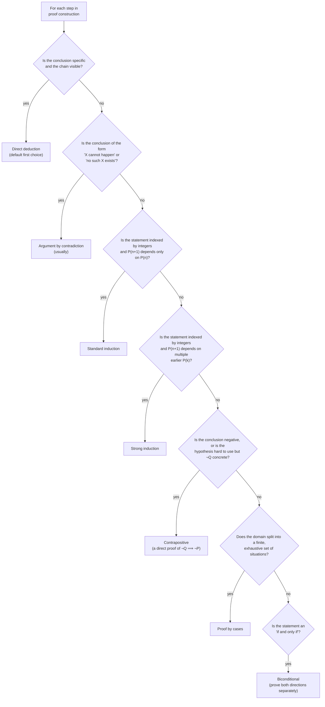

# Methods of Mathematical Argument

**Summary**: The named proof-construction methods that compose every mathematical argument: **direct deduction · argument by contradiction · mathematical induction (standard) · mathematical induction (strong)**, plus the transition-to-proof trio **contrapositive · cases · biconditional**. Tool-level moves per [problem-solving-three-levels](./problem-solving-three-levels.md) — they fire after [tactic](./universal-mathematical-tactics.md) is chosen, to actually construct the proof. Zeitz's *The Art and Craft of Problem Solving* Ch 2.3 supplies the first four; the transition-to-proof sources (fuchs-proofs-and-strategies, [transition-to-proof-curriculum](./transition-to-proof-curriculum.md)) supply the trio. Sister to the proof-*shape* compression in [math-proof-glyph-grammar](./math-proof-glyph-grammar.md) — that page compresses an already-constructed proof; this page constructs it. The meta-question of *which* method to reach for is owned by [proof-strategy-selection](./proof-strategy-selection.md).

**Sources**:
- Paul Zeitz, *The Art and Craft of Problem Solving*, 3rd ed. (Wiley 2017), Ch 2.3 "Methods of Argument" — direct, contradiction, standard induction, strong induction, with style conventions (WLOG, ISTS, TS, Halmos QED, hypothesis-conclusion structure).
- Shay Fuchs, *Introduction to Proofs and Proof Strategies* (Cambridge 2023), Ch 3–4 — contrapositive, cases, biconditional, induction (source: dokumen.pub_introduction-to-proofs-and-proof-strategies-cambridge-mathematical-textbooks-1nbsped-1009096281-9781009096287.pdf).
- Dana Ernst, *An Introduction to Proof via Inquiry-Based Learning*, Ch 2 — contrapositive (Thm 2.39), case analysis (source: dokumen.pub_an-introduction-to-proof-via-inquiry-based-learning.pdf).
- [zeitz-art-and-craft](./zeitz-art-and-craft.md) — source-summary page.

**Last updated**: 2026-06-10

---

## The four methods

| # | Method | One-line | When it fires | Worked example trigger |
|---|---|---|---|---|
| 1 | **Direct deduction** | If P, then Q. State and chain forward. | The [penultimate step](./zeitz-startup-strategies.md) is obvious; chain from hypothesis to conclusion | Most computational proofs; "by substitution / by definition / by algebra" |
| 2 | **Argument by contradiction** | Assume the conclusion is false; derive an absurdity | The negation of the conclusion is *easier to work with* than the conclusion itself | "Show √2 is irrational"; "Show no positive integer solutions exist" |
| 3 | **Mathematical induction (standard)** | Establish P(n₀); show P(n) ⟹ P(n+1) | Statement is indexed by integers; P(n+1) depends only on P(n) | "Sum 1+2+…+n = n(n+1)/2"; "n! > 2^n for n ≥ 4" |
| 4 | **Mathematical induction (strong)** | Establish P(n₀); show P(n₀)∧…∧P(n) ⟹ P(n+1) | P(n+1) depends on *multiple earlier* P(k), or on an arbitrary earlier P(k) | 3-coloring triangulated polygons; deck-reversal monotonicity proofs |

These four are **not exhaustive** at the meta-level — there are also direct counterexample arguments, constructive existence proofs, pigeonhole arguments, etc. — but every other argument *contains* one or more of these four as load-bearing components. The four are the **atomic verbs** of proof construction.

## Method #1 — Direct deduction

**Form**: P ⟹ Q. Or, more commonly: hypothesis ⟹ intermediate step ⟹ … ⟹ conclusion.

**When**: the chain is reasonably visible. Most exercises and many problems are direct.

**Watch for**: keeping track of the *direction* of implications. Zeitz: P ⟹ Q is not logically equivalent to its **converse** Q ⟹ P, but it *is* equivalent to its **contrapositive** ¬Q ⟹ ¬P. "Dogs are mammals" is true; "mammals are dogs" is false; "non-mammals are not dogs" is true.

**Common mistake**: assuming the converse. Especially in "iff" proofs where you must prove both directions.

**Style anchors** (Zeitz Ch 2.3 §Conventions):
- Lead with a clear statement of the hypothesis and conclusion.
- Use Halmos's filled-square (■) or QED, WWWWW, AWD at the successful end.
- "WLOG" = without loss of generality (used to single out one illustrative case). **Make sure you actually can argue the specific and truly prove the general.** Counterexample of misuse: "WLOG n = 5. Then 1+2+3+4+5 = 15. QED." — false claim.
- ":=" for "is defined to be" (introduces a new symbol).
- "TS" / "ISTS" for "to show" / "it is sufficient to show."

## Method #2 — Argument by contradiction (reductio ad absurdum)

**Form**: assume ¬Q (the conclusion is false). Derive ⊥ (a contradiction). Therefore Q.

**When**: the negation of the conclusion gives you specific, workable information.

**Trigger heuristic**: ask *what happens if we negate the conclusion? Will we have something easy to work with?* If yes → try contradiction. Zeitz's metaphor: the conclusion is a vertical glass wall; the negation has footholds.

**Worked examples** (Zeitz Ch 2.3):

- **√2 is irrational.** Assume √2 = a/b in lowest terms. Then 2b² = a², so a² is even, so a = 2t, so 2b² = 4t², so b² = 2t², so b is even. Both even contradicts lowest-terms.
- **b² + b + 1 = a² has no positive integer solutions.** Assume it does. Then b < a, and (a−b)(a+b) = b + 1. But (a−b) ≥ 1 and (a+b) ≥ 2+b, so LHS ≥ b+2 > RHS. Contradiction.
- **Polynomial-roots problem (Greece 1995).** Assume Q has no real roots; derive contradiction with the hypothesis about P.
- **Multiplicative inverses mod p.** Assume two products in {x, 2x, …, (p−1)x} are congruent mod p; derive that p divides their difference; contradiction.

**Special pattern**: **the smallest-counterexample method.** Combines contradiction with the [Extreme Principle](./universal-mathematical-tactics.md). Assume the statement fails; let n be the smallest n at which it fails; derive a smaller failure → contradiction. This is the standard form of many number-theory and combinatorics proofs.

**Watch for**: writing an entire "contradiction" proof that's actually a direct proof in disguise. If your "contradiction" never *uses* the negated assumption to derive the absurdity, you don't need it.

## Method #3 — Mathematical induction (standard)

**Form**:

1. **Base case**: establish P(n₀). Usually easy.
2. **Inductive step**: assume P(n) (inductive hypothesis); show P(n) ⟹ P(n+1).

**Domino metaphor** (Zeitz): infinitely many dominos in a line. Knock the first one down (base case). Show that each falling domino knocks down its neighbor (inductive step). All fall.

**When**: statement is indexed by integers ("for all n ≥ n₀, P(n) holds"). Many such statements are *indirectly* indexed — the "right" variable to induct on isn't always obvious. Zeitz Ch 2.3.7: a coloring problem about plane regions divided by lines isn't obviously inductive, but inducting on the number of lines yields a clean proof.

**Worked examples**:

- 1+2+…+n = n(n+1)/2 (standard).
- Sum of interior angles of an n-gon = 180(n−2) degrees.
- n! > 2^n for n ≥ 4. The trick: multiply inductive hypothesis by (n+1) → (n+1)! > 2^n(n+1) > 2^n · 2 = 2^(n+1).
- The plane divided by n lines can be 2-colored so adjacent regions differ. Crux: when drawing the (n+1)-st line, *invert* one side's colors.

**Common mistakes** (Zeitz Ch 2.3):

- Forgetting the base case.
- Choosing the wrong variable to induct on.
- "Proving" P(n+1) by re-deriving it (not actually using P(n)).
- Subtle scope error in the inductive step (e.g., the partial-solution to the n-gon angle-sum has a subtle issue about which triangle to extract).

## Method #4 — Mathematical induction (strong)

**Form**: same base case. Inductive step: assume P(n₀), P(n₀+1), …, P(n) **all** hold; show P(n+1) holds.

**Stiffer-springs domino metaphor** (Zeitz): the dominos have springs that get stiffer as n grows. Domino n+1 needs the force of *all* prior fallen neighbors, not just the most recent.

**When**: P(n+1) depends on an *arbitrary earlier* P(k), or on multiple P(k) at once.

**Worked examples**:

- **Sequence problem (Russia 1995).** a_{m+n} + a_{m−n} = ½(a_{2m} + a_{2n}), a₁ = 1; prove a_n = n². Inductive step at n+1 uses both P(u) and P(u−1) — strong induction is required.
- **3-coloring of triangulated polygons.** Cut along an arbitrary edge to split (n+1)-gon into two smaller polygons L and R; apply the inductive hypothesis to *both* L and R (which may have different sizes); recolor as needed. Standard induction would force you to extract a specific (3-gon, n-gon) decomposition; strong induction lets you cut anywhere.
- **Half-and-double product inequality** (Zeitz 2.3.10). (1/2)(3/4)…((2n−1)/2n) ≤ 1/√(3n). Strong induction requires a stronger hypothesis than the obvious one — sometimes you need to *strengthen what you're proving* before induction goes through.

**The strengthening trick** (load-bearing): sometimes a statement that won't yield to induction directly *will* yield if you prove a *stronger* statement instead. Stronger inductive hypotheses give stronger inductive footings. Zeitz: *"sometimes stronger statements are easier to prove."*

**Why induction at all** (Fuchs Ch 4): induction is the method of choice precisely when case-by-case checking *cannot* cover all n — there are infinitely many cases, so a single uniform "knock-on" argument replaces an impossible enumeration (source: dokumen.pub_introduction-to-proofs-and-proof-strategies-cambridge-mathematical-textbooks-1nbsped-1009096281-9781009096287.pdf). Fuchs takes the Principle of Mathematical Induction as an axiom; its equivalent footing, the [Well-Ordering Principle](./universal-mathematical-tactics.md), is owned there — link, don't redefine.

## Proof-writing methods (transition-to-proof layer)

The four methods above are Zeitz's *problem-solving* verbs. The transition-to-proof literature names three more methods that the discovery scaffold of rough-work-technique resolves into. The first four and these three share one owner page (here) so they are never defined twice.

### Method #5 — Proof by contrapositive

**Form**: to prove P ⟹ Q, instead prove the logically equivalent **¬Q ⟹ ¬P**, then conclude P ⟹ Q. The plain-English equivalence "P ⟹ Q is the same claim as ¬Q ⟹ ¬P" is owned by [informal-logic-foundations](./informal-logic-foundations.md); this section owns it as a *constructed proof method*.

**When**: the hypothesis P is awkward to use directly but ¬Q hands you something concrete, or the conclusion is itself a negative ("…is not…", "…has no…").

**Distinct from contradiction** (the load-bearing distinction): contrapositive is a *direct* proof of an equivalent statement — you assume ¬Q and march to ¬P, full stop. Contradiction assumes P **and** ¬Q and is satisfied by *any* absurdity. Contrapositive is targeted; contradiction is open-ended. Treating them as the same is the most common transition-to-proof error (source: dokumen.pub_an-introduction-to-proof-via-inquiry-based-learning.pdf, Thm 2.39).

**Worked trigger**: "if n² is even then n is even" — prove the contrapositive "if n is odd then n² is odd," which is a one-line direct computation (source: dokumen.pub_introduction-to-proofs-and-proof-strategies-cambridge-mathematical-textbooks-1nbsped-1009096281-9781009096287.pdf).

### Method #6 — Proof by cases (case analysis)

**Form**: partition the domain into a finite, **exhaustive** set of cases; prove the statement separately in each.

**When**: no single argument covers every input, but a finite split does — n even/odd, x<0 / x=0 / x>0, the four residues mod 4.

**Watch for**: the cases must be **exhaustive** — the dominant failure mode is a silently missing case. A non-exhaustive split proves nothing (source: dokumen.pub_introduction-to-proofs-and-proof-strategies-cambridge-mathematical-textbooks-1nbsped-1009096281-9781009096287.pdf).

### Method #7 — Biconditional proof (iff)

**Form**: to prove P ⟺ Q, prove **both** implications separately — P ⟹ Q and Q ⟹ P — each by whichever of methods #1–#6 fits. Sometimes a chain of equivalences (P ⟺ R ⟺ Q) is cleaner.

**When**: the statement is an "if and only if."

**Watch for**: proving only one direction and assuming the converse — exactly the converse trap flagged under Method #1. Each direction is its own proof with its own method choice (source: dokumen.pub_introduction-to-proofs-and-proof-strategies-cambridge-mathematical-textbooks-1nbsped-1009096281-9781009096287.pdf).

## How the four methods compose

Real proofs frequently use multiple methods nested. Common patterns:

| Outer | Inner | Pattern name | Example |
|---|---|---|---|
| Direct | Direct | "By the lemma…" | Most theorem chains |
| Direct | Contradiction | Lemma proved by contradiction | √2 used in a direct argument |
| Induction | Direct | Inductive step is a direct chain | Most inductive proofs |
| Induction | Contradiction | Inductive step uses contradiction internally | Some pigeonhole + induction proofs |
| Contradiction | Induction | "Assume not, then by induction…" | Smallest-counterexample method |
| Induction | Induction | Nested induction over two variables | Multi-variable polynomial identities |

The **outer method** sets the overall shape of the proof; the **inner methods** fill specific sub-steps. The [math-proof-glyph-grammar](./math-proof-glyph-grammar.md) page's glyph alphabet (▢ proof-frame, ⟲ induction, ⊥ contradiction, ▷ apply, ▲ QED) represents exactly this compositional structure.

## Routing rule (which method fires when)

**Default order to attempt**: direct → contrapositive → contradiction → cases → standard induction → strong induction; biconditionals split into two of these. The further down the list, the more *machinery* the proof needs. Don't reach for induction when direct works. The full form-to-method routing table is owned by [proof-strategy-selection](./proof-strategy-selection.md).

## Style and presentation (Zeitz Ch 2.3 §Conventions)

- **Mathematical sentences are sentences.** Subject, verb, object. Verbs include =, ≠, ≤, ⊂, ⟹, ⟺.
- **Complicated equations on their own line, labeled** if referred to later: `(2.3.3)`.
- **Halmos** (■) or QED at end. WWWW, AWD as casual variants.
- **WLOG** for "without loss of generality" — and *check the generality holds*.
- **TS / ISTS** for "to show" / "it is sufficient to show" — useful for marking penultimate-step pivots in the argument.
- **:=** for "is defined to be" — left side new, right side already-defined.

## Cross-link to proof glyph grammar

Each method has a default silhouette in [math-proof-glyph-grammar](./math-proof-glyph-grammar.md):

| Method | Silhouette element |
|---|---|
| Direct | Linear chain of □ (step) pieces leading to ▲ (QED) |
| Contradiction | Outer ▢ frame with ⊥ piece inside; final ▲ negates the assumption |
| Standard induction | ⟲ (induction circle) with base case + inductive step both contained |
| Strong induction | ⟲ (induction circle) with multi-arrow notation to earlier P(k), often with "all k ≤ n" badge |

Proofs that *compose* methods (most non-trivial ones) show *nested* silhouettes — an inductive proof whose inductive step is itself a contradiction is ⟲ containing ⊥ containing chain of □.

## METER pass-floors

| Test | Pass floor |
|---|---|
| Recall all 4 methods | <5 s, 100% |
| Distinguish standard from strong induction | <8 s |
| Recall the contrapositive identity (¬Q ⟹ ¬P) | <6 s |
| Given a 6-line proof skeleton, identify the method | <4 s @ ≥90% |
| Given a problem, predict which method fits | <10 s, ≥70% |
| Construct a direct proof of a simple lemma | <5 min |
| Construct a contradiction proof of "√2 irrational" from memory | <10 min |
| Construct a standard-induction proof of "sum-of-first-n" | <5 min |
| Recall the strengthening trick for strong induction | <8 s |

## Drill ladder

- **Lamp**: shown a 6-line proof; classify the method.
- **Scale**: shown a problem statement; predict the method *before* solving.
- **Sword**: given an unfamiliar problem, choose the right method and complete the proof. Pass floor: 50% complete-proofs on a 20-problem set.

## Anti-patterns

| Anti-pattern | Symptom | Fix |
|---|---|---|
| "Contradiction" that's really direct | The negation is never used to derive ⊥ | Rewrite as direct |
| Induction without using the inductive hypothesis | The "P(n+1)" derivation never references P(n) | The proof doesn't need induction |
| Standard when strong is needed | Stalls trying to chain only via P(n) | Switch to strong; assume all earlier |
| Strong when standard suffices | Over-machined proof | Simplify to standard |
| Missing base case | Proof "works" but starts nowhere | Always check P(n₀) |
| Bad WLOG | Specific case doesn't generalize | The "WLOG" is a lie; rewrite to handle all cases |

## Mnemonic

A **scribe** at a stone-tablet desk in [Velvet Aeon](./world-velvet-aeon.md) Mode-Identity register (single warm light, scribe in close-third camera). Four **stone tablets** stack on the desk:

- **Tablet 1**: a simple chain of footprints (Direct) leading to a single Halmos square (■).
- **Tablet 2**: an inverted mountain shape (⊥) with a hand pushing through it from above (Contradiction).
- **Tablet 3**: a row of dominos, all fallen left-to-right, the first one being knocked down by a human finger (Standard induction).
- **Tablet 4**: the same row of dominos, but each domino is held up by a spring; the human pushes the rightmost domino, which is supported by the cumulative force of all already-fallen ones to its left (Strong induction).

The scribe has the **FRAGILE** face archetype (per [feedback-image-face-and-hair](./feedback-image-face-and-hair.md)) — proof construction is precise, careful, luminous-porcelain rather than power. Hair to the waist; one tear has fallen onto the wet stone of Tablet 3 (the user feedback hair-and-water effect). The four tablets are stacked in the order the methods should be tried.

## Memory checksum

- **4** methods (Direct · Contradiction · Standard Induction · Strong Induction)
- **1** contrapositive identity (P ⟹ Q ⟺ ¬Q ⟹ ¬P)
- **2** induction metaphors (dominos · stiffer-spring dominos)
- **1** trigger for contradiction (negation is workable)
- **1** strengthening trick (sometimes stronger statements are easier to prove)
- **5** style abbreviations (■ · WLOG · TS · ISTS · :=)

If you can recite 4-1-2-1-1-5 from "methods of mathematical argument" within 60 seconds, the page is encoded.

## Related pages

- [zeitz-art-and-craft](./zeitz-art-and-craft.md) — source-summary
- [problem-solving-three-levels](./problem-solving-three-levels.md) — the tool level where argument construction lives
- [zeitz-startup-strategies](./zeitz-startup-strategies.md) — what fires *before* argument construction
- [universal-mathematical-tactics](./universal-mathematical-tactics.md) — what fires *between* startup and argument
- [math-proof-glyph-grammar](./math-proof-glyph-grammar.md) — proof shape compression sister; each method has a default silhouette
- [crux-move](./crux-move.md) — the contradiction or strengthening at the crux is often the breakthrough
- [red-queen-skill-gym](./red-queen-skill-gym.md) — hosts the 4-method drill ladder
- [problem-solving-os](./problem-solving-os.md) — argument construction is the closing phase of step 4
- [automaticity-and-reflex-training](./automaticity-and-reflex-training.md) — method recognition can be drilled to reflex (Lamp/Scale phases)
- [representation-rules](./representation-rules.md) — argument is a representation of reasoning
- [copi-introduction-to-logic](./copi-introduction-to-logic.md) — sister textbook (Ch 9 *Methods of Deduction*); Copi's 19 deduction rules are the *atom-level* moves that compose into this page's 4 *strategy-level* methods (added 2026-05-25)
- [argument-anatomy](./argument-anatomy.md) — Copi atoms (premise · conclusion · inference · enthymeme); the *extraction* side complementing this page's *construction* side
- [validity-vs-soundness](./validity-vs-soundness.md) — what the constructed argument must achieve; the form/content distinction
- [fallacy-taxonomy](./fallacy-taxonomy.md) — the dark twin; argument-construction errors named
- [logic-atomic-design](./logic-atomic-design.md) — hub; this page's 4 methods are Molecule-tier moves under the Rules atom family

## Cross-link to Copi's 19 deduction rules (2026-05-25)

Added 2026-05-25 from the [Copi](./copi-introduction-to-logic.md) ingest. The 4 *strategy-level* methods on this page compose from Copi's *atom-level* rules:

| Zeitz method (Tool-level, this page) | Copi atom-rules (Ch 9, [logic-atomic-design](./logic-atomic-design.md) §Atoms→Rules) |
|---|---|
| **Direct deduction** | MP · MT · HS · DS · Conj · Add · Simp + replacement rules (DeM · Comm · Assoc · Dist · DN · Trans · Impl · Equiv · Exp · Taut) |
| **Argument by contradiction** | All Direct rules + Reductio strategy (assume ¬conclusion → derive ⊥ → ∴ conclusion) |
| **Induction (standard)** | Direct rules + UI/UG/EI/EG (Copi Ch 10) + Peano induction axiom |
| **Induction (strong)** | Standard induction + strong induction principle (use *all* P(k), k ≤ n, not just P(n)) |

This is a **strict layering**, not a redefinition: Zeitz's 4 methods are *named strategies* at the Molecule-Tool tier; Copi's 19 deduction rules are the *atoms* those strategies invoke. A direct proof is *a chain of MP/MT/HS/DS applications + replacement rules*. A contradiction proof is *a chain that lands on P ∧ ¬P for some P*. Both stand fully within Copi's natural-deduction system; neither requires extending it.

Cross-link operates both ways: a wiki user drilling at the Atom tier (Copi Ch 9 exercises) is building the substrate that this page's Molecule-level drills run on; a wiki user drilling at the Molecule tier (Zeitz's 4 methods) is exercising the same atoms in larger compositions.

---

## U — See (CAST)

1. Scribe at stone desk with four stacked tablets (chain · contradiction · dominos · stiffer dominos)
2. Edges: direct → contrapositive; contradiction ↔ smallest counterexample; standard ⊂ strong

## D — Name (NEDF)

1. 4 argument methods = Direct · Contradiction · Standard induction · Strong induction
2. Composable: outer method sets shape, inner fills sub-steps
3. Distinguisher: tool-level construction, not tactic-level choice
4. Failure mode: induction without using the hypothesis (rendering the method ornamental)

## F — Do (SPEAR)

1. Tactic chosen → pick argument method
2. Default order: Direct → Contradiction → Standard → Strong
3. Construct chain; check each implication direction
4. End with Halmos; verify by tracing backward from QED

## B — Watch (HEART)

1. Fake contradiction (negation never used)
2. Fake induction (hypothesis never used)
3. Bad WLOG (specific case that doesn't generalize)
4. Missing base case

## L — Predict (ORACLE)

1. Problem says "cannot" or "no such" → predict Contradiction
2. Problem indexed by n → predict Induction
3. Inductive step depends on arbitrary earlier k → predict Strong
4. Visible chain from hypothesis to conclusion → predict Direct

## R — Act (GRACE)

1. Read problem → name predicted argument method
2. Construct proof → label each block with the method that powers it
3. Verify ending → Halmos with no skipped steps
