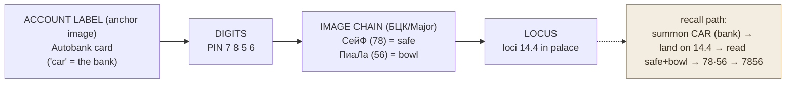

# Mnemonic PIN & Password Encoding

**Summary**: A worked playbook for holding PINs, passwords, account numbers, and other credentials in memory by converting their digit strings into image chains with pre-learned number-image codes and pinning each chain to a locus anchored by the account's label. Distilled from Course 5 («Коды и пароли» / «Запоминание числовых сведений») of *Мнемотехника шаг за шагом* — with a load-bearing modern-security caveat attached, because the technique must carry *independently strong* credentials, never a reused base word.

**Sources**: `Мнемотехника шаг за шагом.pdf`; internal — [mnemonic-methods-master](./mnemonic-methods-master.md) (Major System owner), [kozarenko-mnemotechnics](./kozarenko-mnemotechnics.md) (БЦК Cyrillic number code), [memory-palace](./memory-palace.md) (Method of Loci owner).

**Last updated**: 2026-07-10

---

## What Course 5 covers

Course 5 of *Мнемотехника шаг за шагом* — «Коды и пароли» (a special course of 8 lessons) — teaches how to hold numeric and credential data reliably in memory: internet and site logins, mail-program accounts, plastic-card numbers, PIN codes, bank accounts, cellular details, electronic money, remote bank access over the internet, and account-blocking-by-phone (source: Мнемотехника шаг за шагом.pdf). The later lesson blocks (Lessons 53–60, run under the banner «Запоминание числовых сведений») walk concrete examples: email login + password + security-question answer, e-payment wallets (Яндекс.Деньги, WebMoney), full bank requisites (БИК, correspondent account, ИНН, card number + PIN + expiry + blocking phone), passport/insurance/licence/plate/entrance codes, and BIOS/OS/file passwords (source: Мнемотехника шаг за шагом.pdf).

This is the most concretely actionable slice of the source, and it is a **Tier-2 application page**: it does not mint a new technique. It composes three owners the wiki already holds — the [Major System](./mnemonic-methods-master.md)'s number-image codes, their Cyrillic instance [БЦК](./kozarenko-mnemotechnics.md), and the loci of the [memory palace](./memory-palace.md).

## The core move — two methods

The source splits credential encoding into two cases (source: Мнемотехника шаг за шагом.pdf):

1. **You invent the password yourself.** Build it from fragments of a well-known poem, phrase, or words. Then no digits need to be memorized at all: the code's digits are simply the consonants of the poem line read off through the phonetic number code. Reciting the verse lets you type the long string blind at typist speed. The source's demonstration: `По уЛиЦе СЛоНа ВоДиЛи…` decodes to `5 69 760 826…` because each consonant is its digit under the number alphabet (source: Мнемотехника шаг за шагом.pdf).

2. **You must store a "ready-made" password handed to you.** Convert the digit string into images with the pre-learned number-image codes — preferably **three-digit** codes, because larger codes mean fewer images per chain and fewer links to build. The source's safe-combination example: `836 503 004` → ФаКеЛ (torch) · БиНоКль (binoculars) · НуНЧаки (nunchaku), anchored to the image of a safe (source: Мнемотехника шаг за шагом.pdf).

The digit→consonant→image mapping in these examples is Cyrillic, so it rides the [БЦК](./kozarenko-mnemotechnics.md) instance of the Major System; the same move in Latin/English rides the [Major System](./mnemonic-methods-master.md) proper or a [PAO](./person-action-object-system.md) deck. The pattern is identical; only the phoneme table differs.

## Anchoring by the credential's label

The load-bearing retrieval trick is that the **label** — which site, which account, which card — is the association base, not just decoration. You store a wallet's account number on the image that *means* that wallet (a purse for Янд.Деньги), so to recall it you summon the purse, read the number fixed to it, and land directly on the right locus without scanning the whole sequence; the next locus holds that wallet's password (source: Мнемотехника шаг за шагом.pdf). This label-first anchoring is what makes credentials randomly addressable in the [palace](./memory-palace.md) instead of a linear list you have to walk.

Two discipline rules from the source (source: Мнемотехника шаг за шагом.pdf):

- **Number-images are attached in isolation, never fused to each other.** Each digit-code image links only to a part of the association base, so repeated codes don't cross-contaminate between credentials.
- **Case and keyboard layout are part of the secret.** Always account for register (upper/lower case) and input language; the source renders capital letters as *large* images and uses dedicated image codes for the English letters that appear inside passwords.

Until you trust your own recall, the source recommends keeping a copy of each credential hidden in a reliable place — a bank vault or a strongly encrypted disk — as a fallback (source: Мнемотехника шаг за шагом.pdf).

## Pass-floor

A stored credential is only "in memory" if it clears a hard bar: **recalled correctly and typed with no hesitation, inside a <4-second recall band, even under social observation.** The source's own tell for this floor is that long mnemonic passwords can be entered "completely freely in full view of your colleagues" — they cannot memorize what they watch you type, but only if *your* recall is instant and fluent (source: Мнемотехника шаг за шагом.pdf). Anything slower is a lookup, not a memory, and fails the [METER](./meter-overview.md) pass-floor for this page.

## Security caveat

This caveat is load-bearing: the wiki must not absorb a weak security practice while adopting a strong memory practice.

A tempting shortcut — flagged from a sibling English-language mnemonics source — is a **"master word + site suffix" password**: one base word plus a per-site tag, e.g. `MemoryGmail08`, `MemoryFB08`. **Do not use it.** By modern standards it is a guessable password-reuse pattern: a single leaked password exposes both the base word *and* the transform, so every other account falls at once. Mnemonic encoding makes such a pattern *easier to remember*, which is exactly the wrong thing to make easy.

Use the technique the other way round: generate **independently strong or random** credentials (ideally from a password manager), and spend the mnemonic layer on recalling the few high-value secrets you genuinely must hold in your head — the manager's master password, a handful of PINs, an offline recovery code. Note the source's own examples already lean this way: each account gets a *different* passphrase (a Pushkin line for one mailbox, a Lermontov line for another, a war-song for a third), not one base word with swapped suffixes (source: Мнемотехника шаг за шагом.pdf). The upgrade over the source is simply to prefer high-entropy strings over guessable public verse when the account matters, and to treat the mnemonic as recall-for-strong-secrets, never as a licence to reuse a base.

## Mnemonic

**"LABEL → LADDER → LOCUS."** Three L's carry the whole move: fix the **Label** (which account) as the anchor image, climb the digits as a **Ladder** of three-digit number-images, and hang the chain on its **Locus** in the palace. If any of the three is missing — no label anchor, raw digits instead of images, or no locus — the credential will not come back clean.

## Checksum

Three falsifiable questions; if your recall of this page answers any of them wrong, re-read the section named.

- Did you store a credential as **raw digits** or as an image chain? Raw digits → wrong; the whole point is converting the string through number-image codes (§The core move).
- Is the **account label** the anchor of the chain, or just a note beside it? If it is not the association base you jump to directly, retrieval degrades to scanning the locus list (§Anchoring by the credential's label).
- Did you reuse a **base word with a site suffix** (`MemoryGmail08`-style)? If yes → security-fail; the page mandates independently strong/random credentials (§Security caveat).

## Visual

Rule: label anchors the jump · digits ride number-images · one chain per locus.

(Source example: PIN 7856 encoded as СейФ (78) + ПиаЛа (56) on the Autobank card locus — source: Мнемотехника шаг за шагом.pdf.)

## Related pages

- [mnemonic-methods-master](./mnemonic-methods-master.md) — owner of the Major System; the number-image codes this page reuses
- [kozarenko-mnemotechnics](./kozarenko-mnemotechnics.md) — БЦК, the Cyrillic number code the source's examples run on
- [memory-palace](./memory-palace.md) — owner of the loci this page anchors credentials to
- [person-action-object-system](./person-action-object-system.md) — championship-tier digit deck; alternative code for the digit ladder
- [meter-overview](./meter-overview.md) — the pass-floor (no-hesitation recall under observation) this page must clear
- [clocks24](./clocks24.md) — sibling application of the same number-image codes (founding years, not passwords)

---

## U — See (CAST)
1. One repeatable move: turn a credential's digit string into an image chain and pin it under its account label
2. Edges: the digit codes come from mnemonic-methods-master / БЦК; the loci come from memory-palace; the bar comes from METER

## D — Name (NEDF)
1. Mnemonic PIN & password encoding = storing credentials as label-anchored image chains built from number-image codes
2. Distinguisher: the *label* is the anchor you jump to; digits become three-digit images; one chain per locus
3. Failure mode: reusing a master-word + site-suffix base (guessable), or storing raw digits with no image conversion

## F — Do (SPEAR)
1. Given a credential → convert digits to three-digit number-images, anchor the chain on the account-label image, drop it on the next locus
2. Invented password → build it from a distinct strong passphrase and read its consonants through the number code; never a reused base word

## B — Watch (HEART)
1. Drift toward the weak "master word + suffix" reuse pattern because it is easy to memorize
2. Recall that is *almost* fluent — anything over the <4s band under observation fails the METER floor

## L — Predict (ORACLE)
1. More accounts → the palace stays addressable only if every credential keeps a unique label anchor
2. A leaked reused base → predicts total compromise; independently strong credentials contain the blast radius

## R — Act (GRACE)
1. New credential to hold in-head → route it through LABEL → LADDER → LOCUS, on an independently strong secret
2. Someone proposes a base-word password scheme → reject per §Security caveat, offer manager-generated + mnemonic recall instead
