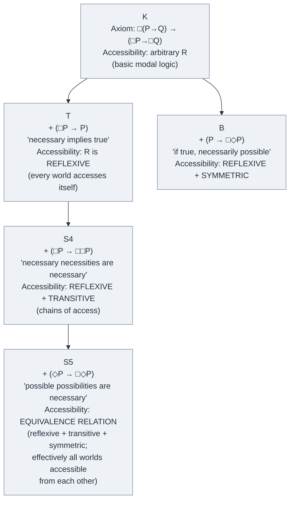
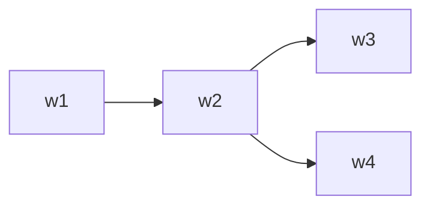
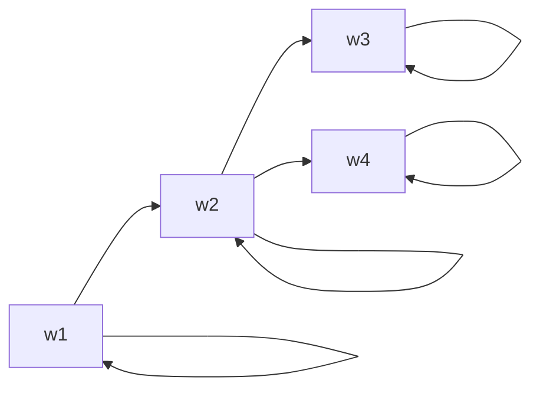
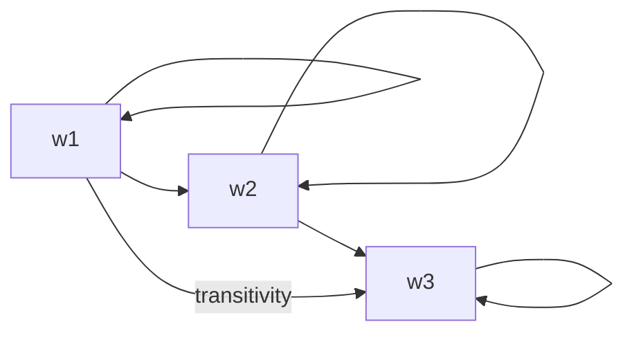
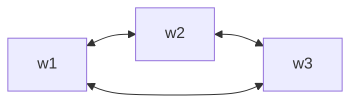

# Modal Logic Primer (Provisional)

**Summary**: A **provisional overview** of modal logic — the logic of *necessity* (□) and *possibility* (◇) — built from canonical knowledge of the field rather than from an ingested source PDF. Closes the most-load-bearing entry in [logic-atomic-design](./logic-atomic-design.md) §Gaps (queued from Wave 1 onward). **Modal logic extends classical propositional + predicate logic** with operators for modalities: alethic (necessity/possibility), epistemic (knowing/believing), deontic (obligation/permission), temporal (always/sometimes), doxastic (belief). **Modal logic's central technical machinery** = Kripke semantics (possible-worlds model theory) developed in the 1950s-60s. Different modal systems (T, S4, S5, B, K) correspond to different sets of axioms about how necessity behaves.

**Sources**:
- **Modal logic is not in the Wave-1 source corpus.** This page is built from canonical knowledge of the field.
- Standard primary text: Theodore Sider, *Logic for Philosophy* (Oxford UP 2010) — queued for future ingest in [logic-atomic-design](./logic-atomic-design.md) §Gaps; would replace this page's canonical content.
- Standard alternative: G.E. Hughes + M.J. Cresswell, *A New Introduction to Modal Logic* (Routledge 1996).
- Original key papers: Saul Kripke, "Semantical Analysis of Modal Logic I-II" (1959, 1963).
- **Provisional**: this page should be updated when a proper modal-logic source is ingested.

**Last updated**: 2026-08-20 (`glyph:` assigned — [representation-rules](./representation-rules.md) Rule 11); 2026-05-25

---

## One-line

> Modal logic = classical logic + **□** (necessity) + **◇** (possibility). *□P* means *"P is necessarily true"*; *◇P* means *"P is possibly true"*. **Kripke semantics** uses *possible worlds*: *□P* means *"P is true in every accessible world"*; *◇P* means *"P is true in some accessible world"*. Different modal systems (K, T, S4, S5, B) differ in axioms about the accessibility relation.

## Unlocks (lead, not footer)

1. **Modal logic closes the biggest [logic-atomic-design](./logic-atomic-design.md) §Gaps entry.** The Wave-1 hub explicitly named modal logic as the most-important missing piece. Modern philosophy of mind, philosophy of language, metaphysics, epistemology, formal ethics, and computer-science applications (program verification, knowledge representation) all use modal logic. **A proper analytic-philosophy logic curriculum requires modal logic**; the wiki's logic domain was incomplete without it.

2. **Kripke semantics is one of the great mid-20th-century logical achievements.** Saul Kripke (1959, age 18) developed the possible-worlds semantics that made modal logic rigorous. **Possible-worlds models** treat necessity + possibility as quantifiers over a domain of worlds, with an *accessibility relation* between worlds determining which worlds are "relevant" from a given world. **This converted modal logic from a syntactic + axiomatic curiosity into a substantive semantic theory.**

3. **Different modal systems = different axiomatic commitments about modality itself.** The hierarchy K ⊂ T ⊂ S4 ⊂ S5 corresponds to increasingly-strong assumptions about how necessity behaves:
   - **K** (Kripke): basic modal logic; minimal axioms.
   - **T**: adds *□P → P* (necessity implies truth — necessary truths are true).
   - **S4**: adds *□P → □□P* (necessity is necessary — if P is necessary, it's necessarily necessary).
   - **S5**: adds *◇P → □◇P* (possibility is necessary — what's possible is necessarily possible).
   - **B**: adds *P → □◇P* (truth implies necessary possibility).

4. **Modal logic generalizes to many domains.** The same machinery handles:
   - **Alethic**: necessity vs possibility (truth-modally).
   - **Epistemic**: knowing vs entertaining as possible (knowledge logic).
   - **Doxastic**: believing vs not-disbelieving (belief logic).
   - **Deontic**: obligation vs permission (legal/moral logic).
   - **Temporal**: always vs sometimes (temporal logic).
   - **Provability**: provable vs consistent (provability logic, tied to [Gödel](./godels-incompleteness.md)).

## Mnemonic

**□ = necessarily** · **◇ = possibly**

For the system hierarchy: **K ⊂ T ⊂ S4 ⊂ S5** = *basic ⊂ truth-respecting ⊂ transitive ⊂ equivalence-class accessibility.*

For Kripke semantics: **W · R · V** = *Worlds · Relation · Valuation* (the three components of a Kripke model).

## Memory checksum

1. **State the two modal operators + their classical-logic interaction.** (*□* = necessarily; *◇* = possibly. *◇P ↔ ¬□¬P* — possibly P iff not-necessarily-not-P. They're duals like ∃ and ∀.)
2. **State Kripke semantics in one sentence.** (A Kripke model is *⟨W, R, V⟩* — a set of possible worlds W + an accessibility relation R between worlds + a valuation V assigning truth-values to atomic propositions at each world. *□P* is true at world w iff P is true at every world accessible from w. *◇P* is true at w iff P is true at some accessible world.)
3. **State the K axiom.** (K: *□(P → Q) → (□P → □Q)*. "If it's necessary that P implies Q, then if it's necessary that P, it's necessary that Q." Basic distribution of necessity over implication; holds in all Kripke frames.)
4. **Distinguish T, S4, S5.** (T adds *□P → P* (reflexive accessibility — every world is accessible from itself). S4 adds *□P → □□P* (transitive accessibility). S5 adds *◇P → □◇P* (symmetric accessibility — actually equivalence-class accessibility, making the modalities collapse).)
5. **Name 3 modal application domains.** (Alethic = necessity/possibility. Epistemic = knowing K(P). Deontic = obligation O(P). Temporal = always G(P) / eventually F(P). Provability = provable □P (this gives provability logic, tied to Gödel).)

## Visual — the modal system hierarchy

**The modal system hierarchy** — each system adds one axiom to its parent:

**Kripke frames (visualized)** — worlds as nodes, accessibility R as edges:

K frame (no constraints on R):

T frame (reflexive — every world has a self-loop):

S4 frame (reflexive + transitive — w1→w3 edge added by transitivity):

S5 frame (equivalence class — all worlds mutually accessible, one cluster):

**Modal application domains**:

| Domain | Necessity/primary operator | Possibility/other operator | Standard system |
|---|---|---|---|
| Alethic | □P = "necessarily P" (useful for metaphysics) | ◇P = "possibly P" | S5 (?) |
| Epistemic | K(P) = "agent knows P" (useful for epistemic logic) | K(P) → P (knowledge implies truth) | S4 (or weaker for belief) |
| Doxastic | B(P) = "agent believes P" (useful for belief logic) | ¬(B(P) ∧ B(¬P)) (consistency); weaker than knowledge (no K(P) → P) | — |
| Deontic | O(P) = "P is obligatory" (useful for moral/legal reasoning) | Pe(P) = "P is permitted"; ¬O(⊥) (no impossibility is obligatory) | — |
| Temporal | G(P) = "always P" (useful for program verification) | F(P) = "eventually P"; H(P) = "always was P"; P(P) = "sometime was P" | — |
| Provability | □P = "PROV(P) in PA" (useful for meta-math, tied to Gödel) | Löb's theorem: □(□P → P) → □P | — |

The hierarchy is the spine. The applications are the branches.

---

## Modal operators

### □ (necessity, "box")

*□P* reads as *"necessarily P"* or *"it is necessary that P"*.

In **alethic** modal logic: *P* could not have been false; *P* is true in every possible world.
In **epistemic** modal logic: an agent knows *P*; *P* is true in every world consistent with what the agent knows.
In **deontic** modal logic: *P* is obligatory; *P* is true in every "ideal" world.
In **temporal** modal logic: *P* is always true; *P* is true at every time.
In **provability** modal logic: *P* is provable in the system.

### ◇ (possibility, "diamond")

*◇P* reads as *"possibly P"* or *"it is possible that P"*.

**Duality with necessity**: *◇P ↔ ¬□¬P*. Saying *"possibly P"* = *"not-necessarily-not-P"*.

In **alethic**: there's a possible world where *P* is true.
In **epistemic**: the agent doesn't know that *P* is false; *P* is consistent with what the agent knows.
In **deontic**: *P* is permitted (not-forbidden).
In **temporal**: *P* is sometimes true.
In **provability**: *P* is consistent (not refutable).

### Compound operators

- *◇□P*: "possibly necessarily P" — there's a world where P holds at every world accessible from there.
- *□◇P*: "necessarily possibly P" — at every accessible world, P is possible somewhere.
- *◇◇P*: "possibly possibly P" — there's an accessible world where there's another accessible world where P holds.

These compound operators carry substantive content; many philosophical disputes hinge on whether *◇□P → □P* holds (S5) or whether *◇◇P → ◇P* holds (S4 or stronger).

## Kripke semantics

**Saul Kripke (1959, age 18)** developed the possible-worlds semantics that made modal logic rigorous. A Kripke model is a triple *⟨W, R, V⟩*:

- **W** = a non-empty set of *possible worlds* (or *states*, *points*, *times*, *epistemic situations* depending on application).
- **R** = a binary relation on W — the *accessibility relation* — telling you which worlds are "relevant" from a given world.
- **V** = a *valuation function* assigning each atomic proposition a truth-value (T or F) at each world.

**Modal semantics**:

- *□P* is **true at world w** iff *P* is true at every world *v* such that *wRv* (every world accessible from w).
- *◇P* is **true at world w** iff *P* is true at some world *v* such that *wRv* (some world accessible from w).
- Classical propositional operators (∧, ∨, →, ¬) are evaluated as in classical logic at each world separately.

**Validity**:

- A formula is **valid** in a Kripke model iff it's true at every world in the model.
- A formula is **valid** in a *class* of frames iff it's valid in every model with a frame from that class.

### Different accessibility relations → different modal systems

- **K**: arbitrary R. Validates K-axiom *□(P → Q) → (□P → □Q)*.
- **T**: R is **reflexive** (∀w. wRw). Validates K + *□P → P*.
- **B**: R is **symmetric** (∀w,v. wRv → vRw). Validates K + *P → □◇P*.
- **S4**: R is **reflexive + transitive**. Validates K + T + *□P → □□P*.
- **S5**: R is **equivalence relation** (reflexive + transitive + symmetric). Validates K + T + S4 + *◇P → □◇P*.

In **S5**, the accessibility relation makes all worlds mutually accessible (within equivalence classes). Modal claims collapse: *□P* and *□□P* are equivalent; *◇P* and *◇◇P* are equivalent; the "depth" of modal nesting doesn't matter.

## Application domains

### Alethic modal logic

The "default" modal logic — about metaphysical necessity + possibility.

**Standard interpretation**: *□P* means *"P is true in every possible world"*; *◇P* means *"P is true in some possible world"*.

**Disputed**: which modal system is the "right" one for alethic modality?
- *□(□P → P)*: if necessity implies necessity-of-necessity, S4 is appropriate.
- *□P ↔ □□P*: if necessity is itself necessary, S4.
- *◇P ↔ □◇P*: if possibility is necessary, S5.

Many philosophers default to **S5** for alethic modality; others argue **S4** or weaker is more philosophically defensible.

### Epistemic logic (Hintikka 1962)

*K_a(P)* = *"agent a knows P"*. Possible worlds = epistemic possibilities (worlds compatible with what the agent knows).

**Axioms typically include**:
- *K_a(P) → P* (knowledge implies truth — corresponds to T).
- *K_a(P) → K_a(K_a(P))* (positive introspection — corresponds to S4).
- *¬K_a(P) → K_a(¬K_a(P))* (negative introspection — corresponds to S5; controversial).

**Multi-agent epistemic logic** extends to common knowledge + distributed knowledge.

### Doxastic logic

*B_a(P)* = *"agent a believes P"*. Like epistemic but weaker:
- **NOT** *B_a(P) → P* (believing doesn't imply truth — agents can have false beliefs).
- *B_a(P) → B_a(B_a(P))* (positive introspection on belief — controversial).
- *¬(B_a(P) ∧ B_a(¬P))* (consistency — agents don't believe contradictions; idealized).

### Deontic logic

*O(P)* = *"P is obligatory"*. *Pe(P)* = *"P is permitted"*.

**Standard axioms**:
- *O(P) → ¬O(¬P)* (no contradictions in obligations).
- *Pe(P) ↔ ¬O(¬P)* (permission as not-forbidden).

Famous **deontic paradoxes**: Chisholm's paradox, contrary-to-duty obligations, the Good Samaritan paradox. These motivated alternative deontic systems.

### Temporal logic

*G(P)* = *"always P (in the future)"*. *F(P)* = *"sometime P (in the future)"*. Plus past-tense operators.

**Used heavily in**:
- **Program verification**: linear temporal logic (LTL) + computation tree logic (CTL) for verifying that programs satisfy specifications.
- **Hardware verification**: model checking for circuit designs.
- **Plan reasoning**: AI planning systems.

### Provability logic

*□P* = *"P is provable in PA (Peano Arithmetic)"*.

**Famous result — Löb's theorem (1955)**:
*□(□P → P) → □P*

"If it's provable that *provability of P implies P*, then *P* is provable." This is a strange result: it says you can't prove that *"provability implies truth"* for any specific P without that P being provable.

**Tied to [Gödel](./godels-incompleteness.md)**: provability logic is the modal-logic formalization of *what is provable in PA*. The Gödel sentence G is the propositional analog of an unprovable proposition: *¬□G* (G is not provable) is true at the meta-level but unprovable in PA itself.

## Why modal logic matters operationally

Modal logic gives rigorous treatment of:

- **Counterfactuals**: *"if it had rained, the picnic would have been canceled"* — counterfactual conditionals are modal claims.
- **Hypothetical reasoning**: thought experiments rest on modal structure.
- **Epistemic states**: distinguishing what an agent knows from what's true.
- **Norms + obligations**: legal + ethical reasoning involves deontic modality.
- **Time + temporal reasoning**: causal reasoning + planning + future-oriented arguments.
- **Provability + computability**: meta-mathematical claims have modal structure.

**Without modal logic**, these reasoning modes are handled informally or via ad-hoc extensions of classical logic. **With modal logic**, they have rigorous semantics + axiomatic foundations + decidable algorithms (for many systems).

## Limitations of this primer

This page is **provisional**. A proper modal-logic source ingest would:
- Cite specific theorems with proofs (not just axioms).
- Develop semantic completeness + soundness results.
- Cover **first-order modal logic** (quantification + modality interaction; Barcan formula, converse Barcan).
- Treat **modal logics with constants** + **rigid designators** (Kripke 1972).
- Survey **non-normal modal logics** (where K-axiom fails).
- Engage with **modal metaphysics** (Lewis 1986, *On the Plurality of Worlds*).
- Treat **dynamic modal logic** (public announcement logic, action models).

**The primer here serves as scaffolding** until a proper ingest replaces it. Per [take-seriously-but-hold-lightly](./memory-paradox.md): take the modal-logic framework seriously enough to recognize when modal claims are being made; hold the specific axioms + semantics lightly enough to update on a proper ingest.

## METER integration

| Drill | Pass floor | Source |
|---|---|---|
| State the two modal operators + duality | <15 s | this page §Operators |
| State Kripke semantics in one sentence | <30 s | this page §Memory checksum |
| State the K-axiom + T-axiom | <30 s | this page §Hierarchy |
| Distinguish T, S4, S5 by their accessibility relations | <60 s | this page §Visual |
| Name 3 application domains | <30 s | this page §Applications |

## Related pages

- [logic-atomic-design](./logic-atomic-design.md) §Gaps — modal logic queued from Wave 1; this page closes that gap provisionally
- [godels-incompleteness](./godels-incompleteness.md) — provability logic instance
- [methods-of-deduction](./methods-of-deduction.md) — modal logic extends propositional + predicate logic
- [validity-vs-soundness](./validity-vs-soundness.md) — modal validity = truth in every world; modal soundness = validity + true premises
- [internal-limits-pattern](./internal-limits-pattern.md) — modal logic doesn't escape Gödel; provability logic embeds Gödel's results
- [memory-paradox](./memory-paradox.md) — take-seriously-but-hold-lightly applied (this page is provisional)
- [philosophical-investigations-overview](./philosophical-investigations-overview.md) — sister provisional page; both flagged for future ingest
- [glossary](./glossary.md) — Logic layer registration
