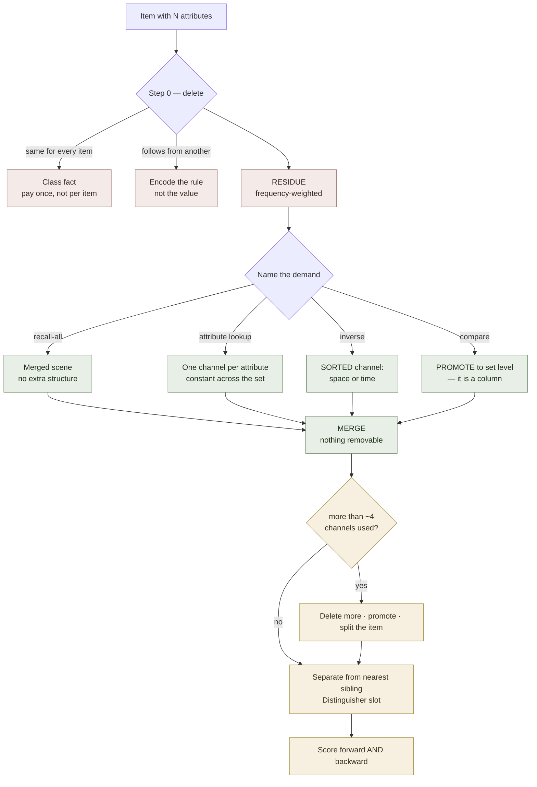

# Multi-Attribute Encoding

**Summary**: How to memorize **one item that carries several attributes at once** — an AWS service with a use-case, a limit and a price; a French noun with a gender, a spelling and a plural; a clock with a city, an era and a hand position. The answer is not one image per attribute: it is **one merged scene in which each attribute rides a different orthogonal channel**, with the channels chosen *after* the retrieval demand is named. The page's name describes the **material**; its technique describes the **encoding** — two axes that must be kept apart (§Two axes). It sits between [table-memorization](./table-memorization.md) (which owns the *set* — rows, columns, access patterns) and [UMTF](./universal-mental-tagging-framework.md) (which owns the *channel vocabulary*) and answers the question neither states directly: what to do with a single row.

**Sources**:
- Internal owners: [universal-mental-tagging-framework](./universal-mental-tagging-framework.md) (the seven channels and the orthogonality discipline) · [table-memorization](./table-memorization.md) (retrieval demands, Step 0, near-neighbor collision) · [image-merging](./image-merging.md) (the fusion rule) · [nedf-overview](./nedf-overview.md) (the Distinguisher slot) · [spatial-coding](./spatial-coding.md) (the position channel) · [mental-markers-category-importance-order](./mental-markers-category-importance-order.md) (the per-item marker channel) · [vocabulary-word-type-routing](./vocabulary-word-type-routing.md) (МегаЛоция, the environment channel) · [kozarenko-mnemotechnics](./kozarenko-mnemotechnics.md) (*затирание*, the collision hazard).
- Worked instance already in the wiki: [calendar-memory](./calendar-memory.md) §Hour → [clocks24](./clocks24.md) — the four-attribute clock, and the only place the phrase "multi-attribute pattern" previously appeared.
- `raw/templates/MULTIDIMENSIONAL_vs_UNIDIMENSIONAL_ENCODING.md` — the encoding-dimensionality axis, its worked list-vs-room contrast, and the dimensional-interaction argument used in §Merge. **This source has no owner page in the wiki**: it is cited in the Sources of [universal-mental-tagging-framework](./universal-mental-tagging-framework.md) and [heart-overview](./heart-overview.md) but has never been ingested, so the claims below are quoted from it directly and flagged where they are unverified.
- Otherwise a synthesis page: it assembles a procedure that existed only as fragments across the pages above.

**Last updated**: 2026-09-02 (complement page [multi-valued-attributes](./multi-valued-attributes.md) authored and linked — the same-attribute-many-values case this page cannot handle); 2026-09-02 (§Two axes repointed to its new owner [encoding-dimensionality](./encoding-dimensionality.md) after that source was ingested — the definition and 2x2 moved there, the application stayed here, and the decline gate it owns now runs before Step 0); 2026-09-02 (§Two axes — the material/encoding split named after the pair was traced to `MULTIDIMENSIONAL_vs_UNIDIMENSIONAL_ENCODING.md`, an un-ingested source; the page's central failure mode renamed to **unidimensional encoding**, and §Merge gained the interaction test, which is a stronger merge criterion than removability alone); 2026-09-02 (§Worked example — Clocks24 run end to end; it forced two additions above it: Step 0's fourth deletion "delete by design", and the checksum exception to one-attribute-one-channel. Two defects in the deck found by arithmetic: the 2011 peg collision sitting exactly where the monotone check is blind, and city being forward-only); 2026-09-02 — page authored from a question ("how do we memorize multi-attribute items?") whose answer had no owner.

---

## The law this page rests on

**An attribute is free if it rides a channel that is currently empty, and costs a whole extra image if it does not.**

That is the entire economics of the problem, and it inverts the naive question. The naive question is *"how do I remember that this item's price is $0.023?"* — which invites a fresh mnemonic per attribute and produces an item made of five loose images held together by effort. The real question is **"which channels does this scene still have free?"**

The seven channels are [UMTF](./universal-mental-tagging-framework.md)'s tag families, and they are already in the scene whether you use them or not. Every mental image *has* a location, a size, a condition, a texture, a moment. Leave them unassigned and they carry noise; assign them and they carry data at no extra retrieval cost. This is why [clocks24](./clocks24.md) gets a clock's city, era and hand position "for free" — space, time and state were sitting empty.

## Two axes, not one — multi-attribute vs multi-dimensional

Before Step 0, separate the two things the word *multi* is doing, because collapsing them is the mistake this whole page exists to prevent. The axis itself is owned by [encoding-dimensionality](./encoding-dimensionality.md); what matters here is which half you control.

**Multi-attribute** describes the **material** — how many attributes this item carries. You do not choose it. **Encoding dimensionality** describes the **encoding** — how many independent channels they are distributed across. That is the choice, and it is the only one this page is about. The failing combination, and the 2x2 it sits in, are stated on the owner page; its short form:

> "Most people use **one-dimensional encoding with multiple attributes**. This looks like memorizing a list." (source: MULTIDIMENSIONAL_vs_UNIDIMENSIONAL_ENCODING.md)

**What this renames.** The failure this page elsewhere calls *one image per attribute* and *the silent stack* is one thing under two descriptions: **unidimensional encoding of multi-attribute material**. Nine loose images are not better than nine bullets in the way that matters — they are more vivid, and still one-dimensional, because vividness is not a channel. That is why more effort does not fix a stack; only redistribution does.

**And the case this page cannot cover at all.** Everything here depends on attributes answering *different* questions, so each can take a channel. When an item carries several values of the **same** attribute — a word's meanings, a verb's forms, a field occurring twice — orthogonality is unavailable by construction and none of this applies. That is [multi-valued-attributes](./multi-valued-attributes.md), the complement rather than an extension: it routes on what retrieval demands and reaches a different answer for each route, including "stop treating it as one item."

**And the half this page does not cover.** [encoding-dimensionality](./encoding-dimensionality.md) also owns the *decline gate* — the conditions under which staying unidimensional is the correct call (thin information, speed over depth, shallow use, no responsibility for predicting the item). Everything below assumes that gate has already been passed. Step 0 deletes attributes; the gate declines the encoding, and it runs first.

## Step 0 — delete attributes before encoding any of them

Same discipline as [table-memorization](./table-memorization.md) §Step 0, applied to one item instead of a grid. Three deletions, in order, **before** a channel is assigned:

1. **Class-constant attributes are not attributes.** If every item in the set shares the value, it is a fact about the *class*, paid once. Encoding "is an AWS service" onto each of forty services is forty payments for one fact.
2. **Derivable attributes are not attributes.** If attribute B follows from attribute A by a rule, encode A and the rule. The precedent is [speed-math-unifying-generator](./speed-math-unifying-generator.md): a generator plus its exceptions beats a memorized family of cases.
3. **Frequency-weight what survives.** The attribute you will be asked forty times and the one you will never be asked do not get the same budget. georgian-driving-exam-b-numeric-table does this explicitly by counting the question bank first.

4. **Delete by design — choose a layout that *makes* an attribute derivable.** The three deletions above take the attribute list as given. This one changes it: if you control how the set is arranged, arrange it so that one attribute falls out of another. §Worked example is the case — sorting the clocks by age makes age-rank a consequence of the hour, and an attribute that would have cost twenty-four encodings costs none. Deletions 1–3 find derivability; this one manufactures it, and it is available exactly once, before the set is laid out.

What survives is the **residue**, and only the residue gets a channel. Most multi-attribute items shrink by half here, and the shrink is pure profit — it deletes work rather than organizing it.

## Name the demand — four of them, and they are a square

**Four demands, so the count-shape is a square** ([representation-rules](./representation-rules.md) Rule 10, declared instance). The two axes are what makes them four and not a list: **direction** (do you start from the item, or from a value?) crossed with **scope** (one item, or across the set?).

```
                 ONE ITEM                    ACROSS THE SET
             ┌──────────────────┐        ┌──────────────────┐
   ITEM →    │   RECALL-ALL     │        │     COMPARE      │
   VALUE     │ "tell me every-  │────────│ "which item has  │
             │ thing about X"   │        │  the largest C?" │
             └────────┬─────────┘        └─────────┬────────┘
                      │                            │
             ┌────────┴─────────┐        ┌─────────┴────────┐
   VALUE →   │  ATTRIBUTE       │        │     INVERSE      │
   ITEM      │  LOOKUP          │────────│ "which item has  │
             │ "what is X's C?" │        │  value V?"       │
             └──────────────────┘        └──────────────────┘
```

**Test** (Rule 10): cover the labels. Four seats; a demand you have not scored shows as an empty corner before a single word is read.

| Demand | What it needs | Cheapest structure |
|---|---|---|
| **Recall-all** | Nothing special — the merged scene already answers it | One fused image |
| **Attribute lookup** | The attribute must be *addressable*, not merely present | One channel per attribute, held constant across the set |
| **Inverse** | The attribute must be **sorted**, not just tagged (see below) | Push it onto space or time, or pay for a second encoding |
| **Compare** | The attribute must exist **outside** the item | Promote it to the set level — it is a column, not a channel |

The trap is the same one [table-memorization](./table-memorization.md) names: **encoding for recall-all and being asked lookup.** Recall-all is the pleasant demand — it is the one that feels like memory working — and it is the one exams almost never ask.

## The two structural rules

### Rule A — an attribute you must *compare* does not belong inside the item

A channel is read **after** you have found the item. So any question of the form *"which of these is the biggest / earliest / most expensive?"* cannot be answered from channels at all without walking every item and filtering. That attribute has to be **promoted to the set level**: it becomes the route order, the floor you are standing on, the size ranking along a shelf — a *column*, in [table-memorization](./table-memorization.md)'s vocabulary, not a tag inside a row.

This is the bridge between the two pages, and it is a design decision made at encode time. Promote late and you re-encode the whole set.

### Rule B — channels read forward; only *sorted* channels read backward

Item → attribute is what a channel gives you. Attribute → item is a different memory ([word-knowledge-links](./word-knowledge-links.md) on directed links: passing forward does not imply passing backward).

But the channels are not equal here, and this is the page's one non-obvious claim:

> **Spatial and temporal channels sort natively; the other five do not.** A position on a route or a moment in a sequence is itself ordered and walkable, so "which item is at the far end / earliest" is answerable by *traversing the channel*. Glow, texture, weight and condition are unordered labels — you can read them off an item you have already found, but you cannot walk them.

Consequence: **the attribute most likely to be asked backward should be assigned to space or time, not to sensory or state**, even when a sensory cue would be more vivid. Vividness serves recall-all; order serves inverse lookup.

## The channel assignment sheet

Assign in this order (the "spatial anchor first" order from [UMTF](./universal-mental-tagging-framework.md) §Default Encoding Order), one attribute per channel, never two:

| Channel | Question it answers | Best attribute type | Sorts? | Cost |
|---|---|---|:--:|---|
| **The object itself** | *what is it* | Identity — the item's name-hook | — | The scene; always spent |
| **Spatial** | *where* | Category, hierarchy, ordering, "which one" | **yes** | Free if a palace exists |
| **Temporal** | *when* | Era, version, sequence position, lag | **yes** | Free inside a walked route |
| **State** | *what condition* | Status, validity, deprecation, health | no | Free — one modifier |
| **Priority** | *how much* | Magnitude, importance, frequency | partly | Cheap, but see the glow trap |
| **Relation** | *what it touches* | Dependency, produces/consumes, pairs-with | no | One verb, merged (see below) |
| **Pattern** | *what it resembles* | Family, shape, archetype | no | Free when the shape is already known |
| **Sensory** | *how it feels* | The leftover attribute, or a collision-breaker | no | Cheapest to add, weakest to query |

### The one exception to one-attribute-one-channel

[UMTF](./universal-mental-tagging-framework.md)'s orthogonality discipline rules out spending two channels on one attribute, and that is right whenever the second channel is a second *address*. There is one case where it is not waste:

> **A redundant channel earns its cost only if it can disagree.** A second encoding that must always match the first is decoration; one that can be *checked against* the first is an error-detecting code, and it converts a silent wrong answer into a detectable one.

The power of such a check is proportional to how far apart neighbouring values are — which means a checksum is not uniformly strong across a set, and the places it goes slack are computable in advance rather than discovered in a drill. §Worked example locates seven of them by arithmetic.

Two working notes:

- **Sensory last, and mostly not as data.** [UMTF](./universal-mental-tagging-framework.md)'s orthogonality discipline says sensory tags exist to *separate collisions*, not to decorate. Spending smell on an attribute and then needing it to break a collision leaves nothing free.
- **Priority is the one channel that self-destructs under overuse.** If every item glows, nothing glows. It carries magnitude only while most items are dim.

## Merge, don't stack

Once assigned, the attributes must be **fused into a single percept**, not placed beside each other. [image-merging](./image-merging.md) is the owner and its rule is exact: *exaggerate until no element can be removed without destroying the scene.*

The reason is a failure-count argument. Three attributes stacked as three adjacent images are three independent retrieval events, each of which can fail alone — and their failure is silent, because the other two still come back and the item feels recalled. Merged, they are one event, and **the scene's own coherence becomes the integrity check**: a merged scene missing an element does not look incomplete, it looks *wrong*, which is detectable.

The practical move: make each attribute *load-bearing in the physics of the scene*. The state modifier should be why the object is doing what it does; the relation verb should be the action; the spatial slot should be the surface everything rests on. An attribute that could be edited out without changing the picture has been stacked, not merged.

### Separation is necessary, not sufficient — the interaction test

Spreading attributes across orthogonal channels stops them colliding. That is the *defensive* half, and on its own it produces a tidier list rather than a different kind of object. The offensive half is the reason the dimensionality source gives for the whole exercise: **dimensions are worth separating because they then combine into something none of them says alone.**

Its worked case is a temperament read. "High energy" and "rigid adaptability" and "high intensity" as three separate entries answer nothing — *so what? what does that combination do?* Fused, they become one totem, a fierce tiger with a tender heart, and the combination is immediately readable: explodes fast (energy + intensity), cannot climb down easily (rigidity), but carries remorse (the tender half). That single image **predicts** behaviour the three entries do not (source: MULTIDIMENSIONAL_vs_UNIDIMENSIONAL_ENCODING.md).

So the merge has a second, sharper test beside [image-merging](./image-merging.md)'s removability check:

> **Removability asks: can any element be taken out without breaking the picture?** (No → merged.)
> **Interaction asks: does the combination say something no single channel says?** (Yes → the dimensions are doing work.)

A scene can pass the first and fail the second — every attribute welded in, and the whole thing still just an inventory with good glue. That is the more common near-miss at this scale, because welding is mechanical and interaction is not.

Two consequences worth carrying:

- **This is the real argument for the channel budget.** The ceiling in §The ceiling is not about how many channels can be *held* — it is about how many can interact legibly. Combinations grow faster than channels do, and a scene whose parts no longer say anything jointly has reverted to a list regardless of how many dimensions it nominally occupies.
- **It is also a retrieval test, not just an authoring one.** If reading the scene gives back the attributes but no read of the item *as a whole*, the dimensions were separated and never combined — which is exactly the state the list was in, reached by a longer route.

## The ceiling, and what to do at it

Seven channels is the ceiling of the vocabulary, but it is not the working budget. In practice a scene stays retrievable at **three or four assigned channels**; past that the merge stops being one percept and quietly reverts to a stack, which is the failure this page exists to prevent — and it reverts without announcing itself.

Three exits when an item has more attributes than budget, in preference order:

1. **Delete more** — go back to Step 0. Almost always something is class-constant or derivable and was not caught.
2. **Promote** — an attribute needed for comparison belongs at the set level anyway (Rule A). Promotion removes it from the item's budget *and* answers a demand better.
3. **Split the item** — two linked scenes with a shared anchor beat one overloaded scene. This is cheaper than it sounds: the anchor is already paid.

Only when all three fail is the answer an addressable store — [four-level-blocks](./four-level-blocks.md)' matrix-shaped lattice, or a grid address per [table-memorization](./table-memorization.md). That is a heavier structure and should be a last resort, not a first reach.

## Separate the neighbors

Items in one set are **same-type by construction**, which makes every sibling a high-quality distractor for every other — the [БЦК](./kozarenko-mnemotechnics.md) hazard *затирание* arriving through the material's shape rather than through code reuse. The signature failure is not blanking. It is **fluent, confident recall of the neighbor's attribute value**.

So the [NEDF](./nedf-overview.md) Distinguisher slot is not optional here: for each item, the question is not "is this vivid?" but **"what makes this item's channel-reading impossible to confuse with its nearest sibling's?"** Vivid-but-not-discriminable is the exact defect, and no amount of repetition fixes it, because repetition strengthens the confusion along with everything else.

## Worked example — Clocks24

The densest multi-attribute set in the wiki — and so the fairest test of everything above — is [clocks24](./clocks24.md). Each of its twenty-four clocks carries an hour, a name, a city, a founding year, an age-rank, a [Major System](./mnemonic-methods-master.md) peg, a visual hook and a poem stanza. Eight stated attributes per item, twenty-four items — which by the naive method is nearly two hundred things to encode. It is not, and seeing why is the whole lesson.

### Step 0 — what actually survives

| Candidate attribute | Verdict | Why |
|---|---|---|
| "is a famous public clock" | **class-constant** | True of all twenty-four; a fact about the set, paid once |
| Age-rank (oldest → newest) | **deleted by design** | The set is sorted by construction date from noon, so rank is a consequence of the hour: 12:00 is oldest, 11:00 newest. Twenty-four encodings replaced by one sentence about the layout |
| Major peg (*Tough Lip*, *Diva Pail*…) | **not a second attribute** | The peg **is** the year, re-rendered through the Major System. Same datum in two representations; encoding both is paying twice for one fact |
| Poem stanza's position in the story | **derivable** | The cycle runs in hour order from midnight; position follows the address |
| Visual hook | **not an attribute** | It is the scene itself — the thing the channels hang on |
| **Hour ↔ clock** | **residue** | Irreducible. The retrieval key |
| **Clock → city** | **residue** | Irreducible |
| **Clock → year** | **residue, but checkable** | Not derivable — but constrained, see below |

Eight candidates collapse to **three irreducible bindings per clock**. The largest single win is the age-sort, and it is worth being precise about what kind of win it is: age-rank was never encoded and never forgotten, because the design made it impossible to hold separately from the hour. That is deletion #4 from §Step 0, and it was only available before the set was laid out.

### Where the year sits — a constraint, not a deletion

The founding years climb monotonically along the hours, 1392 → 2011. It is tempting to call the year derivable. It is not: monotonicity gives you a **bracket** (this clock is younger than its predecessor and older than its successor), never the value. What it gives instead is the §The one exception case above — a second channel that *can disagree with the first*, and therefore an error-detecting code. A year peg that breaks the climb is misfiled, and that is detectable without knowing the right answer.

But the check's strength is the size of the gap, and the gaps are wildly uneven. Median adjacent gap: **7 years**. Largest: **191**. And seven of the twenty-three seams are three years or less:

| Seam | Years | Gap | The two pegs |
|---|---|:--:|---|
| 19:00 Spasskaya → 20:00 Atlas | 1852 → 1853 | 1 | Devil Nail / Diva Lamb |
| 21:00 Big Ben → 22:00 Sainte-Croix | 1859 → 1860 | 1 | Tough Lip / TV jazz |
| 03:00 Grand Central → 04:00 Anker | 1913 → 1914 | 1 | Top Dome / Debater |
| 07:00 Binns → 08:00 Allen-Bradley | 1960 → 1962 | 2 | Top Jazz / BaBaJaN |
| 00:00 City Hall → 01:00 Orsay | 1898 → 1900 | 2 | Dive Buffet / Top Sauce |
| 23:00 Dolmabahçe → 00:00 City Hall | 1895 → 1898 | 3 | Diva Pail / Dive Buffet |
| **10:00 Tbilisi → 11:00 Makkah** | **2011 → 2011** | **0** | **Nasty Date / Nasty Date** |

The last row is the important one. At a gap of zero the monotone check is **structurally blind** — equal values cannot violate an ordering in either direction — *and* the two clocks share a Major peg, which [clocks24](./clocks24.md) itself notes and resolves with "the hour disambiguates them." That resolution works forward (hour → clock → year) and fails backward: given *Nasty Date*, the peg names no clock. It is the only genuine channel collision in the set, and it sits exactly where the checksum cannot see it.

The six single-digit seams are milder but the same shape: a swapped pair there breaks monotonicity by one or two years, which is inside the noise of a half-remembered peg. **The checksum is strong across 1392→1852, where it is not needed, and slack across 1852→2011, where the clocks cluster.** That is computable from the table, in advance, without a single recall attempt — which is the practical payoff of naming the exception as a code rather than as redundancy.

### The channel read — one clock

Taking 21:00, Big Ben, London, 1859:

| Channel | Carries | Cost |
|---|---|---|
| **The object** | The clock itself — Westminster tower | The scene; always spent |
| **Spatial** | The hour, 21:00 — the address, and the only retrieval key | Free; the ladder already exists |
| **Temporal** | Founding year 1859, *and* age-rank ten-of-twenty-four, fused because the sort made them the same axis | One peg (*Tough Lip*); the rank rides free |
| **Sensory / pattern** | London — carried by the building's own architecture, not by a separate "London" image | Free, **where the city is visually distinctive** |
| **Relation** | The poem's cross-reference to its neighbours in the cycle | One narrative link, shared with the whole set |
| **State · Priority** | *unassigned* | Held in reserve — see below |

Four channels assigned, at the top of the working budget, and the item still holds — because two of the four (spatial, temporal) cost nothing extra: the ladder and the sort were paid at design time for the whole set at once. This is the free-channel law at its most visible.

### What Clocks24 gets right, in this page's vocabulary

- **Rule A, done natively.** "Which clock is oldest?" is a *comparison* question, and it is answered without walking the set — because age was promoted out of the items and into the layout. The comparison attribute became the axis, which is exactly the promotion this page prescribes, arrived at independently.
- **The merge is the poem.** Twenty-four arbitrary buildings do not cohere; a wanderer chasing a soul scattered through them does. The stanzas make each clock load-bearing in a story, which is [image-merging](./image-merging.md)'s "nothing removable" test applied across a set instead of inside one scene.
- **Free channels found and spent.** City rides on architecture, age rides on position — neither was encoded as a fact.

### What it exposes — two defects worth drilling

**1. Inverse lookup on city is ambiguous, and not by accident.** City is not a key: **London** holds both Big Ben (21:00) and Selfridges (06:00); **New York City** holds both the Atlas clock (20:00) and Grand Central (03:00); France holds three (Lyon 18:00, Nantes 22:00, Paris 01:00). Forward — clock → city — is fine and always will be. Backward — "which clock is in London?" — has no answer, and no amount of drilling produces one, because the ambiguity is in the encoding, not in the retrieval. This is Rule B's forward/backward split showing up in a real set: the city rides an *unsorted* channel, so it reads one way only.

The fix is not more repetition. It is either accepting that city is forward-only, or giving the duplicated cities a second discriminator that *is* addressable — the hour they sit on, drilled as a pair ("London is Big Ben at 21 and Selfridges at 6") rather than as two independent facts.

**2. The 2011 pair is the one place to spend a Distinguisher.** Two clocks, one year, one peg, adjacent hours, and a checksum that cannot fire. Everything this page says about sibling collision converges on that single pair. It is also the cheapest thing on the list to fix: the two need one deliberate contrast (the leaning tower in Tbilisi against the tallest clock face on earth in Mecca), tied to their hours, and the defect is closed.

### The general lesson

Clocks24's real achievement is not that it encodes eight attributes well. It is that **it never encodes five of them.** Three of the deletions are design decisions made before the first image was built — sort by age, let the peg *be* the year, let the story carry the order — and each one removed twenty-four encodings at a stroke. Compared with that, channel assignment is the small half of the job.

The corollary is uncomfortable and worth stating: **the leverage in multi-attribute material is almost entirely front-loaded.** Once the set is laid out, deletion #4 is gone, promotion is expensive, and you are down to spending channels on whatever survived. An hour of design beats a week of drilling, and the order is not reversible.

## Falsifiable claim — the sorted-channel asymmetry

Rule B is the only claim on this page that is not a restatement of an existing owner page, so it ships with a test. **It has not been run.**

**Claim.** For a set of items each carrying an attribute A, inverse lookup (value → item) is materially faster and more accurate when A is assigned to a spatial or temporal channel than when A is assigned to a state, sensory, or priority channel — while *forward* lookup accuracy is roughly unchanged between the two assignments.

**Design.** One set, split in half. Both halves get identical items and identical attributes; the halves differ only in whether A rides space/time or state/sensory. Score forward lookup and inverse lookup separately, latency and accuracy both, after equal encode time and one sleep.

**What would refute it.** Inverse-lookup latency indistinguishable across the two assignments — which would mean the channel's orderedness is not what backward retrieval rides on, and that the right advice is simply "encode inverse separately" for every channel alike.

**What would weaken it without killing it.** A difference that disappears once the set is small (fewer than roughly a dozen items), which would make the rule a scaling rule rather than a design rule.

Until it is run, Rule B is reasoning from the structure of the channels, not from an observed retrieval failure — the same standard [table-memorization](./table-memorization.md) §Falsifier result holds itself to.

## Pass floors

Score the demand you built for, in both directions ([meter-overview](./meter-overview.md) owns the measurement layer).

| Demand | Test | Floor |
|---|---|---|
| Recall-all | Name the item, list every attribute | Complete set, no invented attributes |
| Attribute lookup | Random (item, channel) prompts | Latency floor per attribute; the value should arrive faster than the scene it sits in |
| Inverse | Given a value, name the item | **Scored separately** — forward passing does not imply backward |
| Compare | "Which item has the largest A?" | Answerable without walking the set; if you had to walk it, A was never promoted |
| Neighbor separation | Forced choice between an item and its nearest sibling | The only test that catches confident-wrong recall |

## Failure modes

| Failure | What it looks like | Fix |
|---|---|---|
| **Unidimensional encoding** (a.k.a. one image per attribute, the silent stack) | Multi-attribute material held as a list — bulleted or, no better, as five loose vivid pictures | Redistribute across channels; effort and vividness do not substitute for a second dimension |
| **Encoding before deleting** | Every stated attribute got encoded | Step 0 — class-constant, derivable, then frequency-weight |
| **Channel collision** | Two attributes both riding size, or both riding colour | One attribute per channel; if two answer the same question, one is mis-assigned |
| **Comparison attribute buried inside the item** | Must walk the whole set to answer "which is biggest" | Promote it to the set level — it was always a column |
| **Backward attribute on an unsorted channel** | Forward lookup fine, inverse hopeless | Move it to space or time, or pay for a second encoding |
| **Everything glows** | Priority spent uniformly | Priority is relative or it is nothing |
| **Silent stack** | Six channels assigned; recall feels fine, then attributes start dropping alone | Budget three or four; a lone missing attribute is the tell |
| **Separated but not combined** | Every attribute on its own channel, welded in, and the item still reads as an inventory | Run the interaction test — the combination must say something no channel says alone |
| **Vivid but not discriminable** | Confident recall of the sibling's value | Distinguisher work, not more repetition |
| **Sensory spent as data** | No channel left to break a collision | Sensory last, and reserved |

## Mnemonic

**SHRINK · SORT · MERGE · SEPARATE.** *Shrink* the attribute list before touching a channel (class-constant and derivable attributes are not attributes). *Sort* — name the demand and put anything you will be asked *backward* onto an ordered channel, anything you will be asked *across* onto the set. *Merge* until nothing can be removed without breaking the picture. *Separate* from the nearest sibling, because in a same-type set the neighbour is the best distractor the material will ever produce.

Compressed further, one line: **an attribute is free if a channel is empty, so ask which channels are empty — not how to remember the attribute.**

## Checksum

- If the item is multi-attribute and the encoding is one-dimensional → that is the default failure, and it is invisible from the inside because reading the list back works.
- If you gave one attribute its own image → wrong; it should have taken a channel in an existing scene. Vivid is not a dimension.
- If every attribute is welded in but the scene reads as an inventory → separation happened, interaction did not; the dimensions are not yet doing work.
- If you encoded every attribute the source stated → Step 0 was skipped; some were class-constant or derivable.
- If two attributes ride the same channel → one is mis-assigned; if two answer the same *question*, one of them is not an attribute of this item.
- If an attribute is only reachable *after* finding the item, and the question compares items → it was never promoted, and promotion is an encode-time decision.
- If forward lookup passes and you assumed inverse follows → wrong, separately trained; and on an unsorted channel it may not be trainable without a second encoding.
- If more than about four channels are assigned → the merge has probably reverted to a stack; the tell is attributes dropping one at a time while the item still feels recalled.
- If recall is fluent but belongs to the neighbouring item → Distinguisher defect, not a retrieval defect.
- If every item glows → priority is carrying nothing.
- Rule B (spatial/temporal sort, the rest do not) is **reasoned, not measured** — the falsifier above has not been run.

## Visual



New framework minted: NONE. New acronym: NONE — SHRINK·SORT·MERGE·SEPARATE is a page-local device, deliberately echoing [table-memorization](./table-memorization.md)'s SHRINK·NAME·ADDRESS·SEPARATE because it is the same discipline one scale down.

## Related pages

- [universal-mental-tagging-framework](./universal-mental-tagging-framework.md) — owner of the seven channels and the orthogonality discipline this page spends
- [table-memorization](./table-memorization.md) — the set-level sibling; an item with attributes is a row, and Rule A is the promotion path from this page to that one
- [image-merging](./image-merging.md) — owner of the fusion rule; why stacked attributes fail silently
- [multi-valued-attributes](./multi-valued-attributes.md) — the complement: several values of the *same* attribute, where channels are unavailable by construction
- [encoding-dimensionality](./encoding-dimensionality.md) — **owner of the uni/multi axis**, the decline gate, and the falsifiability argument; this page is its applied procedure
- [heart-overview](./heart-overview.md) — the dimensionality source's worked case: the same person as a list and as a walked room
- [nedf-overview](./nedf-overview.md) — owner of the Distinguisher slot, load-bearing for sibling separation
- [spatial-coding](./spatial-coding.md) — the position channel, and one of the two that sort
- [mental-markers-category-importance-order](./mental-markers-category-importance-order.md) — the per-item marker channel, at item granularity
- [vocabulary-word-type-routing](./vocabulary-word-type-routing.md) — МегаЛоция, the class-level environment channel
- [kozarenko-mnemotechnics](./kozarenko-mnemotechnics.md) — *затирание*, the collision hazard same-type sets reproduce structurally
- [clocks24](./clocks24.md) · [calendar-memory](./calendar-memory.md) — the worked instance in §Worked example: twenty-four items, eight stated attributes, three that survive Step 0
- [four-level-blocks](./four-level-blocks.md) — the addressable store to fall back to when the channel budget genuinely runs out
- [word-knowledge-links](./word-knowledge-links.md) — why forward and inverse are separately-trained memories
- [speed-math-unifying-generator](./speed-math-unifying-generator.md) — the precedent for encoding a generator instead of its cases
- georgian-driving-exam-b-numeric-table — frequency-weighting the residue, worked
- [cross-school-encoding-router](./cross-school-encoding-router.md) — route each surviving attribute's *type* through this once it has a channel
- [meter-overview](./meter-overview.md) — where the pass floors are measured

---

## U — See (CAST)

1. An item as one object with several empty channels, not as a bag of facts
2. Edges: attribute → channel (one each); comparison attribute → promoted out of the item to the set

## D — Name (NEDF)

1. Multi-attribute encoding = assigning an item's attributes to orthogonal perceptual channels inside one merged scene
2. Distinguisher: routes on **which channel is free and whether the channel sorts**, where [table-memorization](./table-memorization.md) routes on the set's access pattern and [UMTF](./universal-mental-tagging-framework.md) only names the channels without saying how many one item can spend
3. Failure mode: unidimensional encoding of multi-attribute material (a list, however vivid); comparison attributes buried inside the item; separation without interaction

## F — Do (SPEAR)

1. Item arrives → delete class-constant and derivable attributes → frequency-weight the residue
2. Name the demand → assign channels (backward-asked attributes to space or time; compared attributes promoted out) → merge until nothing is removable
3. Separate from the nearest sibling → score forward and backward separately

## B — Watch (HEART)

1. Drift toward one-image-per-attribute whenever an attribute feels hard
2. Channel budget creeping past four while recall still feels fine
3. Priority spent on every item

## L — Predict (ORACLE)

1. Same-type set with close attribute values → predict sibling collision before any recall failure
2. Attribute on an unsorted channel → predict inverse lookup fails while forward passes
3. Attribute buried inside items but asked comparatively → predict full-set walking, every time

## R — Act (GRACE)

1. New multi-attribute item → run Step 0 before opening a scene
2. "I know the item but keep mixing up which one has which value" → Distinguisher work, not repetition
3. "I can only answer it forwards" → check whether the channel sorts; if not, second encoding or move the attribute
