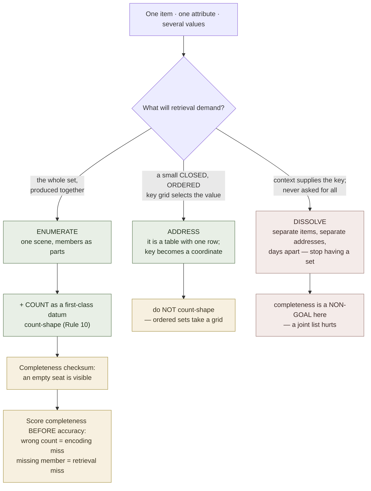

# Multi-Valued Attributes

**Summary**: The case [multi-attribute-encoding](./multi-attribute-encoding.md) cannot handle: **one item, one attribute, several values** — a word with three meanings, a verb with six conjugated forms, a packet field that appears twice, a rule with four exceptions. Channels are no help here by construction, because every value answers the *same* question. The routing question is not how to store them but **what retrieval will demand**, and the three answers are genuinely different techniques: dissolve the set, address it, or enumerate it. Only the third needs a completeness checksum, and only the third is a gap the wiki had not already filled.

**Sources**:
- Internal owners: [vocabulary-word-type-routing](./vocabulary-word-type-routing.md) (owner of the polysemy rule, from Ягодкин/Згода — the *dissolve* route and its mechanism) · [table-memorization](./table-memorization.md) (the *address* route) · [representation-rules](./representation-rules.md) Rule 10 (count-shape, repurposed here as a recall checksum) · [multi-attribute-encoding](./multi-attribute-encoding.md) (the sibling case) · [word-knowledge-links](./word-knowledge-links.md) (directed links; why a set trained one way is not trained the other).
- Worked instance already in the wiki: wireshark-display-filter-grammar — `ip.addr` occurring twice in one packet, and the `all_eq` / `any_ne` operators that exist because a multi-valued field breaks ordinary comparison.
- Synthesis page. No new raw source; the one genuinely new claim (§Silent truncation) is marked as unverified and ships with a test.

**Last updated**: 2026-09-02 — page authored to close the gap named in the 2026-09-02 multi-attribute exchange.

---

## Why channels cannot help

[multi-attribute-encoding](./multi-attribute-encoding.md) works because its attributes answer *different* questions, so each can take a channel that answers that question — position, condition, time. A **multi-valued** attribute is the exact inverse: every value answers the **same** question. There is no second question to hang a second value on, so orthogonality — the whole mechanism of that page — is unavailable by construction, not by oversight.

That is why "just encode them on different channels" is not merely hard advice here; it is incoherent advice. Something else has to give, and what gives is the assumption that the values belong together at all.

## The routing question — three answers

**Three routes, so the count-shape is a triangle** ([representation-rules](./representation-rules.md) Rule 10, declared instance). They are unordered alternatives, not a ladder — you take exactly one per attribute.

```
                        DISSOLVE
                 "context supplies the key;
                  completeness is a non-goal"
                          ·
                         / \
                        /   \
                       /     \
                      ·       ·
              ADDRESS           ENUMERATE
       "a small closed grid    "the demand is the whole
        keys the values"        set, produced together"
```

The routing key is **what retrieval will actually demand** — the same discipline [table-memorization](./table-memorization.md) applies to tables, one level down:

| Route | When | Technique | Owner |
|---|---|---|---|
| **Dissolve** | Context always supplies the key at use time, and you are never asked for the full set | Stop treating it as one item. Separate items, separate addresses, encoded days apart as if unrelated | [vocabulary-word-type-routing](./vocabulary-word-type-routing.md) |
| **Address** | A small, closed, *ordered* key set selects the value (person × number, case × gender) | It is a table, not a set — give the key an address and route each cell normally | [table-memorization](./table-memorization.md) |
| **Enumerate** | The demand is the set *whole* — completeness is the content | One scene containing all members, plus a **count-shape checksum** | this page |

Getting the route wrong is the expensive error, and it is asymmetric: treating an enumerable set as dissolvable loses the completeness you needed, while treating a dissolvable set as enumerable builds a joint list the wiki's own source calls useless.

## Route 1 — Dissolve

The wiki already owns this route and its answer is counter-intuitive enough to state plainly: for polysemous words, **do not encode the set as a set at all**. [vocabulary-word-type-routing](./vocabulary-word-type-routing.md) carries the rule and its mechanism — meanings live at different retrieval addresses, and the routing move is one meaning per sitting, several days apart, encoded as if it were a new word.

The reason it generalizes: when context supplies the key at every use, you are *never* asked to produce the set. Reading a sentence hands you the sense; the demand is recognition of the right one, not enumeration of all. Completeness is not merely unnecessary here — pursuing it *hurts*, because several images hung on one sound interfere with both use and recognition.

**So the first question is not "how do I hold these values" but "will anything ever ask me for all of them?"** If the answer is no, the correct move is to stop having a multi-valued attribute. This is the route most multi-valued material takes, and it is why this page is short.

## Route 2 — Address

When a small closed key set selects the value — a verb's person × number, a noun's case × gender — the material is not a set with several members. It is a **table with one row**, and the key is a coordinate.

The consequence is that everything in [table-memorization](./table-memorization.md) applies unchanged: name the demand first (produce a form from a key, or recognize a form and name its key — separately trained, per [word-knowledge-links](./word-knowledge-links.md)), strip the schema, encode the generator plus its exceptions when the paradigm is regular, and frequency-weight the residue.

**Do not count-shape a paradigm.** [representation-rules](./representation-rules.md) Rule 10 excludes ordered sets from polygons explicitly — cardinality alone does not earn one — and a conjugation table is ordered by its key. Six forms take a grid, not a hexagon. This is the commonest way to misapply the checksum below.

## Route 3 — Enumerate

Some sets must come back whole: a rule's exceptions, the checks in a safety procedure, the ports a service opens, the operators that behave differently on a multi-valued field. Here completeness *is* the content, and this is the route with no existing owner.

Two moves, and the second is the one that matters.

**One scene, members as parts.** Encode the set as a single composite in which each value is a component of one image, so retrieving any member drags the rest. Loose sibling images do not cue each other; a scene's parts do. This is [image-merging](./image-merging.md)'s mechanism used for a different purpose — not fusing *different* attributes into one percept, but binding *same-attribute* siblings so they are co-retrieved.

**Encode the count as a first-class datum.** This is the load-bearing move. [representation-rules](./representation-rules.md) Rule 10 requires a set of two to seven unordered members to be drawn so the arrangement's outline is the polygon of its own size, and states the payoff as a reading property: an empty corner is visible before a single label is read. **Applied at recall rather than at reading, the same property is a completeness checksum** — you recover the shape, count the seats, and a missing member shows up as a gap rather than as nothing at all.

Rule 10's own boundaries carry over intact: the set must be unordered (ordered sets take a ladder), and above seven members the polygon stops being pre-attentively readable — at which point the honest move is to impose a key and switch to Route 2, not to draw a nonagon.

## Silent truncation — the failure this route exists for

Multi-attribute material fails by **collision**: you produce the neighbour's value, confidently and wrongly. Multi-valued material fails differently, and worse:

> **You produce a subset and stop, with no sense that you stopped early.**

Every check the wiki has verifies what you *did* produce. None verifies what you failed to produce — because a partial answer to "name the exceptions" is well-formed, fluent, and indistinguishable from a complete one from the inside. That is the whole argument for spending a channel on the count: the count is the only part of a set that a partial recall cannot fake.

> **Unverified mechanism, flagged not absorbed.** There is an external psychology literature holding that recalling *some* members of a set actively *impairs* recall of the remaining ones — retrieval-induced forgetting and part-list cuing (Slamecka 1968; Anderson, Bjork & Bjork 1994). If it holds, truncation is not neutral but self-reinforcing: the members you retrieve first suppress the ones you have not reached, so re-testing without the count makes the set worse. **The wiki has no page on this and no verified citation for it** — it is named here as a candidate mechanism only. The observable claim above (truncation feels complete) stands on its own and does not depend on it.

## Falsifiable claim

**Claim.** For enumerable sets, encoding the cardinality as a separate datum reduces truncation more than equivalent extra time spent on the members.

**Design.** Matched sets of the same size, split. One arm encodes members plus an explicit count-shape; the other spends the same additional time strengthening member images with no count. Score **completeness** (members recovered ÷ members held) separately from accuracy, cold, after one sleep.

**What refutes it.** Equal truncation rates — which would mean the count is recovered from the members rather than independently, and the checksum is a re-description of knowing the set rather than a separate handle on it.

**Status: not run.** Everything in §Route 3 rests on the structure of the failure, not on an observed comparison — the same standard [table-memorization](./table-memorization.md) §Falsifier result holds itself to.

## Pass floors

Completeness is scored **before** accuracy here, which is the only structural difference from the sibling pages ([meter-overview](./meter-overview.md) owns the layer).

| Event | Test | Floor |
|---|---|---|
| `multivalued.route` | Given a multi-valued attribute, call dissolve / address / enumerate | **<10s**; the call is the only irreversible choice on this page |
| `multivalued.enumerate` | Produce the whole set | **Count first**: state how many before naming any. A right count with a missing member is a retrieval miss; a wrong count is an *encoding* miss, and they are repaired differently |
| `multivalued.recognize` | Given one member, name the set it belongs to | Scored separately — forward does not imply backward ([word-knowledge-links](./word-knowledge-links.md)) |

## Failure modes

| Failure | What it looks like | Fix |
|---|---|---|
| **Routing by material instead of by demand** | Treating every multi-valued attribute the same way | Ask what will be demanded: a keyed use, a cell, or the whole set |
| **Joint list for a dissolvable set** | All meanings of a word learned together | [vocabulary-word-type-routing](./vocabulary-word-type-routing.md)'s rule — separate sittings, days apart, as new words |
| **Count-shaping a paradigm** | A hexagon for six conjugated forms | Ordered sets take a grid; Rule 10 excludes them by name |
| **Silent truncation** | Fluent partial recall that feels complete | Encode the count; score completeness before accuracy |
| **Polygon past seven** | A nonagon for a nine-member set | Impose a key and switch to Route 2 |
| **Loose sibling images** | Members encoded separately, none cueing the others | One scene, members as parts |
| **Re-testing without a count** | Repeated recall of the same easy members | The count is what makes the missing ones visible; without it, practice reinforces the subset |

## Mnemonic

**Ask what will be asked — then dissolve, address, or enumerate.** Most multi-valued attributes should stop being sets (context hands you the key). Some are tables wearing a set's costume (a closed key grid). Only the rest are genuinely sets, and for those the count is the content: **a partial recall can fake every member but it cannot fake the number.**

## Checksum

1. Why can channels not carry a multi-valued attribute, and how is that different from the multi-attribute case? (Every value answers the same question, so there is no second question to hang a second value on.)
2. Name the three routes and the single question that selects between them.
3. What does the wiki's own source say to do with a word's several meanings, and why is it the opposite of building one complete set?
4. Why is a conjugation table not count-shaped? (It is ordered; Rule 10 excludes ordered sets — cardinality alone does not earn a polygon.)
5. State the failure mode this page exists for, and why no existing wiki check catches it.
6. On the enumerate route, what distinguishes a retrieval miss from an encoding miss? (A right count with a missing member versus a wrong count.)

## Visual



New framework minted: NONE. New acronym: NONE — *dissolve · address · enumerate* is a page-local routing triple, deliberately not registered: the three words are ordinary English and would leak across unrelated pages, the same call the glossary made for `bleed` and `cycle`.

## Related pages

- [multi-attribute-encoding](./multi-attribute-encoding.md) — the sibling case: several *different* attributes, where channels do work; this page is its complement, not its extension
- [encoding-dimensionality](./encoding-dimensionality.md) — the axis above both; a multi-valued set held as a list is still a list
- [vocabulary-word-type-routing](./vocabulary-word-type-routing.md) — owner of the polysemy rule, and of the *dissolve* route's mechanism
- [table-memorization](./table-memorization.md) — owner of the *address* route; a keyed paradigm is a table one level down
- [representation-rules](./representation-rules.md) — Rule 10 count-shape, whose reading property this page reuses as a recall checksum, and whose ordered-set exclusion bounds it
- [image-merging](./image-merging.md) — one scene with members as parts, so siblings cue each other
- [word-knowledge-links](./word-knowledge-links.md) — why forward and backward set membership are separately trained
- wireshark-display-filter-grammar — the worked instance: a field that occurs twice, and the operators that exist because of it
- [meter-overview](./meter-overview.md) — the floors above

---

## U — See (CAST)

1. One item, one attribute, several values — a set with no second question to spread across
2. Edges: demand → route (dissolve · address · enumerate); count → completeness check on the enumerate branch only

## D — Name (NEDF)

1. Multi-valued attribute = several values of the *same* attribute on one item
2. Distinguisher: the inverse of [multi-attribute-encoding](./multi-attribute-encoding.md) — same question many times, not many questions once; so orthogonality is unavailable and the routing key is the retrieval demand
3. Failure mode: silent truncation — a fluent partial answer, indistinguishable from a complete one from the inside

## F — Do (SPEAR)

1. Attribute arrives → ask whether anything will ever demand the whole set
2. No → dissolve into separate items at separate addresses; keyed by a closed ordered grid → address it as a table
3. Yes → one scene with members as parts, plus the count as its own datum; score completeness first

## B — Watch (HEART)

1. Building a joint list for material context would have keyed anyway
2. Count-shaping something ordered
3. Re-testing a set without its count, so practice reinforces the members you already had

## L — Predict (ORACLE)

1. Enumerable set encoded without a count → predict truncation, and predict it feels complete
2. Polysemous word encoded as one joint scene → predict both use and recognition degrade, not just recall
3. Set past seven members with no key → predict the polygon stops working before the memory does

## R — Act (GRACE)

1. "I always forget one of them" → count-shape it; that is a completeness defect, not a strength defect
2. "I know the word but keep reading it wrong in context" → wrong route; dissolve it
3. Set growing past seven → impose a key and move to the address route
