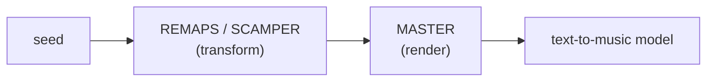

# Music Generation Frameworks

**Summary**: How the memory-transformation frameworks apply to music generation. [REMAPS](./remaps.md) and [SMASHIN' SCOPE](./smashin-scope.md) retarget cleanly from mental imagery onto a *musical* seed, where the six moves map onto the canonical contrapuntal devices (retrograde = Reverse, inversion = Rotate, augmentation = Exaggerate…). The SCAMPER deck from [creative-thinking-os](./creative-thinking-os.md) becomes a prompt-mutation operator set for text-to-music models. And the two-stage [image-pipeline](./image-pipeline.md) (transform → render) generalizes to a **music pipeline** whose render half is **MASTER** — the audio twin of [CLAMP](./clamp-render-lens.md), its six slots locked against Suno's v4.5/v5 control surface.

**Sources**:
- Design synthesis, David conversation 2026-07-02 (validated via `/validate-idea`, verdict keep-with-modification)
- Builds on [remaps](./remaps.md) (`raw/Neural OS Book/REMAPS.md`), [clamp-render-lens](./clamp-render-lens.md), [smashin-scope](./smashin-scope.md), [creative-thinking-os](./creative-thinking-os.md)
- Tuning spec: music-profile (David's taste profile, 2026-07-02)
- MASTER slot-locking source (2026-07-02 web research): Suno help — [Music Glossary](https://help.suno.com/en/articles/9010177), [Create in v4.5: Detailed Style Instructions](https://help.suno.com/en/articles/5782849), [Create Music with AI (hub)](https://suno.com/hub/create-music-with-ai); Suno controls surveyed — style prompt, structure/vocal-delivery/dynamic meta-tags, Exclude Styles, Style-Influence + Weirdness sliders, Personas, Covers
- Contrapuntal-device mappings are standard music theory (retrograde, inversion, augmentation, diminution, transposition), cited as general knowledge — no raw source

**Last updated**: 2026-07-02

---

## What this page is

This is a **design-synthesis** page, in the same sense as [software-design-principles-for-neural-os](./software-design-principles-for-neural-os.md): it does not claim the source frameworks were built for music. It claims that the frameworks already in the wiki, pointed at a musical seed instead of a mental image, produce a working music-generation toolkit — and it names the one genuinely missing piece (an audio render-lens).

The move that makes this legitimate rather than clever is the [Open/Closed principle](./software-design-principles-for-neural-os.md): applying an existing framework to a new *material type* (music instead of imagery) is extension, not redefinition. REMAPS-as-composition needs **no new acronym**. Only the render-lens is new — and its six slots are now locked against Suno's control surface (researched 2026-07-02), so it is no longer provisional.

## Three senses of "memory principles in music" — keep them apart

Collapsing these three is the trap. Only the middle one is about *generating* music; the first is about *carrying* content, the third about *diagnosing* stickiness.

| Sense | What it does | Objective | Home |
|---|---|---|---|
| **Carrier** | Encode content *into* music so the song makes the content stick (alphabet songs, multiplication chants) | Retrievability of the payload | Already built — lyrebrook-radio-rotation + [cultural-string-sequences](./cultural-string-sequences.md) |
| **Generator** | Use REMAPS / SCAMPER moves to *transform a musical seed* into variations | Novelty + fit | This page §REMAPS-as-composition, §SCAMPER deck |
| **Memorability** | Use [SMASHIN' SCOPE](./smashin-scope.md) to diagnose *why a hook is catchy* | Earworm strength | This page §The tension |

## REMAPS as a composition engine

[REMAPS](./remaps.md) is defined as a six-move transformation checklist for making any image, concept, or scene retrievable, and it explicitly *absorbs* "creative variation: substitute, combine, adapt, modify, eliminate, reverse" (source: [remaps](./remaps.md) §What REMAPS Absorbs). Point that checklist at a **musical motif** and the six moves land on the canonical contrapuntal transformations — and, strikingly, on David's already-confirmed music-profile attractors:

| REMAPS move | Classical / production device | music-profile attractor it already names |
|---|---|---|
| **R** — Reverse / Rotate / Relocate | retrograde · melodic inversion · transposition / modulation | — |
| **E** — Exaggerate / Eliminate | augmentation (stretch durations) · thinning texture | **"slowed+reverb"** (augmentation) · **Korn-unplugged / strip the production** (eliminate) |
| **M** — Modify / Merge / Move | reorchestration · genre fusion / mashup · adding groove | **"Bulgarian folk choral + dark trap," "anime + dark trap"** (merge) · electric→acoustic (modify) |
| **A** — Associate / Adapt / Aesthetic | sampling / quotation · genre transplant · register targeting | **"Bre Petrunko" sample, Naruto RMX** (associate) · folk-tune-into-trip-hop (adapt) |
| **P** — Play / Palace / Path | playful juxtaposition · song arc / structure | **Mode A escalation vs Mode B sustain** *is* the Path |
| **S** — Sensations / Symbols | timbre · production texture · leitmotif | **sub-bass as physical element · scrap-metal percussion · reverb** (sensations) |

Read the right column back: the music profile's rule that *"production modifications that intensify the core emotional attractor are sought out, not just tolerated"* (source: music-profile §Pacing) is a verbatim restatement of the REMAPS practical rule — *change 2–3 dimensions to intensify the signal, then re-test*. The profile was independently running REMAPS moves as production techniques before either was connected to the other. That is the generative payoff: a seed (say, the Mazzy Star register) plus 2–3 REMAPS moves (Merge with a post-Soviet source, Exaggerate via augmentation, Eliminate the drums) is a *specification for a new track* that is likely to pass the profile's gate, because the moves are the same ones the confirmed picks already went through.

**Transform vs render — the same overlap CLAMP has.** REMAPS "slowed" (Exaggerate/augmentation) *transforms* the seed's tempo; the render-lens *specifies* an absolute BPM. Same axis, transform-side vs render-side — identical to how REMAPS Rotate (viewpoint transform) overlaps [CLAMP](./clamp-render-lens.md) Camera (absolute lens spec). See [clamp-render-lens](./clamp-render-lens.md) §REMAPS × CLAMP Composition for the image-side precedent.

## SCAMPER as the prompt-mutation deck

[creative-thinking-os](./creative-thinking-os.md) already files SCAMPER as the **"vary"** move — a seven-card [NEDF](./nedf-overview.md) deck (Substitute · Combine · Adapt · Modify · Put-to-other-use · Eliminate · Reverse). For a text-to-music model (Suno, Udio, MusicGen) each verb becomes a **prompt operator** on an existing track description:

- **Substitute** the vocalist / language (profile rule: non-English is often an *amplifier*, not a barrier — the Kovacs signal)
- **Combine** two cultural sources — the profile's single most-confirmed attractor (traditional source × dark trap)
- **Adapt** a folk / choral tune into a trip-hop frame (the lyrebrook-radio-rotation move, run for taste instead of curriculum)
- **Eliminate** production layers (unplugged), then **Modify** what remains
- **Reverse** the arc — open at the emotional peak (t.A.T.u's *"desperate urgency from the opening bar"*) instead of building to it

SCAMPER and REMAPS overlap by design — REMAPS absorbed SCAMPER's verbs (source: [remaps](./remaps.md) §What REMAPS Absorbs). Use SCAMPER when the unit of work is a **prompt string** to mutate; use REMAPS when the unit is a **motif / scene** to transform. Same moves, two altitudes.

## MASTER — the audio render-lens

The [image-pipeline](./image-pipeline.md) is two stages: [REMAPS](./remaps.md) transforms the scene, then [CLAMP](./clamp-render-lens.md) fixes the render directives (camera, lighting, medium, constraints) that REMAPS does not name. Music generation needs the same second stage — REMAPS/SCAMPER give the transform, but nothing names tempo, mix, arc, and the negatives. **MASTER** fills that slot: the audio twin of CLAMP. The name is the metaphor — *mastering* is the finalization stage of a record, exactly as CLAMP is the capture/finalization lens for an image.

> **Status: locked** (2026-07-02). CLAMP earned its five slots from three ingested image-prompting guides; MASTER earns its six from Suno's v4.5/v5 control surface (see Sources). Every slot below maps to a real Suno control — which also settled the one open question: A and T stay separate.

*Naming note — same-letter string collisions only, no shared definitions: MASTER's **M** is musical **meter** (tempo / time-feel), not the [METER](./meter-overview.md) measurement layer; **S**'s *mix* is audio mixing, not the proof-theoretic mix rule.*

### The six slots — each grounded in a Suno control

| Slot | What it fixes | Suno control it maps to |
|---|---|---|
| **M — Meter & tempo** | BPM, groove, swing, time-feel | tempo/rhythm terms in the style prompt (Adagio…; "half-time", "syncopated", "four-on-the-floor"); the "slowed" target |
| **A — Arrangement** | which instruments/voices, density, orchestration | instrumentation in the style prompt ("sparse piano and vocals" vs "dense orchestral") + **vocal gender** control ("male lead, female backup") |
| **S — Space & mix** | reverb depth, stereo width, sub-bass, front/back depth | production-space adjectives ("reverb-heavy ambient soundscape", "sub bass", "808") in the style prompt |
| **T — Timbre & treatment** | production texture + vocal delivery | **vocal-delivery meta-tags** (`[Whispered]` `[Belted]` `[Raspy]` `[Soulful]`) + texture adjectives ("lo-fi", "distorted", "analog") — the *production-reveals-not-covers* dial |
| **E — Energy arc** | Mode A escalation→catharsis / Mode B sustain | **dynamic meta-tags** (`[Build]` `[Drop]` `[Crescendo]` `[Fade Out]`) + energy descriptors ("high energy", "chill") before the turning section |
| **R — Restrict / Reserve** | preserve invariants + proscribe negatives | **Exclude Styles** field + v5 `no [element]` negatives — the cold zones ("no upbeat, no clean-pop polish"). Twins CLAMP's **P** exactly |

**A/T fold — resolved: keep separate.** The provisional worry was that Arrangement (*what plays*) and Timbre/treatment (*how it sounds*) would collapse into one slot. Suno's own model settles it: it separates the **instrument list** (A, in the style prompt) from **vocal-delivery meta-tags** (T, bracketed in the lyrics) from production-texture adjectives (also T). Three distinct control surfaces → A and T stay two slots.

**Arc splits across the two stages.** Suno exposes song shape two ways: **structure tags** (`[Intro]` `[Verse]` `[Chorus]` `[Bridge]` `[Outro]`) that lay the *route*, and **dynamic tags** (`[Build]` `[Drop]` `[Crescendo]`) that render the *intensity* along it. The route is [REMAPS](./remaps.md) **P**ath (Stage 1, transform); the intensity is MASTER **E** (Stage 2, render) — the same transform/render split as everywhere else in the pipeline.

### MASTER prompt template

Mirroring CLAMP's template, a MASTER spec compiles to Suno's two inputs:

```
Style prompt:  [genre / blend], [mood], [M: tempo], [A: instrumentation + vocal gender],
               [S: reverb / space / sub-bass], [T: texture — lo-fi / analog / distorted]
Exclude:       [R: no upbeat, no clean-pop polish, no <cold-zone>]

Lyrics (the arc):
  [Intro] … [Verse] … [Chorus] …          ← REMAPS Path (structure = the route)
  [Build] / [Crescendo] before the turn    ← MASTER E (dynamic intensity)
  [Whispered] / [Belted] inline            ← MASTER T (vocal delivery)
  [Outro]                                  ← always close (no tag → Suno cuts or loops)
```

Meta-controls (not slots): Suno's **Style Influence** slider (how hard to follow the prompt) and **Weirdness** slider (how experimental) tune *how strictly* MASTER is applied — the audio analogue of a generation temperature.

**Default world profile — and its Suno instantiation.** music-profile is to MASTER what [Velvet Aeon](./world-velvet-aeon.md) is to [CLAMP](./clamp-render-lens.md): the auto-loaded slot defaults (darkness-as-substrate, emotional-authenticity gate, sub-bass-when-it-amplifies, Mode A/B) unless overridden. Suno **literalizes** this — a **Persona** saves a track's voice + style + vibe for reuse across songs, so encoding the music-profile as a Persona *is* loading MASTER's default world profile into the tool. And a **Cover** (re-render a song in a new style, melody kept) is a pure render-swap — same REMAPS motif, new MASTER slots — the transform/render split made operational.

## The music pipeline — and the unlock

The whole thing composes into a two-stage pipeline mirroring [image-pipeline](./image-pipeline.md):



The architectural find — and the reason this passed validation — is that **the `transform → render` split is a real extension point, not an image-only accident**. This is [Dependency Inversion + Strategy](./software-design-principles-for-neural-os.md): the pipeline depends on the *abstraction* "render-lens," and CLAMP (image) and MASTER (audio) are two concrete strategies selected by output medium. A second clean implementation of the same abstraction is evidence the abstraction is sound. Registered in [composability-index](./composability-index.md).

## The tension — memorability is not the gate

The **Memorability** sense (SMASHIN' SCOPE) does not transfer cleanly, and *why* is instructive. [SMASHIN' SCOPE](./smashin-scope.md) maximizes stickiness — but a maximally sticky stimulus (Exaggeration + Play + Colour + Humour all dialed to 11) is a **jingle**, which is precisely the music-profile cold zone ("upbeat/cheerful pop," "mainstream clean pop"). Note that REMAPS already *dropped* Buzan's **Positive Images** principle (source: [smashin-scope](./smashin-scope.md) §Mapping to REMAPS), and the profile is darkness-as-substrate — so REMAPS and the profile already agree on rejecting forced positivity.

Resolution: in music, the transform moves stay **subordinate to the emotional-authenticity gate**. The moves generate candidates; the gate selects. This is the profile's own test — *"does this production choice make the emotional event louder or quieter? Louder = pass"* (source: music-profile §Korn unplugged signal) — which is the same discipline REMAPS states as "retrievability, not artistic perfection" (source: [remaps](./remaps.md) §Practical Rule), retargeted from memory to emotion. Memorability is a byproduct of a deep signal, never the target.

## METER hooks

Measurement events for [METER](./meter-overview.md):

- `music_gen.lens_slot_filled` — which MASTER slots were specified per generation (surfaces which axes actually carry weight).
- `music_gen.pass_gate` — did the output clear the music-profile emotional-authenticity gate (the Mode A/B + darkness-substrate test)?
- **Fit floor** — the slots are now locked against Suno's surface; the ≥3× reuse floor now tracks *real-world fit* (does a MASTER spec reliably clear the music-profile gate on actual Suno output?), not slot definition. (Same disposable-tier logic [UMTF](./universal-mental-tagging-framework.md) applies.)

## When to reach for this

- Generating music to match a taste profile (feed the seed through REMAPS + MASTER, gate on music-profile)
- Producing variations on an existing track (SCAMPER the prompt, or REMAPS the motif)
- Building the Lyrebrook radio tracks (the Carrier sense — payload + listenability)

## When not to

- Pure listening / recommendation with no generation — music-profile alone is sufficient
- Treating the MASTER prompt template as tool-universal — it compiles to *Suno's* inputs (style prompt + meta-tags + Exclude); Udio / MusicGen have different surfaces and need their own compile target

## Related pages

- [remaps](./remaps.md) — the six-move transform, reused here as a composition engine (Stage 1)
- [clamp-render-lens](./clamp-render-lens.md) — the image render-lens MASTER twins (Stage 2, image side)
- [image-pipeline](./image-pipeline.md) — the transform→render pattern this generalizes
- [smashin-scope](./smashin-scope.md) — the 12-principle memorability ancestor; source of the memorability-vs-gate tension
- [creative-thinking-os](./creative-thinking-os.md) — owner of the SCAMPER deck reused as a prompt-mutation operator set
- music-profile — the default world profile / tuning spec for MASTER
- vocal-range-profile — concrete values for MASTER's **A** (vocal gender/register) and **T** (vocal delivery) slots when David is the intended singer (low baritone, B♭2–A3)
- lyrebrook-radio-rotation — the Carrier sense (content encoded *into* music)
- gof-pattern-song-cycle — a worked Carrier instance: the 23 GoF patterns rendered through this pipeline, one MASTER profile per Purpose album
- [software-design-principles-for-neural-os](./software-design-principles-for-neural-os.md) — the Open/Closed + DIP + Strategy reasoning that lets this extend the render-lens abstraction
- [composability-index](./composability-index.md) — where the music-pipeline unlock is registered
- [glossary](./glossary.md) — registry entry for MASTER + Music Pipeline
- [framework-comparison-matrix](./framework-comparison-matrix.md) — the **Render / Externalization layer** this is the **auditory channel** of

---

## U — See (CAST)
1. Two-stage music pipeline: REMAPS/SCAMPER (transform) → MASTER (render)
2. MASTER is the audio twin of CLAMP; music-profile is its default world

## D — Name (NEDF)
1. Music Generation Frameworks = memory-transform frameworks applied to music + the MASTER render-lens
2. Distinguisher: transform/render split generalizes from image to audio (same abstraction, 2nd implementation)
3. Failure mode: maximizing memorability → jingle → fails the emotional-authenticity gate

## F — Do (SPEAR)
1. Seed → apply 2–3 REMAPS moves (or SCAMPER the prompt) → fill MASTER slots → compile to Suno inputs → generate → gate on music-profile
2. Compile: style prompt (M·A·S·T) + Exclude (R) + lyric structure/dynamic/delivery tags (Path + E + T)

## B — Watch (HEART)
1. Treating the Suno compile target as tool-universal (Udio/MusicGen differ)
2. Optimizing catchiness instead of emotional signal (jingle drift)

## L — Predict (ORACLE)
1. All-dials-to-11 transform → predicts jingle → predicts gate failure
2. Cultural-source Merge → predicts profile pass (confirmed attractor)

## R — Act (GRACE)
1. New track wanted → run the pipeline, compile to Suno, gate on emotional authenticity
2. New tool (Udio/MusicGen) → add its compile target; re-gate on music-profile
