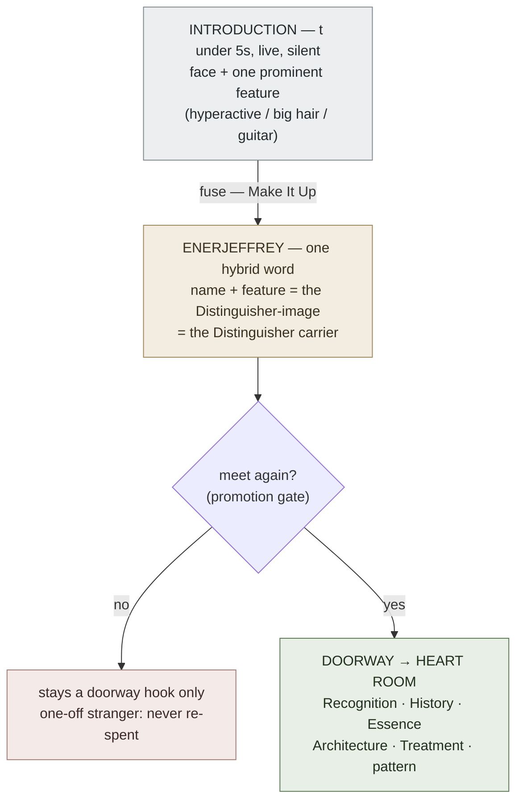

# Name-Face Fast-Encode

**Summary**: A Tier-2 primitive for sub-5-second first-meeting name+face capture — fuse the person's name with one prominent feature into a single Distinguisher-bearing hybrid word, attached to the face at introduction. It fills the gap between a single-concept [NEDF](./nedf-overview.md) card and a full [HEART](./heart-overview.md) person room, and feeds HEART's Recognition doorway when the stranger recurs.

**Sources**: The Mnemonics Mind And Memory Improvement For Adults 2020.epub; internal — [heart-overview](./heart-overview.md), [nedf-overview](./nedf-overview.md), [mnemonic-methods-master](./mnemonic-methods-master.md), [substitute-word-system](./substitute-word-system.md).

**Last updated**: 2026-07-10.

---

## The Gap It Fills

You meet someone once, exchange a few sentences, walk away, and by the end of the day the name is gone — and often the face with it. The source frames this as a common, business-costly failure. (source: The Mnemonics Mind And Memory Improvement For Adults 2020.epub)

Neural OS already has two people-and-concept encoders, but neither fits the one-off stranger:

- [NEDF](./nedf-overview.md) is built to encode a **single concept as one vivid scene** — precise, but its target is a concept card, not a live introduction, and it is not a sub-five-second move.
- [HEART](./heart-overview.md) builds a **full person room** (Recognition, History, Essence, Architecture, Treatment, pattern tag). That richness is exactly right for people you interact with repeatedly, and exactly too expensive for a stranger you may never see again.

Name-Face Fast-Encode is the **primitive that sits between them**: fast enough to run silently mid-conversation, cheap enough to spend on someone who might turn out to be nobody, and structured enough that its output slots straight into HEART's doorway if the person recurs. This is the live, in-head, recognition-speed encoding that [CAST](./cast-overview.md)'s mission prioritizes over slower System-2 assembly.

(The rough envelope the design targets: an NEDF concept card is a couple of minutes of deliberate work; a HEART room is on the order of ten minutes per person; this primitive must run in under five seconds. The five-second floor is the hard constraint — see [METER](./meter-overview.md) below. The two comparison timings are design-level positioning estimates, not measured source claims.)

## The Technique — "Make It Up"

The mechanic is the book's **Make It Up** technique: create a new word out of two existing ones. The author reports it "works particularly well for remembering names and information of people I've just met." (source: The Mnemonics Mind And Memory Improvement For Adults 2020.epub)

The move is: **name + one prominent feature → one hybrid/nonsense word, bound to the face at the moment of introduction.** The worked examples from the source:

- A man named **Jeffrey** who is extremely hyperactive → fuse "Jeffrey" + "energetic" → **"Enerjeffrey."**
- A woman named **Jennifer** with beautiful flowing hair → **"Jennif-hair."**
- A girl named **Zoey** who plays guitar → **"Zotar"** or **"Guitoey."**

(source: The Mnemonics Mind And Memory Improvement For Adults 2020.epub)

The source's own instruction for faces reinforces the same discipline: when someone is introduced, "pay attention to their name and immediately choose a recognizable feature and create their mnemonic name." (source: The Mnemonics Mind And Memory Improvement For Adults 2020.epub)

If a name resists hybridization, the fallback is a [substitute-word-system](./substitute-word-system.md) move — link the name to a familiar word and picture it. The source's example: **Doug** → the near-homophone "dug" → picture Doug with a spade sticking out of his head. (source: The Mnemonics Mind And Memory Improvement For Adults 2020.epub)

Reinforcement tips from the source: greet the person by name right after the introduction and repeat it when saying goodbye; if you need extra repetition, ask how the name is spelled. (source: The Mnemonics Mind And Memory Improvement For Adults 2020.epub)

## The Correction — Why "Just Focus" Is Incomplete

The source leans heavily on a focus diagnosis. It quotes Ron White (2009 and 2010 USA Memory Championship winner): "A major reason you don't recall names is you weren't listening... This is not a memory problem. It is a focus problem." (source: The Mnemonics Mind And Memory Improvement For Adults 2020.epub)

Focus is necessary but **not sufficient**, and presenting it as the whole answer is the source's bug. Attention gets the name *into* short-term memory; it does nothing to make two names *discriminable* at retrieval. If you attentively hear "David" at 7pm and "Daniel" at 7:20, you can have listened perfectly to both and still collide them an hour later, because nothing separates them.

This is precisely the job of the **Distinguisher** — [NEDF](./nedf-overview.md)'s slot for separation from the nearest confusing neighbor. The fix is not "listen harder," it is: **the hybrid word must carry a Distinguisher.** By binding the name to *one prominent, person-specific feature*, "Enerjeffrey" is not just a well-heard "Jeffrey" — it is a Jeffrey that cannot be confused with a calm Jeffrey, a different Jeffrey, or a Geoffrey standing three feet away. The feature is the discriminator; the fusion is what makes the discriminator inseparable from the name at recall.

Rule: **name-only repetition without a Distinguisher-bearing image is a collision waiting to happen.** Two "properly listened-to" names with no discriminator still merge. Always fuse in one feature.

## Where It Sits — Tier-2 Primitive Feeding HEART

In the [mnemonic-methods-master](./mnemonic-methods-master.md) tier scheme, Name-Face Fast-Encode is a **Tier-2 encoder primitive**: a sharp, specialized tool that feeds a Tier-1 framework rather than standing alone. Its downstream consumer is [HEART](./heart-overview.md).

HEART's Phase-1 doorway (Recognition) already holds exactly "face + name sound-hook." Name-Face Fast-Encode is the primitive that *produces* that doorway payload on first contact — a Distinguisher-bearing hybrid word welded to the face. It never competes with HEART and never tries to model History, Essence, Architecture, or Treatment. It builds only the doorway, fast, so that a room can later be raised behind it.

## The Promotion Gate

The primitive is deliberately shallow, so it needs an explicit, falsifiable trigger for when to spend the fuller [HEART](./heart-overview.md) investment:

> **Meet the person again → build the HEART room.**

Recurrence is the gate. A stranger met once and never again stays at the fast-encode layer forever — a hybrid word and a face, nothing more. The moment they recur (second meeting, a name that reappears in your circle, a client who books again), promote: take the existing doorway payload as HEART's Recognition slot and start filling Essence, Architecture, and the rest. The gate is falsifiable because it names an observable event (a second encounter) and a required action (a HEART room exists afterward); if the person has recurred and no room was built, the gate was missed.

## METER

Measured via [METER](./meter-overview.md). Pass-floors:

- **Encode speed**: hybrid word formed in **≤ 5 seconds**, silently, during live conversation (no visible System-2 pause).
- **Short recall**: name recalled correctly at **+10 minutes**, same gathering, on seeing the face again.
- **Durable recall**: name recalled correctly at **+24 hours**.
- **Promotion**: escalate to a full [HEART](./heart-overview.md) room **only if the person recurs** — do not pre-build rooms for one-off strangers.

Failure signature to watch (the anti-metric): two encoded people whose hybrids share the same feature or no feature — a collision, not a recall miss. Fix by re-encoding with a sharper, person-unique Distinguisher.

## Validation

Passed `/validate-idea` on 2026-07-10 — verdict **keep-with-modification**. The three approved modifications, all built into this page:

1. **Tier-2, not Tier-1.** Positioned in the [mnemonic-methods-master](./mnemonic-methods-master.md) tier scheme as a Tier-2 primitive that feeds [HEART](./heart-overview.md)'s Recognition/doorway slot. It never competes with HEART.
2. **Borrow NEDF's Distinguisher discipline.** The source's focus-only diagnosis (Ron White) is treated as **incomplete**: the encode must fuse name + one prominent feature into a single Distinguisher-bearing image, or Person A and Person B still collide. Distinguisher concept owned by [NEDF](./nedf-overview.md).
3. **Explicit promotion gate.** Falsifiable: person recurs → build the HEART room.

Stale-source flag on record: the epub is mass-market self-help; its Ron White "focus problem" framing is presented there as the complete answer and is corrected here. The source's Major System digit table (which has an r/l collision at digits 4–5) is deliberately **not** reproduced on this page.

## Mnemonic

**"One face, one feature, one word."** — the three-ones cadence of the whole primitive.

Say it as a beat you can run mid-handshake: *catch the name → grab the one loudest feature → weld them into one silly word on the face.* If any of the three "ones" is missing — no feature grabbed, or two words instead of one welded image — the encode is a bare repetition and will collide. The nonsense word should make you almost laugh; the laugh is the receipt that the Distinguisher landed.

## Checksum

Answerable from recall alone:

1. What single thing, added to a well-heard name, turns it from a collision risk into a discriminable one — and which [NEDF](./nedf-overview.md) slot owns that concept? (Answer: one prominent person-specific feature, fused in; the Distinguisher slot.)
2. What is the falsifiable event that promotes a fast-encode into a full [HEART](./heart-overview.md) room? (Answer: the person recurs — you meet them a second time.)
3. Why is the source's "it's a focus problem, you weren't listening" diagnosis incomplete? (Answer: attention loads the name into memory but adds no discriminator; two attentively-heard names with no feature still merge at retrieval.)

## Visual

The hybrid word IS the future room's doorway plate. Fast-encode builds the doorway; recurrence raises the room behind it.

---

## U — See (CAST)
1. First meeting: face + one prominent feature + the name sound
2. One hybrid word fusing name + feature — the Distinguisher carrier

## D — Name (NEDF)
1. Name-Face Fast-Encode = Tier-2 sub-5-second name+face primitive
2. Fuses name + one feature into a single Distinguisher-bearing image
3. Feeds HEART's Recognition doorway; not a standalone person model

## F — Do (SPEAR)
1. At introduction: catch the name, pick one prominent feature
2. Fuse into one nonsense/hybrid word welded to the face
3. Greet by name; repeat at goodbye; ask spelling for extra reps

## B — Watch (HEART)
1. Name-only repetition, no Distinguisher → A and B collide
2. Feature not prominent or not person-unique → cue fails next meeting
3. Person recurs but no HEART room built → promotion gate missed

## L — Predict (ORACLE)
1. Distinguisher-bearing hybrid → name recall holds at +24h
2. Bare well-heard repetition → predictable collision at retrieval

## R — Act (GRACE)
1. Stranger met once → fast-encode only, never over-invest
2. Person recurs → promote the doorway hook into a full HEART room

## Related pages

- [heart-overview](./heart-overview.md) — the Tier-1 framework this primitive feeds; its Recognition doorway is the consumer of the hybrid word
- [nedf-overview](./nedf-overview.md) — owner of the Distinguisher discipline that corrects the source's focus-only diagnosis
- [mnemonic-methods-master](./mnemonic-methods-master.md) — the tier scheme that places this as a Tier-2 encoder primitive
- [substitute-word-system](./substitute-word-system.md) — the fallback when a name resists hybridization (Doug → "dug" → spade)
- [cast-overview](./cast-overview.md) — the live, in-head, recognition-speed mission this primitive serves
- [meter-overview](./meter-overview.md) — the measurement floors (≤5s encode, +10min / +24h recall, recurrence-gated promotion)
- [kozarenko-mnemotechnics](./kozarenko-mnemotechnics.md) §Person identity — the Giordano sibling to this primitive, found 2026-07-22. It reaches the **opposite** conclusion about the face itself: where this page hybridizes a facial feature with the name, Kozarenko argues from low-spatial-frequency recall that faces should **not** be encoded directly at all, and designates the person by an occupation/hobby object instead. Two live answers to one problem — see [cross-school-encoding-router](./cross-school-encoding-router.md) row 9
