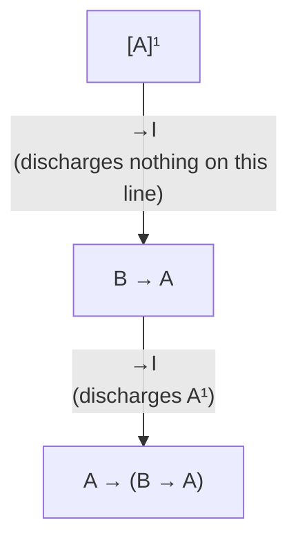
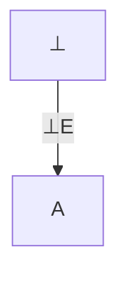
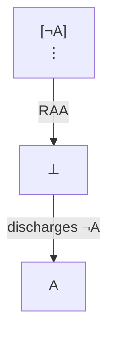
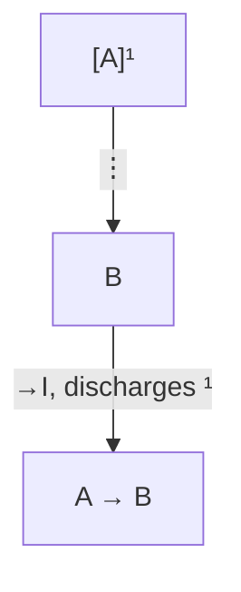
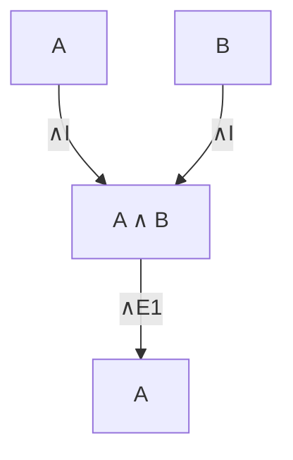

# Natural Deduction (NM / NJ / NK)

**Summary**: Gentzen's 1935 proof system in which each logical connective comes with a pair of rules — an *introduction* rule (how to prove a formula with that connective as main operator) and an *elimination* rule (how to use such a formula) — and proofs are *trees* of formulas in which some assumptions can be *discharged*. The minimal, intuitionistic, and classical variants (NM, NJ, NK) differ only in the rules for negation / ⊥ / classical reductio. Natural deduction is the system mathematicians actually argue in. The wiki's authoritative source for the intro/elim duality and assumption-discharge mechanics.

**Sources**:
- [Mancosu, Galvan, Zach (2021)](./proof-theory-mancosu-galvan-zach.md) Ch 3 (rules and deductions), Ch 3.3 (classical), Ch 3.7 (equivalence with axiomatic).
- an-introduction-to-proof-theory-normalization-cut-elimination-and-consistency-proofs.pdf — Ch 4 (normal deductions) + Appendix E (full NM/NJ/NK rule and conversion tables).
- Gentzen, G. (1935b) "Untersuchungen über das logische Schließen I," *Math. Z.* 39: 176-210. (Dissertation.)
- Prawitz, D. (1965) *Natural Deduction: A Proof-Theoretical Study*. Stockholm.

**Last updated**: 2026-06-10

---

## Unlocks (lead, not footer)

1. **Assumption-discharge × production-reception grammar pair × I-utterance / SHIELD.** ND's discharge is: temporarily assume A, derive B, conclude A→B with A *no longer in force*. I-utterance E-F-R: under the *Event*, derive a *Feeling* and a *Request* that lands independent of which Event-interpretation was assumed. SHIELD's *interpret-shielded*: receive A as discharged-already. **The discharge mechanism is the formal-logic grandparent of the production-reception grammar pair.**

2. **Intro/elim duality × proof-theoretic harmony × [GRACE](./grace-overview.md).** Every connective has *one* intro and *one* elim rule, related by the *harmony* condition: the elim never extracts more than the intro deposits. This is the formal expression of *what a connective means by what it lets you do with it* — the philosophical core of [proof-theoretic-semantics](./proof-theoretic-semantics.md). GRACE's discipline (the Read sets up exactly what the Alternatives need) is the social-pragmatic instance.

3. **Detour-and-normalization × [FRAME FORGE Distill](./frame-forge.md).** A *detour* is intro-then-elim on the same formula (the introduced formula was discarded). [Normalization](./normalization-theorem.md) eliminates detours; FRAME FORGE Distill drops working hypotheses that don't appear in the final claim. Same shape.

## Mnemonic

**RAID-T** = *Rules-come-in-pairs · Assumptions-can-be-discharged · Intro-introduces · Detour-eliminates · Tree-structured.*

Plays as *"raid the tee"* — proofs raid the tree of hypothetical assumptions, knocking off each one as the conditional that wraps it is introduced.

## Memory checksum

If you can answer these in <60 s each from memory, the page is encoded:

1. State the **→I** rule and what gets discharged. (*From a derivation of B under temporary assumption A, conclude A → B. The discharge marks A as no longer open. Multiple instances of A in the sub-proof can be discharged at one →I inference.*)
2. State [**modus ponens**](./logic-atomic-design.md) in ND vocabulary, and what its proper name is. (*The →E rule: from A and A → B, conclude B. The connective whose elim rule this is, is the conditional.*)
3. State the difference between **NJ** and **NK** rules. (*NK = NJ + classical absurdity rule (or double-negation elimination, or excluded middle). Intuitionistically you can derive A from contradicting assumptions but not from a proof that ¬¬A; classically you can.*)
4. Why are ND proofs **trees rather than sequences**? (*To track which assumption an inference depends on. A formula in the tree appears at most once as a conclusion of one inference and at most once as a [premise](./argument-anatomy.md) of one inference — so discharge can target a specific occurrence.*)
5. Name the connective whose ND rules **two-version** elimination has. (*∧ (conjunction) has two elim rules: from A ∧ B conclude A; from A ∧ B conclude B. Equivalently it has one elim rule with two conclusions, but the pedagogical convention is to split them.*)

## Visual — the rule schema

| Connective | Introduction rule(s) | Elimination rule(s) |
|---|---|---|
| ∧ | A, B ⟹ A ∧ B (∧I) | A ∧ B ⟹ A (∧E1) · A ∧ B ⟹ B (∧E2) |
| ∨ | A ⟹ A ∨ B (∨I1) · B ⟹ A ∨ B (∨I2) | A ∨ B, [A]⟹C, [B]⟹C ⟹ C (∨E) |
| → | [A]⟹B ⟹ A → B (→I, discharges [A]) | A → B, A ⟹ B (→E) |
| ⊥ | A ⟹ ⊥ (⊥I) | ⊥ ⟹ A (⊥E, intuitionistic) |

(NK adds: from a derivation of ⊥ assuming ¬A, conclude A.)

Each connective has its intro and elim rules grouped. Discharged assumptions are written in [brackets] above the conclusion line; an inference label connects the discharge to the inference doing the discharging.

**Example — A → (B → A)**:

The inner →I introduces B → A without discharging any B (none were assumed). The outer →I discharges the open assumption A¹.

---

## The three systems

### NM (Minimal logic)

The connectives are ∧ ∨ → ⊥. Negation is *defined* as ¬A := A → ⊥. Each connective has its intro+elim rule pair. No special rule for ⊥. The rules for the quantifiers (∀, ∃) come in their own intro+elim pairs, with side-conditions on free variables.

NM is *just the intro/elim machinery itself*. Any formula provable in NM is intuitionistically valid; some intuitionistic theorems are not NM-provable (specifically those requiring ex-falso-quodlibet).

### NJ (Intuitionistic predicate logic)

NJ = NM + the **⊥-elimination rule**:

*Ex falso quodlibet*: from a contradiction, anything follows. NJ proves the same theorems as Heyting predicate calculus / the BHK interpretation.

What NJ does *not* prove: A ∨ ¬A (excluded middle) · ¬¬A → A (double-negation elimination) · ((A → B) → A) → A (Peirce's law) · ¬∀x P(x) → ∃x ¬P(x) (non-constructive ∃).

### NK (Classical predicate logic)

NK = NJ + *one* of (equivalently): excluded middle, double-negation elimination, classical reductio, Peirce's law. Standard convention: add the **classical absurdity rule**:

NK is classically complete; NK ⊢ A iff A is a [tautology](./picture-theory-of-language.md) of classical predicate logic.

## What the intro/elim duality says

For each connective ⋆ , the intro rule says *how to produce a formula of the form ⋆(…)* and the elim rule says *how to consume one*. The harmony condition (Dummett-Prawitz) demands that consuming a formula extracts exactly what producing it deposited:

- **∧I deposits both A and B; ∧E extracts A or B.** Harmony: elim ⊂ intro.
- **→I deposits a function "give me an A, I'll give you a B"; →E extracts "given the A, here is the B."** Harmony: elim ≡ intro composition.
- **∨I deposits *one* of A or B (tagged); ∨E extracts a uniform-result-no-matter-which.** Harmony: elim allows any disjunct case to be reached.
- **∀I deposits a uniform proof; ∀E extracts an instance.** Harmony: instance ⊂ uniform.
- **∃I deposits a witness; ∃E extracts a uniform conclusion.** Harmony: any witness suffices.

When intro and elim are in harmony, the connective is *meaningful* in [proof-theoretic-semantics](./proof-theoretic-semantics.md) terms. Tonk (Prior 1960) — a fake connective with ∨I-like intro and ∧E-like elim — collapses to triviality precisely because it lacks harmony.

## The discharge mechanism — formal home of the production-reception grammar pair

The →I rule:

*The assumption A is dropped (discharged) at the →I step.* Subsequent inferences in the proof have access to A → B but no longer to A.

This is the formal-logic ancestor of:
- **I-utterance's E-F-R**: Event (provisional A) → Feeling (B under A) → Request (which is "if-A-then-please-X" — A is no longer in force after the Request lands).
- **SHIELD's interpret-shielded**: receive Event-with-implication as if A were already discharged — *do not* re-assume A in your response.
- **[BRIDGE LOAD](./bridge-load.md)'s mapping**: assume source-domain features map to target-domain; derive consequences; the *mapping itself* becomes the load-bearing object, with the assumed correspondences discharged.

The pattern is universal: assume a structure, derive its consequences, package the derivation as a thing-independent-of-the-assumption. ND gives the formal shape.

## Detours and normalization preview

A **detour** in NJ is an intro rule followed immediately by the matching elim rule on the same formula:

The whole thing reduces to *just A*. The introduction was wasted — we already had A.

[Normalization](./normalization-theorem.md) (Prawitz 1965, Andou 1995 for NK) shows that *every* NJ/NK proof can be transformed to a *normal* proof — one containing no detours. Normal proofs have the [sub-formula property](./sub-formula-property.md): every formula appearing in them is a sub-formula of the end-formula or of an open assumption. The structural payoff is enormous (decidability of propositional fragment; constructive ∃-witness extraction in NJ).

## Weak vs strong normalization

A subtlety worth flagging before reading the proof: there are two strengths of "normalization theorem," and this source proves only the weaker one.

- **Weak normalization** = *some* reduction order terminates: there exists a strategy for choosing which detour to convert next such that, following it, you reach a normal form in finitely many steps. This is what [Mancosu, Galvan, and Zach](./proof-theory-mancosu-galvan-zach.md) establish for NJ (Theorem 4.29) and NK (Theorem 4.58) — the proof picks a *highest cut* (a maximal-degree, suitably-topmost cut segment) at each step and shows that converting *that one* strictly lowers a complexity measure (source: an-introduction-to-proof-theory-normalization-cut-elimination-and-consistency-proofs.pdf, Ch 4.6, Ch 4.9).
- **Strong normalization** = *every* reduction order terminates: no matter which detour you convert at each step, you cannot run forever. Strong normalization is the harder result and is **deferred as beyond the scope** of this introductory source — it follows the choice of conversion judiciously rather than proving termination for an arbitrary order.

So when this wiki says "[normalization](./normalization-theorem.md)" for the Mancosu et al. material, it means **weak** normalization unless stated otherwise. The owner page [normalization-theorem](./normalization-theorem.md) carries the full weak-vs-strong contract.

### Normal-form theorem vs normalization theorem

A related caveat in naming: the **normal-form theorem** is the *existence* claim ("every provable formula has a normal proof"), whereas the **normalization theorem** is the stronger *effective* claim ("there is an algorithm transforming any given proof into a normal one, and it terminates"). The source proves the effective version for the specific reduction order it chooses — the algorithm is the highest-cut reduction (source: an-introduction-to-proof-theory-normalization-cut-elimination-and-consistency-proofs.pdf, Ch 4.6).

### Where the full rule tables live

The complete rule and conversion tables for all three systems are collected in **Appendix E**. E.1 lists the inference rules in one place; E.2 lists the conversions (E.2.1 simplification, E.2.2 permutation, E.2.3 ⊥_J/E-detours, E.2.4 intro/elim-detours, E.2.5 Andou's classical conversions). The appendix frames the three systems *subtractively* from one master table: **NK consists of all rules; NJ of all except ⊥_K; NM of all except ⊥_J and ⊥_K** (source: an-introduction-to-proof-theory-normalization-cut-elimination-and-consistency-proofs.pdf, Appendix E.1). Equivalently, in the additive framing used in §The three systems above: NJ adds the intuitionistic absurdity rule ⊥_J (ex falso) to NM, and NK adds the classical absurdity rule ⊥_K to NJ (source: an-introduction-to-proof-theory-normalization-cut-elimination-and-consistency-proofs.pdf, Appendix E.1).

### Normalization is β-reduction (Curry-Howard)

The reason weak vs strong matters at all is that, under the [Curry-Howard correspondence](./curry-howard-correspondence.md), a detour-conversion *is* a β-reduction step in the typed λ-calculus: a →-detour (→I immediately fed into →E) corresponds exactly to the β-redex (λx.M)N → M[N/x] (source: an-introduction-to-proof-theory-normalization-cut-elimination-and-consistency-proofs.pdf, Ch 4.6). "Which detour do I reduce next?" becomes "which redex do I contract next?" — and the weak/strong distinction is the same distinction λ-calculists draw between a terminating reduction *strategy* and termination under *every* strategy. The owner page for that bridge is [curry-howard-correspondence](./curry-howard-correspondence.md); the owner page for the termination engine is [normalization-theorem](./normalization-theorem.md).

## Equivalence with axiomatic calculi

ND and Hilbert-style [axiomatic-calculi](./axiomatic-calculi.md) prove the *same* theorems. The translation:
- ND → axiomatic: replace each ND inference with a derivation in the axiomatic calculus using the *deduction theorem* (which is a meta-theorem in axiomatic systems, but a *rule* in ND).
- axiomatic → ND: each axiom translates to an ND proof from no assumptions; the axiomatic [modus ponens](./logic-atomic-design.md) step is discharged by the →E rule (source: an-introduction-to-proof-theory-normalization-cut-elimination-and-consistency-proofs.pdf, Ch 3.7).

The point of using ND rather than axioms is *not* additional theorem-power — it's that ND proofs are easier to *find*, easier to *read*, and have the *structural properties* (intro/elim duality, discharge, sub-formula property after normalization) that make further proof-theoretic analysis possible.

## Connection to the wiki

- **[copi-introduction-to-logic](./copi-introduction-to-logic.md) Ch 9** introduces the 9 inference rules + 10 replacement rules of "natural deduction" in the *informal* sense (no discharge as a formal mechanism; conditional proof and reductio are described in prose). Mancosu's ND is the formal version. Cross-reference Copi as the on-ramp.
- **[worked-natural-deduction-proof](./worked-natural-deduction-proof.md)** already in the wiki — a worked example. This page is the theory; that page is the practice.
- **[per-rule-modus-ponens](./per-rule-modus-ponens.md) / [per-rule-modus-tollens](./per-rule-modus-tollens.md) / [per-rule-hypothetical-syllogism](./per-rule-hypothetical-syllogism.md)** — individual rule cards. Now their formal home is here.
- **[methods-of-deduction](./methods-of-deduction.md)** — Copi's chapter ingest. Cross-link.
- **[methods-of-mathematical-argument](./methods-of-mathematical-argument.md)** (Zeitz) — sister page on the practice side; mathematicians use direct proof / contradiction / induction. Direct proof + contradiction map onto →I + reductio + classical absurdity.

## Related pages

- [proof-theory-mancosu-galvan-zach](./proof-theory-mancosu-galvan-zach.md) — source textbook (Ch 3)
- [gentzens-proof-theory](./gentzens-proof-theory.md) — historical context
- [sequent-calculus](./sequent-calculus.md) — dual presentation of the same logic
- [normalization-theorem](./normalization-theorem.md) — the detour-elimination result (owns weak-vs-strong)
- [sub-formula-property](./sub-formula-property.md) — the structural payoff
- [curry-howard-correspondence](./curry-howard-correspondence.md) — normalization = β-reduction
- [axiomatic-calculi](./axiomatic-calculi.md) — Hilbert-style systems proving the same theorems
- [godel-gentzen-translation](./godel-gentzen-translation.md) — uses NJ as the target
- [proof-theoretic-semantics](./proof-theoretic-semantics.md) — Dummett-Prawitz philosophical reading
- [copi-introduction-to-logic](./copi-introduction-to-logic.md) · [methods-of-deduction](./methods-of-deduction.md) — informal-logic on-ramp
- [worked-natural-deduction-proof](./worked-natural-deduction-proof.md) — worked example
- [per-rule-modus-ponens](./per-rule-modus-ponens.md) · [per-rule-modus-tollens](./per-rule-modus-tollens.md) · [per-rule-hypothetical-syllogism](./per-rule-hypothetical-syllogism.md) — individual rule cards
- production-reception-grammar-pair · i-utterance-protocol · not-taking-it-personally — application layer
- [glossary](./glossary.md) — Logic layer registrations
