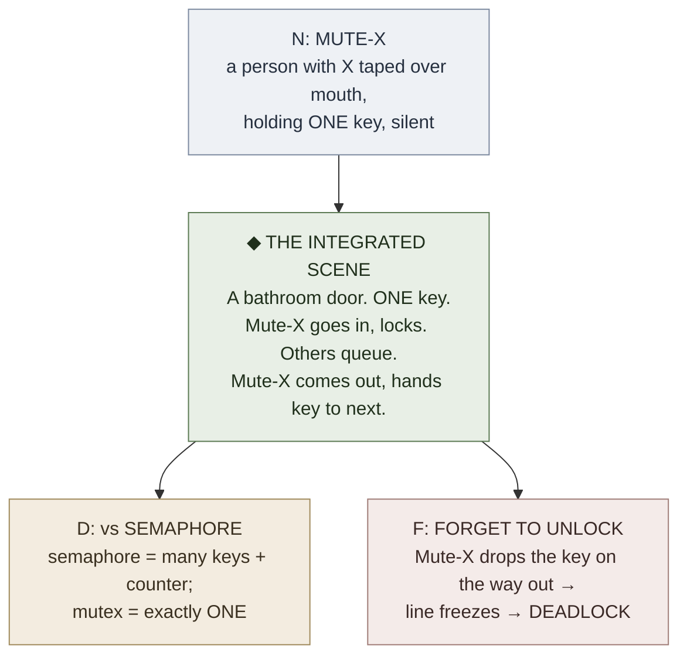

# NEDF Overview
NEDF.excalidraw
**Summary**: NEDF encodes a concept as **one vivid scene** retrievable from four angles (Name-hook, Essence, Distinguisher, Failure). Four slots, one integrated image — never four isolated flashcard fields.

**Sources**: 03_NEDF_TEMPLATE.md; FRAMEWORK_OVERVIEW.md; Concept Encoding Protocol.md

**Last updated**: 2026-08-20 (§Visual authored — diagram replaces the TODO stub); 2026-08-20 (§Checksum authored — 3 falsifiable retrieval questions replace the TODO stub); 2026-08-20 (§Mnemonic authored — TODO stub replaced with a real device); 2026-08-20 (the four slots drawn as their count-shape square ([representation-rules](./representation-rules.md) Rule 10 declared instance) — relations shown as edges leaving the box, not a fifth corner); 2026-08-20 (`glyph:` assigned — [representation-rules](./representation-rules.md) Rule 11); 2026-05-09 (retrofit pass: applied [representation-rules](./representation-rules.md) 1+2+3+5+7+8)

---

## Glyph


```p5 height=280
p.setup = () => { p.createCanvas(Math.min(el.clientWidth||600, 600), 280); p.noLoop(); };
p.draw = () => {
  const dark = p.isDark;
  p.background(dark ? 30 : 245);
  const ink = dark ? '#ECE4D3' : '#2B2620';
  const green = '#5c7a54';
  const cx = p.width / 2, cy = 140, arm = 90, r = 8;
  p.stroke(ink); p.strokeWeight(2);
  p.line(cx, cy - arm, cx, cy + arm);
  p.line(cx - arm, cy, cx + arm, cy);
  p.noStroke(); p.fill(ink);
  p.circle(cx, cy - arm, r * 2);
  p.circle(cx, cy + arm, r * 2);
  p.circle(cx - arm, cy, r * 2);
  p.circle(cx + arm, cy, r * 2);
  p.fill(green); p.push(); p.translate(cx, cy); p.rotate(p.PI / 4);
  p.rectMode(p.CENTER); p.rect(0, 0, 26, 26); p.pop();
  p.fill(ink); p.textStyle(p.BOLD); p.textSize(16); p.textAlign(p.CENTER, p.CENTER);
  p.text('N', cx, cy - arm - 22);
  p.text('D', cx, cy + arm + 22);
  p.text('F', cx - arm - 24, cy);
  p.text('E', cx + arm + 24, cy);
};
```

A 4-cornered scene; the diamond at the center is the integrated image; the corners are the retrieval handles.

## One-line

> Encode a concept as one vivid scene retrievable from four angles: name-hook, essence, distinguisher, failure.

---

## Concrete example: encoding "Mutex" with NEDF

A real worked card before any abstraction.



**Why this works**:
- Name-hook (Mute-X) fires perceptually before any reasoning
- Essence (one-key bathroom) shows what the thing *does*, not what it *is*
- Distinguisher protects against the most common collision (semaphore)
- Failure carries the highest-value operational lesson (deadlock from forgotten unlock)

All four slots collapse into one image, not four facts.

---

## Where NEDF sits (2D placement among frameworks)


```p5 height=340
p.setup = () => { p.createCanvas(Math.min(el.clientWidth||600, 600), 340); p.noLoop(); };
p.draw = () => {
  const dark = p.isDark;
  p.background(dark ? 30 : 245);
  const ink = dark ? '#ECE4D3' : '#2B2620';
  const green = '#5c7a54';
  const grid = dark ? '#6b7280' : '#9aa0a6';
  const w = p.width, h = p.height, cx = w / 2, cy = h / 2;
  p.stroke(grid); p.strokeWeight(1.5);
  p.line(cx, 40, cx, h - 40); p.line(40, cy, w - 40, cy);
  p.noStroke(); p.fill(grid);
  p.triangle(cx - 5, 46, cx + 5, 46, cx, 36);
  p.triangle(cx - 5, h - 46, cx + 5, h - 46, cx, h - 34);
  p.triangle(46, cy - 5, 46, cy + 5, 36, cy);
  p.triangle(w - 46, cy - 5, w - 46, cy + 5, w - 34, cy);
  p.fill(ink); p.textStyle(p.ITALIC); p.textSize(12); p.textAlign(p.CENTER, p.CENTER);
  p.text('dynamic / changes over time', cx, 20);
  p.text('static / time-invariant', cx, h - 16);
  p.textAlign(p.LEFT, p.CENTER); p.text('single thing', 44, cy - 14);
  p.textAlign(p.RIGHT, p.CENTER); p.text('many things / network', w - 44, cy - 14);
  p.textAlign(p.CENTER, p.CENTER);
  const q = (title, sub, x, y, hl) => {
    p.fill(hl ? green : ink); p.textStyle(p.BOLD); p.textSize(14); p.text(title, x, y);
    p.fill(ink); p.textStyle(p.NORMAL); p.textSize(11); p.text(sub, x, y + 18);
  };
  q('SPEAR, HEART', '(procedure, person)', cx * 0.5, cy * 0.6, false);
  q('ORACLE, GRACE', '(prediction, social)', cx * 1.5, cy * 0.6, false);
  q('NEDF', '(one concept)', cx * 0.5, cy * 1.4, true);
  q('CAST', '(relational graph)', cx * 1.5, cy * 1.4, false);
};
```

**NEDF's quadrant**: static + single-thing. The concept doesn't change over time and stands alone. As soon as either axis shifts, route to the right framework — that's the entire framework selection rule on one diagram.

HEART shares the upper-left quadrant with SPEAR: both target a single subject (one person, one procedure) that unfolds or changes over time. ORACLE and GRACE sit upper-right because both draw on patterns across many instances or people.

---

## The four slots

| Slot                | Role                                                       | Primary [UMTF](./universal-mental-tagging-framework.md) tag |
| ------------------- | ---------------------------------------------------------- | -------------------------------------------------------- |
| **N** Name-hook     | Perceptual access trigger (sound-alike, rhyme, pun, image) | Sensory                                                  |
| **E** Essence       | What the concept *does* in active form                     | State / Action                                           |
| **D** Distinguisher | Separation from the nearest confusing neighbor             | Pattern + light Relation                                 |
| **F** Failure       | Where it breaks, gets misused, or produces bad outcomes    | Priority                                                 |

The slots are **not** four flashcard fields. They are **four entry points into one scene**. If you can describe the four slots without invoking the same image each time, the encoding has failed (source: 03_NEDF_TEMPLATE.md).

**Draw them as a square** — four members, so the count-shape is a square ([representation-rules](./representation-rules.md) Rule 10, declared instance 2026-08-20). The corners are N · E · D · F; [CAST](./cast-overview.md) relations are the arrows *leaving* the box, never a fifth corner, because relations are edges. The two diagonals are the two standing questions:

```
        🏷️ N  name-hook ─────────────── ⚖️ E  essence (what it does)
             │ ╲                         ╱ │
             │   ╲                     ╱   │
             │     ╲   🧩 concept    ╱     │
             │       ╲             ╱       │
             │         ╲         ╱         │
             │           ╲     ╱           │
             │             ╳               │
             │           ╱     ╲           │
             │         ╱         ╲         │
             │       ╱             ╲       │
             │     ╱                 ╲     │
             │   ╱                     ╲   │
             │ ╱                         ╲ │
        🔪 D  distinguisher ──────────── 💥 F  failure

   ╲  N ↔ D  identity   — "which one is this, and not its neighbour?"
   ╱  E ↔ F  behaviour  — "what does it do, and where does that break?"
```

The payoff is the one a bulleted list cannot give: an **empty corner is visible before any label is read**. A card with three filled slots looks wrong at a glance, which is exactly the failure mode ("four-fact decomposition", below) the slot count is meant to catch. See [representation-rules](./representation-rules.md) Rule 10 §The concept card.

NEDF is primarily **Sensory + State + Priority**, with **Pattern** sometimes doing major work and **Spatial** entering when the concept is stored in a larger palace.

---

## Boundary set

### What NEDF is NOT

- Not a flashcard pair (Q/A) — it's a *scene* with four handles
- Not a definition list — definitions stay verbal; NEDF is perceptual
- Not for procedures — that's [SPEAR](./spear-overview.md)
- Not for relational networks — that's [CAST](./cast-overview.md)

### What breaks NEDF

- **Abstract name-hook** ("the concept of mutual exclusion") — kills perceptual access
- **Distant distinguisher** (vs unrelated concept) — fails to block real-world collisions
- **Generic failure** ("you might forget it") — wastes the highest-leverage slot
- **Four-fact decomposition** — slots stay as separate cards instead of merging into one image
- **Trying to encode a graph or procedure with NEDF** — wrong tool, slots will feel forced

### Adjacent but excluded (deliberate non-features)

- **No spatial layout requirement** — NEDF works as a standalone scene; method of loci is *optional* enhancement
- **No prerequisite Anki** — NEDF defines the *content*; SR delivery is a separate layer
- **No multi-concept relation** — by design, NEDF stops at the concept boundary; relations are CAST's job

---

## When to use NEDF (and when not)

**Use NEDF when**:
- material is a concept, term, definition, or mental model
- main problem is vague familiarity without recall
- the concept is easy to confuse with nearby concepts
- you need one durable retrieval scene, not a procedure

**Reach for another framework when the real difficulty is**:
- a dependency or flow graph → [CAST](./cast-overview.md)
- a step-by-step procedure → [SPEAR](./spear-overview.md)
- modeling a person → [HEART](./heart-overview.md)
- prediction under conditions → [ORACLE](./oracle-overview.md)
- social context calibration → [GRACE](./grace-overview.md)

---

## One mental motion

> **Pinch the concept with four fingers** (N, E, D, F) **until they meet in the palm** — the integrated scene.

If you can't make the pinch — if the four fingers don't converge on a single image — the encoding isn't done.

---

## Why it works

NEDF compresses definition, difference, and risk into one memorable unit:

- Name fires an image
- Essence shows what the thing does
- Distinguisher keeps it from blending into neighbors
- Failure adds consequence and operational stakes

This is more robust than memorizing dictionary wording, because retrieval has four independent paths into the same scene — losing any one still recovers the concept.

---

## Multi-resolution zoom (for retrieval at different costs)

| Size | NEDF representation |
|---|---|
| **Glyph** | The 4-corner diamond above |
| **Line** | "One vivid scene retrievable from four angles: name-hook, essence, distinguisher, failure." |
| **Paragraph** | NEDF is for static single-concept material. Four slots — N (perceptual hook), E (active essence), D (vs nearest neighbor), F (failure mode) — collapse into one integrated scene. Used when the difficulty is *what is this and how do I not confuse it with X*, not *how does this connect* (CAST) or *how do I do this* (SPEAR). |
| **Page** | This page |

---

## Relationship to other frameworks

- [CAST](./cast-overview.md) takes over when *connections between concepts* become the hard part
- [SPEAR](./spear-overview.md) takes over when *execution* is the hard part
- [HEART](./heart-overview.md) reuses NEDF scenes for formative history events in people encoding
- [ORACLE](./oracle-overview.md) reuses NEDF concepts as the cued half of "given X, predict Y"
- [representation-rules](./representation-rules.md) governs *how* the four slots are filled (diagram-first, concrete example, boundary set)

NEDF is the concept-focused member of the broader framework family.

---

## Constraint and extension notes

- **Aphantasia.** Without a vivid Name-hook scene, the four NEDF slots re-weight: Distinguisher (sharp contrast against the nearest confusable concept) and Failure (the concrete trap) carry heavier identity work; the Name-hook is substituted with a motoric gesture, [Braille tap pattern](./symbolic-encoding-systems.md), or kinesthetic anchor rather than a visual scene. See [memory-palace-for-aphantasia](./memory-palace-for-aphantasia.md) §"Notes for NEDF users" for the full re-weighting.
- **STEM constants.** Physical constants stored as NEDF cards benefit from explicit Camp routing per [major-system-for-mathematical-notation](./major-system-for-mathematical-notation.md): digit string → Name-hook, order-of-magnitude → Distinguisher, operator-reconstruction trap → Failure. The Camp choice (context-elision vs reserved operator icons) is itself recorded in the Failure slot so retrieval doesn't have to re-derive the convention.
- **Essence slot won't come into focus.** Diagnostic: you can name the concept but the Essence stays verbal ("a mutex is mutual exclusion") rather than perceptual. That means you don't yet have an analogy — the concept hasn't been *understood*, only *labeled*. Run [BRIDGE LOAD](./bridge-load.md) before encoding. Its outputs route slot-by-slot: Mapping → Essence scene (what the concept *does*, in borrowed form), Boundary → Failure, Nearest-Neighbor → Distinguisher. The Name-hook stays independent of BRIDGE — perceptual access is upstream of analogy. See [composability-index](./composability-index.md) for the full slot-to-slot mapping and the worked Mutex instance.

## External canon — picture-theory ancestry (TLP)

Added 2026-05-25 from the [Wittgenstein TLP](./tractatus-logico-philosophicus.md) ingest. **NEDF's encoder paradigm — *encode a concept as one vivid scene retrievable from four angles* — is operationalized [TLP picture theory](./picture-theory-of-language.md)**:

| NEDF claim | TLP grounding |
|---|---|
| Encode as a *scene*, not a list of properties | TLP 2.1 — *We make to ourselves pictures of facts.* |
| The scene's *elements* correspond to the concept's *objects* | TLP 2.13 — *To the objects correspond in the picture the elements of the picture.* |
| The scene is retrievable because its *structure* shares the concept's *form* | TLP 2.17 — *What the picture must have in common with reality, in order to be able to represent it, is its form of representation.* |
| The visual (`` glyph above) *shows* what the prose cannot fully *say* | TLP 4.121 / 4.1212 — *what can be shown cannot be said* — operationalized as the [show-vs-say](./show-vs-say.md) rule and the wiki's visual-per-concept feedback rule |

This is **not a redefinition of NEDF** — NEDF predates the wiki's explicit ingest of TLP. TLP is registered as NEDF's *philosophical antecedent*, sibling to:
- AIM·TRUST·RELAX·LEARN·DO (Maltz, identity layer)
- [smashin-scope](./smashin-scope.md) (Buzan, REMAPS lineage)
- Cybernetics (Wiener, servo-mechanism lineage)

The wiki's encoder paradigm has been doing TLP picture-theory operationally since the NEDF page was first authored; the 2026-05-25 ingest makes the philosophical root explicit.


## Mnemonic

**"Name it · run it · tell it apart · watch it break."** Four verbs, **one** picture — N Name-hook, E Essence, D Distinguisher, F Failure. The test is built into the phrase: say all four *about the same image*. If each verb pulls up a different picture, you have made four flashcards instead of one scene, which is the failure this page names.

## Checksum

1. Name the four slots and say what each one's job is.
2. NEDF is "four entry points into one scene," not four fields. What observation tells you an encoding failed that test?
3. Two of the "what NEDF is NOT" lines route material elsewhere. Which material goes to SPEAR, and which to CAST?


## Visual

**One scene, four ways in** — the picture the four slots are handles *on*, not four fields beside each other.

```
        N ─────────╮                     ╭───────── E
    name-hook       ╲                   ╱      essence
                     ╲                 ╱
                      ╲   ┌───────┐   ╱
                       ──▶│ SCENE │◀──
                      ╱   └───────┘   ╲
                     ╱                 ╲
        D ─────────╯                     ╰───────── F
  distinguisher                              failure
```

Four arrows, **one** picture at the centre. If each arrow lands on a *different* picture, you have made four flashcards, not one NEDF card — see §Mnemonic for the test.

## Related pages

- georgian-driving-exam-b-first-aid-tables — NEDF exception tables over all 43 first-aid questions
- georgian-driving-exam-b-admin-law-rules — NEDF-style decision tables for admin-law/duties
- [representation-rules](./representation-rules.md) — the rules this page was retrofitted against
- [picture-theory-of-language](./picture-theory-of-language.md) — the philosophical antecedent of NEDF; added 2026-05-25
- [show-vs-say](./show-vs-say.md) — TLP boundary; the visual-per-concept rule's home
- [tractatus-logico-philosophicus](./tractatus-logico-philosophicus.md) — TLP source summary
- [UMTF](./universal-mental-tagging-framework.md)
- [umtf-operational-template](./umtf-operational-template.md)
- [framework-comparison-matrix](./framework-comparison-matrix.md)
- [glossary](./glossary.md) — registry for the slot-letter overloads (NEDF's `E` shares its letter with several other encoders; see Collision warnings)
- [CAST System](./cast-overview.md)
- [SPEAR](./spear-overview.md)
- [HEART](./heart-overview.md)
- [memory-palace-for-aphantasia](./memory-palace-for-aphantasia.md) — per-slot re-weighting under the aphantasia constraint
- [major-system-for-mathematical-notation](./major-system-for-mathematical-notation.md) — per-constant Camp routing into NEDF slots for STEM material
- [memory-atomic-design](./memory-atomic-design.md) — NEDF is this lens's flagship *molecule* (4-slot card-shape bonded from atoms IMG + LOC + ELAB + ROT); the NEDF card schema is the template it realizes; Encoded-SR is the organism it runs in
- [logic-atomic-design](./logic-atomic-design.md) — sister hub (4th atomic-design lens application); registers picture-theory at the Atom tier
- [sub-formula-property](./sub-formula-property.md) — **the Distinguisher discipline's formal-logic home (added 2026-05-27 from Mancosu-Galvan-Zach ingest)**: in a normal proof of A, every formula appearing is a sub-formula of A or of an open assumption. NEDF's Distinguisher is the encoder-layer instance — narrows to *exactly* what's load-bearing in the concept, not external trivia. The two disciplines say the same thing at different layers.
- [proof-theoretic-semantics](./proof-theoretic-semantics.md) — Dummett-Prawitz framework that grounds NEDF as a *meaning-in-use* discipline (a concept's meaning is given by the slots' rules of use, not by reference to a prior truth-conditional referent)
- [proof-theory-mancosu-galvan-zach](./proof-theory-mancosu-galvan-zach.md) — the textbook that surfaces the sub-formula property as NEDF's formal-logic ancestor

---

## U — See (CAST)
1. Concept as one vivid scene, 4 retrieval angles
2. Edges: N-hook → Essence → Distinguisher → Failure

## D — Name (NEDF)
1. NEDF = Name-hook · Essence · Distinguisher · Failure
2. ONE integrated scene, never four flashcard fields
3. Distinguisher = nearest neighbor; Failure = where it breaks

## F — Do (SPEAR)
1. Pick concept → grab name-hook → fuse with essence
2. Add distinguisher (vs nearest neighbor)
3. Add failure case → render single scene

## B — Watch (HEART)
1. Cards split across 4 isolated fields (anti-pattern)
2. Missing distinguisher → concept blur
3. No failure case → fragile transfer

## L — Predict (ORACLE)
1. All 4 slots filled + integrated → strong recall
2. Name-hook only → typical Anki rot at 3 weeks

## R — Act (GRACE)
1. New concept → fill all 4 slots before encoding
2. Faded card → rebuild as integrated scene