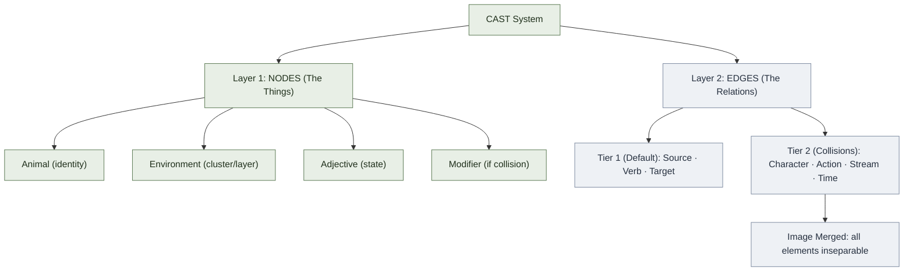

# Nodes & Edges: The Two-Layer Model

**Summary**: [CAST](./cast-overview.md) encodes both nodes (the things) and edges (the relations between things). Nodes use [Georgian animals](./georgian-animals.md). Edges use verbs (Tier 1) or full CAST scenes (Tier 2).

**Sources**: CAST and Georgian Node System.md (lines 30-42; §CAST cheat sheet for the Tier 2 option set); 2026-08-31 `/validate-idea` session (edge codes)

**Last updated**: 2026-09-05 — §Modifier composition: **loop gain** named as a second open gap, surfaced by filing Meadows' leverage rungs against the encoder (rungs 8 and 7 are gain rungs; CAST owns polarity and not magnitude around a cycle). 2026-09-04 — §Layer 1: break-the-isomorphism rule added, from st-example-ecological-system (an encoding that mirrors its subject has no error detection). 2026-09-04 (ingest-ghost pass: tier-1/tier-2 self-links de-linked to their own sections, `major-system`/`pao`/`names-and-faces`/`loci` repointed to real owners, `feedback-loops` → feedback-loop-taxonomy, web-service example → [cast-example-city-streets](./cast-example-city-streets.md)); 2026-09-04 — §Modifier composition added: the three additive modifiers stated as a lattice (disjoint positions, no order), the "cheapest mark that discriminates" rule promoted to cover all three, depth-as-a-nested-ladder rejected via `/validate-idea`, and edge confidence named as the open gap; 2026-08-31 — §Edge codes added (the Tier-2 codebook unparked and switched from 2-bit to two-letter form; `/validate-idea` keep-with-modification); 2026-07-09 Polarity note added to Tier 2 section + [edge-sign](./edge-sign.md) links (candidate variant); 2026-04-30 original.

---

## The Core Insight

Most people memorize **nodes** but ignore **edges**. Result: you know pieces but not the system.

A codebase is a graph. A proof is a graph. Historical causality is a graph. If you only memorize the components and not how they interact, you don't understand the system.

**CAST solves this by encoding both layers:**

---

## Layer 1: Nodes (The Things)

Each node is encoded as a vivid scene using four slots:

```
Node Scene = [Animal] + [Environment] + [Adjective] + [Optional Modifier]
```

**Example**: API Gateway
- Animal: Eagle (identity, from [Georgian system](./georgian-animals.md))
- Environment: Mountain peak (belongs to "top tier" / hub layer)
- Adjective: Sharp (current state: tense, critical, always alert)
- Modifier: (none, unless a second API Gateway node exists)

**Result**: *A sharp eagle on a mountain peak*

The scene should be **vivid and distinctive**. You should see it instantly in your mind's eye.

**When the domain is already animals, places or actions, break the isomorphism deliberately.** Encoding a *hare* node as a hare leaves the mnemonic layer transparent — it is storing nothing the subject matter did not already supply, and worse, it removes error detection: a mis-recalled scene and a correct one are equally plausible, because any animal doing anything to any other animal is a believable meadow. Distinctiveness is what makes a palace checkable, and it comes from the image being *implausible*. Push the identity into the Environment and Adjective slots and let the animal be wrong on purpose. Worked instance: st-example-ecological-system §Step-by-step CAST encoding, where grass is a flattened bear on a kitchen floor and the lynx is a tortoise on a snowdrift.

---

## Layer 2: Edges (The Relations)

Each edge connects a source node to a target node. The edge carries **meaning about the relationship**.

Edges are encoded as **scenes placed INSIDE or ON the source node's palace location**, not floating in hallways.

### Tier 1 Encoding (Default)

Most edges are **distinct by a single verb**. Use Tier 1 when no two edges collide.

```
Edge Scene = [Source Animal] + [Verb] + [Target Animal]
```

**Example**: API Gateway → Database
- Source: Eagle
- Verb: Feeds (supplies data to)
- Target: Pig (Database)
- Scene: *Eagle feeds Pig*

**That's enough.** No further encoding needed if no other edge also has "Eagle feeds something."

### Tier 2 Encoding (When Tier 1 Collides)

When two or more edges look like the same Tier 1 scene, **upgrade to Tier 2 CAST**.

CAST adds four dimensions to break the collision:

```
Edge Scene = [Character] [Action] [Stream] in/across [Time environment]
```

**Example**: API Gateway → Cache (collision with Eagle feeds Pig)
- Character: Mage (helper/invisible dependency)
- Action: Flowing (supplies on demand)
- Stream: Water (resources/energy, not raw data)
- Time: Blue ocean (normally active, occasionally paused)
- Scene: *Mage flowing water in a blue ocean*

Now we can distinguish:
- **Eagle feeds Pig** (Gateway feeds Database directly)
- **Mage flowing water** (Gateway supplies Cache on demand)

Different verbs, different streams, different characters. Zero ambiguity.

**Polarity note**: none of the four Tier 2 slots carries a +/− sign, so an inhibitory Tier 1 verb (*blocks*, *throttles*) loses its sign on promotion. The additive [edge-sign](./edge-sign.md) modifier (🟡 candidate) covers this: unmarked Stream arrival = promotes, interceptor = inhibits — no canonical slot changes.

**Quantity note**: none of the four Tier 2 slots carries a magnitude either, so `Eagle feeds Pig` reads the same at two rows an hour and forty thousand a second. [Edge quantity](./encoding-quantities-in-cast.md) (🟡 candidate) covers this on the **Stream** — scale it for a comparative reading, weld a peg into it for an exact one, wrap it in a vessel when the edge moves a one-shot total rather than a rate. Also additive: no canonical slot changes. Note the division of labour with the node side — an edge carries a *rate*, a node carries a *level*.

**Delay note**: nor does any Tier 2 slot carry *latency* — `Eagle feeds Pig` reads the same at a millisecond and at next quarter, and per system-delays-and-lags that difference is what turns a stable loop into an oscillating one. [Edge delay](./delay-encoding-in-cast.md) (🟡 candidate) puts it in the **gap** the Stream crosses before it lands — scene-internal geometry, so the palace's spatial axis (already allocated six ways by the placement rules) is untouched. Note the trap: the **T** slot is *stability*, not latency. Also additive.

### Modifier composition (three positions, no order)

The three notes above are **not a ladder**. Each modifier claims a *different position on the same edge*, so all three can mark one edge at once and none of them requires any other:

```
   SOURCE  ==[ thickness = how much ]==(  gap = how long  )==  ✂  ─>  TARGET
                    quantity                   delay          edge-sign
                  (stream body)              (air time)      (target end)
```

*(diagram from [delay-encoding-in-cast](./delay-encoding-in-cast.md) §Composition with the other modifiers, promoted here because it is the law for all three, not a fact about delay)*

The worst edge in any system is therefore one readable picture — **thick stream, long gap, interceptor**: high-volume, slow, inhibitory. Seen, not derived.

**The composition law.** Modifiers are *disjoint in position* and *independent in use*. There is no order to learn, no prerequisite to earn, and no level to reach. Marking one never invalidates an unmarked edge — that is what "additive" means on all three pages, and it is [software-design-principles-for-neural-os](./software-design-principles-for-neural-os.md) §O.

**Which to reach for** is §I of the same page, stated once here for all three: **use the cheapest mark that discriminates.** An unmarked Tier 1 verb is the default and usually the correct answer; [encoding-quantities-in-cast](./encoding-quantities-in-cast.md) applies the identical rule inside its own cost-ordered tiers. Depth is opt-in **per edge**, never per graph.

**Rejected — depth as a nested stack.** A 2026-09-04 `/validate-idea` proposed replacing this with one ordered ladder (anchors ⊂ topology ⊂ CAST ⊂ context ⊂ mechanics ⊂ …). It fails on the three modifiers already written: [edge-sign](./edge-sign.md)'s mechanism sits inside the Tier 2 scene while its payoff is the loop-sign checksum; [quantity](./encoding-quantities-in-cast.md) rides *inside* the Stream, beneath the rung meant to contain it; [delay](./delay-encoding-in-cast.md) is defined by explicitly *not* being the **T** slot. None of the three has a single rung, which is the diagnostic for a foreign axis ([software-design-principles-for-neural-os](./software-design-principles-for-neural-os.md) §Registries shard on their own retrieval axis). Full reasoning at [cast-overview](./cast-overview.md) §Adjacent but excluded.

**Four modifiers, three positions.** [Edge dynamics](./dynamic-edge-encoding.md) is the fourth registered modifier and does not appear in the diagram, because it claims no position of its own: its default is *Dyn0 derive*, and the case that survives (`Dyn1`) is read as the **shape of the material along the delay gap** — a second reading of a mark that is already there. A modifier that needs another modifier to exist is not a fourth edge position, and the count is three either way you ask.

**Whether to reach for any of them at all** is one step upstream of *which*, and is answered by the Encode test §Two questions, four cells: a property earns a mark only when it *varies edge to edge* and *cannot be re-derived from the picture*. All three notes above already state their own version of it — Q0 volume, D0 decompose, Dyn0 derive are the same instruction four times, and the square is their general form.

**Open, unclaimed.** No modifier carries **confidence** — how sure you are the edge exists at all. [ORACLE](./oracle-overview.md) owns confidence for predictions; nothing owns it for structure. Note that the three edge positions are already taken, which is weak evidence that doubt belongs to the node or the graph rather than to the arrow. Named here as a gap, not designed. **Independently confirmed 2026-09-04**: an epidemic model reached the same hole from the other side — an imperfect test leaves doubt about a *node's state*, never about whether the contact edge exists (systems-thinking-and-cast-integration §What is genuinely missing). Two routes, one answer, and both put doubt on the node.

**Open, unclaimed (2).** No modifier carries **loop gain** — how hard a feedback loop pushes, as opposed to which way it pushes. [edge-sign](./edge-sign.md) multiplies polarity around a cycle and yields the loop's *sign*; [encoding-quantities-in-cast](./encoding-quantities-in-cast.md) carries per-edge rate and checks it with the flow-balance checksum at a **node**. Nothing composes magnitude around a cycle, so there is no loop analogue of the loop-sign checksum. Gain passes both Encode-test questions — it varies loop to loop and no unmarked graph recovers it — so it belongs in the encode cell and has no owner. Surfaced 2026-09-05 by filing Meadows' rungs against the encoder: rungs 8 and 7 are both gain rungs and both came back half-owned (systems-thinking-and-cast-integration §The ladder against the encoder). Named as a gap, not designed.

### Edge codes (written shorthand for a Tier 2 scene)

A Tier 2 scene is four slot picks, so it can be *written* as four two-letter codes. This is a **notation, not a second vocabulary**: each code is the opening of the image already drilled, so there is nothing new to install.

| Slot | Option 1 | Option 2 | Option 3 | Option 4 |
|---|---|---|---|---|
| **C** Character | `Gi` Giant | `Me` Mermaid | `Ma` Mage | `Dr` Dragon |
| **A** Action | `Cr` Crushing | `Fl` Flowing | `Sp` Spreading | `Ex` Exploding |
| **S** Stream | `Ro` Rock | `Wa` Water | `Cl` Cloud | `Li` Lightning |
| **T** Time | `Re` Red cave | `Bl` Blue ocean | `Gr` Green sky | `Pu` Purple storm |

(source: CAST and Georgian Node System.md §CAST cheat sheet — the sixteen options are unchanged; only their written form is new)

**Format.** Four codes in CAST order, hyphen-joined: `Gi-Ex-Cl-Bl`. All sixteen codes are distinct, so the code decodes without knowing which slot you are in — position is a convention for *writing*, never a requirement for *reading*. This is the property one-letter codes cannot have: `C` would be Crushing or Cloud, `R` Rock or Red cave, `G` Giant or Green sky.

**Worked example** (the Apple → Banana edge on `Excalidraw/CAST.excalidraw.md`):

```
Gi-Ex-Cl-Bl
 │  │  │  └── Blue ocean ...... normally active
 │  │  └───── Cloud .......... signals or info
 │  └──────── Exploding ...... transforms or breaks
 └─────────── Giant .......... hub / controller

"A Giant exploding clouds while standing in blue ocean."
```

**With [edge-sign](./edge-sign.md)** (🟡 candidate): append the sign, unmarked = promotes. `Gi-Ex-Cl-Bl` promotes; `Gi-Ex-Cl-Bl−` inhibits. The letter form takes the suffix for free — the earlier fixed-width bit form had no room for it.

**The machine view is derived, not parallel.** The authoritative object is the slot-option *index* (0–3, reading left to right in the table above). Letters are the human rendering; the 2-bit form (`00`/`01`/`10`/`11` per slot, one byte per edge) is the machine rendering for packing, sorting, or diffing edges in external tooling. One authoritative mapping, two views — the DRY + orthogonality corollary in [software-design-principles-for-neural-os](./software-design-principles-for-neural-os.md) §Registries shard on their own retrieval axis. Do not maintain the two by hand as separate tables.

**Scope.** Codes serialize an edge; they do not encode or retrieve one. Use them for writing edges down — notes, diagrams, tooling, drill answers — never as the thing you rehearse. **Tier 1 edges never get a code**: an open verb needs no codebook, and giving it one is the ceremony [software-design-principles-for-neural-os](./software-design-principles-for-neural-os.md) §The Main Constraint rejects.

**Failure mode — the `Me`/`Ma` pair.** Mermaid and Mage are the one within-slot near-pair (same letter, different vowel), and they are why single letters fail here at all. Cross-slot near-pairs (`Ro`/`Re`, `Gi`/`Gr`, `Cr`/`Cl`) are separated by position as well as by vowel; `Me`/`Ma` has only the vowel. Drill it as a discrimination pair or the collision the code was built to survive returns inside the code.

---

## The Edge Bundle (Where Edges Live)

Every node carries its **outgoing edges** as a bundle of scenes at its palace location.

### Example: API Gateway Node with 3 Outgoing Edges

**Node scene** (at the palace stop): *A sharp eagle on a mountain peak*

**Edge bundle** (attached to this stop):
1. *Eagle commands Owl* → Auth Service
2. *Eagle feeds Pig* → Database
3. *Mage flowing water in a blue ocean* → Cache (Tier 2)

When you walk the palace and reach the eagle's stop, you see the eagle AND read all three outgoing edges instantly. Then you follow each one to its target.

### Bundle Size Limit

Keep each bundle to **5 edges or fewer**. If a node has more than 5 outgoing edges, it's a **super-hub** and should be:
- Split into sub-nodes, OR
- Encoded with a **nested mini-palace** at that stop

---

## Complete Graph Walk Procedure

1. **Enter at the highest in-degree node** (the hub with most connections)
2. At each node: name it, state its adjective, then read its edge bundle
3. Follow each outgoing edge to its target node
4. At the target: repeat (name, state, bundle)
5. When you hit a feedback loop: note it, continue forward, don't recurse
6. When you reach a leaf node: turn back
7. After the full walk: **count nodes visited** — if the count is wrong, a node is missing

---

## Image Merging: The Quality Upgrade

Don't encode source + edge + target as three separate images.

**Merge them into one composite scene** where:
- Source animal and target animal are physically interacting
- The action determines the contact (crushing, flowing, spreading, exploding)
- The stream becomes the object passing between them
- Neither animal can be removed without destroying the scene

**Before**: Eagle (source) → Feeds (action) → Pig (target)
- Three images: eagle, "feeding", pig

**After**: *Eagle's talons grip a stream of grain flowing into Pig's open mouth, so tightly entwined that neither could be separated*
- One image where all three elements are inseparable
- If any element is missing, the scene collapses ([mnemonic checksum](./mnemonic-checksum.md))

---

## Feedback Loops: Special Edge Encoding

A feedback loop is a cycle: A → B → A. The edge returns to its source.

**Encode as**: Source animal **holding** the downstream scene in its hands or mouth, rather than projecting it outward.

| Loop Type | Visual | Meaning |
|-----------|--------|---------|
| **Amplifying** | Animal holds scene ABOVE head, growing larger | Loop makes itself stronger each cycle |
| **Stabilizing** | Animal holds scene CLOSE to body, gently | Loop dampens disturbances |

**Example: 2008 Crisis**
- CDOs pull demand for mortgages, which creates more CDOs
- **Encoding**: Owl (CDOs) **holds** a rock overhead and stares back at Dinosaur
- This visual signals: this edge curves back, creates a cycle, and it's growing

---

## The Two-Layer Architecture in Summary



---

## Why This Works

1. **Nodes are distinctive**: Each animal is unique. You can't confuse Eagle with Pig.
2. **Edges are explicit**: Verbs and CAST scenes make relationships clear.
3. **Merged scenes are durable**: When elements are inseparable, missing one breaks the image (checksum).
4. **Order is spatial**: Palace placement means location = meaning.
5. **The system scales**: From 5-node web service to 100-node codebase, same framework.

---

## External validation: the collision rule is convergent

The **animal-collision rule** on this page (never reuse the same animal for two nodes; see the HEART footer below) is not a local CAST quirk. Two independently-designed Russian mnemonics systems in the [Giordano school](./kozarenko-mnemotechnics.md) arrive at the same constraint from the opposite direction — encoding *sequences* rather than graphs — which is strong evidence the rule is real, not arbitrary.

Kozarenko names the failure mode **затирание** ("erasure"): when a reused image-code sits in the **linking/background role** of a chain (Цепочка), its second occurrence silently **overwrites** the first's forward link, dropping a fragment of the sequence. Critically, nothing "fails" at encode time — the write just doesn't happen, so the loss is undetectable until recall. (source: GMS_V.Kozarenko.pdf; Мнемотехника шаг за шагом.pdf)

The cross-system principle both CAST and the Giordano school obey: **the background/first slot of any paired-encoding primitive must be unique across the whole sequence; only the foreground/second slot may safely repeat.** In CAST terms, that first slot is the *source animal* — reuse it and two edges collide exactly as затирание predicts.

The Giordano school also supplies the fix CAST states only informally: the **Прием возврата** ("return technique") — attach a repeating code as an *isolated element on a branch of the previous image*, never chain two repeat-codes directly. This is the sequence-encoding analog of CAST's "split the super-hub / add a modifier" move. (source: Мнемотехника шаг за шагом.pdf) Registered as a confirmed unlock in [composability-index](./composability-index.md).

## When to Use Node-Edge vs. Simpler Methods

| You're encoding | Use |
|---|---|
| A single number | [Major system](./mnemonic-methods-master.md) or [PAO](./person-action-object-system.md) |
| A single concept | Concept encoding or [Names and Faces](./name-face-fast-encode.md) |
| A list in order | [Loci](./memory-palace-architecture-for-neural-os.md) (simple palace) |
| A relation between two things | **Tier 1 verb scene** (§Tier 1 Encoding, this page) |
| Multiple similar relations | **Tier 2 full CAST** (§Tier 2 Encoding, this page) |
| A whole network | Full [CAST system](./cast-overview.md) with palace |

---

## Related Pages

- [Edge dynamics](./dynamic-edge-encoding.md) — the fourth and thinnest edge modifier: a varying rate read as the profile of material in the delay gap. Not a peer of the other three — mostly it routes back to the **T** slot, the loop patterns, or the gap
- [UMTF](./universal-mental-tagging-framework.md) — how node and edge slots fit into a broader tag taxonomy
- [Georgian Animals](./georgian-animals.md) — identity system
- [Memory Palace](./memory-palace-architecture-for-neural-os.md) — where nodes are placed
- Feedback Loops — the cycle *dynamics*; §Feedback Loops on this page owns their CAST encoding
- [Image Merging](./image-merging.md) — compressing node-edge-node
- [Edge Sign](./edge-sign.md) — per-edge polarity modifier (🟡 candidate); extends the loop-level holds above down to single edges
- [software-design-principles-for-neural-os](./software-design-principles-for-neural-os.md) — §Registries shard on their own retrieval axis is why the bit form is *derived* from the letter form rather than maintained beside it
- [Step 0 Analysis](./step-zero-analysis.md) — how to analyze before encoding
- [Example: City Streets](./cast-example-city-streets.md) — the two-layer model on a real graph


---

## U — See (CAST)
1. Nodes (Georgian animals) + Edges (verbs or scenes)
2. Two-tier edge encoding: verb (T1) or full scene (T2)

## D — Name (NEDF)
1. Nodes and edges = the CAST atom
2. Distinguisher: edges live on source nodes, not floating
3. Failure mode: floating edges or duplicated animals

## F — Do (SPEAR)
1. Pick nodes from Georgian animal set
2. Encode each edge as verb from source node

## B — Watch (HEART)
1. Floating edges
2. Animal collision (same animal, two nodes)

## L — Predict (ORACLE)
1. Verb collision → expect Tier-2 promotion
2. New graph → expect 1-2 animal swaps

## R — Act (GRACE)
1. Encoding graph → start with nodes
2. Edge unclear → promote to T2 scene