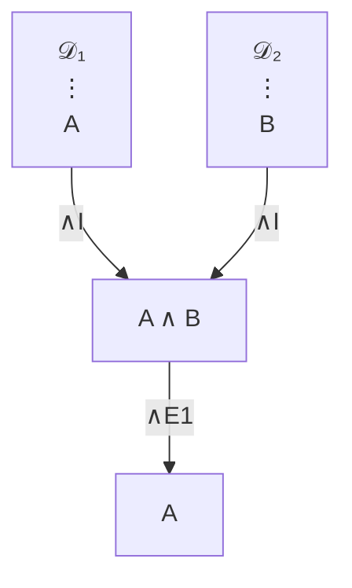
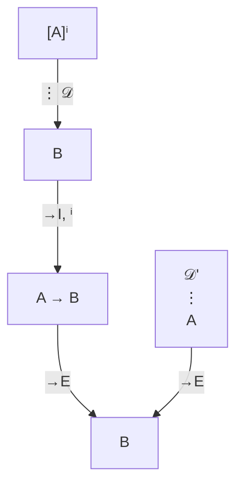
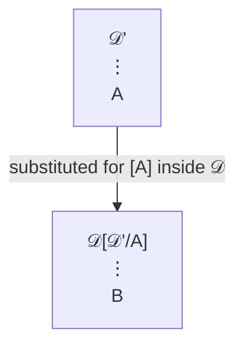
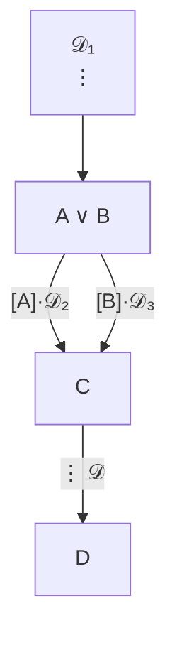
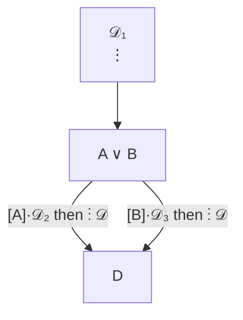

# Normalization Theorem (NJ / NK)

**Summary**: Every [natural-deduction](./natural-deduction.md) proof can be effectively transformed into a *normal* proof — one with no *detours* (introduction immediately followed by elimination on the same formula). The version proved here is **weak** normalization: a *specific* reduction order (always convert a highest cut) terminates; *strong* normalization (every reduction order terminates) is a harder result deferred beyond scope. Proved for NJ by Prawitz 1965, for NK by Stålmarck 1991 / Andou 1995. The normal-deduction analog of [Gentzen's Hauptsatz](./cut-elimination-hauptsatz.md) for the sequent calculus. Normal proofs satisfy the [sub-formula property](./sub-formula-property.md) — every formula appearing is a sub-formula of the end-formula or of an open assumption. **This page is the owner of the terms *weak normalization* and *strong normalization*.**

**Sources**:
- [Mancosu, Galvan, Zach (2021)](./proof-theory-mancosu-galvan-zach.md) Ch 4 — primary source for this page.
- an-introduction-to-proof-theory-normalization-cut-elimination-and-consistency-proofs.pdf — Ch 4 (§4.2 double induction, §4.6 normalization for NJ, §4.9 normalization for NK) + Appendix E (conversion tables).
- Prawitz, D. (1965) *Natural Deduction: A Proof-Theoretical Study.* Stockholm.
- Raggio, A. (1965) independent proof for NJ.
- Statman, R. (1974) — first classical conversion (degree-raising).
- Andou, Y. (1995) — normalization for NK using new classical conversions.
- Gentzen, G. (1936/2008) — *Untersuchungen über das logische Schließen — Section V* posthumous: Gentzen had proved normalization for intuitionistic predicate calculus but didn't publish.

**Last updated**: 2026-06-10

---

## Unlocks (lead, not footer)

1. **Detour-elimination × [FRAME FORGE Distill](./frame-forge.md) × `/lint` audit.** A detour wastes a step: A is introduced (e.g., A ∧ B from A and B) only to be eliminated again (extract A from A ∧ B). The conclusion was already in the [premises](./argument-anatomy.md). Normalization strips these. FRAME FORGE Distill drops working hypotheses that don't survive to the final claim. The `/lint` audit catches *parallel definitions* — the wiki version of the same waste. **Same operation at three layers.**

2. **The normal form is the *meaning* of the proof.** Two proofs of the same theorem that differ only by detours represent the *same argument*. The normal form is the canonical representative. This is structurally the wiki's *encoder uniqueness* discipline: NEDF says "one vivid scene per concept"; normalization says "one normal proof per argument." A page's existence is justified by what its normal form contains.

3. **Termination of normalization × [ok-plateau](./ok-plateau.md) × ε₀.** For NJ, normalization terminates by an induction on (cut-rank, cut-degree). The same termination argument generalizes for *PA + induction* — but now requires ordinal induction up to [ε₀](./epsilon-zero-and-ordinal-induction.md) ([Gentzen 1936](./consistency-of-peano-arithmetic.md)). **The cut-elimination reduction strictly decreases an ordinal at each step** — same pattern as the OK Plateau's "progress is real if measurable," lifted to the formal-logic substrate.

## Mnemonic

**DESNAP** = *Detours-Eliminated · Sub-formula-property · Normal-form · Algorithm-terminates · Prawitz-1965.*

Reads as "de-snap" — normalization *un-snaps* the proof from its detour-trap and produces the canonical un-snapped version.

## Memory checksum

If you can answer these in <60 s each from memory, the page is encoded:

1. State the **normalization theorem**. (*Every NJ (and NK) deduction can be effectively transformed into a normal deduction with the same end-formula and the same or fewer open assumptions. The transformation terminates.*)
2. Define a **detour**. (*An [introduction rule](./natural-deduction.md) for a connective ⋆ immediately followed by an elimination rule for ⋆ applied to the introduced formula as major premise. The introduced formula was wasted — the elimination's conclusion is recoverable from the intro's premises.*)
3. Name the *three conversion types* in the Mancosu-Galvan-Zach proof of normalization for NJ. (*Detour conversions (transform intro+elim into a shorter sub-proof); permutation conversions (reorder elim rules whose major premise is the conclusion of ∨E or ∃E); both proven to strictly decrease a complexity measure.*)
4. State the **sub-formula property**. (*In a normal NJ proof of A from assumptions Γ, every formula appearing in the proof is a sub-formula of A or of some γ ∈ Γ.* For NK, slightly attenuated: also includes ⊥ where applicable.)
5. Why does normalization for NK need extra ("classical") conversions? (*Classical reductio (RAA) and excluded-middle create new detour-shapes that don't appear in NJ — Andou 1995 introduces additional permutation conversions to handle them. Pure NJ techniques transform an NK proof but leave residual classical-detours; the extension closes the gap.*)

## Visual — detour and its elimination

**Before normalization (∧-detour)**:

**After normalization**: the whole detour collapses to just 𝒟₁ (the sub-derivation of A directly) — the ∧I/∧E1 round-trip was wasted work.

**Before normalization (→-detour)**:

**After normalization (substitute 𝒟' for [A] in 𝒟)**:

Each connective has its own detour-conversion pattern (∧, ∨, →, ∀, ∃, ⊥ in some versions). The total *complexity* of the proof — measured by (max-cut-rank, sum-of-cut-degrees) — strictly decreases at each conversion. Termination follows by induction.

---

## Detours in detail

A **detour** (sometimes "cut" in the natural-deduction sense, distinct from sequent-calculus cut) is a sub-proof of one of these shapes:

| Connective | Detour shape | Reduction |
|---|---|---|
| ∧ | ∧I then ∧E (either branch) | Drop the ∧I; keep the relevant premise |
| ∨ | ∨I then ∨E | Drop the ∨I; substitute the introduced disjunct's case |
| → | →I then →E | Substitute the modus-ponens minor premise for the discharged assumption inside the →I's sub-proof |
| ⊥ (intuitionistic) | ⊥-elim with ⊥ as immediate conclusion of itself | (no detour shape — ⊥-elim has no intro pair) |
| ∀ | ∀I then ∀E | Substitute the ∀E term for the eigenvariable in the ∀I's sub-proof |
| ∃ | ∃I then ∃E | Substitute the ∃I witness for the eigenvariable in the ∃E's sub-proof |
| ¬ (defined as →⊥) | reduces to → detour | — |

### Permutation conversions

Some elimination rules have *case-analysis* structure (∨E, ∃E in NJ). If an elimination rule fires on the *result* of such a case-analysis, it can be *pushed inside* each case:

**Before** (∨E fires first, then 𝒟 continues below C down to D):

**Becomes** (permutation pushes 𝒟 inside each case, ahead of the ∨E):

After enough permutation conversions, all detours can be transformed away — the resulting proof contains no shape where an intro feeds directly into an elim.

### Classical conversions (for NK)

NK's classical absurdity rule (RAA) creates new detour shapes when combined with ⊥-elim or with classical case-analysis (excluded middle). Andou 1995 added the missing conversions. The proof in [Mancosu et al.](./proof-theory-mancosu-galvan-zach.md) Ch 4.9 follows Andou.

## What "normal" means and why it matters

A proof is **normal** iff no conversion (detour or permutation; for NK also classical) applies. Equivalently: no formula is both the conclusion of an intro rule (or ⊥-elim) AND the major premise of an elim rule.

The *normal-form* discipline matters because:

### 1. Sub-formula property

Every formula in a normal NJ proof of A from Γ is a sub-formula of A or of some assumption in Γ. (For NK: also includes ¬sub-formulas of A in a precisely-defined way.)

Why this matters: the proof "shows" only material from its conclusion and premises — it does not invent intermediate concepts. This is the formal-logic instance of [TLP 4.121-4.1212](./show-vs-say.md).

### 2. Decidability (propositional fragment)

Cut-free / normal proofs of propositional formulas can be searched mechanically. Each rule application either decomposes a formula into sub-formulas (intro) or extracts a sub-formula (elim). The search tree is finite.

### 3. Witness extraction (intuitionistic ∃)

If NJ ⊢ ∃x A(x), then in the normal proof, the last rule must be ∃I — and ∃I requires a term t with NJ ⊢ A(t). So the proof effectively *exhibits* the witness. This is the BHK interpretation in action and the formal-logic core of constructive mathematics.

This *fails* for NK (classical proofs of ∃x A(x) need not yield a witness — they can be proofs that "not-all-x-fail" without naming a successful x).

### 4. Consistency

A normal NJ-proof of ⊥ from no assumptions would have to end with an elimination rule whose conclusion is ⊥. By the sub-formula property, every formula in the proof is a sub-formula of ⊥ (which has none) or of an open assumption (there are none). So the proof contains only ⊥. But there's no way to introduce ⊥ from nothing in NJ. Contradiction — no such proof exists. **Pure intuitionistic logic is consistent.**

## Termination — the engine room

The Mancosu-Galvan-Zach proof of normalization for NJ proceeds in two steps:

1. **Detour conversions strictly decrease cut-rank.** The "rank" of a detour is the *degree* (number of logical symbols) of the cut-formula. A detour conversion replaces a high-rank detour with zero or more *lower-rank* detours.

2. **Permutation conversions strictly decrease cut-length.** A "cut segment" is a maximal sequence of inferences in which the major premise of each elim is the conclusion of the previous elim plus appropriate intermediate moves. Permutation conversions shorten these segments.

By induction on (max-rank, sum-of-lengths), the algorithm terminates.

For PA (Peano arithmetic with induction), this complexity measure is no longer sufficient — the induction rule can re-introduce high-rank cut-formulas. Gentzen's solution: replace numerical complexity with *ordinal* complexity, using ordinal notations < ε₀. See [epsilon-zero-and-ordinal-induction](./epsilon-zero-and-ordinal-induction.md) and [consistency-of-peano-arithmetic](./consistency-of-peano-arithmetic.md).

## Termination via double induction

The termination argument is not a single induction on one number — it is a **double induction** on a *pair* of measures, ordered lexicographically. Making the two measures explicit is the whole engine.

For NJ the measure is the pair **⟨d(δ), r*(δ)⟩** where (source: an-introduction-to-proof-theory-normalization-cut-elimination-and-consistency-proofs.pdf, Ch 4.6):

- **d(δ)** = the *degree* of the deduction = the maximal degree (number of logical symbols) among the cut-formulas of δ's cut segments. This is the "how complex is the worst detour" measure.
- **r*(δ)** = the *rank* = the **sum** of the lengths of all cut segments of maximal degree d(δ). This is the "how much of the worst-complexity detour is there" measure. A normal deduction is one with d(δ) = r*(δ) = 0.

A normalization step picks a **highest cut** — a maximal-degree cut segment chosen topmost-and-rightmost enough that converting it cannot manufacture a *new* maximal-degree cut above it (Prop 4.28 guarantees a highest cut exists if any cut does). Converting it either drops d(δ) outright, or holds d(δ) fixed while strictly lowering r*(δ). So ⟨d, r*⟩ strictly decreases in the lexicographic order, and lexicographic order on pairs of naturals is well-founded — hence the procedure halts (Theorem 4.29) (source: an-introduction-to-proof-theory-normalization-cut-elimination-and-consistency-proofs.pdf, Ch 4.6).

**Why single induction fails.** Converting a detour can *increase* the raw number of detours: a →-conversion substitutes the minor-premise sub-derivation 𝒟' for *every* discharged occurrence of the assumption inside 𝒟, so a copy-heavy 𝒟 multiplies 𝒟's detours. An induction on "number of detours" therefore has no decreasing quantity to ride. An induction on degree *alone* also fails: a single conversion can replace one high-degree detour with several detours of the *same* degree elsewhere (e.g. when ∨E/∃E permutations only reorganize equal-degree segments), so degree need not strictly drop at every step. The fix is exactly the second coordinate: when degree holds, the *summed length* of the worst-degree segments must fall — and that is the inner induction. One number cannot carry both facts; the pair can. This is the textbook motivating case for double induction (source: an-introduction-to-proof-theory-normalization-cut-elimination-and-consistency-proofs.pdf, Ch 4.2, Ch 4.6).

The same shape escalates twice more in this book: NK needs a **quadruple** ⟨d, r, s, h⟩ (see below), and PA needs an *ordinal* measure < ε₀ — but every one of them is "find a well-founded measure that strictly decreases per step," which is the double-induction pattern lifted to a longer tuple or to the ordinals (source: an-introduction-to-proof-theory-normalization-cut-elimination-and-consistency-proofs.pdf, Ch 4.9; Ch 8).

## Weak vs strong normalization

**This page owns the terms *weak normalization* and *strong normalization*.**

- **Weak normalization (WN)** = there *exists* a reduction order that terminates. Equivalently: *some* strategy for picking which detour to convert next reaches a normal form in finitely many steps. The highest-cut strategy above is exactly such an order — the proof never claims any order works, only that *this* one does (source: an-introduction-to-proof-theory-normalization-cut-elimination-and-consistency-proofs.pdf, Ch 4.6, Ch 4.9).
- **Strong normalization (SN)** = *every* reduction order terminates. No matter which detour you convert at each step, you cannot reduce forever; all reduction sequences are finite (and, by Newman's lemma plus local confluence, they reach the *same* normal form).

SN strictly implies WN. The Mancosu–Galvan–Zach source proves **WN only**, for both NJ (Theorem 4.29) and NK (Theorem 4.58); it chooses the conversion order judiciously precisely so it does not have to argue termination of an arbitrary order. **Strong normalization is deferred as beyond the scope of this introductory text** — it is provable for the simply-typed λ-calculus (Tait's computability/reducibility method) and transfers to NJ/NK via [Curry-Howard](./curry-howard-correspondence.md), but that machinery is not developed here (source: an-introduction-to-proof-theory-normalization-cut-elimination-and-consistency-proofs.pdf, Ch 4).

Practical consequence for the wiki: whenever another page says "normalization" citing this source, it means **weak** normalization unless it explicitly says strong. The "[natural-deduction](./natural-deduction.md) preview" and "[sub-formula-property](./sub-formula-property.md) payoff" both rest on WN, which suffices for the sub-formula property, decidability, consistency, and ∃-witness extraction — none of those need SN.

## NK normalization sketch (§4.9)

Normalizing **NK** is genuinely harder than NJ because the classical absurdity rule ⊥_K behaves worse than the intuitionistic ⊥_J under conversion (source: an-introduction-to-proof-theory-normalization-cut-elimination-and-consistency-proofs.pdf, Ch 4.9).

**The ⊥_K vs ⊥_J detour detour.** A ⊥_J detour (deriving ⊥, then ⊥_J-eliminating into A ∧ B, then ∧E back to A) converts cleanly: just apply ⊥_J directly at A and skip the intermediate formula. The naive copy of this move for ⊥_K *fails*: ⊥_K discharges an assumption ¬(B ∧ C), and if you shorten its conclusion from B ∧ C down to B, "the conclusion does not match the discharged assumption anymore" — the sub-derivation below relied on the *shape* ¬(B ∧ C), so blindly retyping the assumption to ¬B breaks correctness (source: an-introduction-to-proof-theory-normalization-cut-elimination-and-consistency-proofs.pdf, Ch 4.9).

**Statman degree-raising.** Statman (1974) proposed the first repair: replace the discharged assumption ¬(B ∧ C) with a *small sub-derivation* of it from ¬B (using ¬B, the ∧E of B from B ∧ C, ¬E to ⊥, then ¬I to discharge and rebuild ¬(B ∧ C)). This removes the cut on B ∧ C — but it can **introduce a new cut of *higher* degree** than the one it removed: the freshly built ¬(B ∧ C) may now be the conclusion of a ¬I that feeds a ¬E below, and that new detour can outrank the original. A measure based only on degree would *go up*, not down — the degree-raising problem (source: an-introduction-to-proof-theory-normalization-cut-elimination-and-consistency-proofs.pdf, Ch 4.9).

**The Andou fix.** This source follows Andou (1995). Two normalizing assumptions are imposed first (Problem 4.50): (1) every ⊥_K application actually *discharges* an assumption (those that don't are demoted to ⊥_J), and (2) every ⊥_K-assumption ¬A is the *major premise of a ¬E* — enforced by inserting a tiny ¬E/¬I gadget where needed. Under these normal forms, Andou states a battery of *classical conversions* (Appendix E.2.5) that push a ⊥_K through each elimination connective (∧E, ⊃E, ∀E, ∨E, ∃E) without the degree-raising blowup. Termination is then by the **quadruple** ⟨d, r, s, h⟩ (Def 4.55): d = max degree of cuts, r = max rank among cuts of degree d, s = number of those maximal cuts, h = sum of their heights; the conversion strictly lowers this 4-tuple lexicographically (Theorem 4.58) — the same well-founded-measure pattern as NJ's ⟨d, r*⟩, just with two more tie-breakers (source: an-introduction-to-proof-theory-normalization-cut-elimination-and-consistency-proofs.pdf, Ch 4.9, Appendix E.2.5).

The payoff is that NK normalization is *weaker in conclusion* than NJ's: a normal NK proof satisfies an *attenuated* [sub-formula property](./sub-formula-property.md) (sub-formulas of the conclusion/assumptions, **or** their negations), because classical reasoning intrinsically routes through negative information.

## Connection to the wiki

- **FRAME FORGE Distill** ([frame-forge](./frame-forge.md)) is structurally a detour-conversion: a working hypothesis used only as an intermediate (introduced and then discharged) is recognized as such and stripped.
- **The wiki's `/lint` audit** for *parallel definitions* (CLAUDE.md §Consistency rules) is detour-elimination at the page level: if a glossary-registered term is re-defined on a non-owner page, that's a *parallel definition* — the equivalent of a redundant intro. The fix is exactly the normalization move: link to the owner instead.
- **[Encoded SR](./encoded-spaced-repetition.md) and NEDF** insist on one-card-per-concept; redundant cards that re-derive a concept are detours in the encoder system. Normalization is the deep-logic version of the same discipline.
- **[ok-plateau](./ok-plateau.md)'s "measurable progress requires bounded ladder"** is the same shape: termination of a reduction needs a well-founded measure. Normalization terminates because (cut-rank, cut-length) is well-founded; OK Plateau crossing terminates because the skill ladder is well-founded; PA's consistency proof terminates because ordinal notations are well-founded.

## Connection to Curry-Howard (preview)

Each detour-conversion corresponds to a *β-reduction* in the simply-typed λ-calculus under the [Curry-Howard correspondence](./curry-howard-correspondence.md):

- Proof ↔ Program
- Formula ↔ Type
- Detour (→I then →E) ↔ β-redex ((λx.M) N → M[N/x])
- Normal proof ↔ Normal-form program

The normalization theorem says: every typed λ-term β-reduces to a normal form. **The same theorem, two presentations.** The wiki page on Curry-Howard is queued (see [proof-theory-mancosu-galvan-zach](./proof-theory-mancosu-galvan-zach.md) §Authority and limits) — Mancosu et al. don't develop it.

## Related pages

- [proof-theory-mancosu-galvan-zach](./proof-theory-mancosu-galvan-zach.md) — source textbook (Ch 4)
- [natural-deduction](./natural-deduction.md) — what gets normalized
- [sub-formula-property](./sub-formula-property.md) — the payoff
- [cut-elimination-hauptsatz](./cut-elimination-hauptsatz.md) — the sequent-calculus analog
- double-induction — the ⟨degree, rank⟩ termination engine
- [curry-howard-correspondence](./curry-howard-correspondence.md) — detour-conversion = β-reduction; the SN/WN bridge
- [consistency-of-peano-arithmetic](./consistency-of-peano-arithmetic.md) — Gentzen's extension to PA
- [epsilon-zero-and-ordinal-induction](./epsilon-zero-and-ordinal-induction.md) — the ordinal-bound that makes PA-normalization terminate
- [proof-theoretic-semantics](./proof-theoretic-semantics.md) — Dummett-Prawitz reading
- [show-vs-say](./show-vs-say.md) — TLP grounding of "the normal proof shows what's required"
- [frame-forge](./frame-forge.md) — wiki-layer instance
- [ok-plateau](./ok-plateau.md) — substrate-layer instance of well-founded termination
- [glossary](./glossary.md) — Logic layer registrations
