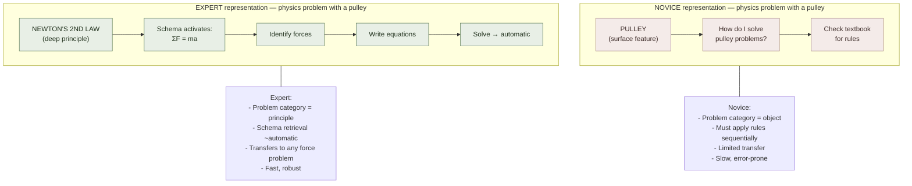

# Novice vs. Expert Cognition

**Summary**: The novice–expert distinction is one of the most empirically robust findings in cognitive psychology: **experts and novices don't just know more — they think differently**. Chi, Feltovich & Glaser (1981) showed that physics experts categorize problems by deep structural principles (conservation of energy, Newton's laws) while novices categorize by surface features (inclined planes, pulleys, springs). The distinction is general: experts see pattern-rich chunks where novices see isolated features; experts retrieve whole solution schemas where novices apply sequential rules; experts monitor their own reasoning where novices don't. This page is the canonical owner of the novice-expert cognitive distinction as a learning-science concept. The [mental-models-for-learning](./mental-models-for-learning.md) page covers the practical model-building moves; this page covers the underlying cognitive-architecture difference.

**Sources**:
- Chi, M. T. H., Feltovich, P. J., & Glaser, R. (1981). "Categorization and Representation of Physics Problems by Experts and Novices." *Cognitive Science*, 5(2), 121-152. — the canonical study.
- Chase, W. G., & Simon, H. A. (1973). "Perception in Chess." *Cognitive Psychology*, 4(1), 55-81. — chunks in chess: 50,000 patterns vs. ~100.
- Ericsson, K. A. (1993). "The Role of Deliberate Practice in the Acquisition of Expert Performance." *Psychological Review*, 100(3), 363-406. — deliberate practice as the bridge from novice to expert.
- Bransford, J. D., Brown, A. L., & Cocking, R. R. (Eds.). (2000). *How People Learn: Brain, Mind, Experience, and School*. National Academies Press. Ch 2: "How Experts Differ from Novices."
- Sweller, J. (1988). "Cognitive Load during Problem Solving: Effects on Learning." *Cognitive Science*, 12(2), 257-285. — cognitive load theory; worked examples for novices.
- Internal: [mental-models-for-learning](./mental-models-for-learning.md), [chunking](./chunking.md), [deliberate-practice](./deliberate-practice.md), [making-smaller-circles](./making-smaller-circles.md), automaticity, [desirable-difficulties](./desirable-difficulties.md).

**Last updated**: 2026-06-10

---

## The Chi-Feltovich-Glaser finding

Chi et al. (1981) showed physics problems to expert professors and undergraduate novices. Both groups were asked to sort the problems into groups. 

- **Novices** sorted by surface features: "inclined-plane problems," "spring problems," "pulley problems."
- **Experts** sorted by deep structural principles: "Newton's Second Law problems," "conservation of energy problems."

This is not merely vocabulary. The novice categories map to the observable objects in the problem; the expert categories map to the physical laws that determine how to solve the problem. When you categorize a problem into "conservation of energy," you immediately know which formulas apply, what the solution schema is, and how to check your answer — the categorization is the solution path.

## The cognitive architecture difference

| Dimension | Novice | Expert |
|---|---|---|
| **Representation** | Surface features, isolated facts | Deep structural principles, hierarchical organization |
| **Chunking** | ~4 independent pieces in working memory | ~50,000 compiled chunks (chess: Chase & Simon 1973) |
| **Problem solving** | Sequential rule application, weak methods | Schema retrieval, rapid pattern matching |
| **Self-monitoring** | Limited metacognitive monitoring | Active monitoring; detects errors early |
| **Transfer** | Context-locked; fails when surface changes | Principle-level; applies to novel surfaces |
| **Attention** | Spent decoding surface; limited left for reasoning | Surface decoding automatic; attention free for strategy |
| **Confidence calibration** | Often overconfident (Dunning-Kruger zone) | Better calibrated; knows what they don't know |

## Chunking is the structural change

Chase & Simon (1973) chess study: grandmasters can reconstruct realistic positions from a 5-second glance. Novices cannot. But neither group can reconstruct *random* positions better than chance. The expert advantage is entirely about **pattern recognition in meaningful configurations** — they see the board not as 32 pieces but as 5-10 tactical configurations, each a compiled chunk.

This is the architectural reason why [deliberate-practice](./deliberate-practice.md) works: it assembles chunks through targeted practice. Each small circle ([making-smaller-circles](./making-smaller-circles.md)) that reaches automaticity becomes one more chunk. Over thousands of hours, the chunk library grows large enough that expert-level pattern recognition becomes possible.

## The cognitive load implication

Sweller (1988) identified the instructional consequence: **novices benefit from worked examples; experts do not.** For a novice, a worked example reduces extraneous cognitive load (the work of figuring out what to do next) and leaves processing capacity for schema formation. For an expert, worked examples are slower than active problem-solving — the "expertise reversal effect."

This means instructional design must distinguish novice from expert:
- **Novice**: worked examples → partly-worked examples → problem solving (fade scaffolding)
- **Expert**: problem solving → challenge problems → teach-it-back (remove scaffolding)

Using novice-appropriate instruction for experts produces boredom and wasted time; using expert-appropriate instruction for novices produces cognitive overload and failure.

## The three stages of expertise development

Synthesizing across Chi, Chase-Simon, and Ericsson:

| Stage | Characteristics | Instructional need |
|---|---|---|
| **Stage 1: Novice** | Isolated facts, surface categorization, no schemas | Worked examples, direct instruction, error correction |
| **Stage 2: Intermediate** | Some schemas forming, still deliberate application, inconsistent | Deliberate practice at the edge; mixed problem types (interleaving) |
| **Stage 3: Expert** | Automatic pattern matching, principle-level categorization, active monitoring | Challenge problems, teaching, novel problem types, extreme interleaving |

The transition is not a smooth slope — it has plateaus (see Bryan & Harter 1897 in [practice-is-required-not-optional](./practice-is-required-not-optional.md)) where sub-schemas are building below the surface before the next performance jump.

## The metacognition difference

Expert self-monitoring is a second-order difference: experts know what they know and what they don't. They can:
- Predict their own performance on novel problems
- Detect early when a solution path is failing
- Ask the right questions when stuck
- Identify which sub-problems they need to practice

Novices often cannot accurately predict performance, persist on failing paths, and don't know which sub-skills are weak. This is why expert tutors can direct student practice efficiently — they can see the student's chunk structure from their responses and know exactly which chunk is missing.

## Visual

## Failure modes

| Failure | What it produces |
|---|---|
| **Teaching experts like novices** | Boredom, inefficiency, expertise reversal effect |
| **Teaching novices like experts** | Cognitive overload, failure, discouragement |
| **Mistaking surface practice for chunk-building** | Many reps of surface-similar problems without deep structure → no schema formation |
| **Confusing familiarity with expertise** | Student can solve previously-seen problems → seems expert → fails novel variants |
| **Skipping novice scaffolding** | Expert-style problem sets before schemas form → brute-force weak methods → no progress |

## Related pages

- [mental-models-for-learning](./mental-models-for-learning.md) — the practical model-building moves (this page: the underlying architecture)
- [chunking](./chunking.md) — the cognitive mechanism; expert chunks are compiled knowledge units
- [deliberate-practice](./deliberate-practice.md) — the bridge from novice to expert through targeted chunk-assembly
- [making-smaller-circles](./making-smaller-circles.md) — the technique for building one chunk at a time
- automaticity — the end-state of chunk formation; automatic = working-memory cost near zero
- [desirable-difficulties](./desirable-difficulties.md) — applies differently to novices vs. experts (expertise reversal)
- [interleaving](./interleaving.md) — benefits experts more than novices; appropriate after schema formation
- [prism-pattern-discovery](./prism-pattern-discovery.md) — the three-layer pattern model (surface cues · deep structure · mechanism) extends the Chi et al. surface/deep split by one layer

---

## U — See (CAST)
1. Experts categorize by deep structural principles; novices by surface features
2. Expert chunks: ~50,000 compiled patterns; novices: ~100

## D — Name (NEDF)
1. Novice-expert distinction = surface→deep shift in representation, chunk size, monitoring, and transfer
2. Distinguisher: categorization target (object vs. principle) is the diagnostic
3. Failure mode: surface practice without schema formation; many reps of same surface → no chunk

## F — Do (SPEAR)
1. Diagnose learner stage before choosing instruction: novice → worked examples; expert → challenge problems
2. Test transfer not familiarity: novel surface + same principle = expert; same surface + same principle = memorizer

## B — Watch (HEART)
1. Fast on practiced problems but fails novel variant → surface mastery, not schema
2. Cognitive overload with problem-solving format → novice stage; add scaffolding

## L — Predict (ORACLE)
1. Expert categorization → rapid solution, robust transfer, early error detection
2. Novice categorization → slow rule application, context-locked, poor error detection

## R — Act (GRACE)
1. New domain → start with worked examples; resist expert-style problem sets until schemas form
2. Assess own categorization: when given a new problem, what category fires first? Principle = expert zone
