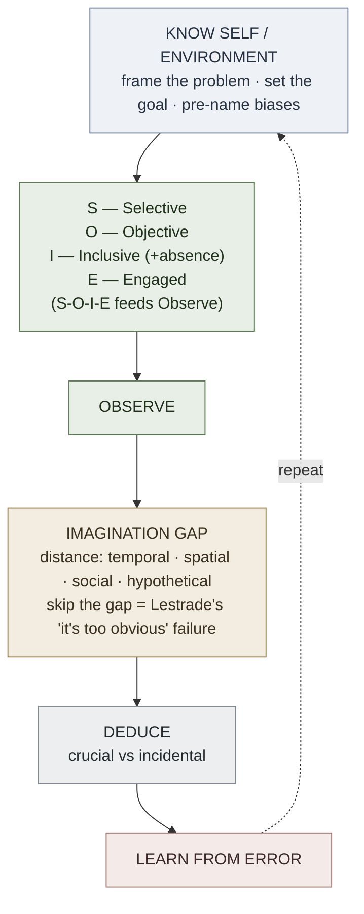

# Observation Before Deduction

**Summary**: Maria Konnikova's Sherlock-Holmes model of thinking, in which *disciplined observation is the mandatory first step before any inference*. Its two payloads are the **S-O-I-E** four-element observation protocol (Selective · Objective · Inclusive · Engaged) and the **observation → imagination → deduction** cycle, in which imagination is the load-bearing middle step you skip at your peril. This page's "deduction" is Konnikova's colloquial usage — closer to abduction — and is deliberately *not* the formal natural-deduction system owned by [methods-of-deduction](./methods-of-deduction.md).

**Sources**:
- Maria Konnikova, *Mastermind: How to Think Like Sherlock Holmes* (2013), Ch. 3 (observation), Ch. 4 (imagination), Ch. 5 (deduction).
- [memory-is-residue-of-thought](./memory-is-residue-of-thought.md) — why the observation gate determines what ever gets encoded.
- [attention-framework](./attention-framework.md) — attention as the finite resource S-O-I-E allocates.
- [methods-of-deduction](./methods-of-deduction.md) — the *formal* Copi deduction system this page disambiguates against.

**Last updated**: 2026-07-10

---

## The core claim

Konnikova's thesis is that most "reasoning failures" are actually *observation* failures — bad conclusions drawn quickly from data that was never properly gathered in the first place (source: Maria Konnikova - Mastermind How to Think Like Sherlock Holmes - 2013.epub). The scientific method of thought she extracts from the Holmes canon runs: *understand and frame the problem; observe; hypothesize (imagine); test and deduce; and repeat* (source: Maria Konnikova - Mastermind How to Think Like Sherlock Holmes - 2013.epub). Observation is load-bearing because it feeds everything downstream — this is the upstream sibling of [memory-is-residue-of-thought](./memory-is-residue-of-thought.md): what your [attention](./attention-framework.md) fails to gate in during observation cannot be reasoned over, recalled, or encoded later.

Throughout the book Konnikova personifies two modes of mind with memorable nicknames — the slow, mindful, single-focused **System Holmes** and the fast, lazy, multitasking **System Watson**. These are Konnikova's *illustrative* labels for the slow/fast dual-process distinction; treat them as narrative devices, not as a second name for Kahneman's System 1 / System 2 (source: Maria Konnikova - Mastermind How to Think Like Sherlock Holmes - 2013.epub). Likewise, many of the worked examples in the book — the imagined Watson "airplane on the Empire State Building" monologue, the reconstructed interior dialogues — are Konnikova's fictional narrative illustrations, not experimental data; the empirical claims (bit-rate of vision, conjunction-fallacy rates, the omission-neglect phone demonstration) are the parts that carry evidentiary weight.

## S-O-I-E — the four elements of observation

Konnikova distills Holmesian observation into four requirements. She stresses that "noticing everything" is a myth — Holmes notices everything *that matters to the purpose at hand*, and nothing else (source: Maria Konnikova - Mastermind How to Think Like Sherlock Holmes - 2013.epub).

1. **Selective** — goal-directed filtering. Attention is a scarce, non-parallel resource: the environment throws roughly eleven million pieces of sensory data at us at once, of which we consciously process about forty (source: Maria Konnikova - Mastermind How to Think Like Sherlock Holmes - 2013.epub). So the first move is to decide *what you want to accomplish*, which primes the mind toward relevant elements and pushes the rest to the background — "I only saw it because I was looking for it," as Holmes says in "Silver Blaze" (source: Maria Konnikova - Mastermind How to Think Like Sherlock Holmes - 2013.epub). The caveat: goals must filter, not blind — if the available information changes, the goal must flex (source: Maria Konnikova - Mastermind How to Think Like Sherlock Holmes - 2013.epub).

2. **Objective** — separate observation from interpretation. Konnikova invokes Heisenberg: the act of observing changes the thing observed, and even an empty room is altered by your presence (source: Maria Konnikova - Mastermind How to Think Like Sherlock Holmes - 2013.epub). The everyday version is the **white-coat effect** — merely entering a doctor's office shifts pulse and blood pressure before anything is done (source: Maria Konnikova - Mastermind How to Think Like Sherlock Holmes - 2013.epub). The discipline is to record the bare fact ("a missing boy, a missing schoolmaster — that is all") and let interpretation come later, as a distinct step (source: Maria Konnikova - Mastermind How to Think Like Sherlock Holmes - 2013.epub). A practical override: describe the situation out loud or in writing to an imagined stranger; the act of speaking surfaces the gaps your eye skipped (source: Maria Konnikova - Mastermind How to Think Like Sherlock Holmes - 2013.epub).

3. **Inclusive** — use *every* sense, and attend to *absence*. Holmes solves cases on smell (the jasmine on the note in *The Hound of the Baskervilles*) as readily as on sight (source: Maria Konnikova - Mastermind How to Think Like Sherlock Holmes - 2013.epub). Critically, inclusivity extends to what *isn't* there: "the dog that didn't bark" in "Silver Blaze" is the turning point precisely because a non-event is still a datum (source: Maria Konnikova - Mastermind How to Think Like Sherlock Holmes - 2013.epub). The failure mode has a name — **omission neglect**: in Konnikova's phone-comparison demonstration, readers flip their preference as each new spec (weight, then radiation) is revealed, even though nothing about the phones changed, only which attributes were made visible (source: Maria Konnikova - Mastermind How to Think Like Sherlock Holmes - 2013.epub). This element is the direct parent of [red-herring-resistance](./red-herring-resistance.md)'s inverse skill: inclusive observation targets *not missing* silent data, while [red-herring-resistance](./red-herring-resistance.md) targets *not using* loud-but-irrelevant data.

4. **Engaged** — "engaged passivity," not "disengaged activity." Konnikova's sharpest reframe: Holmes the *passive* observer (doing one thing fully) beats Watson the *active* observer (doing five things at once) (source: Maria Konnikova - Mastermind How to Think Like Sherlock Holmes - 2013.epub). Under cognitive load — juggling tasks — we reliably complete the first two steps of perception (categorize, characterize) but skip the third (correct), producing confident wrong impressions (source: Maria Konnikova - Mastermind How to Think Like Sherlock Holmes - 2013.epub). The one time Holmes lets engagement lapse — in "The Stock-Broker's Clerk," where he considers the case already solved — he misses the newspaper clue and nearly lets his suspect die (source: Maria Konnikova - Mastermind How to Think Like Sherlock Holmes - 2013.epub).

## The imagination gap — the load-bearing middle step

Between observation and deduction there is a mandatory hypothesis-generation stage, and skipping it is the signature failure of the story's lesser detectives: moving, "like Lestrade, straight from evidence to conclusion" because the first explanation seemed too obvious to question (source: Maria Konnikova - Mastermind How to Think Like Sherlock Holmes - 2013.epub). The mechanism that makes imagination possible is **psychological distance**. Konnikova draws on Yaacov Trope's construal-level theory: distance comes in four forms — temporal, spatial, social, and hypothetical — and the further you move on any of them, the more abstract and wide-angle your interpretation becomes (source: Maria Konnikova - Mastermind How to Think Like Sherlock Holmes - 2013.epub).

Three routes to that distance:

- **Unrelated activity.** The "three-pipe problem": Holmes pushes an object (pipe, violin, opera) between himself and the case so his observations can percolate in the background. The activity must be unrelated, not too effortful, yet engaging — a walk in nature is close to ideal (source: Maria Konnikova - Mastermind How to Think Like Sherlock Holmes - 2013.epub).
- **Physical relocation.** A literal change of location renders your ingrained associations irrelevant and frees new ones — this is why Holmes spends a night in the room where the crime occurred in *The Valley of Fear* (source: Maria Konnikova - Mastermind How to Think Like Sherlock Holmes - 2013.epub).
- **Meditation / visualization.** Directed mental journeying (Holmes "visiting Devonshire in spirit") and fly-on-the-wall visualization produce the same distancing without moving your body (source: Maria Konnikova - Mastermind How to Think Like Sherlock Holmes - 2013.epub).

Without this gap, deduction has nothing to test but the single obvious story, and the obvious story is often wrong.

## Deduction discipline

Konnikova's Chapter 5 gives three rules for the final step:

- **Separate crucial from incidental.** Holmes "smoked several pipes over them, trying to separate those which were crucial from others which were merely incidental" (source: Maria Konnikova - Mastermind How to Think Like Sherlock Holmes - 2013.epub). The classic failure is the **conjunction fallacy** (Tversky & Kahneman, 1983): shown the "Linda" and "Bill" descriptions, ~85–87% of subjects rank "Linda is a bank teller *and* a feminist" as more likely than "Linda is a bank teller," even though a conjunction can never be more probable than one of its parts (source: Maria Konnikova - Mastermind How to Think Like Sherlock Holmes - 2013.epub). More detail makes a story feel *more* credible while making it *less* probable.
- **Respect base rates.** The antidote to the conjunction fallacy is knowing how often each category actually occurs in the population, rather than judging by resemblance (source: Maria Konnikova - Mastermind How to Think Like Sherlock Holmes - 2013.epub).
- **The improbable is not yet impossible.** "When you have eliminated the impossible, whatever remains, however improbable, must be the truth" (source: Maria Konnikova - Mastermind How to Think Like Sherlock Holmes - 2013.epub). We default to the past as a model of the future (the "Lucretius underestimation"), so we prematurely discard rare-but-valid explanations — even Holmes does this, arriving three days late in "Silver Blaze" because he could not believe so famous a horse could stay hidden (source: Maria Konnikova - Mastermind How to Think Like Sherlock Holmes - 2013.epub).

## Disambiguation: this "deduction" is not formal deduction

Konnikova's own endnote 3 concedes the point: "some of his deduction would, in logic's terms, be more properly called induction or abduction. All references to deduction or deductive reasoning use it in the Holmesian sense, and not the formal logic sense" (source: Maria Konnikova - Mastermind How to Think Like Sherlock Holmes - 2013.epub). So the "deduction" on this page is **inference-to-the-best-explanation (abduction)**, not the truth-preserving rule-chaining of [methods-of-deduction](./methods-of-deduction.md) (Copi's 19 atomic rules + conditional proof + reductio). Both are worth having and they compose: Holmesian abduction *generates* the best candidate explanation; Copi's natural deduction *validates* whether a conclusion strictly follows from stated premises. Do not conflate them — one is a discovery heuristic, the other is a proof procedure.

## The applied five-step cycle

Konnikova's method, restated as a runnable loop (source: Maria Konnikova - Mastermind How to Think Like Sherlock Holmes - 2013.epub):

1. **Know yourself and the environment** — frame the problem, set the goal that will drive Selective filtering, and pre-name your own biases (the "brain attic" you are working from).
2. **Observe** — run S-O-I-E: Selective, Objective, Inclusive (including absence), Engaged.
3. **Imagine** — open the distance gap; generate multiple hypotheses before committing to one.
4. **Deduce** — sort crucial from incidental, respect base rates, keep the improbable in play.
5. **Learn from error** — update the knowledge base; retest hypotheses as circumstances change.

## METER instrumentation

Bind the two hardest sub-skills to measurable floors via [meter-overview](./meter-overview.md):

| Test | Pass floor |
|---|---|
| Crucial-vs-incidental sort over a 10-item deck | <10 s per scenario at ≥90% accuracy |
| Omission-neglect gap recognition ("what datum is silent here?") | <4 s |
| Name the four S-O-I-E elements from the cue | <8 s |
| Name a distancing technique before hypothesizing | <5 s |
| Catch a conjunction-fallacy ranking in a worded prompt | <10 s |

## Mnemonic

**S-O-I-E spells *soie* — French for "silk."** Picture Holmes at the window of 221B holding a single strand of shimmering silk thread up to the grey London light. He runs it past each faculty in turn:

- He *looks* at only this thread and ignores the storm outside — **Selective**.
- He notes the plain fact "one strand, frayed at one end" before guessing where it came from — **Objective**.
- He *smells* it, *feels* its weave, and notices there is *no second strand where there should be one* — **Inclusive** (present and absent).
- His eyes are closed, fingertips together, doing nothing else in the world but this — **Engaged** passivity.

One silk thread, four senses of discipline. If you can feel the silk (soie) between your fingers, you can recover S-O-I-E.

## Checksum

Three falsifiable self-tests — if you cannot answer, the page is not encoded:

1. **Absence test.** Given a scene, can you name at least one *thing that should be present but isn't* within 4 seconds? (Fail = Inclusivity not internalized — the dog-that-didn't-bark reflex is missing.)
2. **Gap test.** Before stating a conclusion on a live problem, did you generate ≥2 competing hypotheses via a distancing move? If you jumped straight from evidence to one conclusion, you failed the Lestrade check.
3. **Disambiguation test.** Can you state, in one sentence, why this page's "deduction" is *not* what [methods-of-deduction](./methods-of-deduction.md) means by deduction? (Answer: this is abduction / inference-to-best-explanation; that is truth-preserving rule-chaining.)

## Visual

## Related pages

- [memory-is-residue-of-thought](./memory-is-residue-of-thought.md) — the downstream partner: observation gates what ever gets encoded.
- [methods-of-deduction](./methods-of-deduction.md) — the *formal* deduction system this page is disambiguated against.
- [attention-framework](./attention-framework.md) — the finite resource S-O-I-E's Selectivity allocates.
- [red-herring-resistance](./red-herring-resistance.md) — inverse skill: not *using* loud irrelevant data (vs not *missing* silent data).
- [meter-overview](./meter-overview.md) — the measurement layer this page's floors feed.
- [crux-move](./crux-move.md) — recognition-under-observation sibling in the problem-solving cluster.

---

## U — See (CAST)

1. Holmes at the window holding one silk (soie) thread to each sense; storm ignored outside
2. Edges: S-O-I-E → Observe → [imagination gap] → Deduce → Learn; skip-gap → Lestrade failure

See [CAST](./cast-overview.md).

## D — Name (NEDF)

1. Observation-before-deduction = disciplined observation is mandatory *before* any inference
2. S-O-I-E = Selective · Objective · Inclusive(+absence) · Engaged
3. Distinguisher: "deduction" here is abduction, NOT [methods-of-deduction](./methods-of-deduction.md)'s formal rules
4. Failure mode: jumping evidence→conclusion, skipping the imagination gap (Lestrade)

See [NEDF](./nedf-overview.md).

## F — Do (SPEAR)

1. Frame goal → run S-O-I-E, logging absent data explicitly
2. Insert a distancing move (walk / relocate / visualize) before hypothesizing
3. Generate ≥2 hypotheses, then sort crucial vs incidental against base rates
4. State the case aloud to catch skipped premises; update after error

See [SPEAR](./spear-overview.md).

## B — Watch (HEART)

1. "Noticing everything" (Watsonian disengaged activity) instead of noticing what matters
2. Confusing observation with interpretation (white-coat / correspondence bias)
3. Conjunction fallacy — a richer story ranked as more probable
4. Dismissing the improbable as impossible (Lucretius underestimation)

See [HEART](./heart-overview.md).

## L — Predict (ORACLE)

1. High cognitive load during observation → the "correct" step gets skipped → confident wrong reads
2. No distancing move logged → conclusion will collapse to the single obvious hypothesis

See [ORACLE](./oracle-overview.md).

## R — Act (GRACE)

1. Before concluding, ask: "what is silent here that should be present?"
2. Buy distance deliberately — take the walk, change the room, run the fly-on-the-wall
3. Coach another → force them to observe fully before they are allowed to guess

See [GRACE](./grace-overview.md).
