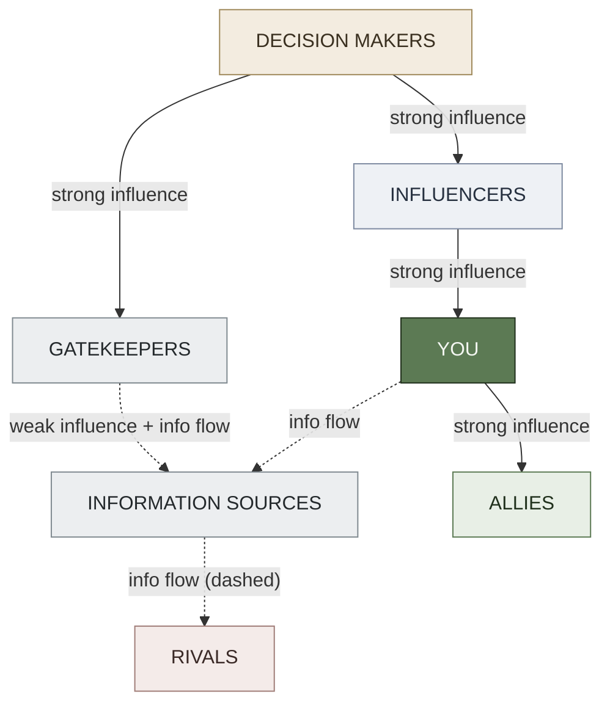
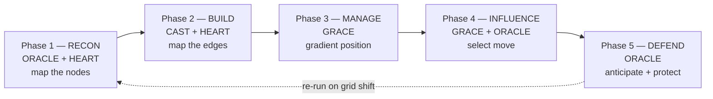
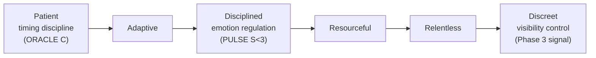

# Office Politics — Operative Field Guide (Operative Dialect Instance #4)

**Summary**: Professional social navigation reframed through the covert-operator aesthetic. Decodes the workplace as a power grid (6 typed nodes) and sequences five phases — Recon · Build · Manage · Influence · Defend — as a runnable SPEAR procedure over a Composite substrate (CAST power grid + HEART player rooms + GRACE influence selection + ORACLE threat anticipation). The fourth instance of the Operative Dialect register; the first where the operative aesthetic and the subject matter share the same underlying domain (power navigation).

**Sources**: RDCTD.PRO — "Office Politics: A Covert Operative's Field Guide" (public infographic, 2024).

**Last updated**: 2026-06-17

---

> ⚠️ **AUTHORIZATION & SOURCE NOTICE.** Navigational-use page. Source: RDCTD.PRO public infographic. All content is for understanding, mapping, and responding to organizational power dynamics — not for running covert operations against colleagues. See §Boundary below for the three-lane test.

---

> 🔓 **Unlock — this is the first Operative Dialect instance where the aesthetic register and the content substrate share a domain.**
>
> Instances #1–3 were "biology/cognition *dressed* operatively" — operator framing was a retrieval door into neutral substrate (sleep hygiene, pattern recognition, social-environmental fit). Instance #4 is different: workplace power dynamics and covert operations share the same underlying machinery — map the players, track information flows, manage perception, apply leverage, defend your position. The operative aesthetic is not a costume here; it *is* the subject matter's native language. This unlocks a second unlock shape for the [composability-index](./composability-index.md): **register-as-natural-domain-language** (not just register-as-retrieval-door). Register to [composability-index](./composability-index.md) §2026-06-17 Office Politics block.

---

## What this page is — and isn't

**Is**: a Composite Operative Dialect page — SPEAR procedure over a CAST power grid, with HEART player-room encoding, GRACE move selection, and ORACLE anticipation. The substrate pages ([CAST](./cast-overview.md), [HEART](./heart-overview.md), [GRACE](./grace-overview.md), [ORACLE](./oracle-overview.md), [SPEAR](./spear-overview.md)) remain canonical owners of their respective frameworks; this page reframes them in the professional-navigation register without restating their definitions.

**Isn't**: (a) a new top-level framework or new acronym at framework level — "the RECON Cycle" is prose, not a registered wiki code; (b) a license to run influence operations against colleagues; (c) a replacement for communicating-up-the-power-gradient, which is the *defensive-only* sibling (protect yourself from someone running this playbook) — this page is the *strategic-navigational* door (read the map and move through it with awareness).

---

## §Boundary — three lanes (required per Operative Dialect contract)

Run this test before applying any move from this page:

| Lane | What it looks like | In scope? |
|---|---|---|
| **Navigational** | Understanding that a power structure exists in your org and choosing to map it, build deliberate relationships, and communicate strategically. Everyone who succeeds at work does this, named or unnamed. | ✓ Yes |
| **Defensive** | Recognizing when these moves are being run *against* you — someone managing your perception, using indirection, or applying pressure through your identified leverage points. Name the move → choose your response. | ✓ Yes |
| **Hostile** | Deliberately weaponizing intelligence about a colleague's vulnerabilities to harm them for personal gain, bypassing their informed consent. The diagnostic: are you advancing legitimate interests, or extracting something they wouldn't give if they could see clearly what was happening? | ✗ No |

**Boundary partner pages**: communicating-up-the-power-gradient (defensive sibling — your shield when someone is running this playbook against you); frame-projection-attack (the attack mode that "Influence Strategically" must never slide into); IDSE (what "Apply Pressure" becomes when it crosses into manipulation at relationship scale).

---

## The Office Power Grid — CAST model

The workplace is not a flat list of people. It is a **6-node dependency graph** with typed edges (source: RDCTD.PRO). YOU sit at center. Map this graph before making any significant move.

| Node | Role | Edge type to you |
|---|---|---|
| **Decision Makers** | Final authority; hold budget, scope, access | Strong influence (their decisions land directly on you) |
| **Gatekeepers** | Control access to Decision Makers; filter information up and down | Weak influence + information flow (they shape what Decision Makers see) |
| **Influencers** | Shape opinion horizontally; not formally powerful but socially load-bearing | Strong influence (they move perception without title) |
| **Allies** | Shared interests; mutual support; information exchange | Strong influence + information flow (bidirectional and trustworthy when maintained) |
| **Rivals** | Competing for the same resources, recognition, or position | Information flow (they are information *sources* about threat patterns — do not write them off as zero-value nodes) |
| **Information Sources** | Access to intelligence about plans, decisions, narratives in play | Information flow (dashed in the original; highest ORACLE feed) |

CAST encoding note: map this as a CAST graph in the relevant workplace palace room. Nodes carry state tags — a Gatekeeper who has gone cold is "frosted"; a Rival who has become neutral is "thawing." Edges carry typed relation tags (commands · blocks · feeds · amplifies · depends on). Update the map after every significant event; a stale map is worse than no map.

---

## The RECON Cycle — SPEAR procedure

Five phases, each with sub-moves. Run in order on entering any new professional context. Re-run whenever the power grid shifts materially (leadership change, reorg, budget cycle, project handoff).

### Phase 1 — Recon: Know the Terrain

**ORACLE trigger**: what is actually happening in this environment before I make assumptions?

- **Map the players**: identify who fills each Power Grid role. Names, titles, and org chart are the starting point; actual behavior patterns override the chart.
- **Observe patterns**: track interactions, norms, and unspoken rules. Who speaks first in meetings? Who stays silent but always gets the last word? What gets celebrated and what gets quietly punished?
- **Find the leverage**: understand motivations, dependencies, and vulnerabilities — *for navigational awareness*, not for weaponization. Knowing that a Decision Maker values speed above elegance tells you how to frame proposals.
- **Track the narrative**: every person and every project exists inside a story being told about them. What story is being told about you? Who is telling it?

Encoder note: Recon output feeds directly into [HEART](./heart-overview.md) person rooms. Open one room per grid node and populate the Recognition tier (behavioral signatures) before doing anything else.

### Phase 2 — Build Your Network

**CAST trigger**: which relational edges are missing or weak that limit my reach?

- **Be useful**: solve problems. Add value. Become the go-to resource for something specific before asking for anything.
- **Build trust**: keep confidences. Follow through. Reliability is the precondition for influence — without it, network nodes remain acquaintances.
- **Diversify connections**: avoid over-reliance on any single node. A network that routes all value through one person breaks the moment that person leaves or turns.
- **Reciprocate**: relationships are two-way exchanges. Unilateral value extraction degrades the edge; reciprocation maintains it.

Encoder note: this phase is the [CAST](./cast-overview.md) encoding step — edges being strengthened, new nodes being linked. A Rival node should have an edge, even if the label is "monitors and occasionally competes." A node with no edge is a blind spot.

### Phase 3 — Manage Perception

**GRACE trigger**: what gradient position am I projecting, and is it the one I intend?

- **Control your narrative**: define how others see you *before* someone else does. Silence about your work is not neutrality — it is vacancy that others will fill.
- **Be consistent**: align words, actions, and outcomes. Inconsistency is the most common self-inflicted perception damage.
- **Stay calm**: emotions are exploitable. In charged situations, composure is leverage — not coldness, but regulation. See not-taking-it-personally §Layer-2 regulation.
- **Know when to stay silent**: information withheld is information controlled. Not every question requires an immediate answer; not every meeting requires your input.

Encoder note: GRACE §Hierarchy and GRACE §Professional modes cover the gradient selection mechanics. If perception keeps drifting despite correct moves, check communicating-up-the-power-gradient §Poise — the exploitability-tells may be leaking through delivery rather than content.

### Phase 4 — Influence Strategically

**GRACE + ORACLE trigger**: what outcome do I need, and what is the minimum-footprint path to it?

- **Frame the conversation**: guide focus toward your desired outcome before the explicit ask. See conversational-framing for the mechanics.
- **Use indirection**: plant ideas; let others champion them. Authorship of an idea and credit for its adoption do not always need to be the same person's. The move that others execute feels like their own decision.
- **Find alignment**: tie your goals to theirs. Shared success compounds — an Ally who benefits from your win will promote it without being asked.
- **Apply pressure**: know the pressure points. Use sparingly. Precisely. Pressure applied too broadly or too early reads as desperation; applied too late reads as weakness. ORACLE Anticipatory mode sets the timing window — see [timing-operative](./timing-operative.md) for the 5 high-leverage timing signals.

§Boundary check at this phase: indirection is legitimate when you are navigating a shared decision space. It becomes hostile when you are manufacturing the outcome for personal gain at another party's direct expense without their awareness.

### Phase 5 — Defend Your Position

**ORACLE trigger**: what threats are approaching and how do I reduce exposure before they arrive?

- **Anticipate threats**: watch for shifts, rumors, and emerging risks. An early signal caught in ORACLE C-slot is worth ten reactive responses. Track the narrative (Phase 1) continuously.
- **Disarm criticism**: address issues early. A known weakness self-disclosed and mitigated costs less than the same weakness discovered by a rival. Neutralize narratives before they harden.
- **Protect your reputation**: guard credibility like an asset. Once a reputation for unreliability or poor judgment attaches to a name, the evidence bar for dislodging it is high.
- **Have an exit plan**: know when to pivot, disengage, or relocate. An operative who cannot exit cleanly is an operative who has lost optionality. See negotiation-os §BATNA — optionality is leverage.

---

## Common Political Traps — ORACLE Anomaly mode

These are the five patterns that most reliably undermine a player's position (source: RDCTD.PRO). Run them as ORACLE Anomaly check items: *something would feel wrong if I detected this in my own behavior*.

| Trap | Signature | Defensive name |
|---|---|---|
| **Over-sharing** | Information leaks become ammunition. Telling everyone your plans is not transparency — it is inventory for rivals. | Stimulus for "Know When to Stay Silent" (Phase 3) |
| **Taking sides early** | Power shifts. Loyalties become liabilities. The Influencer who is today's kingmaker may be tomorrow's liability. | Violates "Diversify Connections" (Phase 2) |
| **Chasing credit** | Visible ambition invites resistance. Claiming authorship too loudly alerts rivals and puts Decision Makers on guard. | Violates "Use Indirection" (Phase 4) |
| **Underestimating others** | Everyone has influence somewhere. The Information Source node with no formal title may control the Decision Maker's agenda. | Violates Phase 1 mapping completeness |
| **Burning bridges** | Today's contact could be tomorrow's key. A Rival node at a previous employer can become an Ally node at a future one. | Violates "Reciprocate" (Phase 2) — even exits should be managed |

---

## The Operative Mindset

The six virtues the infographic names are not personality traits to install; they are **PULSE-modulation targets** — states to reinforce when the cognitive environment is right and defend when it is under pressure (source: RDCTD.PRO).

| Virtue | Substrate meaning | When it fails |
|---|---|---|
| **Patient** | Timing creates opportunity; ORACLE C-slot must fire before you act | Replaced by urgency-pressure → premature moves at the Too Early timing window |
| **Adaptive** | Adjust tactics when the environment shifts; SPEAR has repair branches | Replaced by rigid plan-following → executing against a stale Power Grid map |
| **Disciplined** | Emotions in check; mindset stability regardless of provocation | Replaced by reactivity → leaks exploitability, violates Phase 3 Poise |
| **Resourceful** | Leverage what exists; Ally nodes and Information Sources before creating new resources | Replaced by resource hoarding or resource blindness |
| **Relentless** | Consistent progress compounds; small Phase 2 trust-builds > occasional large gestures | Replaced by burst activity with long silences → trust degrades between bursts |
| **Discreet** | Low profile. High impact. No unnecessary signals | Replaced by visibility-seeking → Chasing Credit trap |

PULSE note: under high Stress (S≥4), the failures column is what fires automatically. Run a PULSE check before any high-stakes Phase 3 or 4 move.

---

## METER hooks

| Event | What it captures | Pass floor |
|---|---|---|
| `workplace.power_map_updated` | A new player node is added or an existing node's state tag changes (e.g., Ally goes cool → Neutral; Rival begins thawing) | Map should be updated after any significant org event; stale = 2+ weeks without a check |
| `workplace.influence_move_selected` | A Phase 4 move (frame / indirect / align / pressure) is consciously selected via GRACE gradient | ≥1 per high-stakes interaction; default mode (no explicit selection) = Phase 4 was not run |
| `workplace.threat_pattern_detected` | ORACLE C-slot fires on a workplace threat (narrative shift, rival move, narrative vacuum forming) | Detection before the threat materializes = pass; detection after = late |
| `workplace.political_trap_checked` | One of the 5 Common Political Traps is consciously reviewed before a move | ≥1 per significant Phase 4 action |

Register-level METER events (inherited from operative-dialect):

- `wiki.dialect_used` with `register=operative, host_page=office-politics-operative` — fires each time this register is applied in practice
- `wiki.dialect_cross_instance_transfer` — fires when operator vocabulary (e.g., "anti-predictability", "exit clean") learned in other instances transfers to a workplace context
- `wiki.dialect_substrate_drift_check` — zero violations required: this page must not restate definitions from CAST, HEART, GRACE, ORACLE, or SPEAR owner pages

---

## Mnemonic + Checksum

**Mnemonic — RECON** (the 5-phase cycle, in order):

- **R**ead the room first (Phase 1 — Recon: map before moving)
- **E**xtend the network quietly (Phase 2 — Build Network: be the useful node)
- **C**ontrol the signal (Phase 3 — Manage Perception: narrative before moves)
- **O**rchestrate outcomes indirectly (Phase 4 — Influence Strategically: minimum footprint)
- **N**ail down the perimeter (Phase 5 — Defend Position: exit plan in place)

The word RECON is the operative's pre-mission discipline: you do not move until you have done it. Applied here: you do not influence until you have completed R, E, and C in sequence.

**Memory checksum** (5 questions, answerable in <30 seconds):

1. **Name the 6 nodes of the Office Power Grid.** → Decision Makers · Gatekeepers · Influencers · Allies · Rivals · Information Sources. YOU at center. Which of these is a dashed edge (information flow only)? → Rivals and Information Sources.
2. **Which encoder owns each RECON phase?** → R=ORACLE+HEART; E=CAST+HEART; C=GRACE; O=GRACE+ORACLE; N=ORACLE.
3. **What is the load-bearing difference between this page and communicating-up-the-power-gradient?** → This page = proactive navigation (read the map, move through it). That page = defensive shield (prevent being instrumentalized by someone running this playbook against you).
4. **What are the 5 Common Political Traps?** → Over-sharing · Taking sides early · Chasing credit · Underestimating others · Burning bridges.
5. **What is the §Boundary test?** → Navigational (mapping + moving through a real power structure) and Defensive (recognizing these moves running against you) are in scope. Hostile (weaponizing vulnerabilities for personal gain at direct cost to another) is out of scope. Diagnostic: would they still grant this if they could see clearly what is happening?

If you cannot answer all 5 in under 30 seconds, the page has not stabilized. Drill via the RECON acronym, then return to the Grid nodes list.

---

## Visual

The Office Power Grid — 6-node CAST graph with YOU at center:

The 5-phase RECON Cycle as a SPEAR chain:

The Operative Mindset — 6 virtues as PULSE modulation targets:

---

## Related pages

- operative-dialect — register owner; this is instance #4 in the registry table
- communicating-up-the-power-gradient — defensive sibling: your shield when someone runs this playbook against you (POP triad: Proof · Options · Poise)
- [CAST](./cast-overview.md) — Power Grid encoding substrate
- [HEART](./heart-overview.md) — player-room encoding substrate (Phase 1 + 2 output)
- [GRACE](./grace-overview.md) — Phase 3 and 4 move selection substrate
- [ORACLE](./oracle-overview.md) — Phase 1 and 5 anticipation substrate
- [SPEAR](./spear-overview.md) — 5-phase RECON Cycle procedural substrate
- frame-projection-attack — the attack mode that Phase 4 "Influence Strategically" must never slide into
- IDSE — same SE primitives at relationship/personal scale (the boundary partner at a different domain)
- honey-trap-ci-operation — same primitives at CI-operation scale (the 3-scale stack: personal → CI → state)
- conversational-framing — Phase 4 "Frame the conversation" mechanics
- [timing-operative](./timing-operative.md) — Phase 4 "Apply Pressure" timing: 5 high-leverage timing signals for ORACLE C-slot
- negotiation-os — Phase 5 "Have an exit plan" mechanics (BATNA / optionality)
- not-taking-it-personally — Phase 3 "Stay calm" Layer-2 regulation
- [PULSE](./pulse-overview.md) — Operative Mindset virtue maintenance under cognitive load

---

## U — See (CAST)
1. 6-node Power Grid graph: YOU at center; 6 typed nodes; edge types (strong / weak / info flow / dashed)
2. RECON Cycle as a SPEAR chain over the CAST substrate

## D — Name (NEDF)
1. Office Politics Operative = RECON Cycle (5 phases) over a 6-node Power Grid (CAST)
2. Distinguisher: this page navigates the power structure; communicating-up-the-power-gradient defends against it
3. Failure mode: crossing from navigation into hostile influence (§Boundary test fails)

## F — Do (SPEAR)
1. New context → run Phase 1 Recon before any move
2. Power Grid shift detected → update CAST map + re-run Phase 1
3. Phase 4 move being considered → run §Boundary test first; then ORACLE timing check

## B — Watch (HEART)
1. Stale Power Grid map (CAST nodes not updated after org events)
2. Poise failures under up-gradient pressure (Phase 3 breaking down under stress)
3. Crossing §Boundary into hostile territory (especially in Phase 4 "Apply Pressure")

## L — Predict (ORACLE)
1. Over-sharing trap fires → information will be used against the person who shared
2. No exit plan in Phase 5 → optionality collapses at the worst moment
3. Underestimating a low-title node → that node surfaces at a decision point where it matters

## R — Act (GRACE)
1. New org context → start RECON; don't skip to Phase 4
2. Phase 4 move selected → minimum footprint; prefer indirection over direct pressure
3. Threat detected → Phase 5 defensive posture before any offensive Phase 4 move
