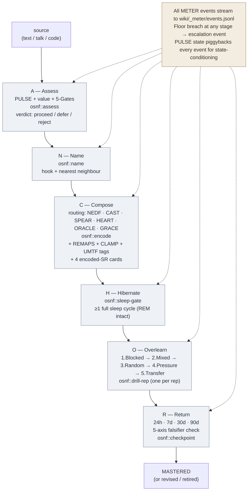

# OSNF — Once-Seen-Never-Forget Protocol

**Summary**: A six-stage operational pipeline — **A · N · C · H · O · R** (Assess · Name · Compose · Hibernate · Overlearn · Return) — that orchestrates every existing Neural OS encoder, transformation, and consolidation principle into one repeatable workflow for first-pass durable encoding. **A visual artifact is a hard requirement at Stage C** (not optional polish) — per the user's "if I don't see it visually I will forget it" discipline, the concept ships with an image (Velvet Aeon generated scene · meme · found image · sketch) or it is not encoded. OSNF does not invent new theory; it is the *sequence* that turns "I just read this" into "I can still produce it in 90 days with cue alone." Sister to neural-os-daily-loop (daily governance) and [language-learning-protocol](./language-learning-protocol.md) (domain-specific); OSNF is the **per-concept** protocol underneath both.

**Sources**:
- [framework-comparison-matrix](./framework-comparison-matrix.md) — encoder spine ([NEDF](./nedf-overview.md) · [CAST](./cast-overview.md) · [SPEAR](./spear-overview.md) · [HEART](./heart-overview.md) · [ORACLE](./oracle-overview.md) · [GRACE](./grace-overview.md))
- [UMTF](./universal-mental-tagging-framework.md) — 7-tag perceptual retrieval dimensions
- [PULSE](./pulse-overview.md) — state-gate at stage A
- [METER](./meter-overview.md) — event emission at every stage
- [REMAPS](./remaps.md) · [CLAMP](./clamp-render-lens.md) — Stage 1+2 of the Image Pipeline used in Compose
- [active-recall](./active-recall.md) · [encoded-spaced-repetition](./encoded-spaced-repetition.md) · [spaced-repetition](./spaced-repetition.md) — retrieval engine in Overlearn + Return
- [sleep-dependent-memory-consolidation](./sleep-dependent-memory-consolidation.md) · [memory-reconsolidation](./memory-reconsolidation.md) — Hibernate biology
- [automaticity-and-reflex-training](./automaticity-and-reflex-training.md) · [drill-ladder-patterns](./drill-ladder-patterns.md) · [practice-loop](./practice-loop.md) — Overlearn stage
- [fluent-forever-wyner](./fluent-forever-wyner.md) — frequency/value filter (Assess stage)
- [5-gates-of-comprehension](./5-gates-of-comprehension.md) — comprehension gate before encoding
- [smashin-scope](./smashin-scope.md) — REMAPS lineage (12→6 compression)

**Last updated**: 2026-08-20 (`glyph:` re-picked 📌 → ⚓ — the page's mnemonic is ANCHOR and it says so outright — "the mnemonic is the noun itself: an anchor is what holds the trace down"; six flukes for six stages; [representation-rules](./representation-rules.md) Rule 11); 2026-08-20 (`glyph:` assigned — [representation-rules](./representation-rules.md) Rule 11); 2026-08-13 (C.4 artifact typed as a permanently-exempt Type A addressing visual; Stage R gains the conditional Type-B scaffold probe per [representation-rules](./representation-rules.md) Rule 9; Stage R's stale "4-axis" count corrected to the registered 5); 2026-06-02

**Status**: Page created 2026-06-02 — M1 deliverable of the [OSNF](./once-seen-never-forget-protocol.md) effort (no separate roadmap; single-session orchestrator authored)

---

## The promise (falsifier first)

OSNF is **wrong** for a given concept if, **24 hours after running the protocol**, the user cannot — from the cue alone (the concept name) — reconstruct **all five** of:

1. **One concrete visual artifact** the user can *re-see* in the mind's eye — the actual image produced at Stage C, not a verbal description of it (≤2 s to surface)
2. **One vivid scene** carrying the concept's essence (≤3 s to surface)
3. **The Distinguisher** vs its nearest neighbour (≤5 s; named correctly)
4. **One failure-mode** — where this concept goes wrong in the wild (≤5 s)
5. **One drill rep at <3 s latency** — produce / classify / apply, not recognise

If **any one** of the five collapses, the protocol failed *for that concept* — not the student. The fault is in encoding (revise scene or replace the image), routing (wrong encoder), or filter (not worth keeping). Re-run with the named fix; do not "study harder." Axis 1 is **load-bearing** for this user — if the image collapses, no amount of verbal rehearsal will hold the concept; rebuild the image first.

This is the [active-recall](./active-recall.md) testing principle (Roediger & Karpicke 2006: tested groups retain ~61% at 1 week vs ~40% restudy) compounded with [memory-reconsolidation](./memory-reconsolidation.md): every retrieval edits the trace, so the 24h check is itself the consolidation.

---

## The pipeline at a glance — **A · N · C · H · O · R**

| Stage | Letter | Operation | Output | Owner page (technique) | METER event |
|---|---|---|---|---|---|
| **A**ssess | A | PULSE state-gate + value/frequency filter + comprehension gate | go / no-go decision | [pulse-overview](./pulse-overview.md) · [fluent-forever-wyner](./fluent-forever-wyner.md) · [5-gates-of-comprehension](./5-gates-of-comprehension.md) | `osnf::assess` |
| **N**ame | N | Capture the concept with a sticky name-hook + nearest neighbour | name + neighbour pair | [nedf-overview](./nedf-overview.md) (Name + Distinguisher slots) | `osnf::name` |
| **C**ompose | C | Route to the right encoder; build one [REMAPS](./remaps.md) scene; render with [CLAMP](./clamp-render-lens.md) if visual | one durable artifact | [framework-comparison-matrix](./framework-comparison-matrix.md) routing · [remaps](./remaps.md) · [UMTF](./universal-mental-tagging-framework.md) | `osnf::encode` |
| **H**ibernate | H | Sleep before next retrieval; protect the consolidation window | locked trace | [sleep-dependent-memory-consolidation](./sleep-dependent-memory-consolidation.md) · [memory-reconsolidation](./memory-reconsolidation.md) | `osnf::sleep-gate` |
| **O**verlearn | O | Drill ladder: blocked → mixed → random → pressure → transfer | reflex-grade retrieval | [automaticity-and-reflex-training](./automaticity-and-reflex-training.md) · [drill-ladder-patterns](./drill-ladder-patterns.md) · [encoded-spaced-repetition](./encoded-spaced-repetition.md) | `osnf::drill-rep` |
| **R**eturn | R | Checksum at 24h · 7d · 30d · 90d; rewrite or retire if it collapses | mastered or retired | [spaced-repetition](./spaced-repetition.md) · [lifecycle-manager](./lifecycle-manager.md) | `osnf::checkpoint` |

ANCHOR runs **once per concept**. Stages cannot be reordered — each stage exists because its predecessor's output is the next stage's input. Skip a stage and the trace is fragile in the exact direction that stage was protecting.

---

## Stage A — Assess

**Three gates in series, all must pass:**

1. **PULSE gate**: `E ≥ 3` and `S ≤ 3`. Below floor → defer encoding to next session; consume the source as input only (no scene built). Rationale: encoding under low-E or high-S produces traces that only retrieve under matching state — fragile by [PULSE](./pulse-overview.md)'s state-conditioning rule.
2. **Value filter** ([Wyner-style](./fluent-forever-wyner.md)): is this concept (a) high-frequency in the user's working domain, (b) reusable across ≥3 problems, (c) foundational (other concepts will lean on it), or (d) costly to reconstruct? **At least one yes**, or the concept goes to plain spaced repetition without the full protocol. The protocol is expensive; not every fact earns it.
3. **Comprehension gate** ([5-gates-of-comprehension](./5-gates-of-comprehension.md)): can the user **locate** the concept's neighbours, **represent** it in one alternate form, **minimise** it to a one-sentence essence, **falsify** it (name what would prove it wrong), and **regenerate** it from cue? If any of the 5 gates fails, comprehension is illusory — encoding will store a fluency illusion, not the concept. Send back to source.

**METER emission**: `osnf::assess` carries `verdict ∈ {proceed, defer, downgrade, reject}`, the PULSE state, and which filter (if any) blocked. Persistent `defer` on the same concept across 3 sessions = either the concept doesn't matter (drop) or the user's state is chronically below floor (substrate problem, route to [bdnf-and-neurogenesis](./bdnf-and-neurogenesis.md)).

---

## Stage N — Name

The single highest-leverage stage. Once a concept has a sticky **name-hook** and a named **nearest neighbour**, the [NEDF](./nedf-overview.md) Distinguisher slot is half-filled and every later stage has somewhere to land.

**Operations**:

- **Name-hook**: a single concrete image / phrase / glyph that, when the concept's textbook name is heard, fires automatically. Not a definition — a **handle**. ([nedf-overview](./nedf-overview.md) Name slot.)
- **Nearest neighbour**: the one concept this is most easily confused with. Without a named neighbour, the Distinguisher slot is empty and Card 3 of [encoded-SR](./encoded-spaced-repetition.md) cannot be authored — discrimination will never drill.
- **Apply [SMASHIN' SCOPE](./smashin-scope.md)/[REMAPS](./remaps.md) preview**: if the name-hook is bland (no motion, no exaggeration, no sensory channel), it will not stick. Pass it through Rotate / Exaggerate / Modify-Merge-Move at least mentally before locking it. Defer the full scene to Compose.

**Pass-gate**: user can say the name-hook out loud in <2 s, and say "vs **X**" naming the neighbour, in one breath. If they have to think, the hook is too weak.

**METER**: `osnf::name` carries `name_hook`, `neighbour`, `umtf_dimensions_planned` (which of the 7 [UMTF](./universal-mental-tagging-framework.md) families this concept will lean on).

---

## Stage C — Compose

**Route, build, render.**

### C.1 — Route to the right encoder

Use the [framework-comparison-matrix](./framework-comparison-matrix.md) §"By Question Type" table:

| If the concept answers… | Encoder | Card-shape produced |
|---|---|---|
| "What is this?" | [NEDF](./nedf-overview.md) | One scene + 4 slots (N · E · D · F) |
| "What connects to what?" | [CAST](./cast-overview.md) | Walkable graph in a palace |
| "How do I do it?" | [SPEAR](./spear-overview.md) | One runnable story-chain (5 slots) |
| "How does this person work?" | [HEART](./heart-overview.md) | One person-room (6 slots) |
| "What comes next / what would feel wrong?" | [ORACLE](./oracle-overview.md) | One prediction card (6 slots) |
| "What is the right social move?" | [GRACE](./grace-overview.md) | One graded-move card (5 slots) |

Mis-routing is the most common Compose failure: trying to encode a *procedure* as NEDF produces a memorable name with no operational handle; trying to encode a *graph* as SPEAR loses the topology. When in doubt, build both and let drill data say which one carries the load.

### C.2 — Build the scene (REMAPS)

Apply the six [REMAPS](./remaps.md) moves to the slot's content:

- **R**otate / reverse / relocate — orient the scene unusually; place it in a palace locus
- **E**xaggerate / eliminate — 100× the load-bearing feature; strip the noise
- **M**odify-merge-move — give it motion; merge two pegs into one impossible object
- **A**ssociate — bind to a drilled anchor (palace locus, peg, archetype)
- **P**lay / palace / path — humour, absurdity, or a fixed walkable order
- **S**ensations — multi-channel (sight + sound + texture + smell)

Per the user's image discipline, the visual style defaults to [Velvet Aeon](./world-velvet-aeon.md) unless overridden. Figures fuse animal/creature with a woman archetype (the figure-rule convention), either STRONG (angular jaw) or FRAGILE (luminous porcelain), never neutral.

### C.3 — Tag with UMTF

Assign at least one **Spatial**, one **Sensory**, and one **Priority** tag from the [UMTF](./universal-mental-tagging-framework.md) seven families. Hubs / bridges get **giant / glowing / centered** Priority cues; failure-modes get **cracked / burning / chained** State cues; sequences get **left-to-right / deeper-into-palace** Temporal cues.

### C.4 — Ship a concrete visual artifact (MANDATORY)

**This sub-stage is non-optional.** Per the load-bearing rule "if I don't see it visually I will forget it," every OSNF run produces one persistent, file-on-disk image attached to the concept. Verbal description ≠ visual encoding. Pick **one** of four modes (more is fine; fewer than one = the protocol failed at Stage C):

| Mode | When to use | Tooling | Effort |
|---|---|---|---|
| **A. Velvet Aeon generated scene** | Default for new concepts that deserve full ceremony — abstract structure, hub concepts, named protocols | [CLAMP](./clamp-render-lens.md) prompt → image-gen API; defaults to [Velvet Aeon](./world-velvet-aeon.md) style profile + figure-rule (woman+animal fusion, STRONG or FRAGILE) | High (~5–15 min) |
| **B. Meme** | Failure-modes, anti-patterns, "the trap" scenarios, social/emotional concepts; whenever the concept *has a punchline* | Find or build a known meme template; overlay the concept's label on the right caption slot | Low (~30–90 s) |
| **C. Found image** | Concrete real-world subjects (a specific algorithm shape, a building, an artifact, a person, a place) where photo > stylized render | Web search / Wikipedia / domain-specific image bank | Low (~1–2 min) |
| **D. Sketch / diagram** | Structural / relational concepts whose load is *topology*, not aesthetic — graphs, sequences, state machines, ladders | Excalidraw, hand-drawn, ASCII; ship the source + a PNG render | Medium (~3–8 min) |

**Storage**: each image lands at a stable path the wiki page (or Anki card) embeds — `wiki/diagrams/<concept>.png`, `wiki/assets/memes/<concept>.png`, `wiki/assets/found/<concept>.<ext>`, or `wiki/diagrams/<concept>.excalidraw`. The path is **part of the encoding**; if the file dies, the encoding dies. Treat the image as load-bearing infrastructure.

**Visual type — permanently exempt from fading** *(added 2026-08-13)*: the C.4 artifact is a **Type A addressing visual** ([representation-rules](./representation-rules.md) Rule 1 §Two visual types) — the image *is* the concept's retrieval address, so [representation-rules](./representation-rules.md) Rule 9's fading condition does **not** apply to it and never will. Rule 9 governs **Type B scaffold visuals** (diagrams you reason *inside* — a bar model, a worked 2×2), which a concept is supposed to outgrow. If a concept happens to carry both, they are separate objects with separate obligations: keep the address, fade the scaffold. See §Stage R's scaffold probe.

**For Velvet Aeon mode**: apply [CLAMP](./clamp-render-lens.md) for camera / lighting / aspect / medium / preserve-proscribe; figures fuse animal/creature with a woman archetype (STRONG = angular jaw / piercing gaze, or FRAGILE = luminous porcelain); skin milky-white default; hair always long and shining (waist+); no chaotic atmosphere words; empty sky + single light source to eliminate particle noise. The full discipline is in [world-velvet-aeon](./world-velvet-aeon.md) and the user's image-style memory feedback files.

**Failure-mode**: image generated but never re-seen between encoding and the 24h checkpoint. Mitigation — embed the image inline in the concept's wiki page AND in the Anki card front. The image must be *unavoidable* during review, not stored-and-forgotten.

### C.5 — Render directionality

For modes A and D: Stage 1 ([REMAPS](./remaps.md)) made it *retrievable*; Stage 2 ([CLAMP](./clamp-render-lens.md)) makes it *production-grade*. For modes B and C: REMAPS/CLAMP don't fire — the image is borrowed/found, not authored — but you still verify it carries Exaggeration, Movement (or implied motion), and at least one Sensation channel before locking it.

### C.6 — Author the 4 encoded-SR cards

For NEDF-typed concepts: build the four [encoded-SR](./encoded-spaced-repetition.md) cards (Recognition · Recall · Discrimination · Diagnosis) from the four NEDF slots. For other encoders, see their template pages for card-shape generation.

**Pass-gate**: the scene reads at one fixation (no scanning required); UMTF dimensions are perceptually present (not just text-described); cards have content in every slot (no `Distinguisher: TBD`).

**METER**: `osnf::encode` carries `encoder`, `remaps_moves_used`, `umtf_dimensions_present`, `cards_authored`.

---

## Stage H — Hibernate

The biology stage. Per [sleep-dependent-memory-consolidation](./sleep-dependent-memory-consolidation.md): declarative encoding consolidates during deep NREM via the hippocampus → cortex spindle pulse (every 100–200 ms); skipping the first night's sleep after encoding *erases* consolidation gains that **recovery sleep cannot recover** (Stickgold). Procedural skills gain +20% speed / +35% accuracy across post-learning sleep.

**Operational rule**: between Compose (C) and the first Overlearn drill (O), **a full sleep cycle must elapse** — ideally 7–9 h with intact REM (no alcohol within 4 h of bed; no late caffeine; no THC tolerance window per [PULSE](./pulse-overview.md) §Substance modifier table).

**The pre-sleep rinse** (deliberate, optional): re-walk the scene once mentally in the 10 minutes before sleep. Per [memory-reconsolidation](./memory-reconsolidation.md), this retrieval edits the trace — used here to lock the *correct* version while it's still close to the source.

**Sleep-debt fork**: if last night's sleep was <6 h, downgrade by one stage — do not run Overlearn drills on a deprived substrate. Run Return at 24 h+ instead, then re-attempt Overlearn after a proper sleep.

**METER**: `osnf::sleep-gate` carries `hours_since_encoding`, `sleep_duration`, `sleep_quality_self_report`. Records whether the gate was honoured or shortcut.

---

## Stage O — Overlearn

After the sleep window, drill the concept up the [drill ladder](./drill-ladder-patterns.md) / [automaticity stages](./automaticity-and-reflex-training.md). The ladder converts *correct retrieval under deliberate conditions* into *reflex retrieval under load*. Pure spaced repetition gives you "I remember it." Drilling gives you "I notice it without trying."

| Rung | Stage | Operation | Pass criterion |
|---|---|---|---|
| 1 | **Blocked** | Repeat the same card type alone | ≥90% accuracy across 5 reps |
| 2 | **Mixed** | Interleave with 2–3 sibling concepts | ≥85% accuracy + stable latency |
| 3 | **Random** | Inserted into unpredictable sequence with distractors | ≥75% accuracy under load |
| 4 | **Pressure** | Add timer / noise / dual-task | ≥70% live |
| 5 | **Transfer** | Apply in a novel domain / framing | ≥60% on first encounter |

Rungs 1–3 typically fit in one post-sleep session (15–25 min). Rungs 4–5 unfold over days, gated by [PULSE](./pulse-overview.md) state.

The [encoded-SR](./encoded-spaced-repetition.md) note's four card templates each ride this ladder independently — Card 4 (Diagnosis) is the hardest and the most operationally valuable; protect time for it.

**Sister-loop**: [active-recall](./active-recall.md)'s testing-effect, not [fluency illusion](./fluency-illusion.md) of re-reading. Production, never recognition.

**METER**: `osnf::drill-rep` carries `ladder_rung`, `card_template`, `latency_ms`, `accuracy`, `state` (PULSE at the rep).

---

## Stage R — Return

The verification + spacing stage. At each interval, run the **5-axis falsifier** named at the top of this page (visual artifact re-seen · scene · distinguisher · failure-mode · drill-rep at <3 s). Results route into [spaced-repetition](./spaced-repetition.md) scheduling. *(Corrected 2026-08-13 — this section read "4-axis" and omitted axis 1, contradicting §The promise and the [glossary](./glossary.md)'s registered **OSNF 5-axis falsifier**.)*

**Interval schedule** (a [SM-2-style](./spaced-repetition.md) floor; widen on success, contract on failure):

| Checkpoint | What fires | Falsifier expectation |
|---|---|---|
| **24 h** | First retrieval after sleep window | All 5 axes hit, otherwise rewrite the failing axis |
| **7 d** | Mid-range consolidation check | 5 axes hit; ≤1 axis slow (>5 s) is acceptable |
| **30 d** | Long-term lock | 5 axes hit at full latency; if any collapses, the card needs [lifecycle review](./lifecycle-manager.md) |
| **90 d** | Mastery confirmation | All 5 axes hit cold from cue alone, no scaffolding |

**Routing on miss**:

- Visual-artifact axis collapsed → rebuild the image before anything else (load-bearing; see §The promise)
- Scene axis collapsed → revise [REMAPS](./remaps.md) moves on the failing slot
- Distinguisher collapsed → the nearest neighbour is wrong; pick a new neighbour
- Failure-mode collapsed → the F slot was abstract; rewrite to a concrete scenario
- Drill rep collapsed (latency > 3 s) → drop one [ladder rung](./drill-ladder-patterns.md), re-drill from there

### The scaffold probe — a conditional add-on, not a sixth axis

Concepts that carry a **Type B scaffold visual** ([representation-rules](./representation-rules.md) Rule 1 §Two visual types — a diagram you reason *inside*, like a bar model or a worked 2×2) take one extra check at each checkpoint, per [representation-rules](./representation-rules.md) Rule 9:

> **Cover the diagram.** Reconstruct the concept's structure from the cue alone.

This is deliberately **not** part of the 5-axis count — the five are universal, this fires only when a Type B visual exists (most concepts have none). It is also the exact inverse of axis 1, and both are wanted: **axis 1 asks *can you still see the image?*; the scaffold probe asks *can you still do it with the image gone?*** No contradiction — they govern different objects. OSNF's Stage C.4 artifact is Type A (the image *is* the address) and is **permanently exempt** from fading; a Type B scaffold is a medium the concept should outgrow.

**Routing on miss**: a scaffold probe failing at ≥3 consecutive checkpoints means **scaffold dependence** — route to *re-encode*, not to more review. More reps inside the scaffold deepen the dependence rather than curing it. This is the representational form of the [ok-plateau](./ok-plateau.md) trap.

**METER**: `repr.scaffold_independent` fires alongside `osnf::checkpoint` when the concept has a Type B visual.

If after two revision cycles the concept still collapses at the 30-day mark, [lifecycle-manager](./lifecycle-manager.md) retires it — it wasn't worth the encoding cost, and OSNF's Assess gate let it through wrongly. Update the value-filter calibration.

**METER**: `osnf::checkpoint` carries `interval_bucket`, `falsifier_4axis_result`, `revisions_applied`.

---

## Worked example — "Goodstein sequence"

Walking the protocol once on a concept the user has flagged in the [glossary](./glossary.md) §Proof-theory layer but hasn't yet encoded.

**Source claim** (from the proof-theory ingest): *a Goodstein sequence is a sequence of non-negative integers starting from any natural n, where at each step you write n in hereditary base-b, increment the base to b+1, then subtract 1. The sequence always reaches 0 — but proving this requires transfinite induction up to ε₀, putting the result outside Peano Arithmetic's reach.*

### A — Assess

- **PULSE**: assume E:4 S:2 → proceed.
- **Value filter**: is it reusable? Yes — it's the canonical example of a true PA-statement that PA cannot prove. Earns the protocol.
- **5 Gates**: locate (sibling of Paris-Harrington), represent (write the sequence explicitly for n=4: 4, 26, 41, 60, 83, …), minimise ("hereditary base bump kills the sequence eventually, but only ε₀ knows it"), falsify (find an n where the sequence never reaches 0 → would refute), regenerate (compute step 3 from step 2). **All gates pass.**

### N — Name

- **Name-hook**: *a tower of bases climbing to the sky, and a tiny gardener at its base snipping one twig per step — the tower must fall, but only the gods can see the calendar that proves it.*
- **Nearest neighbour**: **Paris-Harrington theorem** (also PA-independent, also Ramsey-flavoured, also requires ε₀-level reasoning). Distinguisher: Goodstein is a *number sequence*; Paris-Harrington is a *combinatorial colouring*.

### C — Compose

- **Route**: this is a **NEDF** concept — "what is this?" not "how do I do it?" not "what connects to what?"
- **NEDF slots**:
  - **N**ame-hook: tower-and-gardener scene above
  - **E**ssence: hereditary base bump → subtract 1; always reaches 0; requires transfinite induction
  - **D**istinguisher: vs Paris-Harrington — Goodstein is sequential arithmetic, P-H is finite-Ramsey colouring; both PA-independent
  - **F**ailure-mode: trying to bound the sequence's *length* with primitive recursion — impossible; the length itself grows faster than any provably-total recursive function on PA
- **REMAPS applied**: the tower **Exaggerate**s (climbs to the sky); the gardener **Modify-Merge**s (a tiny figure against a vast structure); **Movement** is the snipping rhythm; **Palace** locus = the user's logic-room (where Hilbert / Gentzen sit).
- **UMTF**: Spatial (tower in logic-room), Sensory (the snipping sound; the cold mountain air), Priority (the result is foundational — make it glowing gold).
- **Visual artifact (MANDATORY)** — pick mode: **A. Velvet Aeon generated scene.** The gardener is a FRAGILE archetype (luminous porcelain, long shining hair dissolving into the snipped twigs); the tower is a Cosmic-mode Velvet Aeon spire; empty pale-gold sky, single high light source. CLAMP prompt fixed in the concept page; output to `wiki/diagrams/goodstein-sequence.png`. Image embedded inline in both the wiki page and Anki Card 1's front. A meme version (mode B) is added as a secondary anchor for the failure-mode card: a "tries to bound it with primitive recursion / Goodstein laughs in ε₀" two-panel.
- **4 [encoded-SR cards](./encoded-spaced-repetition.md)** authored: Recognition · Recall · Discrimination · Diagnosis (the last is "user is asked to bound Goodstein's length by a primitive recursive function — what's wrong?"); Card 1's front IS the Velvet Aeon image, not a verbal prompt.

### H — Hibernate

- **Sleep window**: 7.5 h tonight; pre-sleep rinse = one mental walk through the tower scene at 23:50.

### O — Overlearn

Next morning (E:4):

- **Blocked rung**: 5× Recognition card — scene → name. Latency 1.8 s, 100%.
- **Mixed rung**: interleaved with Paris-Harrington + Gödel-Gentzen translation cards. 11/12 accuracy.
- **Random rung**: dropped into a 20-card proof-theory deck shuffle. 16/20; one miss on Discrimination (P-H confusion) → rewrite Distinguisher line for sharpness.

### R — Return

- **24 h**: all 5 axes hit. Distinguisher rewrite from O.3 is checked; sharper.
- **7 d**: 5 axes hit, Failure-mode axis at 6 s (acceptable, mark for next round).
- **30 d** (pending): scheduled in [encoded-SR](./encoded-spaced-repetition.md) deck.
- **90 d** (pending): mastery checkpoint.

**METER trail** for this concept: `osnf::assess(proceed) → osnf::name(tower-gardener, Paris-Harrington) → osnf::encode(NEDF, [E, M, P, S], image=velvet-aeon, cards=4) → osnf::sleep-gate(7.5h) → osnf::drill-rep × 33 → osnf::checkpoint(24h, 5/5)`.

This is the shape every concept-encoding session should leave in the event log.

---

## Pre-conditions and skip rules

| Condition | OSNF action |
|---|---|
| Source not yet read at comprehension depth | Don't run OSNF; route to [BRIDGE LOAD](./bridge-load.md) or [5-gates-of-comprehension](./5-gates-of-comprehension.md) first |
| Concept already has an encoded card with `state_history` ≥ 5 hits | Don't re-encode; route to [lifecycle-manager](./lifecycle-manager.md) for tier review |
| Concept is a **procedure** with branching | Use [SPEAR](./spear-overview.md) route at Stage C; the 4-card encoded-SR set doesn't apply (use SPEAR's S/P/E/A/R card-shape) |
| Concept is a **person model** | Use [HEART](./heart-overview.md) route at Stage C; the H room replaces NEDF's scene |
| Concept is a **graded social move** | Use [GRACE](./grace-overview.md) at Stage C; gradient anchors replace Distinguisher |
| User is in PULSE `E≤2` or `S≥4` | Stop at Stage A; consume the source as [comprehensible input](./comprehensible-input-protocol.md) only |
| Sleep last night < 6 h | Stop at Stage A; reschedule for after a recovery night per [sleep-dependent-memory-consolidation](./sleep-dependent-memory-consolidation.md) |
| Concept's value filter scored 0/4 | Send to plain [spaced-repetition](./spaced-repetition.md) without the full protocol — not every fact earns ANCHOR |

---

## Failure modes

| Failure | Signature | Fix |
|---|---|---|
| **Fluency illusion at Assess** | All 5 gates "pass" but recall fails at 24 h | Comprehension-gate Q2 (represent in alt form) was rubber-stamped; require *production* of the alt form, not assertion |
| **Bland name-hook** | Recognition card latency > 3 s by drill rung 2 | Hook lacks REMAPS moves; rebuild with at least Exaggerate + Movement + one Sensation channel |
| **Wrong encoder routing** | Card drills at 90% in isolation but collapses on Transfer rung | Concept was procedure mis-encoded as concept (or vice versa); rebuild on the right encoder, keep the other as decoration |
| **Missing Distinguisher** | Discrimination card hit-rate stays at chance (~50%) | The "nearest neighbour" was named but not contrasted; rewrite as a single contrastive sentence, not a property list |
| **Sleep-window shortcut** | Strong same-day recall, near-zero 7-day recall | Hibernate skipped; the trace never consolidated. Re-encode under a real sleep window |
| **State-coupled mastery** | Hits under E≥4, misses under E≤2 (per [PULSE](./pulse-overview.md) state-history) | Encode-replay one rep under low-E to broaden state-conditioning |
| **Goodhart on drill rep** | High accuracy + low latency but failure-mode card never fires | Diagnosis card was authored as definition-restate; rewrite F-slot to a concrete failure scenario |
| **Stale checkpoint** | 30-day check missed by ≥7 days | [lifecycle-manager](./lifecycle-manager.md) takes over; consider downgrade to `low` priority tier |
| **No-image encoding (load-bearing for this user)** | 24h falsifier axis 1 collapses — the user cannot re-see anything; concept feels "studied but slippery" | Stage C.4 was skipped or treated as optional. Re-run Stage C with mode A (Velvet Aeon) or mode B (meme); embed the image inline on the page and Anki card front so it is unavoidable on review |
| **Image stored-and-forgotten** | Image generated but never re-seen between encoding and checkpoint | Path lives on disk but the wiki page / Anki card don't embed it. Always embed inline; the path is part of the encoding, not metadata about it |
| **Wrong image mode picked** | Meme used for structural concept (no punchline available) → recall is verbal-only; or Velvet Aeon used for a concrete real-world subject → ornament beats the actual referent | Mode-B (meme) requires a real punchline; Mode-C (found) wins for concrete real-world subjects; Mode-A is for abstract structure + ceremony; Mode-D is for topology |

---

## Composition with other protocols

OSNF is the **per-concept** orchestrator. It composes with:

- **neural-os-daily-loop** — provides the daily/weekly cadence inside which OSNF runs. OSNF tells you *how* to encode one concept; the daily loop tells you *when* OSNF gets to fire.
- **[language-learning-protocol](./language-learning-protocol.md)** — domain-specific; OSNF Stage C uses NEDF/SPEAR for vocabulary, but Block 0 (comprehensible input) sits **above** OSNF as the dominant time slice.
- **[problem-solving-os](./problem-solving-os.md)** — calls OSNF when a problem-classification surfaces a new pattern that earns long-term retention.
- **[red-queen-skill-gym](./red-queen-skill-gym.md)** — Stage O drills can be scheduled inside the gym's Lamp / Scale / Sword stages; OSNF's Pressure rung ≈ Red Queen's Sword.
- **[Foer metronome](./ok-plateau.md)** — if Stage O plateaus at autopilot, force the rep 10–20% past comfort with allowed errors, then re-engineer encoding.

---

## Mnemonic

**A · N · C · H · O · R** — *Assess · Name · Compose · Hibernate · Overlearn · Return.*

The mnemonic is the noun itself: an **anchor** is what holds the trace down through the storms of forgetting, sleep-loss, state-drift, and time. Six flukes for six stages. Drop any fluke and the anchor drags.

Phrase: *"Assess the swell, **Name** the rock, **Compose** the rigging, **Hibernate** through the night, **Overlearn** the line, **Return** when the tide turns."*

---

## Checksum

1. **Stage routing**: a colleague hands you a 4-page paper on a new graph algorithm. You read it once. Without re-reading, name the OSNF stage you skip if you've slept < 5 h, the encoder you route to at Stage C, and the rung of Stage O you'd open with. (Answer pattern: skip O+R until recovery; encoder = SPEAR for algorithm; open Overlearn at Blocked for the happy path.)
2. **Falsifier**: you've run OSNF on three concepts this week. At the 24-h checkpoint, concept B fails axis 5 (drill rep > 3 s) but hits axes 1–4. Which stage's revision do you trigger, and why **not** the others?
3. **Skip rule**: name two PULSE conditions and one sleep condition under which OSNF must halt at Stage A, and what protocol takes over in each case.
4. **Image-mode selection**: for each of (a) "the cut-elimination Hauptsatz," (b) "the off-by-one error trap," (c) "the Eiffel Tower," (d) "a topological sort of a DAG" — pick the Stage C.4 image mode and justify in one sentence. (Pattern: a=A Velvet Aeon abstract structure · b=B meme has a punchline · c=C found photo beats stylized render · d=D sketch/diagram — the load is topology.)

---

## Visual

Pipeline in one frame:

Rendered schematic:

---

## Related pages

- [framework-comparison-matrix](./framework-comparison-matrix.md) — encoder routing table used in Stage C
- [UMTF](./universal-mental-tagging-framework.md) — 7-tag dimensions applied in Stage C
- [PULSE](./pulse-overview.md) — Stage A gate
- [METER](./meter-overview.md) — event schema for every stage
- [REMAPS](./remaps.md) / [CLAMP](./clamp-render-lens.md) — Stage C scene-building
- [smashin-scope](./smashin-scope.md) — Buzan's 12-principle ancestor of REMAPS
- [5-gates-of-comprehension](./5-gates-of-comprehension.md) — Stage A comprehension gate
- [active-recall](./active-recall.md) · [spaced-repetition](./spaced-repetition.md) · [encoded-spaced-repetition](./encoded-spaced-repetition.md) — Stage O + R engine
- [sleep-dependent-memory-consolidation](./sleep-dependent-memory-consolidation.md) · [memory-reconsolidation](./memory-reconsolidation.md) — Stage H biology
- [automaticity-and-reflex-training](./automaticity-and-reflex-training.md) · [drill-ladder-patterns](./drill-ladder-patterns.md) · [practice-loop](./practice-loop.md) — Stage O ladder
- [fluent-forever-wyner](./fluent-forever-wyner.md) — Stage A value/frequency filter
- [ok-plateau](./ok-plateau.md) · [snap-back-effect](./snap-back-effect.md) — Stage O failure modes
- [bdnf-and-neurogenesis](./bdnf-and-neurogenesis.md) — substrate beneath the whole pipeline
- [lifecycle-manager](./lifecycle-manager.md) — retirement when Stage R fails repeatedly
- neural-os-daily-loop — daily/weekly cadence around OSNF
- [language-learning-protocol](./language-learning-protocol.md) — sister domain-specific protocol
- [problem-solving-os](./problem-solving-os.md) — caller that requests OSNF on novel patterns
- [memory-atomic-design](./memory-atomic-design.md) — OSNF is an **Organism** in the memory periodic table
- [composability-index](./composability-index.md) — registers OSNF as the **Encoder-spine × consolidation-biology × state-governance** unlock
