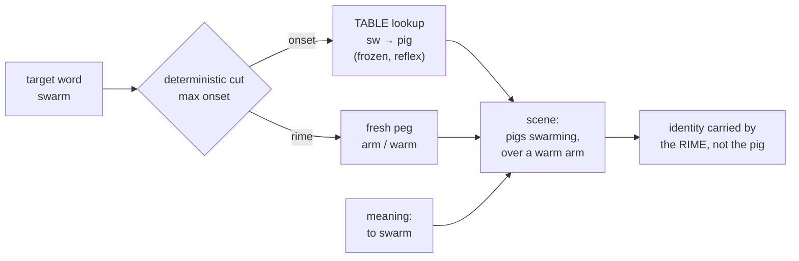

# Onset Peg Alphabet

**Summary**: A **precompiled lookup table** that maps each recurring word-*onset* (the leading consonant cluster or frequent prefix — `sw`, `con`, `str`, `bl`…) to **one fixed, frozen concrete peg image**, drilled to reflex. Once the table exists, encoding a new word stops being a fresh full-word decomposition and becomes **onset-lookup + rime-peg**: you *recall* the standing image for the onset instead of *inventing* one. It is the [Major System](./mnemonic-methods-master.md)'s architecture — a fixed code table replacing live word-finding — applied to **syllable onsets** instead of digits, and it sits directly under [substitute-word-system](./substitute-word-system.md) as the "cache the onset anchor" layer of that page's §Onset priority rule. This page owns the construct; it *consumes* Substitute Word, the [Phonetic Bridge](./substitute-word-system.md), and the «Столбики» drill rather than redefining them. **Origin: David's proposal (2026-07-16).** Carries a falsifiable promotion gate (below) — it is a **candidate**, not yet a ruling.

**Sources**:
- Design conversation with David, 2026-07-16 — the reusable-library proposal (`sw` → свинья; `con` → конь / цепочка).
- [substitute-word-system](./substitute-word-system.md) §Onset priority — Advance's *encode-the-onset* rule, the part this page freezes into a table (source: Ягодкин Н.А., Згода А.Н. - Учись учиться - 2023.pdf).
- [mnemonic-methods-master](./mnemonic-methods-master.md), [major-system-for-mathematical-notation](./major-system-for-mathematical-notation.md) — the precompiled digit→sound→image lookup this borrows its architecture from.
- [person-action-object-system](./person-action-object-system.md) — the fixed-cast precedent (100 pre-assigned actors) this page copies at the onset layer.
- Lorayne, H. & Lucas, J. (1974). *The Memory Book* — the Phonetic Alphabet (a fixed letter→sound→image code), the letter-level ancestor of an onset-level code.

**Last updated**: 2026-07-16 — page created (David-originated; candidate pending its gate).

---

## The move

The [Substitute Word](./substitute-word-system.md) system converts a hard word into a concrete sound-alike, and Advance's addition (documented on that page's §Onset priority) is that the substitute should anchor the **start** of the word, because *«именно начало вспомнить сложнее всего»* — the onset is the hardest part to recall. But Advance still re-derives that onset image **fresh every time**. The Onset Peg Alphabet's single claim is:

> **Freeze the onset anchor once, reuse it forever.** `sw` is *always* свинья (pig); `con` is *always* конь (horse). Encoding a new `sw`-word never again pays the cost of searching for what "sw" should look like — it is a table lookup.

That is exactly the [Major System](./mnemonic-methods-master.md)'s trade: the Major System freezes digit→consonant→image so numbers become instant; this freezes onset-cluster→image so word-beginnings become instant. Same architecture, different alphabet.

**Why it matters — it is a System-2 → System-1 conversion.** Live word decomposition is slow, creative work (System 2). A frozen table makes the onset half a reflex (System 1). This is the deciding criterion for [CAST](./cast-overview.md)-style live encoding — *reject assembly steps, judge by live encode speed* — which is why the library is worth its fixed cost for a language learner and pointless for memorizing ten things.

**It also caches the polyglot search.** The [multilingual](./polyglot-architecture.md) advantage — searching all your languages for the lowest-distortion concrete peg for a sound — is expensive per word. The library pays that search **once per onset** and freezes the winner: свинья (Russian) was the best `sw` peg, so `sw` is now solved for every future word, in any target language.

## Worked examples

| Target | Onset (table) | Rime (fresh) | Meaning-anchor | Scene |
|---|---|---|---|---|
| **swim** | `sw` → свинья (pig) | — | the act of swimming | a pig *swimming* |
| **swarm** | `sw` → pigs | `arm` / warm | swarming | pigs *swarming* at a warm place, over an arm |
| **concept** | `con` → конь (horse) | `cept` → цепочка (chain/necklace) | — | a horse wearing a necklace |

Note that `swim`, `swarm`, `sweet`, `swing` **all reuse the same pig** — and that is the technique working, not failing. See the collision rule.

## The collision rule (load-bearing)

[substitute-word-system](./substitute-word-system.md) lists *"same substitute reused across words → collision risk"* as a **failure mode**. This library reuses the onset image *on purpose*, so it must answer that failure mode, and it does — with one rule that is the difference between the system working and collapsing:

> **Fixed onset image + a distinctly-pegged rime.** The onset image is a **surname**, not an identifier; the **rime carries the identity.** pig-swimming ≠ pig-on-an-arm ≠ pig-with-a-wing *because the tails differ.* Peg only the onset and leave the tail vague, and every `sw`-word collapses into one indistinguishable pig-blur — mass interference, the exact thing the failure mode warns about.

This is precisely how the [Major System](./mnemonic-methods-master.md) tolerates the same consonant appearing in thousands of words: the shared piece never carries identity, the rest does. It also fits Advance's own logic — the onset was the *hard* part (now automated by the table), the rime is the *recall-able* part (so it is cheap to peg fresh).

## Design rules

| Rule | Why |
|---|---|
| **Deterministic cut** — peel the *maximal* onset cluster, then peg the rest. `swarm` = `[sw][arm]`, never `[sw]+[warm]` (overlapping the `w`) | An overlap is a fresh creative decision = System 2 = slow. A library only stays fast if the cut never requires thought |
| **One semantic category for the cast** — every onset image the same *kind* of thing (all animals, or a fixed cast of characters) | Then a word always renders as "which animal, doing what" — scenes compose predictably. This is [PAO](./person-action-object-system.md)'s fixed-actor trick pushed down to the onset layer |
| **It is bounded** — English has ~50 onset clusters; the top ~20 (the `s`-clusters, `bl/cl/fl/gl/pl`, `tr/dr/br/cr/gr/pr/fr`, `ch/sh/th/wh/qu`, `str/spr/thr`) cover most words | ~40–60 rows = a weekend to build. Then drill it «Столбики»-style (owned on [substitute-word-system](./substitute-word-system.md)) to a <1 s call-up per onset — a *speed* floor, not a ladder rung; rungs are owned by [skill-progression-stages](./skill-progression-stages.md) |
| **Onsets first, rimes later** | Onsets are the bounded, high-value set *and* the part Advance says the recall difficulty lives in. Freezing common *rimes* too (a near-complete syllable dictionary) is a valid extension with diminishing returns |

## Promotion gate (falsifiable)

This page is a **candidate**, per David's standing rule that adopted ideas earn a falsifiable gate before they become a ruling. It promotes from *candidate* to *standing technique* only if it passes **both**:

1. **Beats fresh decomposition on the clock.** On a mixed word list, timed onset-lookup + rime-peg must be measurably faster to encode than [Substitute Word](./substitute-word-system.md) from scratch — *after* the table is drilled to reflex. If the lookup is no faster than inventing, the fixed build cost bought nothing.
2. **Survives the collision rule at volume.** Encode ≥30 words sharing a handful of onsets, wait a week, test recall. If shared-onset words interfere (recall the wrong `sw`-word), the rime-disambiguation discipline failed and the library is a net negative.

**Known limits (where it stops paying), already conceded:** it is strongest for mono- and disyllables (most of a core vocabulary); polysyllables crowd the scene with too many pieces; and any word whose onset-image and rime-peg refuse to cohere falls back to improvisation. The library *reduces* live invention; it does not eliminate it.

## Relationship to the peg family

Every fixed-code mnemonic in the wiki is the same architectural move — a precompiled lookup replacing live improvisation — pointed at a different alphabet:

| System | Alphabet | Fixed table |
|---|---|---|
| [Major System](./mnemonic-methods-master.md) | digits 0–9 | consonant-sound per digit |
| [PAO](./person-action-object-system.md) | 2-digit groups 00–99 | person + action + object per group |
| [Peg Matrix](./peg-audio-visual-matrix.md) | numbers 00–99 | one multimodal percept per number |
| **Onset Peg Alphabet** | word onsets (`sw`, `con`, `str`…) | one concrete image per onset |

The gap it fills: the wiki was deep on fixed pegs for *numbers and letters* and had none for *syllable onsets* — the vocabulary-[acquisition](./krashen-sla-hypotheses.md) analog.

## Mnemonic

**A surname on every animal.** The onset is the family name (pig = the `sw` family); the rime is the first name that tells the siblings apart. You are not memorizing pigs — you are memorizing *which* pig.

## Checksum

1. **What does the library freeze, and what does it leave fresh?** — Freezes the *onset* image (the hard-to-recall start); leaves the *rime* to be pegged fresh each time (the easy part).
2. **Why is reusing the same pig for `swim`, `swarm`, `swing` not a collision?** — Because identity lives in the rime, not the onset; the pig is a surname. Collision only happens if you leave the tail vague.
3. **What must it beat to promote from candidate?** — Fresh [Substitute Word](./substitute-word-system.md) decomposition *on the clock*, after the table is drilled — and it must survive a volume-recall test without shared-onset interference.

## Visual

## Related pages

- [substitute-word-system](./substitute-word-system.md) — the owner this extends; §Onset priority is the rule this page caches, and §Столбики is its trainer
- [mnemonic-methods-master](./mnemonic-methods-master.md) — registered owner of the Major System, whose lookup architecture this copies
- [person-action-object-system](./person-action-object-system.md) — the fixed-cast precedent (pre-assigned actors) applied here at the onset layer
- [peg-audio-visual-matrix](./peg-audio-visual-matrix.md) — sibling fixed-code table (numbers → percepts)
- [major-system-for-mathematical-notation](./major-system-for-mathematical-notation.md) — the Major System's own extension layer; a parallel "freeze a reserved vocabulary" move
- [yagodkin-advance-mnemonics](./yagodkin-advance-mnemonics.md) — Advance lineage; source of the onset-priority rule this builds on
- [polyglot-architecture](./polyglot-architecture.md) — the cross-language peg substrate this library caches, one search per onset
- [language-family-clustering](./language-family-clustering.md) — the productive tension: it wants *similar* languages (structure transfer); the peg substrate wants *diverse* phonologies (peg coverage)
- [automaticity-and-reflex-training](./automaticity-and-reflex-training.md) — the <1 s call-up target that makes the lookup faster than invention
- [skill-progression-stages](./skill-progression-stages.md) — owner of ladder positions; the pass-floors here are speeds, not rungs
