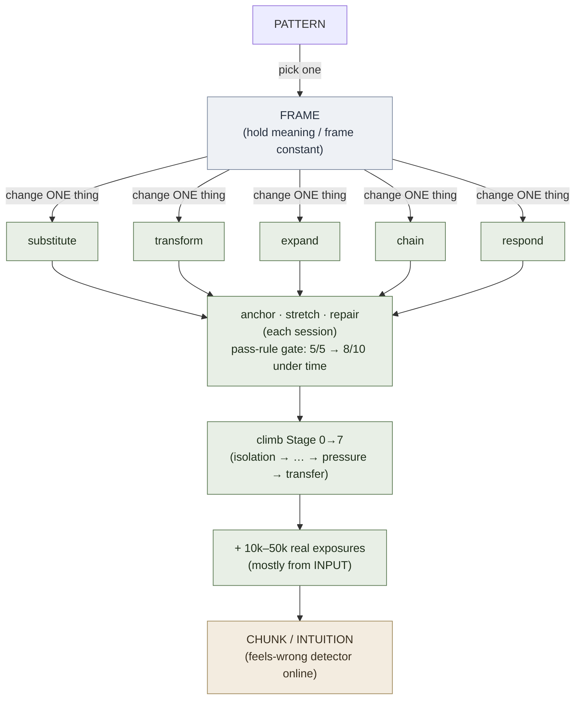

# Pattern Drilling

**Summary**: Pattern drilling is the method of building **grammatical and structural automaticity** by repeatedly operating on a sentence *pattern* — holding meaning constant while forcing one controlled change (substitute a slot, shift a tense, flip polarity, soften a request) — until the structure surfaces without deliberation. It is the language-learning instantiation of the general [drill-generator](./drill-generator.md) families, specialised to the *expression* skill type: the audiolingual drill set (substitution · transformation · expansion · chaining · response · minimal-pair · error-correction · micro-production), the [[#cue-card-drill|CUE-CARD-DRILL]] sequence for stabilising a weak contrast, and **massive pattern exposure** as the endgame that converts compressed structure into intuition. It is one half of the production-reception-grammar-pair discipline and lives inside the **30% encoding/drill** side of the [language-learning-protocol](./language-learning-protocol.md) — it proceduralises and feeds the [Monitor](./krashen-sla-hypotheses.md), but it does **not** replace the [comprehensible-input](./comprehensible-input-protocol.md) acquisition engine. This page is the canonical owner of pattern drilling and CUE-CARD-DRILL.

**Sources**:
- raw/Neural OS Book/Learning Grammar.md — the drill taxonomy (substitution / transformation / error-correction / micro-production), contrast pairs, sentence templates, CUE-CARD-DRILL, "signs you know a pattern"
- raw/06 Buffer/language_learning.md §Massive Pattern Exposure — compression → intuition after ~10k–50k examples
- raw/Neural OS Book/Speaking Languages.md — grammar as grouped, chunked structures
- wiki/learning-systems/drill-generator.md — the nine general drill families + failure-mode routing
- wiki/learning-systems/drill-ladder-patterns.md — the anchor / stretch / repair triplet + universal rung pattern
- wiki/learning-systems/language-production-drill-ladder.md — the worked Stage 0→7 expression ladder
- Background — audiolingual "pattern practice" tradition (Fries; Lado 1957; Brooks 1964) — *needs-verification* as historical framing; the wiki's drills are this lineage
- raw/05 Meta_Knowledge/Mnemonics/Ягодкин Н.А., Згода А.Н. - Учись учиться - 2023.pdf — Advance's pattern-composition recipe: the 3-level complexity ladder, 5–7 sentences per block, 1–2 word swaps, swap-priority order (§Addendum)

**Last updated**: 2026-07-16

---

## What pattern drilling is

A *pattern* is a reusable structural frame — `If X, then Y`, `I have been ___ing`, `Would you mind ___ing`, `The more X, the more Y` — that carries grammar independently of its lexical fillers. (source: raw/Neural OS Book/Learning Grammar.md) Pattern drilling is the deliberate, high-rep manipulation of such a frame so the structure moves from *understood* to *available under pressure*.

The core move is **transformation under a held constant**: change exactly one thing (one slot, one tense, one degree of politeness) while keeping meaning or frame constant. This is what separates a pattern drill from rote sentence memorisation — the learner is exercising the *generative* slot, not storing a fixed string. (source: raw/Neural OS Book/Learning Grammar.md)

**Distinguisher.** Pattern drilling is the *expression*-skill specialisation of the general drill machinery in [drill-generator](./drill-generator.md). [drill-generator](./drill-generator.md) answers "how do I generate a drill for any skill"; [drill-ladder-patterns](./drill-ladder-patterns.md) answers "what do all drill ladders share"; [language-production-drill-ladder](./language-production-drill-ladder.md) is the worked Stage 0→7 ladder for spoken output. **Pattern drilling names the concrete drill *types* that fill those rungs for language structure** — and the failure mode it exists to defeat is "knows the rule, can't deploy it in real time."

## The language pattern-drill set

These are the structural drill types, finest-grained for language. They are the expression-skill instances of the nine general families in [drill-generator](./drill-generator.md) (notably *Reproduction*, *Transformation*, *Discrimination*).

| Drill type | What you do | Holds constant |
|---|---|---|
| **Minimal-pair** | Compare two near patterns (`I lived there for 5 years` vs `I have lived there for 5 years`) | the lexis; isolates the contrast |
| **Substitution** | Change one slot, keep the structure (`I want ___` → tea / a ticket / to leave) | the frame |
| **Transformation** | Rewrite the same meaning in another form — tense · person · polarity · question · passive | the meaning |
| **Expansion** | Add one element each rep (`She runs` → `She runs fast` → `She runs fast every morning`) | the spine |
| **Chaining** | Each answer becomes the next prompt; build a connected turn | the thread |
| **Response / rejoinder** | Produce the socially-expected reply frame to a cue (request → soften; claim → hedge) | the speech act |
| **Error-correction** | Say what is wrong *and why*, then restate correctly | the target rule |
| **Micro-production** | Say or write 5 original sentences using the target form | the structure, novel content |

(source: raw/Neural OS Book/Learning Grammar.md — minimal-pair, substitution, transformation, error-correction, micro-production are named explicitly; expansion / chaining / response are the standard audiolingual completions of the same family.)

Substitution and expansion build *fluency in the frame*; transformation and minimal-pair build *discrimination between frames*; response and chaining push toward *live selection*; error-correction and micro-production verify *ownership*. A balanced session touches more than one band.

## CUE-CARD-DRILL

When one specific contrast keeps slipping (the relearn-it-every-week pattern), the fix is not "study all grammar" — it is to stabilise that single contrast with a cue and then drill the transform. The five-step **CUE-CARD-DRILL** sequence: (source: raw/Neural OS Book/Learning Grammar.md)

1. **Choose one weak contrast** — only one recurring confusion (e.g. `in / on / at`, or past-simple vs present-perfect).
2. **Build one cue per side** — an image, symbol, colour, or location (`past simple` = a closed door behind you; `present perfect` = a bridge from past into now).
3. **Attach 2–3 sentence templates** — not the rule, the frames (`I did X yesterday` / `I have done X already`).
4. **Make a contrast card** — front: the confusion; back: cue + contrast + 2 example sentences. (A [SR](./spaced-repetition.md)/[active-recall](./active-recall.md) card by construction; relate to [Fluent Forever](./fluent-forever-wyner.md) no-translation cards.)
5. **Drill the transformation** — convert one sentence into the competing pattern and say *why* the meaning changed.

Shortest form: *one weak contrast · one cue per side · three anchor sentences · daily retrieval · real use the same day.* The cue's job is not theatre — it is to make the contrast retrievable *fast enough to use*. (source: raw/Neural OS Book/Learning Grammar.md)

## Drilling a pattern rung by rung

A pattern is not drilled flat; it climbs the eight-rung drill ladder (Stage 0→7 — orientation, isolation, clean repetition, controlled variation, automaticity, mixing, pressure-and-noise, transfer; numbering canonical at [skill-progression-stages](./skill-progression-stages.md)) the same way every skill does in [drill-ladder-patterns](./drill-ladder-patterns.md). Each session uses the fixed triplet from [drill-ladder-patterns](./drill-ladder-patterns.md):

- **Anchor drill** — lock the pattern on stable material (e.g. 5 substitutions, answered aloud, no script).
- **Stretch drill** — push the next edge (new vocabulary in the slot, or under a time limit).
- **Repair drill** — fix the most common collapse (recover inside one clause after a deliberate disruption).

Promotion is gated by a **pass rule** (e.g. 5/5 clean, then 8/10 under time), and a **fallback rule** routes failure downward — never solve a Stage 1 accuracy problem with a Stage 6 pressure drill. (source: wiki/learning-systems/drill-ladder-patterns.md; wiki/learning-systems/drill-generator.md) Which drill the generator reaches for follows the failure mode: *too slow* → timed drills on already-clean material; *confuses neighbours* → minimal-pair/discrimination; *fails when mixed* → branching/response across patterns; *fails after disruption* → repair. (source: wiki/learning-systems/drill-generator.md) The worked expression ladder is [language-production-drill-ladder](./language-production-drill-ladder.md).

## Massive pattern exposure → intuition

Drilling stabilises a pattern; **volume of exposure** is what turns the stabilised pattern into intuition. The endgame is to build and reuse pattern libraries — sentence archetypes, discourse structures, conversational templates, narrative flows — and to meet each pattern in thousands of real instances. After roughly **10k–50k examples**, patterns run automatically: recognition becomes unconscious, "feels wrong" detection comes online, and the explicit frame dissolves into a [chunk](./chunking.md). (source: raw/06 Buffer/language_learning.md §Massive Pattern Exposure) This is the compression→intuition leg of the [Red Queen v2 progression](./language-learning-architecture.md) (Comprehension → Compression → Encoding → Retrieval → Automaticity → Prediction → Intuition → Adaptation).

Crucially, the bulk of those 10k–50k instances arrive through the [comprehensible-input](./comprehensible-input-protocol.md) engine, not through manufactured drills — which is why pattern drilling is the *30% encoding* side, not the whole protocol.

## Where pattern drilling fits — and its limits

Pattern drilling is powerful and **bounded**. In [Krashen's](./krashen-sla-hypotheses.md) terms it primarily strengthens the *learned* system and proceduralises retrieval — it feeds and speeds the **Monitor** and builds [automaticity](./automaticity-and-reflex-training.md). It does **not**, on its own, drive *acquisition*; that runs on comprehensible input at i+1. (source: wiki/learning-systems/krashen-sla-hypotheses.md)

The historical caution is the audiolingual method's known failure: drills practised in isolation produce mechanical accuracy without communicative competence — the [fluency illusion](./fluency-illusion.md) in motor form, and the Monitor-overuse pattern (halting, hyper-corrected speech). The wiki's defence is structural: pattern drilling is co-trained with reception (production-reception-grammar-pair), capped at 30% of session time against 70% input ([language-learning-protocol](./language-learning-protocol.md)), governed by frequency and forgetting filters, and always pushed up the ladder into *mixing*, *pressure*, and *transfer* rungs where real selection is forced. A pattern drilled only at Stage 2 (clean repetition) and never at Stage 5–7 is the classic dead-drill failure.

A sibling mnemonic route into this same memorize-vs-acquire boundary is [phrase-based-acquisition](./phrase-based-acquisition.md) — Kozarenko's [GMS](./kozarenko-mnemotechnics.md) phrase-level protocol, which memorizes whole phrases to reflex (речевой штамп) as a Monitor-feeding accelerant, explicitly not a substitute for the comprehensible-input acquisition engine. It maps its own phrase-construction and grammar-as-example-phrases moves onto this page's substitution/expansion/chaining drills and CUE-CARD-DRILL rather than redefining them.

## Addendum — Advance's pattern-composition parameters

The Advance training centre (Yagodkin/Zgoda) publishes its own course-design recipe for what it calls *паттерны* — a trainer it describes as the **bridge between theory and productive speech** (source: Ягодкин Н.А., Згода А.Н. - Учись учиться - 2023.pdf). It was derived independently of this page's audiolingual lineage and lands on the same isolation → mixing progression this page already names — and it supplies the per-block granularity this page has so far left unspecified. Advance's mnemonic doctrine is owned by [yagodkin-advance-mnemonics](./yagodkin-advance-mnemonics.md), its intensive repetition loop by [storm-and-siege-protocol](./storm-and-siege-protocol.md), and its course-sequencing model by [language-learning-architecture](./language-learning-architecture.md). This section takes only the composition parameters.

### The 3-level complexity ladder

Advance splits each pattern into three levels of complexity, and each level into semantic blocks that isolate one unit of theory — an application of its *decomposition* principle ("eat the elephant in pieces") (source: Ягодкин Н.А., Згода А.Н. - Учись учиться - 2023.pdf). Worked example: Present Perfect at Pre-Intermediate — the level matters, because it decides how finely the material is split and which usages are drilled at all (source: Ягодкин Н.А., Згода А.Н. - Учись учиться - 2023.pdf).

| Level | What is drilled | Present Perfect blocks |
|---|---|---|
| **L1 — formula only** | Formation rules in isolation, no usage variety; sentences kept maximally simple so nothing distracts or slows the learner | `I/You/We/They + have + PP` · `He/She/It + has + PP` · negatives · questions |
| **L2 — usage cases** | Real usage-cases *at the target CEFR level*; the level Advance says must always be **the most voluminous**; may combine two formation aspects in one block (e.g. negatives + questions together) | result of a completed action · actions begun in the past and still relevant · personal experience |
| **L3 — mixed** | Usage and formation deliberately mixed, sentences extended, micro-dialogues added — forcing the brain to switch between them | framed explicitly as preparation for the communicative exercises that follow |

(source: Ягодкин Н.А., Згода А.Н. - Учись учиться - 2023.pdf)

**The mapping is approximate.** Roughly, L1 ≈ this page's isolation / clean-repetition work, L2 ≈ controlled variation, L3 ≈ mixing (stage numbering canonical at [skill-progression-stages](./skill-progression-stages.md)). It is a loose fit on purpose: Advance's three bands are a coarser compression, independently derived, and do not align rung-for-rung — there is no Advance band for pressure-and-noise or transfer, because in Advance's own lesson structure those live *outside* the pattern trainer, in the communicative exercises the patterns feed (source: Ягодкин Н.А., Згода А.Н. - Учись учиться - 2023.pdf). Do not read the correspondence as a table.

### The per-block parameters

This is the payload. Advance specifies *how much per block* — the numbers this page's anchor/stretch/repair triplet and substitution drills otherwise leave to taste:

- **Block size: 5–7 sentences.** Advance calls this the count most convenient for drilling and retaining. (source: Ягодкин Н.А., Згода А.Н. - Учись учиться - 2023.pdf)
- **Swap rate: 1–2 words per step** — 3 only if the words are very easy. (source: Ягодкин Н.А., Згода А.Н. - Учись учиться - 2023.pdf)
- **Swap priority within a block**: (1) the lesson's target material → (2) previously-learned material → (3) everything else. (source: Ягодкин Н.А., Згода А.Н. - Учись учиться - 2023.pdf)

The mechanic these parameters drive: the block opens fully in the target language with translation and transcription for self-check; each successive step replaces a little more of the printed sentence with L1 until the learner *sees* an all-L1 sentence and *says* the L2 one at undropped speed. Each block is run several times with the speed ramped, against a timer (source: Ягодкин Н.А., Згода А.Н. - Учись учиться - 2023.pdf) — the intensity discipline this wiki files under [storm-and-siege-protocol](./storm-and-siege-protocol.md). A coupling rule constrains the material: a lesson's patterns are built from the *previous* lesson's content — grammar drilled on already-known vocabulary, new vocabulary drilled on already-known grammar — so attention never splits onto non-target content (source: Ягодкин Н.А., Згода А.Н. - Учись учиться - 2023.pdf).

Slotting into this page: **5–7** sizes an anchor set (this page's "e.g. 5 substitutions" was already in the band); **1–2 words per step** sets substitution granularity — the operational reading of *hold-one-change-one*; the **swap-priority order** decides which slot opens first when several could. These are a commercial training centre's operational defaults, not a research finding — no study is offered for the 5–7 or the 1–2 (**needs verification — Advance-internal**). Treat them as a strong starting prior to be checked against `pattern_drill::substitution_accuracy`, not as a measured optimum.

### Convergence, and one conflict left open

Advance independently names the same failure mode this page exists to defeat: learners who know the theory but cannot deploy it for lack of vocabulary and of a worked-in reflex — better at opening brackets and filling gaps than at holding a conversation (source: Ягодкин Н.А., Згода А.Н. - Учись учиться - 2023.pdf). That is this page's "knows the rule, can't deploy it in real time," arrived at from a different lineage. Relatedly, Advance teaches grammar *natively* — embedded in vocabulary, with constructions introduced only after ~200–400 memorised words (source: Ягодкин Н.А., Згода А.Н. - Учись учиться - 2023.pdf); that sequencing model belongs to [language-learning-architecture](./language-learning-architecture.md), not here.

**The conflict, noted and not resolved.** Advance contests this page's bound directly: it treats pattern drilling as the primary engine for driving material into active use, not a Monitor-feeding accessory capped at 30% of session time by [language-learning-protocol](./language-learning-protocol.md). This page keeps its [Krashen](./krashen-sla-hypotheses.md)-anchored framing and its cap — they are load-bearing here. The collision itself is stated, not adjudicated, at [krashen-sla-hypotheses](./krashen-sla-hypotheses.md) §Rival account — Yagodkin / Advance. Adopting Advance's *parameters* does not require adopting Advance's *theory*: the numbers describe how to compose a block, not how much of the session belongs to blocks.

## Signs you actually own a pattern

You own a pattern — and can stop heavy drilling — when you can: (source: raw/Neural OS Book/Learning Grammar.md)

- recognise it in fast input,
- explain it simply,
- contrast it with a similar pattern,
- transform it into another form,
- produce it in your own sentence under pressure.

These five map onto the upper rungs (recognition · discrimination · transfer) of the ladder; failing any one names which drill type to return to.

## METER integration

What pattern drilling measures (proposed event family `pattern_drill::*`, consumed by the same stack as [language-production-drill-ladder](./language-production-drill-ladder.md)):

| Event | Signal | Target direction |
|---|---|---|
| `pattern_drill::substitution_accuracy` | clean slot-fills per set | rising → 8/10 |
| `pattern_drill::transformation_latency` | time to produce the transformed form | collapsing → automatic |
| `pattern_drill::discrimination_rate` | correct minimal-pair / neighbour calls | rising |
| `pattern_drill::repair_recovery` | recovered inside one clause after disruption | rising |
| `pattern_drill::pattern_exposures` | cumulative real instances of a pattern | toward 10k–50k |

A pattern is retired from heavy focus when accuracy is high, latency is automatic, and it survives the mixing/pressure rungs — then it drops to light maintenance review.

## Related pages

- [drill-generator](./drill-generator.md) — the general system this specialises; the nine drill families and failure-mode routing
- [drill-ladder-patterns](./drill-ladder-patterns.md) — the anchor/stretch/repair triplet and the shared rung pattern
- [language-production-drill-ladder](./language-production-drill-ladder.md) — the worked Stage 0→7 expression ladder pattern drilling fills
- [language-learning-protocol](./language-learning-protocol.md) — pattern drilling is the 30% encoding/drill side
- [language-learning-protocol-english](./language-learning-protocol-english.md) — English pattern libraries + the fused visual map
- [language-learning-architecture](./language-learning-architecture.md) — the Grammar-and-Transformation + Production layers this serves
- [l2-phonology-gym](./l2-phonology-gym.md) — the phonology sister tool (this owns grammar/expression; that owns sound)
- [krashen-sla-hypotheses](./krashen-sla-hypotheses.md) — why drilling feeds the Monitor but not acquisition
- [comprehensible-input-protocol](./comprehensible-input-protocol.md) — the acquisition engine that supplies most pattern exposures
- [fluent-forever-wyner](./fluent-forever-wyner.md) — sentence-mined SR cards = pattern drills in card form
- [phrase-based-acquisition](./phrase-based-acquisition.md) — GMS phrase-level mnemonic sibling; maps phrase construction onto this page's drills
- [yagodkin-advance-mnemonics](./yagodkin-advance-mnemonics.md) — the Advance doctrine whose composition parameters §Addendum borrows
- [storm-and-siege-protocol](./storm-and-siege-protocol.md) — the intensity/repetition loop Advance's speed-ramped block reruns belong to
- production-reception-grammar-pair — co-train the reception side or asymmetry results
- [chunking](./chunking.md) — what a drilled pattern becomes
- [skill-progression-stages](./skill-progression-stages.md) — canonical numbering for the Stage 0–7 ladder and automaticity levels
- [fluency-illusion](./fluency-illusion.md) · [automaticity-and-reflex-training](./automaticity-and-reflex-training.md) — the failure mode drilled patterns must clear

---

## U — See (CAST)
1. Hold meaning constant, change one thing → the structure becomes generative
2. Drill stabilises one pattern; 10k–50k exposures turn it into intuition

## D — Name (NEDF)
1. Pattern drilling = repeated transformation of a held-constant sentence frame to automaticity
2. Distinguisher: drill *types* for language structure (vs the general families in [drill-generator](./drill-generator.md))
3. Failure mode: dead drill — Stage-2 repetition only, never pushed to mixing/pressure/transfer

## F — Do (SPEAR)
1. Pick a pattern → anchor (substitution) → stretch (transformation, timed) → repair → pass rule
2. Weak contrast that keeps slipping → run CUE-CARD-DRILL, then drill the transform
3. Sizing a block (Advance's defaults, *needs-verification*): 5–7 sentences · swap 1–2 words per step · swap order = lesson target → prior material → the rest

## B — Watch (HEART)
1. Speech goes halting and hyper-corrected → Monitor overuse; drop to fluency-first rungs
2. Accurate in drill, absent in conversation → never climbed past clean repetition

## L — Predict (ORACLE)
1. Pattern drilled through mixing + pressure + transfer → deploys in live speech
2. Drill-only, no input volume → mechanical accuracy, no communicative competence

## R — Act (GRACE)
1. New grammar target → choose drill type by failure mode, climb the ladder
2. Plateau on a contrast → CUE-CARD-DRILL it; check input volume for that pattern

## Mnemonic

**HOLD-ONE-CHANGE-ONE** — every pattern drill holds one thing constant and changes exactly one. Drill set in order of force: **Sub · Trans · Expand · Chain · Respond · Correct · Produce** ("Some Teachers Explain Clearly, Reaching Calm Pupils").

## Checksum

1. What is the single defining move that distinguishes a *pattern* drill from rote sentence memorisation, and which two drill types build discrimination vs which two build frame-fluency?
2. State the five CUE-CARD-DRILL steps from memory. Which step makes it an [active-recall](./active-recall.md) card, and what is the "shortest form"?
3. Pattern drilling strengthens which of Krashen's two systems — and what is the structural reason it cannot, alone, take you to C1/C2? (Name the time-split and the co-training rule that bound it.)

## Visual

The fused English C1/C2 map renders pattern drilling as a dedicated band (4 panels: every-rung-3-drills · 9 families · the grammar drill set · massive exposure → intuition): [`english-c1-c2-learning-system.excalidraw`](../assets/english-c1-c2-learning-system.excalidraw).

